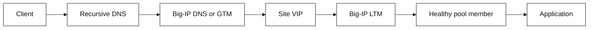

# Networking Primer

Learn enough networking to follow a request from a browser to a service,
debug common failures, and explain how F5 BIG-IP LTM and GTM/BIG-IP DNS steer
traffic. The material is deliberately application-engineer focused: the goal
is sound mental models and safe debugging questions, not device administration.

## Choose your depth

| Directory | Best for |
| --- | --- |
| [`docs/`](docs/01-foundations.md) | Quick concepts, runbooks, glossary, interview Q&A, and compact labs |
| [`book/`](book/README.md) | Long-form chapters, focused F5 topics, and 19 infrastructure case studies |
| [`demos/`](demos/README.md) | Python/shell experiments, Docker/Wireshark workflows, and browser animations |
| [`exercises/`](exercises/README.md) | Implementation assignments with testable edge cases |

Use `docs/` for a fast operational refresher and `book/` for deep study or
design review preparation. The overlap is intentional: each layer adds detail,
evidence, diagrams, and decision context.

## Who this is for

- **SDE1:** diagnose `connection refused`, DNS, timeout, TLS, and HTTP failures
  with the right layer and evidence.
- **SDE2:** design for failure domains, reason about load-balancing policy,
  caching, health checks, and multi-site traffic steering.

## Four-session path

| Session | Read | You should be able to explain |
| --- | --- | --- |
| 1. Foundations | [Networking foundations](docs/01-foundations.md) | What happens between `connect()` and an HTTP response |
| 2. Delivery | [Request path](docs/02-request-path.md) | Where a failed request stopped and what to inspect |
| 3. Local traffic | [F5 LTM](docs/03-f5-ltm.md) | How a VIP, pool, monitor, and SNAT fit together |
| 4. Global traffic | [F5 GTM / BIG-IP DNS](docs/04-f5-gtm.md) | Why DNS steering is not per-request load balancing |

Supporting modules: [DDI](docs/06-ddi.md), [architecture diagrams](docs/architecture.md),
[network automation](docs/07-automation.md), [transport security](docs/08-transport-security.md),
[hands-on labs](docs/09-hands-on-labs.md), and the
[troubleshooting runbook](docs/05-troubleshooting.md), plus the
[platform networking bridge](docs/10-platform-networking.md).

For F5-focused interview preparation, use the [dedicated F5 role interview
bank](docs/f5-interview-bank.md), which includes LTM, GTM/BIG-IP DNS, TLS/mTLS,
HA, SDK/REST/declarative automation, observability, and symptom-driven debug
exercises.

Additional practice: [interview rubric](docs/interview-rubric.md), [simulation
pack](docs/interview-simulation-pack.md), [whiteboard drills](docs/interview-whiteboard-drills.md),
[system-design exercises](docs/network-system-design-exercises.md), and the
[interview study plan](docs/interview-study-plan.md).

For broad networking interview preparation, use the [networking interview
bank](docs/networking-interview-bank.md), covering protocols, cloud,
Kubernetes, observability, security, and automation.

Practice evidence-led conversations with the [interview dialogue
exercises](docs/interview-dialogue-exercises.md), including DNS, TCP, TLS, F5,
incident response, authorized testing, and chaos-test planning.

Then use the [troubleshooting runbook](docs/05-troubleshooting.md), answer the
[interview questions](docs/interview-questions.md), and run the small
[request-path simulator](examples/request_path.py).

For book-depth study, use the [Book Edition](book/README.md), which expands the
topics into 17 chapters with worked examples, diagrams, operational checklists,
and chapter-level Q&A.

Practice with the [implementation exercises](exercises/README.md), and run the
[local Docker/Wireshark demos](demos/README.md) when you want packet-level
evidence.

## Start locally

```bash
git clone https://github.com/<your-user>/networking-primer.git
cd networking-primer
python3 examples/request_path.py
./scripts/validate.sh
```

No third-party dependencies are required.

## The one picture to retain



GTM/BIG-IP DNS normally chooses an answer while resolving a name; LTM normally
handles the data-plane connection to a virtual server. These are complementary
control points, operating at different times and scopes.

## Important naming note

F5 documentation and many teams still say **GTM**. Current BIG-IP product
terminology calls this module **BIG-IP DNS**. This primer uses “GTM/BIG-IP DNS”
where the distinction matters.

## References and evidence

Protocol sources, F5 documentation, and a fact/inference ledger are in
[references](docs/references.md). BIG-IP behavior can vary by version,
license, and local policy; validate against the deployed platform and team
standards before changing traffic.
