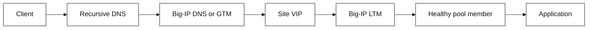

# Networking Primer

Learn enough networking to follow a request from a browser to a service,
debug common failures, and explain how F5 BIG-IP LTM and GTM/BIG-IP DNS steer
traffic. The material is deliberately application-engineer focused: the goal
is sound mental models and safe debugging questions, not device administration.

## Choose your depth

| Start here | Best for |
| --- | --- |
| [`docs/`](docs/README.md) | Quick concepts, operations, interviews, references, and study plans |
| [`book/`](book/README.md) | Long-form chapters, focused topics, and incident case studies |
| [`cloud-networking-interview/`](cloud-networking-interview/00-README.md) | Ordered AWS/GCP cloud networking preparation |
| [`cloud-deployment-models/`](cloud-deployment-models/00-README.md) | Networking-focused private, public, hybrid, and on-premises cloud designs |
| [`terraform-interview/`](terraform-interview/00-README.md) | Terraform, IaC, provider, state, and network automation interviews |
| [`platform-integration-labs/`](platform-integration-labs/00-README.md) | End-to-end ADC, router, switch, node, cloud, NSO, and Terraform labs |
| [`demos/`](demos/README.md) | Runnable Python/shell, Docker/Wireshark, and browser experiments |
| [`exercises/`](exercises/README.md) | Small implementation assignments with testable edge cases |

Use `docs/` for a fast operational refresher and `book/` for deep study or
design review preparation. The overlap is intentional: each layer adds detail,
evidence, diagrams, and decision context.

## Who this is for

- **SDE1:** diagnose `connection refused`, DNS, timeout, TLS, and HTTP failures
  with the right layer and evidence.
- **SDE2:** design for failure domains, reason about load-balancing policy,
  caching, health checks, and multi-site traffic steering.
- **Staff:** frame ambiguous platform problems, quantify capacity and cost,
  choose ownership boundaries, lead migrations, and defend trade-offs across
  teams.

Start with the [SDE2 and Staff curriculum improvement spec](docs/interview-curriculum-improvement-spec.md)
to choose the appropriate depth. SDE2 preparation emphasizes mechanism,
evidence, implementation, and safe diagnosis. Staff preparation adds
multi-region state, overload governance, platform strategy, migration,
ownership, cost, and influence.

## Four-session path

| Session | Read | You should be able to explain |
| --- | --- | --- |
| 1. Foundations | [Networking foundations](docs/01-foundations.md) | What happens between `connect()` and an HTTP response |
| 2. Delivery | [Request path](docs/02-request-path.md) | Where a failed request stopped and what to inspect |
| 3. Local traffic | [F5 LTM](docs/03-f5-ltm.md) | How a VIP, pool, monitor, and SNAT fit together |
| 4. Global traffic | [F5 GTM / BIG-IP DNS](docs/04-f5-gtm.md) | Why DNS steering is not per-request load balancing |

Supporting modules: [DDI](docs/06-ddi.md), [architecture diagrams](docs/architecture.md),
[network automation](docs/07-automation.md), [transport security](docs/08-transport-security.md),
[hands-on labs](docs/09-hands-on-labs.md), and the
[troubleshooting runbook](docs/05-troubleshooting.md), plus the
[platform networking bridge](docs/10-platform-networking.md).

Infra-engineer practice: use the [Unix and network debugging toolkit](docs/infra-engineer-toolkit.md)
for debugging sessions, safe tools and commands, issue cheatsheets, training
runbooks, and evidence-based exercises.

For F5-focused interview preparation, use the [dedicated F5 role interview
bank](docs/f5-interview-bank.md), which includes LTM, GTM/BIG-IP DNS, TLS/mTLS,
HA, SDK/REST/declarative automation, observability, and symptom-driven debug
exercises.

Additional practice: [interview rubric](docs/interview-rubric.md), [simulation
pack](docs/interview-simulation-pack.md), [whiteboard drills](docs/interview-whiteboard-drills.md),
[system-design exercises](docs/network-system-design-exercises.md), and the
[interview study plan](docs/interview-study-plan.md). The planned SDE2/Staff
coverage gaps and implementation roadmap are captured in the [interview
curriculum improvement spec](docs/interview-curriculum-improvement-spec.md).
The full Terra review of book and focused-topic material is tracked in the
[book material review plan](docs/book-material-review-plan.md).

For broad networking interview preparation, use the [networking interview
bank](docs/networking-interview-bank.md), covering protocols, cloud,
Kubernetes, observability, security, and automation.

For a dedicated cloud track with its own ordered modules, use the [Cloud
Networking Interview Track](cloud-networking-interview/00-README.md). It covers
AWS and Google Cloud as explicit comparisons across routing, private services,
identity, Kubernetes, observability, capacity, disaster recovery, migration,
and Staff-level mock interviews.

For Terraform and infrastructure-as-code interview preparation, use the
[Terraform Interview Track](terraform-interview/00-README.md). It covers
Terraform execution, state, providers, plans, imports, AWS, GCP, F5 BIG-IP,
multi-provider ownership, testing, policy, CI/CD, rollback, and interview loops.
The extended platform modules also cover [A10 ADCs, Cisco networking,
spine-leaf fabrics, and Cisco NSO](terraform-interview/16-a10-load-balancers-and-terraform.md).

For end-to-end practice combining those platforms, use the [integrated network
platform labs](platform-integration-labs/00-README.md), which includes lab
contracts, failure exercises, system-design discussions, diagrams, and
interview prompts spanning ADCs, routers, switches, nodes, clouds, NSO, and
Terraform.

Practice evidence-led conversations with the [interview dialogue
exercises](docs/interview-dialogue-exercises.md), including DNS, TCP, TLS, F5,
incident response, authorized testing, and chaos-test planning.

Then use the [troubleshooting runbook](docs/05-troubleshooting.md), answer the
[interview questions](docs/interview-questions.md), and run the small
[request-path simulator](examples/request_path.py).

For book-depth study, use the [Book Edition](book/README.md), which expands the
topics into 17 chapters with worked examples, diagrams, operational checklists,
and chapter-level Q&A. The book also includes the [CCNA-to-Staff networking
expansion](book/ccna-networking/00-README.md), with switching, routing, wireless,
security, cloud, automation, and troubleshooting modules.

CCNA expansion modules: [01](book/ccna-networking/01-network-models-and-physical.md),
[02](book/ccna-networking/02-ethernet-switching-and-vlans.md),
[03](book/ccna-networking/03-stp-lacp-and-layer2-resilience.md),
[04](book/ccna-networking/04-ipv4-subnetting-nat-and-ipv6.md),
[05](book/ccna-networking/05-routing-static-ospf-and-vrf.md),
[06](book/ccna-networking/06-bgp-policy-and-hybrid-wan.md),
[07](book/ccna-networking/07-network-services-and-operations.md),
[08](book/ccna-networking/08-acls-aaa-and-network-security.md),
[09](book/ccna-networking/09-wireless-and-qos.md),
[10](book/ccna-networking/10-multicast-and-service-delivery.md),
[11](book/ccna-networking/11-data-center-fabrics.md),
[12](book/ccna-networking/12-cloud-networking-aws-gcp.md),
[13](book/ccna-networking/13-private-public-hybrid-and-onprem.md),
[14](book/ccna-networking/14-automation-sdn-and-iac.md), and
[15](book/ccna-networking/15-observability-troubleshooting-and-design.md).

Practice with the [implementation exercises](exercises/README.md), and run the
[local Docker/Wireshark demos](demos/README.md) when you want packet-level
evidence.

## Start locally

```bash
git clone https://github.com/<your-user>/networking-primer.git
cd networking-primer
python3 examples/request_path.py
./scripts/validate.sh
```

No third-party dependencies are required.

## The one picture to retain



GTM/BIG-IP DNS normally chooses an answer while resolving a name; LTM normally
handles the data-plane connection to a virtual server. These are complementary
control points, operating at different times and scopes.

## Important naming note

F5 documentation and many teams still say **GTM**. Current BIG-IP product
terminology calls this module **BIG-IP DNS**. This primer uses “GTM/BIG-IP DNS”
where the distinction matters.

## References and evidence

Protocol sources, F5 documentation, and a fact/inference ledger are in
[references](docs/references.md). BIG-IP behavior can vary by version,
license, and local policy; validate against the deployed platform and team
standards before changing traffic.

## License and disclosures

This repository is released under the [MIT License](LICENSE). Read the
[repository disclosures](DISCLOSURES.md) for educational scope, vendor and
version boundaries, authorization and privacy requirements, no-warranty terms,
and generated-content guidance. Formatting conventions are documented in the
[Markdown style guide](docs/markdown-style-guide.md).
