# TCP/IP and Packet Journeys

## SDE2 integration lens

Use this chapter as the evidence contract for every later platform layer. For
an F5 VIP, capture both proxy legs; for GTM, record the DNS answer and cache
age; for DDI, identify the address owner; for automation, preserve timestamps
and object versions. Ask which observation distinguishes route, transport,
policy, and workload failure.

## Learning objectives

By the end of this chapter, a reader should be able to trace an application
request from a process on one host to a process on another. You will identify
the roles of sockets, ports, TCP segments, IP packets, and Ethernet frames;
explain encapsulation and decapsulation; and predict where MTU, routing, NAT,
or a failed handshake can interrupt a request. You will also choose useful
observability evidence, such as socket state, packet captures, counters, and
logs, without confusing a symptom at one layer with its cause at another.

**Fact:** TCP/IP protocols are specified by standards such as the Internet
Protocol and Transmission Control Protocol RFCs, while the names and screens
used to inspect them vary by operating system and vendor. **Inference:** A
layered trace is a practical debugging model, not a claim that every packet
passes through perfectly independent software layers.

## Prerequisites

Know basic binary and decimal notation, the purpose of an IP address, and the
difference between a client and a server. It helps to have run a command such
as `curl https://example.test` and to recognize a process ID, a hostname, and a
network interface. No router configuration or privileged packet capture is
required. Examples use IPv4 for compactness, but the same reasoning applies to
IPv6 with different address resolution and header details.

## Mental model

Start with an application conversation. A browser or API client asks its
operating system for a **socket**, an endpoint represented by an address family,
a transport protocol, a local address and port, and a peer address and port.
The familiar four-tuple `(source IP, source port, destination IP, destination
port)` identifies one TCP flow at a given point in the path. A listening server
socket accepts new connections, then normally receives a connected socket per
client. **Fact:** TCP provides a reliable, ordered byte stream; it does not
preserve application message boundaries. The application protocol (for
example, HTTP) gives those bytes meaning.

Encapsulation is the wrapping process on send. An HTTP request is application
data. TCP adds a header containing ports, sequence and acknowledgement numbers,
flags, and a checksum, making a **TCP segment**. IP adds source and destination
addresses and a next-protocol field, making an **IP packet** (often called an IP
datagram). On a local Ethernet link, a data-link header and trailer add source
and destination MAC addresses and an integrity check, making an **Ethernet
frame**. The receiving host removes these wrappers in reverse order:
decapsulation. “Packet” is often used casually for all of these, but precise
language avoids a lot of confusion.

The destination IP determines the next routing decision, not necessarily the
final machine's physical address. A host compares the destination with its
local subnet. If it is remote, the host sends the frame to its default gateway's
MAC address. The router removes the old link-layer wrapper, decrements the IP
TTL (or hop limit), selects a route, and creates a new frame for the next link.
**Fact:** MAC addresses are normally meaningful only on their local broadcast
domain; IP addresses are the end-to-end addressing layer, subject to middlebox
translation. **Inference:** Seeing the same destination IP in a capture on two
different links does not imply that the same Ethernet frame crossed both links.

The maximum transmission unit (MTU) is the largest IP payload a link is
prepared to carry without fragmentation at that layer. Ethernet commonly has
an MTU of 1500 bytes, though tunnels, VPNs, jumbo frames, and provider links
can differ. A TCP endpoint uses a maximum segment size (MSS), derived from the
path's usable MTU and headers, to avoid sending oversized segments. A path MTU
problem can therefore look like an application timeout even though the TCP
handshake succeeded. **Fact:** IPv4 and IPv6 have different fragmentation
rules, and IPv6 routers do not fragment packets in transit. Always verify the
actual path rather than assuming a number.

Routing is a decision made independently at each hop. Longest-prefix matching
selects the most specific applicable route; policy routing, multiple tables,
or dynamic protocols can make the result differ by source or interface. NAT
(network address translation) rewrites addresses and, commonly, ports at a
boundary. A home gateway may translate many private clients to one public
address using source NAT (SNAT/PAT). A destination-NAT or port-forward rule
can publish an internal service. **Fact:** NAT state must be retained so reply
traffic can be mapped back to the originating flow. **Inference:** If a server
log sees a gateway address instead of the client address, that is evidence of a
translation boundary, not proof that the original client was absent.

TCP begins with a three-way handshake. The client sends SYN with an initial
sequence number; the server replies SYN-ACK acknowledging it and offering its
own sequence number; the client sends ACK. Options negotiated in these packets
can include MSS, window scaling, and selective acknowledgements. Only after
this exchange can the application reliably send stream bytes (although some
implementations may combine a final ACK with data). FIN closes one direction
gracefully; RST aborts a connection. **Fact:** A successful handshake proves
reachability to a TCP listener at that moment, not that HTTP, authentication,
or the backend is healthy.

Observability should follow the same journey. At the process layer inspect
application logs and latency. At the socket layer inspect listening and
established state, queues, and errors (for example with `ss`). At the packet
layer use a narrow, authorized capture or flow telemetry to inspect SYNs,
retransmissions, flags, sequence progress, and ICMP messages. At the interface
and link layers inspect drops, errors, duplex or speed mismatches, and MTU.
At routers and NAT devices inspect route selection, translation counters, and
session expiry. Correlate timestamps and five-tuples; a packet capture without
the interface, direction, and clock context can mislead. **Inference:** When a
SYN leaves a client but no SYN-ACK returns, the likely fault domain is between
that observation point and the listener, but only a second capture can locate
the exact boundary.

## Worked example

Suppose `10.0.1.20` runs an API client and requests `https://api.example` on
port 443. DNS returns `203.0.113.50`. The client chooses ephemeral port 51514.
It checks that 203.0.113.50 is outside its subnet, resolves the gateway's MAC
with ARP, and emits an Ethernet frame containing an IP packet from
10.0.1.20:51514 to 203.0.113.50:443 and a TCP segment with SYN. The first
router performs a source translation to 198.51.100.7:62001 and forwards a new
frame. The public destination routes the packet to the service edge, whose
listener returns SYN-ACK. The NAT table reverses the translation, and the
client sends ACK.

Next, the client writes TLS bytes and then an HTTP request into the TCP stream.
If the request plus headers exceed the negotiated MSS, TCP splits the stream
into multiple segments. A router forwards each packet hop by hop, rebuilding
the frame at every link. The server's TCP stack reorders and acknowledges the
bytes before the HTTP process reads them. A packet capture at the client sees
the private source; a capture after NAT sees the public source; the server may
see the translated address. This is expected, not contradictory evidence.

If the handshake completes but the first HTTP response stalls, compare three
captures: client-side, post-NAT, and server-side. Missing packets after NAT
suggest a policy, route, or translation issue. Repeated TCP retransmissions
with an ICMP “packet too big” or fragmentation-needed message suggest MTU or
PMTUD trouble. Immediate RST from the server suggests a listener or policy
decision. A clean packet exchange with a slow application log points upward to
TLS processing, a queue, or backend work. These are hypotheses until counters
and timestamps support them.

## When this breaks

The model breaks operationally when an assumed layer is absent or transformed.
Containers and service meshes add virtual interfaces, proxies, and extra NAT;
the process may connect to a local sidecar rather than the remote service.
Load balancers can terminate TCP and create a separate downstream flow, so one
client request has two handshakes. VPN and VXLAN tunnels add headers and reduce
effective MTU. Firewalls may silently drop SYNs, reject them with RST, or allow
the handshake while blocking later traffic. Asymmetric routing means the
forward and reverse captures are on different devices. Hardware offload can
make a local capture display giant, apparently invalid checksums or segments
that are later split by the NIC.

DNS answers can change the destination between tests, and IPv6 may be tried
before IPv4. A “connection refused” is not the same as a timeout: refusal is
usually an explicit RST, while timeout means required evidence did not return.
Do not disable firewalls or change MTU globally as a first experiment. Record
the baseline, test one authorized path, and restore any temporary diagnostic
change.

## Operational checklist

1. Record the exact hostname, resolved addresses, protocol, port, time, and
   client location.
2. Confirm the process and socket: listener, local ephemeral port, state, and
   error counters.
3. Verify the interface address, subnet, default route, and neighbor entry.
4. Check the route to the destination from the same network namespace.
5. Confirm the configured and effective MTU, tunnel overhead, and MSS clues.
6. Capture a short, authorized trace at the client and, if possible, the
   nearest server-side boundary; correlate five-tuples and clocks.
7. Classify the handshake: no SYN out, no SYN-ACK back, RST, or successful ACK.
8. Inspect NAT, firewall, load-balancer, and router counters at the suspected
   boundary.
9. After transport is healthy, inspect TLS, HTTP status, application latency,
   and backend dependencies.
10. Write down the evidence, hypothesis, test, result, and rollback or follow-
    up owner.

## Diagram

```mermaid
%%{init: {"theme": "base", "themeVariables": {"background": "#ffffff", "primaryTextColor": "#111111", "lineColor": "#333333"}}}%%
flowchart LR
  App["Application"] --> Sock["Socket"]
  Sock --> Seg["TCP segment"]
  Seg --> Pack["IP packet"]
  Pack --> Frame["Ethernet frame"]
  Frame --> R1["Router and NAT"]
  R1 --> R2["Next-hop router"]
  R2 --> Server["Server decapsulates"]
  Server --> Reply["ACK, data, or RST"]
```

## Questions and answers

1. **What is the difference between a socket and a port?** A port is a
   transport-layer number; a socket is the operating system endpoint combining
   protocol and addressing state. A listening socket can accept many connected
   sockets that share one server port but have different client tuples.

Interview reasoning: For “What is the difference between a socket and a port,” state the mechanism and where it operates, then give the tuple, state transition, and evidence that distinguish the leading hypotheses. Explain the operational trade-off and a worked diagnostic. The caveat is that a successful local check proves only that check, so validate the complete request path and define rollback.

2. **Does a TCP segment equal an IP packet?** No. A segment is TCP data and
   header; IP encapsulates it as a packet. The packet can be fragmented or
   carried by different link frames, so captures must name the layer.

Interview reasoning: For “Does a TCP segment equal an IP packet,” state the mechanism and where it operates, then give the tuple, state transition, and evidence that distinguish the leading hypotheses. Explain the operational trade-off and a worked diagnostic. The caveat is that a successful local check proves only that check, so validate the complete request path and define rollback.

3. **Why does the destination MAC change at every router?** Each router emits
   a new local-link frame. The IP destination normally remains the service
   address, while the next-hop MAC identifies the recipient on that link.

Interview reasoning: For “Why does the destination MAC change at every router,” name the source and destination prefixes, longest-match decision, next hop, VRF or policy table, and return route. Verify both directions with route lookups and a narrow flow trace. A present route is not proof of ARP/ND, ACL, MTU, or listener success; NAT and proxies can also make endpoint evidence differ from the original client.

4. **What does a successful SYN-ACK establish?** It establishes that a TCP
   listener and a return path completed the handshake. It does not establish
   that TLS negotiation, authorization, HTTP, or the application dependency
   succeeded.

Interview reasoning: For “What does a successful SYN-ACK establish,” state the mechanism and where it operates, then give the tuple, state transition, and evidence that distinguish the leading hypotheses. Explain the operational trade-off and a worked diagnostic. The caveat is that a successful local check proves only that check, so validate the complete request path and define rollback.

5. **Why can a small curl work while a large response hangs?** A path MTU or
   PMTUD problem may discard larger packets. Small packets fit, while a needed
   ICMP signal is filtered or a tunnel's overhead was overlooked. Compare MSS,
   packet sizes, and retransmissions.

Interview reasoning: For “Why can a small curl work while a large response hangs,” state the mechanism and where it operates, then give the tuple, state transition, and evidence that distinguish the leading hypotheses. Explain the operational trade-off and a worked diagnostic. The caveat is that a successful local check proves only that check, so validate the complete request path and define rollback.

6. **How can NAT cause a misleading server log?** SNAT rewrites the source
   before forwarding, so the server records the translator's address unless a
   trusted proxy supplies a separate forwarding field. The field must be
   authenticated; it is not automatically proof of client identity.

Interview reasoning: For “How can NAT cause a misleading server log,” state the mechanism and where it operates, then give the tuple, state transition, and evidence that distinguish the leading hypotheses. Explain the operational trade-off and a worked diagnostic. The caveat is that a successful local check proves only that check, so validate the complete request path and define rollback.

7. **What does repeated SYN retransmission indicate?** The client has not
   observed an acceptable SYN-ACK. Causes include filtering, a wrong route,
   an unavailable listener, asymmetric return traffic, or loss. A client-only
   capture narrows the fault but cannot distinguish all causes.

Interview reasoning: For “What does repeated SYN retransmission indicate,” state the mechanism and where it operates, then give the tuple, state transition, and evidence that distinguish the leading hypotheses. Explain the operational trade-off and a worked diagnostic. The caveat is that a successful local check proves only that check, so validate the complete request path and define rollback.

8. **Why can a packet capture show a bad checksum on a healthy flow?** NIC
   checksum offload may leave checksum work to hardware after the capture hook.
   Validate with a capture from another boundary or temporarily account for
   offload settings before declaring corruption.

Interview reasoning: For “Why can a packet capture show a bad checksum on a healthy flow,” state the mechanism and where it operates, then give the tuple, state transition, and evidence that distinguish the leading hypotheses. Explain the operational trade-off and a worked diagnostic. The caveat is that a successful local check proves only that check, so validate the complete request path and define rollback.

9. **Why is a timeout different from connection refused?** Refused usually
   means an explicit RST reached the client, whereas timeout means no required
   response arrived before retry or application deadlines. The distinction
   points investigation toward policy/path loss versus an active rejection.

Interview reasoning: For “Why is a timeout different from connection refused,” correlate packet direction, timer values, MSS/MTU, firewall state, and application timing across both sides of the boundary. A timeout can be a silent drop, an expired state entry, or a black-hole path, while an RST is explicit evidence. Change one boundary at a time and verify recovery without masking the underlying capacity or policy fault.

10. **What is the most useful first correlation key?** Use the timestamp plus
    the five-tuple and interface or network namespace. This joins process logs,
    socket state, captures, NAT records, and server evidence while avoiding a
    false match with another client using the same destination port.

Interview reasoning: Treat DNS, DHCP, and IPAM as one ownership and lifecycle system: DHCP leases allocate addresses, DNS publishes names, and IPAM records intent and authority. For an incident, compare the lease database, authoritative records, address reservations, conflict events, and the actual ARP/ND table before editing anything. The caveat is that a successful allocation or DNS lookup can still be stale or contradictory; reconciliation must be scoped, auditable, and safe for active clients.