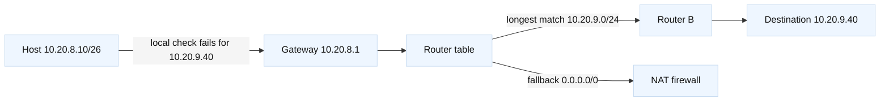

# Chapter 2: Addressing, Subnetting, and Routing

## SDE2 integration lens

Relate every prefix to an owner, return path, and failure domain. Before
changing an LTM self IP, SNAT address, GTM listener, or Kubernetes route,
compare intended CIDR ownership with actual route tables and IPAM. Correct
subnet arithmetic is necessary but not sufficient when routes overlap.

## Learning objectives

By the end of this chapter, you should be able to read IPv4 and IPv6 addresses, explain CIDR prefixes, calculate usable subnet ranges, and distinguish a host route from a network route. You will trace how a host chooses a next hop, how a router chooses a route with longest-prefix matching, and why a default route is useful but dangerous. You will also explain private addressing, NAT, IPv6 global and link-local addresses, and the operational clues left by a routing mistake. [Fact: IPv4 forwarding and CIDR behavior are specified by the IETF standards cited in the references.] [Inference: The debugging habits in this chapter make packet captures and route-table output easier to interpret, but they do not replace checking the actual configuration.]

## Prerequisites

Know that an IP packet has a source and destination address and that a link-layer frame carries a packet over one local network. Be comfortable with binary numbers, hexadecimal notation, and the idea that a prefix divides an address into a network part and a host part. Read Chapter 1 first if the terms interface, router, encapsulation, and packet lifetime are unfamiliar. You do not need access to a router or a cloud account: the examples are paper exercises. [Fact: An interface can have more than one address, and a machine can have more than one interface.] [Inference: Treating an address as an interface identity rather than as a person or service prevents many topology misunderstandings.]

## Mental model

Think of an address as a location label with two pieces. A CIDR prefix such as `192.0.2.0/24` says that the first 24 bits identify the network and the remaining eight bits identify an address within it. The prefix length, not dotted-decimal appearance, determines membership. `192.0.2.7/24` and `192.0.2.200/24` are on the same IPv4 subnet because their first 24 bits match. A host normally sends a packet directly to a peer on its local subnet; for a nonlocal destination it sends the packet to a configured default gateway. [Fact: IPv4 addresses are 32 bits; IPv6 addresses are 128 bits, written in hexadecimal groups and compressed according to IPv6 text rules.]

In IPv4, a subnet mask is another way to write the prefix. `/26` has 26 network bits and six host bits, so it contains 64 addresses. In traditional subnet accounting, the all-zero network address and all-one broadcast address are not assigned to ordinary hosts, leaving 62 usable addresses. [Fact: The special-address rule is a conventional IPv4 subnet practice; point-to-point and modern infrastructure designs can have different assignment rules.] IPv6 has no broadcast address. Neighbor Discovery uses multicast and ICMPv6 messages, and an interface commonly has a link-local `fe80::/10` address even when it also has a globally routable address. [Fact: IPv6 Neighbor Discovery is defined by RFC 4861 and address architecture by RFC 4291.]

The local decision is separate from the router's decision. A host compares a destination with its connected prefixes. If no connected prefix matches, it selects a route through a gateway. A router compares the destination against every candidate route and chooses the most specific matching prefix: `/32` beats `/24`, which beats `/0`. This is longest-prefix matching. The selected route can then have a metric or administrative preference that chooses among equally specific candidates. [Fact: Longest-prefix matching is the core forwarding rule.] [Inference: when two routes appear contradictory, first compare prefix length before comparing metrics.]

There are two related but different route views. The control plane learns routes
from connected interfaces, static configuration, or routing protocols and selects
the best route for each prefix in its routing information base (RIB). It then
programs the forwarding information base (FIB), the data-plane lookup structure.
The FIB performs the per-packet longest-prefix lookup; it does not run a routing
protocol or reconsider every rejected control-plane candidate. A route can
therefore be visible in control-plane output but absent from the FIB because of
policy, recursion, hardware limits, or programming lag. [Fact: RIB/FIB names and
the split between route computation and packet forwarding are common networking
concepts; exact commands and failure states vary by platform.] [Inference: check
the installed FIB and a packet trace, not only the control-plane route list.]

Private IPv4 ranges, such as RFC 1918 space, are not globally routed. NAT translates one address or address-and-port tuple to another at a boundary. Port address translation lets many internal flows share one public IPv4 address, but it changes the apparent endpoint and complicates inbound reachability, logging, and protocols that embed addresses. [Fact: NAT is an implementation behavior, not a replacement for a routing protocol or a complete security policy.] IPv6 generally restores end-to-end address space, but firewalls and routing policy are still required. [Inference: “IPv6 means no firewall” is as unsafe as “NAT is a firewall.”]

## Worked example

Suppose an application tier is allocated `10.20.8.0/26`. The mask has 26 one bits, leaving six host bits and 64 total addresses. The network is `10.20.8.0`; the conventional broadcast is `10.20.8.63`; ordinary host assignments are `10.20.8.1` through `10.20.8.62`. A web host at `10.20.8.10` wants `10.20.9.40`. Comparing the first 26 bits shows the destination is outside the local prefix, so the host sends an Ethernet frame to its gateway, perhaps `10.20.8.1`, while retaining `10.20.9.40` as the IP destination.

The control plane has learned these routes and installed the best route for each
prefix in its RIB: `10.20.9.0/24` via router B, `10.20.0.0/16` via router C,
and `0.0.0.0/0` via an upstream firewall. Assume the next hops resolve and
all three entries are programmed into the FIB. For destination `10.20.9.40`,
the FIB lookup matches all three entries, but `/24` is longest, so the packet is
sent to router B. If the control plane later installs an eligible
`10.20.9.40/32` host route and programs it into the FIB, `/32` wins. A metric
does not make the `/16` beat the `/24`; metrics select among routes of the same
prefix after the control plane has chosen what to install. If the `/24` is
present in the RIB but missing from the FIB, the data plane may use the `/16` or
default instead, depending on what was successfully programmed. [Fact:
`198.51.100.0/24` is documentation space reserved by RFC 5737.] [Inference: In
a real incident, compare control-plane/RIB state, FIB state, next-hop
resolution, and pre/post-NAT captures because each describes a different
forwarding context.]

For IPv6, write `2001:db8:1234:10::25/64`. The first four groups are the prefix in this example and the interface identifier occupies the rest. `2001:db8::/32` is documentation space, not production space. A destination on another `/64` goes to a router learned through Router Advertisements or configured statically. A neighbor on the same link is resolved with Neighbor Solicitation and Advertisement, not ARP. [Fact: `2001:db8::/32` is reserved for documentation by RFC 3849.]

## When this breaks

A wrong prefix can make a host ARP or perform IPv6 neighbor discovery for a remote address, producing confusing timeouts rather than an obvious “no route” error. A missing connected route prevents a router from knowing where directly attached hosts live. An incorrect default gateway can permit local traffic while breaking every remote destination. Asymmetric routing can let a request reach a server while the response leaves through another path and is dropped by a stateful firewall. A route that is present but less specific than an unintended route can silently send traffic to the wrong device.

NAT failures have their own signatures. Outbound connections may work while unsolicited inbound traffic fails because no translation state or destination rule exists. A service can advertise a private address that is unreachable from outside the NAT domain. Overlapping private ranges make VPN route selection ambiguous: the same prefix can represent two different tenants. [Inference: “It works from the server itself” proves only that one local forwarding context works; it says little about return routing, NAT, or policy on the full path.]

IPv6 failures may be caused by filtering ICMPv6, suppressing Router Advertisements, or assuming an IPv4-only diagnostic command is sufficient. A link-local next hop is valid only on its interface, so a route with `fe80::1` must identify the outgoing interface. MTU and fragmentation issues can look like addressing problems when small probes succeed and larger packets fail. [Fact: IPv6 routers do not fragment packets in transit; sources use Path MTU Discovery, while hosts may fragment before transmission.]

## Operational checklist

1. Record the source and destination addresses, prefix lengths, interface, and timestamp.
2. Check the host's connected routes and default route; verify the gateway is on-link.
3. Compare the destination against candidate routes and explicitly identify the longest match.
4. Inspect ARP for IPv4 or Neighbor Discovery state for IPv6, including the interface and state.
5. Trace each hop from the relevant network namespace or host, not only from a laptop.
6. Check NAT translations and both sides of a stateful firewall when address space changes.
7. Look for overlapping prefixes, asymmetric return paths, and stale dynamic routes.
8. Test a large payload as well as a small one when MTU or PMTUD is suspected.
9. Preserve route-table and packet-capture evidence before changing configuration.

## Diagram

The diagram separates the host's on-link test from the router's route choice. [Fact: The labels use documentation addresses and are illustrative.] [Inference: A capture at the host and another after the firewall can reveal whether the failure is local forwarding, route selection, or translation.]

## Questions and answers

1. **What does `/24` mean?** It means 24 leading bits are the network prefix and eight bits remain for addresses. The dotted mask is usually `255.255.255.0`.

Interview reasoning: For “What does `/24` mean,” state the mechanism and where it operates, then give the tuple, state transition, and evidence that distinguish the leading hypotheses. Explain the operational trade-off and a worked diagnostic. The caveat is that a successful local check proves only that check, so validate the complete request path and define rollback.

2. **Why is `/26` not simply four times smaller than `/24` in every sense?** It has one quarter as many addresses, 64 instead of 256, because two additional prefix bits leave four times fewer host combinations.

Interview reasoning: For “Why is `/26` not simply four times smaller than `/24` in every sense,” state the mechanism and where it operates, then give the tuple, state transition, and evidence that distinguish the leading hypotheses. Explain the operational trade-off and a worked diagnostic. The caveat is that a successful local check proves only that check, so validate the complete request path and define rollback.

3. **What is longest-prefix matching?** It chooses the matching route with the greatest prefix length, which represents the narrowest destination range.

Interview reasoning: For “What is longest-prefix matching,” name the source and destination prefixes, longest-match decision, next hop, VRF or policy table, and return route. Verify both directions with route lookups and a narrow flow trace. A present route is not proof of ARP/ND, ACL, MTU, or listener success; NAT and proxies can also make endpoint evidence differ from the original client.

4. **What is a default route?** IPv4 `0.0.0.0/0` and IPv6 `::/0` match destinations not covered by a more specific route. They are useful exits, not proof that the destination is reachable.

Interview reasoning: For “What is a default route,” name the source and destination prefixes, longest-match decision, next hop, VRF or policy table, and return route. Verify both directions with route lookups and a narrow flow trace. A present route is not proof of ARP/ND, ACL, MTU, or listener success; NAT and proxies can also make endpoint evidence differ from the original client.

5. **Does NAT route packets?** A NAT device must route or bridge traffic as appropriate, but translation itself rewrites addresses or ports; it is not a route-distribution protocol.

Interview reasoning: For “Does NAT route packets,” name the source and destination prefixes, longest-match decision, next hop, VRF or policy table, and return route. Verify both directions with route lookups and a narrow flow trace. A present route is not proof of ARP/ND, ACL, MTU, or listener success; NAT and proxies can also make endpoint evidence differ from the original client.

6. **Why does IPv6 need Neighbor Discovery?** Nodes use ICMPv6 ND to discover link-layer neighbors, routers, and prefixes because IPv6 has no ARP broadcast mechanism.

Interview reasoning: For “Why does IPv6 need Neighbor Discovery,” connect the IP next hop to the local Ethernet decision: ARP/ND supplies the neighbor mapping and VLAN membership determines whether that neighbor is on-link. Compare host cache, switch MAC table, gateway, and captures before clearing state. Duplicate or stale mappings can mimic an application outage, while indiscriminate cache clearing destroys useful evidence.

7. **Why can a more specific bad route be dangerous?** It wins over a correct aggregate or default route, so traffic can be consistently diverted without an obvious missing-route error.

Interview reasoning: For “Why can a more specific bad route be dangerous,” name the source and destination prefixes, longest-match decision, next hop, VRF or policy table, and return route. Verify both directions with route lookups and a narrow flow trace. A present route is not proof of ARP/ND, ACL, MTU, or listener success; NAT and proxies can also make endpoint evidence differ from the original client.

8. **What evidence distinguishes a host problem from a router problem?** The host route table, interface counters, and local ARP/ND state show the host decision; router tables and captures on both interfaces show forwarding beyond it. [Inference: Correlating both sides is stronger than relying on a single ping.]

Interview reasoning: A strong answer names the source and destination prefixes, the longest-prefix decision, the next hop, and the return route. In practice, verify both directions with route-table lookups and a narrowly scoped flow trace, because policy routing, NAT, VRFs, and asymmetric paths can invalidate a simple diagram. The caveat is that a route being present does not prove that ACLs, MTU, ARP/ND, or the receiving process will accept the packet.
