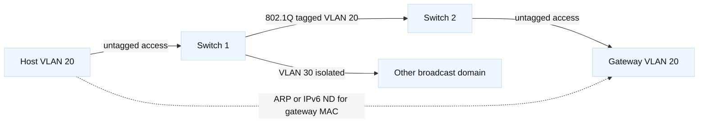

# Chapter 3: Ethernet, ARP, Neighbor Discovery, VLANs, and MTU

## SDE2 integration lens

Treat VLAN, ARP/ND, and MTU state as dependencies of the load-balancer data
plane. A VIP can be configured correctly while a missing tagged VLAN, stale
ARP owner, or tunnel MTU prevents traffic. Pair switch counters and neighbor
tables with F5 self-IP and route evidence.

## Learning objectives

You will learn how an Ethernet frame carries an IP packet, how switches learn MAC addresses, and why a switch can forward without knowing IP routes. You will compare IPv4 ARP with IPv6 Neighbor Discovery, understand access ports, trunks, VLAN tags, and native-VLAN risks, and diagnose MTU problems across links. You will connect these mechanisms to concrete packet captures and operational checks. [Fact: Ethernet framing and VLAN tagging are defined by IEEE standards; ARP and IPv6 ND are described by IETF specifications listed in the references.] [Inference: The exact command syntax differs by vendor, but the evidence categories are portable.]

## Prerequisites

Understand IP addresses, prefixes, gateways, and routing from Chapter 2. Know that a MAC address identifies a link-layer interface on a local network, while an IP address is used for internetwork forwarding. Basic familiarity with a switch port, a network interface, and a packet capture is helpful. [Fact: A MAC address is not a guaranteed permanent identity: hardware, virtualization, privacy features, and administrative configuration can change it.] [Inference: Always record interface, VLAN, and timestamp when interpreting a MAC observation.]

## Mental model

An Ethernet frame has a destination MAC, source MAC, an EtherType or length field, payload, and a frame check sequence. The payload may be an IPv4 packet, IPv6 packet, ARP message, or another protocol. A switch examines the destination MAC and forwards the frame out a port selected from its forwarding database. It learns source MAC addresses by associating each observed source with an ingress port and VLAN. Unknown unicast, broadcast, and some multicast traffic may be flooded within the relevant VLAN. [Fact: A switch's MAC table is scoped by VLAN; the same MAC can validly appear in different VLAN contexts.] [Inference: A “MAC is on port 7” statement is incomplete without the VLAN and observation time.]

ARP maps an IPv4 protocol address to a link-layer address on a local broadcast domain. If `192.0.2.10` needs `192.0.2.20`, it broadcasts an ARP Request and the owner usually replies, allowing a unicast Ethernet frame. ARP does not discover a remote server's MAC: for a remote destination, the host resolves the gateway's MAC. [Fact: ARP is specified by RFC 826.] Caches age and can be updated, so stale or poisoned entries have operational and security consequences.

IPv6 uses Neighbor Discovery over ICMPv6. Neighbor Solicitation and Advertisement resolve neighbors and support reachability detection; Router Solicitation and Advertisement communicate router and prefix information. Solicitation uses solicited-node multicast rather than an IPv4-style broadcast. [Fact: RFC 4861 defines ND; RFC 4862 defines IPv6 stateless address autoconfiguration.] Blocking all ICMPv6 can therefore break ordinary address and neighbor operation, not merely diagnostics. [Inference: Security filters should permit the ICMPv6 messages required by the local design rather than copy an IPv4 ACL mechanically.]

VLANs divide one physical switching fabric into multiple logical broadcast domains. An access port normally carries one untagged VLAN for an endpoint. A trunk carries multiple VLANs with 802.1Q tags so switches, routers, hypervisors, or appliances can distinguish them. The tag includes a VLAN identifier and priority information. A native VLAN, if configured, is sent untagged on a trunk; mismatched native VLAN assumptions can place traffic in the wrong domain. [Fact: VLAN numbering and trunk defaults vary by vendor and platform.] [Inference: Treat “trunk” as a negotiated or configured contract, not as proof that every VLAN is allowed.]

MTU is the largest IP packet a link can carry without needing a lower-layer action. Ethernet payload MTU is often 1500 bytes, but overlays, tunnels, PPPoE, jumbo frames, and provider links differ. A VLAN tag adds frame overhead while common IP MTU calculations depend on the complete encapsulation design. [Fact: IPv4 routers may fragment when permitted; IPv6 routers do not fragment in transit.] [Inference: A path that passes TCP handshakes but fails large responses is a strong reason to test Path MTU, filtering, and fragmentation behavior.]

## Worked example

A laptop on access port `sw1/12` belongs to VLAN 20 and has IPv4 `192.0.2.25/24`. It sends traffic to `198.51.100.8`. Because the destination is not on-link, it first needs the gateway, `192.0.2.1`. ARP Request is broadcast only inside VLAN 20. Switch `sw1` learns the laptop's source MAC on port 12 and floods the request to other VLAN 20 ports, but not to VLAN 30. The gateway replies; the laptop then emits an Ethernet frame with destination MAC equal to the gateway and an IP destination still equal to `198.51.100.8`.

Between `sw1` and `sw2`, the link is a trunk allowing VLANs 20 and 30. The frame is tagged VLAN 20 on that link, then removed or retained according to the next port's role. If `sw2` accidentally allows only VLAN 30, the laptop may still see local ARP behavior on `sw1` while remote traffic fails. If the trunk's native VLAN differs at each end, untagged control or endpoint traffic can be classified inconsistently. [Inference: Capture both trunk directions and inspect VLAN tags instead of concluding from an endpoint capture alone.]

Now suppose an IPv6 host sends a 1480-byte packet across a tunnel whose effective MTU is 1400. The tunnel endpoint cannot forward the oversized packet as-is. IPv4 might fragment if policy permits; IPv6 requires the source to learn a smaller path MTU through ICMPv6 Packet Too Big and then send smaller packets. If a firewall drops that message, PMTUD can stall. [Fact: The exact effective MTU depends on encapsulation headers.] [Inference: A temporary lower-MTU test can confirm the hypothesis, but the durable fix is to correct the path or permitted control traffic.]

## When this breaks

A switch may learn a MAC on the wrong port because of a loop, virtualization move, spoofing, or stale state. MAC flapping can cause intermittent delivery as the forwarding entry changes. A full or unstable MAC table can cause flooding, increasing exposure and load. Broadcast storms can consume links and host CPU even when IP route tables are correct.

ARP problems include duplicate IPv4 addresses, stale cache entries, missing proxy behavior, and malicious replies. IPv6 ND can fail because multicast is filtered, router advertisements are absent or inconsistent, or a host has a bad neighbor cache. VLAN incidents commonly come from an access/trunk mismatch, an omitted allowed VLAN, a native VLAN mismatch, or an incorrect VLAN-to-subnet mapping. [Inference: The first question should be “which broadcast domain and port role?” before changing an IP address.

MTU faults often hide behind successful small pings. TCP SYN and SYN-ACK packets are small, while a later response can exceed the path limit. Encapsulation can reduce MTU only on some paths, creating direction-specific behavior. A tagged frame may also be rejected if a physical device has a lower maximum frame size. Do not “fix” this by enabling arbitrary jumbo frames: every link and endpoint in the path must support the intended size. [Fact: Frame-size support is a property of the complete path and device configuration.]

## Operational checklist

1. Identify interface, switch port, VLAN, MAC, IP, and timestamp for each observation.
2. Verify access versus trunk mode and the allowed VLAN set at both ends.
3. Inspect MAC learning and look for flaps, duplicates, unexpected ports, or rapid aging.
4. Check ARP entries for IPv4 and ND neighbors, including state and interface.
5. Capture the frame before and after a trunk to confirm tags and destination MAC changes.
6. Confirm the gateway MAC is used for remote IP destinations.
7. Compare endpoint, switch, and routed-interface MTUs; account for tunnels and tags.
8. Permit and observe required ARP, ICMPv6 ND, and PMTUD control traffic.
9. Test local, same-VLAN, inter-VLAN, and large-payload paths separately.

## Diagram

The dotted relationship represents neighbor resolution, while the solid path represents frame forwarding. [Fact: VLAN isolation is the intended logical behavior; a misconfigured trunk can defeat it.] [Inference: Capturing at the access side and trunk side gives a compact test of both port role and tagging.]

## Questions and answers

1. **What does a switch learn?** It learns a source MAC, ingress port, and VLAN association from observed frames; it does not learn an IP route from ordinary MAC learning.

Interview reasoning: For “What does a switch learn,” state the mechanism and where it operates, then give the tuple, state transition, and evidence that distinguish the leading hypotheses. Explain the operational trade-off and a worked diagnostic. The caveat is that a successful local check proves only that check, so validate the complete request path and define rollback.

2. **Why does a remote packet use the gateway MAC?** Ethernet is local-hop delivery. The IP destination remains remote, while the frame targets the next hop on the local link.

Interview reasoning: For “Why does a remote packet use the gateway MAC,” state the mechanism and where it operates, then give the tuple, state transition, and evidence that distinguish the leading hypotheses. Explain the operational trade-off and a worked diagnostic. The caveat is that a successful local check proves only that check, so validate the complete request path and define rollback.

3. **Is ARP used by IPv6?** No. IPv6 uses ICMPv6 Neighbor Discovery, including Neighbor Solicitation and Advertisement.

Interview reasoning: For “Is ARP used by IPv6,” connect the IP next hop to the local Ethernet decision: ARP/ND supplies the neighbor mapping and VLAN membership determines whether that neighbor is on-link. Compare host cache, switch MAC table, gateway, and captures before clearing state. Duplicate or stale mappings can mimic an application outage, while indiscriminate cache clearing destroys useful evidence.

4. **What is an access port?** It is an endpoint-facing port assigned to one VLAN, commonly transmitting endpoint frames untagged.

Interview reasoning: For “What is an access port,” state the mechanism and where it operates, then give the tuple, state transition, and evidence that distinguish the leading hypotheses. Explain the operational trade-off and a worked diagnostic. The caveat is that a successful local check proves only that check, so validate the complete request path and define rollback.

5. **What is a trunk?** It is a link carrying multiple VLAN contexts, commonly represented with 802.1Q tags. The allowed set still must be checked.

Interview reasoning: For “What is a trunk,” state the mechanism and where it operates, then give the tuple, state transition, and evidence that distinguish the leading hypotheses. Explain the operational trade-off and a worked diagnostic. The caveat is that a successful local check proves only that check, so validate the complete request path and define rollback.

6. **Why are native VLAN mismatches risky?** An untagged frame can be assigned to different VLANs at each end, causing leakage or loss and sometimes confusing control-plane behavior.

Interview reasoning: For “Why are native VLAN mismatches risky,” connect the IP next hop to the local Ethernet decision: ARP/ND supplies the neighbor mapping and VLAN membership determines whether that neighbor is on-link. Compare host cache, switch MAC table, gateway, and captures before clearing state. Duplicate or stale mappings can mimic an application outage, while indiscriminate cache clearing destroys useful evidence.

7. **Why can small packets work when large packets fail?** The path may have a lower effective MTU, and the mechanism that should communicate that fact may be blocked or mishandled.

Interview reasoning: For “Why can small packets work when large packets fail,” state the mechanism and where it operates, then give the tuple, state transition, and evidence that distinguish the leading hypotheses. Explain the operational trade-off and a worked diagnostic. The caveat is that a successful local check proves only that check, so validate the complete request path and define rollback.

8. **What does MAC flapping suggest?** A source MAC is being observed on changing ports, which can indicate a loop, mobility, teaming issue, spoofing, or a topology/configuration error. [Inference: Correlate the timestamps and VLAN before declaring an attack.]

Interview reasoning: Treat DNS, DHCP, and IPAM as one ownership and lifecycle system: DHCP leases allocate addresses, DNS publishes names, and IPAM records intent and authority. For an incident, compare the lease database, authoritative records, address reservations, conflict events, and the actual ARP/ND table before editing anything. The caveat is that a successful allocation or DNS lookup can still be stale or contradictory; reconciliation must be scoped, auditable, and safe for active clients.