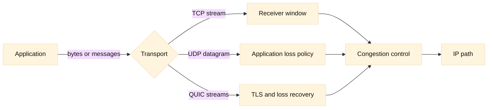

# Transport protocols: TCP, UDP, and QUIC

## SDE2 integration lens

Map transport state to proxy budgets: SYN backlog, established connections,
idle timeout, retransmission, TLS handshakes, and SNAT translations. LTM can
accept a client TCP connection while failing to open the server-side one, and
GTM DNS steering cannot repair an established flow.

## Learning objectives

By the end of this chapter, a reader should be able to describe what a transport protocol contributes beyond IP, identify TCP state transitions in a packet trace, choose sensible uses for UDP and QUIC, and explain how congestion control differs from application rate limiting. The reader should also be able to distinguish a connection being established from an application being healthy, and use counters and timings to form a testable diagnosis.

**Fact:** IP provides best-effort delivery of packets between addresses; it does not promise delivery, ordering, or a particular application process. TCP adds a reliable, ordered byte stream, while UDP supplies a minimal datagram interface. These descriptions follow the Internet standards for TCP and UDP ([RFC 9293](https://www.rfc-editor.org/rfc/rfc9293), [RFC 768](https://www.rfc-editor.org/rfc/rfc768)). **Inference:** The right protocol is therefore a property of the application’s loss, latency, and ordering needs, not a universal performance ranking.

## Prerequisites

Know IPv4 or IPv6 addresses, ports, routing, and the idea that a packet can be dropped at any hop. You should be comfortable reading hexadecimal or decimal port numbers and understand that a socket is commonly identified by protocol, local address and port, and peer address and port. Earlier chapters cover packet journeys and subnetting. No kernel tuning is required; examples use ordinary client and server observations.

## Mental model

Think of IP as a postal network that may lose or duplicate envelopes. TCP is a conversation with numbered pages, acknowledgements, retransmission, flow control, and a rule for sharing a congested road. A TCP connection is identified by a four-tuple and begins with a three-way handshake: a client sends SYN, a server replies SYN-ACK, and the client acknowledges. Sequence numbers make a stream reassemble in order. A receive window protects the receiver; a congestion window protects the network. The sender effectively transmits no more than the smaller permitted amount.

TCP’s FIN means an endpoint has no more bytes to send, whereas RST aborts a connection or rejects an unusable state. TIME-WAIT lets delayed segments expire and protects the next connection using the same tuple. Keepalive probes can detect a dead peer, but idle timeouts in NATs, firewalls, load balancers, and servers are independent policies. **Fact:** A successful handshake proves reachability to a listening socket at that moment, not that an HTTP handler, database, or downstream dependency works. **Inference:** Health checks should exercise the smallest meaningful application behavior while keeping their cost bounded.

UDP retains message boundaries and has no built-in handshake, retransmission, ordering, or congestion control. The application must supply any needed sequence, retry, authentication, or pacing rules. DNS, real-time media, and discovery commonly value short messages and tolerate some loss. UDP can also carry a protocol that builds reliability itself; QUIC does this over UDP.

QUIC integrates a secure transport handshake with TLS 1.3, independent streams, connection identifiers, and loss recovery. **Fact:** QUIC streams avoid forcing unrelated streams to wait behind a lost packet at the stream layer, although packets still share a path and congestion controller ([RFC 9000](https://www.rfc-editor.org/rfc/rfc9000), [RFC 9001](https://www.rfc-editor.org/rfc/rfc9001)). QUIC connection IDs help survive a client’s address change. **Inference:** QUIC is attractive for mobile clients and multiplexed applications, but middleboxes, observability, and policy controls must explicitly support UDP.

Congestion control is a feedback loop. A sender increases its allowed in-flight data when acknowledgements arrive and reduces it after loss or an explicit congestion signal. Slow start probes capacity; congestion avoidance grows more cautiously. Retransmission timeout, duplicate acknowledgements, and selective acknowledgements affect recovery. Flow control can stop a sender even when the path has spare capacity, because the receiver advertised a small window. Application retries are a separate loop and can multiply load during an outage.

## Worked example

Suppose a browser connects to `api.example.test` on TCP port 443 through a reverse proxy. A capture shows SYN at time 0 ms, SYN-ACK at 31 ms, ACK at 32 ms, TLS and HTTP bytes at 36 ms, then an ACK gap and a retransmission at 1,100 ms. The handshake RTT is about 31 ms, so DNS and route reachability are not the first suspects. The long delay after data suggests loss, queueing, a stalled receiver, or a policy device dropping a segment. Check both directions, advertised windows, selective acknowledgements, interface errors, and proxy idle timers before changing a congestion algorithm.

Now compare a UDP telemetry sender that emits one 200-byte datagram every second. A missing sample is acceptable, so retransmitting it may be less useful than sending the next sample. If the sender changes to 500 datagrams per second during an alert, it still needs pacing and a loss policy: UDP does not protect other traffic. For QUIC, inspect connection ID, handshake duration, stream-level progress, packet loss, and the negotiated transport parameters. A packet capture that calls all encrypted UDP bytes “failed” is incomplete; encryption hides payload semantics, not transport behavior.

## When this breaks

The common failure is treating every timeout as “TCP is slow.” A SYN timeout can mean filtering, a dead route, an exhausted listener backlog, or asymmetric return traffic. A completed handshake followed by no response points toward application scheduling, TLS, proxy policy, or a server that accepted but cannot serve. Repeated retransmissions with a shrinking congestion window indicate a path problem or overload, but a capture point can itself miss packets.

UDP failures are often silent. A firewall may allow TCP 443 but block UDP 443, causing QUIC clients to fall back to TCP-based HTTP/2. A NAT mapping may expire between datagrams. Fragmented UDP is especially fragile because losing one fragment loses the datagram. For DNS, truncation should lead a capable resolver to retry over TCP; an application that assumes every response fits in one datagram is brittle.

QUIC can fail because a load balancer routes packets with a changing address to different stateful workers, because a path blocks UDP, or because an implementation’s maximum datagram and MTU assumptions are wrong. **Inference:** A fallback that is observable and bounded is safer than indefinite retries. Retry storms, synchronized reconnects, and overly long idle keepalives can turn a small network event into a large incident.

## Operational checklist

1. Record the protocol, local and peer addresses, ports, timestamps, and capture location.
2. For TCP, inspect SYN, SYN-ACK, ACK, retransmissions, resets, FINs, RTT, windows, and SACK.
3. Separate handshake latency, TLS latency, first-byte latency, and total response time.
4. Compare client, proxy, and server counters to detect asymmetric loss or a wrong hop.
5. Check listener backlog, ephemeral-port exhaustion, NAT state, firewall rules, and idle timers.
6. For UDP, define acceptable loss, message size, pacing, duplicate handling, and authentication.
7. For QUIC, verify UDP reachability, connection migration behavior, stream blocking, and fallback.
8. Change one control at a time; preserve a capture and before/after counters.

## Diagram

## Questions and answers

1. **What does TCP guarantee?** It presents an ordered, reliable byte stream if the connection remains usable; it does not guarantee bounded latency or application success. Retries can make delivery late.
2. **Why is a three-way handshake needed?** Each side confirms that it can send and receive, and sequence numbers are synchronized. It also creates work that can be abused, motivating backlog protections.
3. **What is the difference between flow and congestion control?** Flow control protects a receiver’s buffers; congestion control protects the shared path. Either can limit sending, and they require different evidence.
4. **When is UDP appropriate?** When the application can tolerate loss or implements its own recovery and needs message boundaries or low setup overhead. It is not automatically faster.
5. **Why can a TCP connection be established but requests fail?** The listening socket may accept while the process is overloaded, a proxy may reject a route, or TLS and application work may fail afterward.
6. **What does RST tell an operator?** An endpoint or intermediary abruptly rejected or aborted state. It identifies an event, not necessarily the root cause; inspect who sent it and what preceded it.
7. **How does QUIC reduce head-of-line blocking?** Loss in one stream does not prevent other streams from being delivered at the transport’s stream interface, although congestion and packet loss still affect all streams sharing the connection.
8. **Why do retries cause incidents?** Independent clients can synchronize retries and multiply requests against an already impaired dependency. Exponential backoff, jitter, budgets, and idempotency limit amplification.
9. **What should a capture prove before a tuning change?** It should show the failing phase, direction, packet evidence, and a plausible mechanism. A single retransmission is not enough to justify changing congestion control.

Primary references include [RFC 9293](https://www.rfc-editor.org/rfc/rfc9293), [RFC 9000](https://www.rfc-editor.org/rfc/rfc9000), and [RFC 9001](https://www.rfc-editor.org/rfc/rfc9001). Statements labeled **Fact** summarize standards; statements labeled **Inference** are engineering conclusions.
