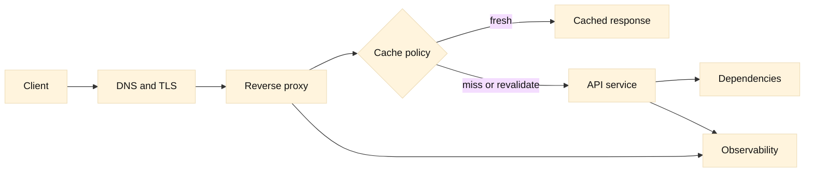

# HTTP, APIs, and proxy boundaries

## SDE2 integration lens

An HTTP status is an observation at one hop, not a root cause. Compare client
and server status classes, retry headers, request IDs, cache keys, and proxy
timeouts. F5 profiles, WAF rules, and sidecars may rewrite headers or terminate
TLS; document each boundary without exposing credentials.

## Learning objectives

This chapter teaches how HTTP versions carry requests and responses, how methods and status codes communicate intent, how caches decide whether a response can be reused, and where an API or reverse proxy should enforce policy. You will learn to separate protocol facts from design inference, trace one request across proxy boundaries, and diagnose failures without blaming “the network” for an application decision.

**Fact:** HTTP is a stateless application protocol whose messages have semantics defined by standards, while a server may maintain state using cookies, tokens, or another mechanism ([RFC 9110](https://www.rfc-editor.org/rfc/rfc9110)). **Inference:** Stateless messages make horizontal scaling easier, but authentication, consistency, and retries still require explicit design.

## Prerequisites

Know TCP or QUIC basics, DNS names, TLS termination, and the difference between a client and an origin server. You should understand headers, JSON, status codes, and a URI. Earlier chapters explain packet journeys and transport behavior. A command-line HTTP client is useful, but the concepts apply to browsers, service clients, and load balancers.

## Mental model

Model a request as a typed message crossing a sequence of trust and policy boundaries. The client sends a method, target, headers, and optionally a body. An origin or intermediary returns a status, headers, and body. HTTP/1.1 uses textual messages and one request stream per connection at a time in the common case. HTTP/2 encodes messages into binary frames and multiplexes streams over one connection. HTTP/3 maps HTTP semantics onto QUIC streams ([RFC 9113](https://www.rfc-editor.org/rfc/rfc9113), [RFC 9114](https://www.rfc-editor.org/rfc/rfc9114)). **Fact:** These versions preserve core HTTP semantics while changing framing and transport. **Inference:** An HTTP/2 or HTTP/3 upgrade cannot repair a slow database or an incorrect cache key.

Methods describe intent. GET retrieves a representation and is safe; HEAD asks for headers without the response content; POST commonly requests processing or creates subordinate state; PUT replaces a known resource; PATCH applies a partial change; DELETE requests removal. “Safe” does not mean harmless to infrastructure: a GET can trigger expensive work if an API is poorly designed. Idempotency describes the effect of repeating a request, not whether it has no side effects. A payment endpoint may use an idempotency key so a retried POST does not charge twice.

Status codes are a compact contract. 2xx indicates success, 3xx redirection or cache validation behavior, 4xx a client or request problem, and 5xx a server or gateway problem. A 401 challenges authentication; 403 indicates understood but refused authorization; 404 can mean absent or intentionally undisclosed; 429 expresses rate limiting; 502, 503, and 504 often identify gateway or availability boundaries. **Inference:** Alerting should group status with latency, route, dependency, and body metadata rather than count every 5xx equally.

Caches reuse a stored response when freshness and request matching permit it. `Cache-Control`, validators such as `ETag`, `Last-Modified`, `Expires`, and `Vary` influence the decision ([RFC 9111](https://www.rfc-editor.org/rfc/rfc9111)). A fresh response can avoid origin work; a stale response may be revalidated with `If-None-Match` and receive 304 Not Modified. A cache key commonly includes scheme, host, path, query, and selected headers. **Inference:** Never cache a response containing user-specific data unless the policy and key explicitly isolate users; “it is a GET” is not a sufficient safety argument.

A reverse proxy receives traffic on behalf of an origin. It may terminate TLS, authenticate, normalize paths, apply limits, select a backend, cache, compress, and record telemetry. It should preserve or deliberately rewrite forwarding context such as `Host`, scheme, client identity, and request ID. A proxy boundary is also a trust boundary: headers supplied by an untrusted client must not be treated as authoritative identity. API gateways add routing and governance, but application authorization remains a defense-in-depth concern.

## Worked example

A client requests `GET /v1/orders?state=open` with an access token. DNS selects a public address, TLS terminates at a reverse proxy, and the proxy routes to an orders service. The proxy adds a request ID and forwards the original host and scheme through controlled headers. The service returns `200`, an `ETag`, and `Cache-Control: private, max-age=30`. A shared cache must not reuse that response for another user: `private` and the authorization context are decisive. If the client repeats the request with `If-None-Match`, the service may return 304, saving the body while preserving the representation’s validation semantics.

If the service is unavailable, the proxy may produce 503 and a `Retry-After` policy. A client should retry only if its operation and budget permit it. If a proxy reports 504, inspect proxy-to-origin connect time, TLS time, upstream queue time, and origin logs using the request ID. A fast client-to-proxy measurement does not prove a fast origin.

## When this breaks

HTTP/1.1 clients can suffer connection queueing; HTTP/2 can expose server or client limits on concurrent streams; HTTP/3 can be blocked by UDP policy or unsupported telemetry. A proxy may reject a request because its maximum header or body size differs from the origin. Incorrect `Host` routing can send a valid request to the wrong virtual service. Path normalization differences can create security bugs where the proxy authorizes one path and the application interprets another.

Caching failures are subtle: a missing `Vary` can mix representations, a cache may key on an untrusted header, and stale data can violate user expectations. Compression and content negotiation can make a body look different while representing the same resource. A 200 response with an application-level error is still a protocol success; clients and dashboards must inspect the documented body contract.

Retries can duplicate non-idempotent work, while aggressive timeouts can abandon requests that the origin will complete. **Inference:** Set budgets across the entire request graph, propagate cancellation, and make overload behavior explicit. Logs should avoid tokens, cookies, and personal data; request IDs are useful only when their trust and retention are understood.

## Operational checklist

1. Record HTTP version, method, authority, path, status, response size, and phase timings.
2. Verify TLS termination and forwarding headers at every proxy boundary.
3. Confirm route, authentication, authorization, body limits, and normalization are consistent.
4. Inspect cache directives, key inputs, validators, `Vary`, and user-data isolation.
5. Correlate client, proxy, origin, and dependency logs with a request ID.
6. Check connection, stream, header, body, queue, and idle timeout limits.
7. Define retryable statuses and methods, backoff, jitter, idempotency, and total budgets.
8. Redact credentials and sensitive payloads before exporting traces or captures.

## Diagram

## Questions and answers

1. **What changed between HTTP/1.1, HTTP/2, and HTTP/3?** Framing and transport changed: text-oriented persistent messaging, binary multiplexed streams over TCP, and HTTP over QUIC respectively. Core request semantics remain recognizable.
2. **Is GET always safe to cache?** No. A response can be personalized or have unsafe operational effects. Cache directives, authorization context, validators, and key design determine safety.
3. **What is idempotency?** Repeating an operation has the same intended resource effect after the first successful application. It is a semantic property and may need an idempotency key for retries.
4. **When should a client retry 503?** Only when the operation is safe or deduplicated, the server’s guidance and client budget allow it, and backoff with jitter prevents a retry storm.
5. **Why can a proxy return 502?** It may be unable to establish or correctly speak to an upstream, or it may receive an invalid upstream response. Inspect both sides and the proxy’s reason code.
6. **What does `Vary` do?** It tells caches which request headers affect representation selection. Omitting a relevant header can cause one representation to be served to the wrong request.
7. **Why preserve the original scheme?** An origin may need to generate correct redirects, secure cookies, and absolute URLs. Forwarded metadata must be authenticated or rewritten by a trusted proxy.
8. **Can a 200 response be an application failure?** Yes. HTTP only reports message-level status; an API can encode a business error in a 200 body. Contracts and metrics should make that distinction visible.
9. **Where should authorization live?** At the service owning the resource, with gateway checks as defense in depth. A gateway-only check is risky when traffic can reach the service through another path.

Primary references: [RFC 9110](https://www.rfc-editor.org/rfc/rfc9110), [RFC 9111](https://www.rfc-editor.org/rfc/rfc9111), [RFC 9113](https://www.rfc-editor.org/rfc/rfc9113), and [RFC 9114](https://www.rfc-editor.org/rfc/rfc9114). **Fact** marks standards-derived behavior; **Inference** marks design guidance.
