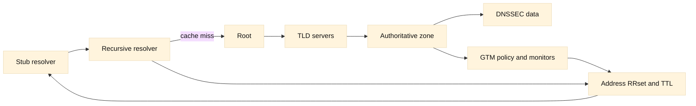

# DNS resolution and operations

## SDE2 integration lens

Always record resolver location, answer set, TTL, authoritative source, and
time observed. A GTM decision is filtered by recursive caching and client
connection reuse. DDI ownership, DNSSEC state, and negative caching can each
make a correct record look wrong from one vantage point.

## Learning objectives

You will learn how a stub resolver, recursive resolver, and authoritative server cooperate; how common record types and TTLs shape behavior; what DNSSEC authenticates; how negative caching works; and how DNS-based global traffic management relates to, but does not replace, application health. You will also practice tracing a name-resolution failure by asking which server knew which fact and when that fact may expire.

**Fact:** DNS is a distributed, hierarchical database and protocol. A recursive resolver obtains answers from authoritative servers and can cache them; an authoritative server publishes data for a zone ([RFC 1034](https://www.rfc-editor.org/rfc/rfc1034), [RFC 1035](https://www.rfc-editor.org/rfc/rfc1035)). **Inference:** Resolution is best debugged as a chain of responsibility rather than as a single “DNS server” box.

## Prerequisites

Understand IP addresses, UDP and TCP ports, delegation, and basic caching. You should know that a fully qualified name ends at the DNS root even when software displays a trailing dot implicitly. Earlier chapters describe packet journeys and transport behavior. Familiarity with an observation tool such as `dig` is helpful, but the workflow can be performed from resolver logs and packet captures.

## Mental model

Start with a client’s stub resolver. It normally asks a configured recursive resolver, which may answer from cache or walk the hierarchy: root referral, top-level-domain referral, then the zone’s authoritative server. Delegation uses NS records and glue addresses when necessary. The authoritative response has an owner name, type, class, data, and TTL. The recursive resolver stores that answer until its TTL expires, subject to implementation policy.

Common records include A for IPv4 address, AAAA for IPv6 address, CNAME for an alias, NS for delegation, SOA for zone metadata, MX for mail exchange, TXT for text-based policies, and PTR for reverse mapping. A CNAME points to another name rather than an address and can add lookup work. **Fact:** A name can have multiple A or AAAA records, but clients and resolvers do not promise a particular application-level load-balancing algorithm. **Inference:** Treat record order as a hint, not as a complete traffic policy.

TTL is a freshness allowance advertised with an RRset. A resolver may continue serving a cached answer while it is fresh, reducing authoritative load and improving latency. Lowering TTL before a change does not instantly flush already cached answers; caches learned the previous value earlier. Raising TTL can reduce query load but makes correction slower. Negative answers also have caching rules. A `NXDOMAIN` says the name does not exist in the relevant namespace; `NODATA` means the name exists but lacks the requested type. The SOA parameters influence negative caching ([RFC 2308](https://www.rfc-editor.org/rfc/rfc2308)).

DNSSEC adds signed data and a chain of trust from a trust anchor through DS and DNSKEY records. **Fact:** DNSSEC authenticates DNS data origin and integrity; it does not encrypt ordinary DNS queries or make an unavailable service healthy ([RFC 4033](https://www.rfc-editor.org/rfc/rfc4033)). Validation failures can produce SERVFAIL rather than an ordinary negative answer. **Inference:** Operators should distinguish unsigned, insecure delegation from broken validation and preserve resolver evidence such as AD and CD behavior.

Global traffic management (GTM), also called BIG-IP DNS in F5 terminology, answers DNS questions using a policy over Wide IPs, pools, virtual servers, monitors, and locations. It can select an address based on availability, topology, ratio, or persistence. The answer is still cached according to TTL and client behavior. **Inference:** GTM chooses an advertised destination; it cannot revoke an answer already cached at every client, and it cannot prove that an application transaction will succeed after selection. LTM or another local load balancer handles the subsequent connection.

## Worked example

A client asks its recursive resolver for `shop.example.test A`. The resolver has no fresh cache. It queries a root server, follows the `.test` referral, and reaches the authoritative server for `example.test`. The authority returns an A RRset with TTL 60 and an SOA in the authority section. The recursive resolver returns the address and caches it for up to 60 seconds. A second client behind the same resolver may receive the cached answer without contacting the authority.

Suppose the authority is a GTM service. Its monitor marks site west unavailable and selects site east, returning east’s address. Existing clients with 300-second cached west answers continue using west until their caches expire or fail over through application logic. A new query through another resolver may see a different answer because cache age and policy inputs differ. To diagnose, compare authoritative answers (`+norecurse`), recursive answers, TTL remaining, resolver validation status, and the health decision at the time of the query.

## When this breaks

A stale or wrong answer can result from cache age, a forgotten delegation, split-horizon views, an incorrect CNAME chain, or an authoritative server publishing inconsistent replicas. `SERVFAIL` can indicate timeout, lame delegation, DNSSEC validation failure, or an implementation problem; it is not synonymous with NXDOMAIN. UDP truncation may require TCP fallback, and blocked TCP 53 can make large or DNSSEC responses fail.

Negative caching surprises teams during migrations: creating a record immediately after clients observed NXDOMAIN does not guarantee immediate visibility. TTL changes are also bounded by the old cached value. A low TTL does not solve an application outage if clients pin addresses, resolvers ignore policy within standards limits, or a connection remains established.

GTM monitors can be shallow, stale, or aimed at the wrong virtual server. A healthy TCP port may hide a broken login flow. Geographic or topology policy can select a distant site when resolver location differs from client location. **Inference:** Pair DNS policy with endpoint telemetry, conservative failback, and an explicit understanding of resolver diversity. Do not use DNS answers as the only source of truth for capacity.

## Operational checklist

1. Identify the client stub, recursive resolver, authoritative server, zone, and view.
2. Query each boundary separately and record flags, response code, RRset, TTL, and authority data.
3. Check delegation, NS reachability, glue, serial numbers, and replica consistency.
4. Distinguish NXDOMAIN, NODATA, timeout, REFUSED, and SERVFAIL.
5. Test both UDP and TCP DNS paths, especially for large or signed responses.
6. Validate DNSSEC signatures, DS/DNSKEY chain, clock correctness, and resolver status.
7. For GTM, inspect Wide IP policy, pool members, monitor target, persistence, and TTL.
8. Plan changes around cached answers, negative TTLs, client pinning, and rollback timing.

## Diagram

## Questions and answers

1. **What is the difference between recursive and authoritative service?** A recursive resolver finds and caches answers for clients; an authoritative server publishes the data for zones it serves. One deployment can contain both roles, but the responsibilities differ.
2. **What does TTL control?** It tells caches how long an RRset may be considered fresh. It does not force every client to forget an address at the exact instant a change is made.
3. **What is NXDOMAIN?** It indicates that the queried name does not exist in the relevant DNS namespace. It differs from an existing name with no requested type, commonly called NODATA.
4. **Why can a new record remain invisible?** Resolvers may have cached an earlier NXDOMAIN or old RRset. Negative and positive caching preserve those observations until their applicable lifetimes expire.
5. **What does DNSSEC protect?** Signatures let a validating resolver detect altered or forged DNS data along a chain of trust. DNSSEC does not provide confidentiality or application availability.
6. **Why is SERVFAIL not the same as NXDOMAIN?** SERVFAIL reports that the resolver could not successfully obtain or validate an answer; NXDOMAIN is a specific authoritative nonexistence result. Conflating them sends operators toward the wrong fix.
7. **How does GTM relate to DNS?** GTM is an authoritative DNS decision point that selects an address using policy and health inputs. Its answer is then subject to resolver and client caching, and the selected service must still work.
8. **Why query with and without recursion?** A nonrecursive query tests what a server itself knows authoritatively, while a recursive query tests the client-facing resolver path and cache. Comparing them localizes the boundary of disagreement.
9. **Why can multiple records fail to balance traffic?** Resolver, client, connection reuse, and address-selection behavior vary. RRset multiplicity is not a guarantee of equal distribution or health-aware selection.

Primary references: [RFC 1034](https://www.rfc-editor.org/rfc/rfc1034), [RFC 1035](https://www.rfc-editor.org/rfc/rfc1035), [RFC 2308](https://www.rfc-editor.org/rfc/rfc2308), and [RFC 4033](https://www.rfc-editor.org/rfc/rfc4033). **Fact** marks standards or vendor terminology; **Inference** marks operational conclusions.
