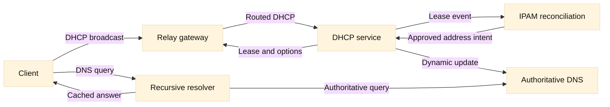

# 07. DDI: DNS, DHCP, and IPAM

## SDE2 integration lens

DDI is a consistency system as much as a set of protocols. Tie every address
to an allocation owner, lease state, DNS record, and intended consumer. Before
adding a VIP, node, or SNAT pool, reserve it in IPAM and reconcile in
dependency-safe order with an audit trail.

## Learning objectives

By the end of this chapter, you should be able to describe DDI as a coordinated set of services rather than a single product; trace a DHCP lease from discovery through renewal and release; explain why a relay is needed across routed boundaries; assign ownership for address space, DNS zones, and DHCP scopes; and diagnose drift between an IP address management (IPAM) record, a DHCP lease, DNS data, and the actual network. You will also learn to distinguish protocol facts from operational inferences, and to choose evidence that narrows a failure without changing production state.

**Fact:** DNS, DHCP, and IPAM have different authoritative roles. DNS answers names, DHCP supplies host configuration and leases, and IPAM records intended address-space usage. **Inference:** Calling all three “the source of truth” without naming a field and authority is a common cause of ambiguous incidents.

## Prerequisites

Know IPv4 addresses, prefixes, routing, UDP, and basic DNS terms such as recursive resolver, authoritative server, A/AAAA record, and TTL. Review [RFC 2131](https://www.rfc-editor.org/rfc/rfc2131) for DHCPv4 and [RFC 2132](https://www.rfc-editor.org/rfc/rfc2132) for common options. For DNS behavior, use [RFC 1034](https://www.rfc-editor.org/rfc/rfc1034) and [RFC 1035](https://www.rfc-editor.org/rfc/rfc1035). The examples use generic appliances and commands; they are not a production configuration guide.

## Mental model

Think of DDI as three ledgers joined by controlled events. The IPAM ledger describes allocation intent: a prefix exists, a subnet has a purpose, and an address is reserved, assigned, or available. The DHCP ledger describes dynamic possession: a client identifier or hardware address has a lease for an address, plus options such as gateway, DNS servers, and lifetime. The DNS ledger describes naming: a name maps to an address or other name and is cached by resolvers for a TTL. A single endpoint may therefore have three different timestamps and three different owners.

**Fact:** DHCPv4 uses UDP and the initial client message is broadcast because a client may not yet know its address or server. **Fact:** Routers normally do not forward broadcasts, so a DHCP relay agent turns the local broadcast into a routed unicast or controlled forwarding action and identifies the client subnet. **Inference:** If clients on one VLAN fail but clients on another VLAN succeed, compare relay configuration and scope selection before blaming DNS.

The DHCP lifecycle is conventionally summarized as DORA: DHCPDISCOVER, DHCPOFFER, DHCPREQUEST, and DHCPACK. A client can also use DHCPDECLINE when an address appears duplicated, DHCPNAK when the requested network is invalid, and DHCPRELEASE when it voluntarily gives up a lease. Renewal normally starts before expiration: the client unicasts a request to the original server, then can broaden the request if the server is unavailable. Exact timers and behavior are specified by the protocol and can be influenced by server policy.

IPAM should not be treated as a passive spreadsheet. It can own prefix allocation, reservations, approval workflow, and reconciliation jobs; a DHCP or DNS system can then consume approved data. Ownership must be explicit at the field level. For example, network engineering may own prefix boundaries, platform engineering may own a service reservation, and the DHCP service may own the current lease expiry. **Inference:** A write-back integration is safe only when update direction, conflict policy, and deletion semantics are documented.

DNS updates may be static, manually managed, or dynamic. Secure dynamic update can let DHCP create forward and reverse records, but the update identity and record ownership matter. A stale A record can coexist with a valid lease; a correct lease does not guarantee that a recursive resolver has expired its cached answer. TTL controls cache duration, not the speed of DHCP or DNS database replication. Negative answers can also be cached according to SOA-related rules.

## Worked example

Suppose a laptop joins VLAN 120, subnet `10.20.120.0/24`, and the user reports “the network is down.” Begin with a read-only packet capture or client log. The client emits DHCPDISCOVER with source `0.0.0.0`, destination `255.255.255.255`, and a client identifier. The access switch forwards it to the gateway; the gateway’s relay sets the gateway-address field identifying VLAN 120 and forwards the request to the DHCP service. **Fact:** The relay context is how one server can select among many scopes.

The DHCP server selects an unused address, say `10.20.120.47`, and offers it with a `/24` mask, gateway `10.20.120.1`, recursive DNS `10.20.10.53`, and a 3600-second lease. The client requests that offer and receives an acknowledgment. Check the client’s route and lease rather than assuming success from the presence of an address. Next query the recursive resolver for `portal.example.test`; if it returns an old address, inspect the record’s TTL and the authoritative answer. Finally compare IPAM: it should show the subnet and reservation policy, while the lease system should show the current client binding.

Now imagine IPAM says `.47` is free, DHCP says it is leased, and DNS still points `portal` at `.47` even though the laptop is not the portal. These are separate defects: missing lease reconciliation, unsafe address reuse, and an incorrect or stale DNS record. Do not immediately delete records. Capture timestamps, client identifier, server identifier, authoritative DNS response, recursive response, and IPAM audit history. A safe remediation is to quarantine the conflicting address, correct the owning system, and then reconcile downstream data according to the documented direction of authority.

## When this breaks

An incorrect or missing relay address commonly selects the wrong scope, produces a DHCPNAK, or leaves a client waiting. A relay ACL or firewall can permit DHCPDISCOVER but block replies, creating an apparently random outage. Multiple relays or helper addresses can produce multiple offers; the client chooses according to protocol behavior, while operators may mistakenly infer which server “won” from a single log line.

Address exhaustion looks like a DNS failure when new clients have no address. Check free leases, declined addresses, reservations, and lease duration. Duplicate addresses can arise from static configuration inside a dynamic pool, delayed lease cleanup, cloned virtual machines, or a stale IPAM import. **Inference:** Shortening leases may relieve exhaustion temporarily but can increase renewal traffic and does not repair ownership.

DNS failures include wrong delegation, missing glue, stale caches, split-horizon policy, DNSSEC validation errors, and dynamic-update authorization failures. Test from the client, the configured recursive resolver, and an authoritative server; these are different observations. A name resolving from one vantage point does not prove global correctness. A DHCP option that advertises the wrong resolver can make an otherwise healthy zone appear broken.

Integrations break when an API retry is not idempotent, when an object is renamed in one system, or when a deletion event is interpreted as permission to remove a still-used reservation. Vendor products also differ in terminology and synchronization guarantees. **Inference:** Reconciliation should produce a report and confidence level first; automatic correction should be limited to well-defined, reversible cases.

## Operational checklist

1. Identify the exact client, VLAN, subnet, client identifier, and timestamp.
2. Confirm link, VLAN tagging, default gateway, and relay/helper configuration.
3. Inspect DHCPDISCOVER/OFFER/REQUEST/ACK or renewal traffic and server logs.
4. Verify scope capacity, exclusions, reservations, declined leases, and option values.
5. Query the configured recursive resolver and an authoritative server separately.
6. Record answer, TTL, response code, and DNSSEC status where applicable.
7. Compare IPAM intent, DHCP possession, DNS naming, and network observations.
8. Check audit trails and integration queues before making a correction.
9. Quarantine conflicts and document the owner before deleting or reusing data.
10. Re-test from the original client and a second vantage point after propagation.

## Diagram

## Questions and answers

1. **Why can a DHCP client not simply send a unicast request at startup?** It may have no address, server address, or route. The initial broadcast lets a relay and server discover the client’s subnet.
2. **What does a relay add?** It carries the request across a routed boundary and supplies subnet context so the server can select the appropriate scope. It does not become the lease authority.
3. **Does a DHCPACK prove DNS works?** No. The ACK proves the server accepted a lease and returned options; resolver reachability, zone data, and delegation still need testing.
4. **Why is IPAM not automatically authoritative for every address?** IPAM usually records intended allocation and ownership, while DHCP records dynamic lease state. Their authority depends on the agreed data model.
5. **What is drift?** Drift is disagreement between systems or between recorded intent and observed state, such as an IPAM-free address that DHCP leases or a DNS name pointing to a retired host.
6. **Why can deleting a stale DNS record be dangerous?** It may be owned by another service, be temporarily hidden by caching, or be the only name for a still-live endpoint. Establish ownership and evidence first.
7. **What does a TTL control?** It bounds how long a caching resolver may reuse an answer; it does not control DHCP leases or guarantee instant worldwide change.
8. **How should conflicts be remediated?** Preserve evidence, quarantine the conflicting object, identify field owners, apply the smallest reversible correction, and verify from multiple vantage points.

Primary references: [RFC 2131](https://www.rfc-editor.org/rfc/rfc2131), [RFC 2132](https://www.rfc-editor.org/rfc/rfc2132), [RFC 1034](https://www.rfc-editor.org/rfc/rfc1034), and [RFC 1035](https://www.rfc-editor.org/rfc/rfc1035). **Fact/inference note:** protocol lifecycle and message roles are facts from the RFCs; recommendations about reconciliation order and quarantine are engineering inferences.
