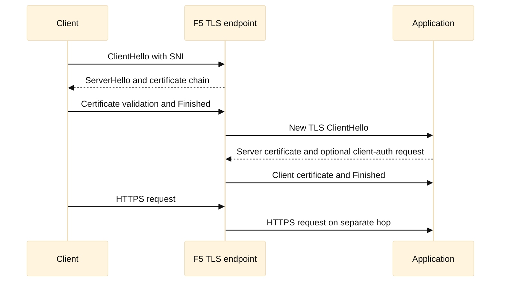

# 08. TLS, Certificates, PKI, and mTLS

## Learning objectives

You will learn to trace a TLS connection, explain the practical differences between TLS 1.2 and TLS 1.3, read an X.509 certificate, distinguish SAN from SNI, validate a chain, and reason about mutual TLS (mTLS). You will also build a rotation plan and understand what changes when an F5 or another reverse proxy terminates TLS. The goal is diagnosis: identify which identity, key, trust store, protocol version, or hop is failing without weakening security as a first response.

**Fact:** TLS provides confidentiality and integrity for records and can authenticate a server; client authentication is optional in ordinary TLS and is negotiated for mTLS. **Inference:** “The certificate is valid” is incomplete unless the hostname, time, chain, key usage, and trust context are named.

## Prerequisites

Know TCP connection setup, DNS names, HTTP requests, asymmetric keys, hashes, and basic threat modeling. Read [RFC 8446](https://www.rfc-editor.org/rfc/rfc8446) for TLS 1.3 and [RFC 5246](https://www.rfc-editor.org/rfc/rfc5246) for TLS 1.2. [RFC 5280](https://www.rfc-editor.org/rfc/rfc5280) defines X.509 path validation; [RFC 6066](https://www.rfc-editor.org/rfc/rfc6066) defines extensions including SNI. Examples are conceptual and contain no private keys.

## Mental model

TLS is a negotiation and key-establishment protocol carried over a transport such as TCP. The client offers protocol versions and cryptographic capabilities; the server selects compatible parameters and presents authentication material. Both sides derive traffic keys, then protect application records. TLS 1.2 commonly has a longer handshake and a separate cipher-suite vocabulary combining key exchange, authentication, encryption, and hashing. TLS 1.3 removes legacy choices, encrypts more of the handshake after the initial exchange, and uses modern authenticated encryption and ephemeral key exchange. **Fact:** TLS 1.3 still needs certificate validation when certificate authentication is used.

An X.509 certificate binds a subject identity to a public key through a signature by an issuer. Modern hostname verification uses the Subject Alternative Name (SAN) extension. The issuer may be an intermediate CA, which chains to a root CA trusted by the client. A signature proves that an issuer signed the certificate; it does not by itself prove that the client trusts the issuer or that the name matches. Check validity interval, SAN, basic constraints, key usage, extended key usage, revocation policy, and signature algorithms.

SNI is a ClientHello extension that tells a server which hostname the client intends to reach before the server selects a certificate. SAN is a certificate field listing identities. They solve different problems: SNI chooses a virtual-host configuration, while SAN is evaluated during hostname verification. **Inference:** A “wrong certificate” can mean missing SNI, a proxy default certificate, or a SAN mismatch, and packet capture plus endpoint logs distinguish these causes.

mTLS adds client authentication. The server requests a client certificate; the client sends a certificate and proves possession of the corresponding private key. The server validates the client chain against a client-CA trust store and may authorize a subject, SAN, SPIFFE-like URI, or mapped policy. mTLS is hop-specific. If a proxy terminates client TLS and opens a new TLS connection upstream, the upstream sees the proxy’s client identity unless the design deliberately forwards identity using a secure, authenticated mechanism.

## Worked example

A mobile client receives a handshake error for `api.example.test`. First determine the hop: client to F5, F5 to application, or application to a downstream service. From the client’s perspective, inspect the ClientHello SNI and offered versions, then the server certificate chain and negotiated protocol. Verify that `api.example.test` appears in SAN, that the current time is within the validity interval, and that the presented intermediates build to a trusted root.

Suppose the F5 presents a certificate whose SAN contains `www.example.test`, not `api.example.test`. The private key may be perfectly paired and the chain complete, but hostname validation correctly fails. The fix is to bind the right certificate/key chain to the SNI-based virtual server and confirm the default behavior for clients that omit SNI. Do not solve this by disabling hostname verification.

Now the client succeeds, but the F5-to-application hop returns an mTLS alert. Inspect the server’s requested client CA names, the F5 client certificate profile, and the upstream trust store. Confirm the F5 sends the full client chain when required and that the certificate’s client-authentication usage is permitted. **Inference:** A successful front-end handshake says nothing about the back-end trust relationship when TLS is terminated and re-originated.

For rotation, issue a new certificate before the old one expires, stage the chain and key in the intended trust stores, validate on a non-production listener, switch references atomically, and monitor handshakes. Retain the old certificate only for the overlap window and revoke or remove it according to policy. Record serial number, SANs, issuer, expiry, owner, and deployment locations; never put private keys in logs or source control.

## When this breaks

Common failures include expired leaf certificates, a missing intermediate, an untrusted private CA, SAN mismatch, SNI routing to the wrong virtual server, unsupported protocol versions, unacceptable signature algorithms, and clocks that are badly skewed. A browser may hide details that a service client reports precisely. Compare client and server timestamps and capture the negotiated parameters where policy permits.

Certificate chains fail when an operator sends only the leaf, sends the wrong intermediate, or assumes every client has the same root store. Cross-signing and trust-store differences can make one operating system succeed while another fails. **Fact:** Path validation is performed in the verifier’s trust context. **Inference:** “It works on my laptop” is weak evidence for a fleet of containers or appliances.

TLS termination introduces identity and observability boundaries. The proxy can inspect HTTP after decryption, but it also becomes responsible for certificate rotation, cipher policy, and secure upstream settings. Passing an `X-Forwarded-Client-Cert`-style header without authenticating the proxy allows spoofing; if identity must cross a hop, define an authenticated protocol and header-stripping policy. Session resumption, connection pools, and retries can make a certificate change appear gradual.

## Operational checklist

1. Name the failing hop, client, server, SNI hostname, and timestamp.
2. Check clocks, DNS target, TCP reachability, and the negotiated TLS version.
3. Inspect SAN, issuer, validity, key usage, and the complete presented chain.
4. Verify the client trust store and any private-CA distribution mechanism.
5. Confirm SNI-to-certificate binding and the no-SNI default policy.
6. For mTLS, check requested CA names, client certificate, private-key proof, and server trust store.
7. Inspect F5 client and server SSL profiles separately when it terminates TLS.
8. Rotate with overlap, inventory, atomic reference changes, and monitored rollback.
9. Redact private keys and certificate-bearing headers from diagnostics.
10. Re-test with representative clients and record evidence, not just a green browser.

## Diagram

## Questions and answers

1. **What does TLS 1.3 change conceptually?** It streamlines negotiation, removes many legacy algorithms, and encrypts more handshake messages while retaining certificate-based authentication when configured.
2. **Is a certificate signature encryption?** No. It authenticates a binding made by an issuer; negotiated traffic keys protect application records.
3. **Why is SAN more important than Common Name?** Modern hostname verification evaluates the SAN extension; a Common Name alone is not a reliable modern identity field.
4. **What is SNI?** It is a ClientHello hostname hint used by a server or proxy to select a virtual-host configuration and certificate.
5. **Why can a complete chain still fail?** The root may not be trusted, the name may not match, time may be invalid, or key usage and policy may reject the path.
6. **What does mTLS add?** The server requests and validates a client certificate and proof of its private key, enabling client identity and authorization decisions.
7. **Does front-end mTLS authenticate the application?** Not automatically. TLS termination creates a new hop; the upstream needs its own TLS and identity design.
8. **What is a safe rotation pattern?** Inventory, issue, stage, validate, overlap, atomically switch references, monitor, then retire the old material according to policy.

Primary references: [RFC 8446](https://www.rfc-editor.org/rfc/rfc8446), [RFC 5246](https://www.rfc-editor.org/rfc/rfc5246), [RFC 5280](https://www.rfc-editor.org/rfc/rfc5280), and [RFC 6066](https://www.rfc-editor.org/rfc/rfc6066). **Fact/inference note:** protocol and certificate semantics are standards facts; operational advice about F5 boundaries, overlap, and evidence is engineering guidance.
