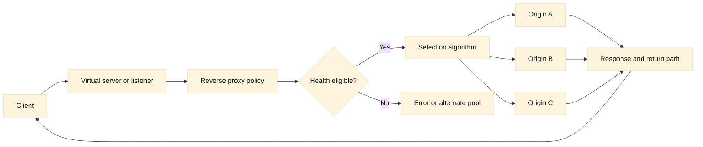

# 09. Reverse Proxies and Load Balancing

## Learning objectives

This chapter builds a request-path model for reverse proxies and load balancers. You will distinguish Layer 4 forwarding from Layer 7 proxying, design meaningful health checks, compare distribution algorithms, understand persistence and source NAT (SNAT), and reason about retries, capacity, and failure domains. You will also learn why a healthy pool can still serve failed requests and why an apparently harmless retry can multiply load.

**Fact:** A reverse proxy accepts a client connection and makes decisions before forwarding traffic to an origin. **Inference:** The proxy is a separate failure domain and observability boundary, not merely a transparent cable.

## Prerequisites

Know IP routing, TCP connection setup, HTTP request/response semantics, TLS termination, and basic queueing concepts. Review [RFC 9293](https://www.rfc-editor.org/rfc/rfc9293) for TCP and [RFC 9110](https://www.rfc-editor.org/rfc/rfc9110) for HTTP semantics. For a vendor vocabulary example, see the [F5 virtual server reference](https://clouddocs.f5.com/cli/tmsh-reference/v14/modules/ltm/ltm_virtual.html) and [pool reference](https://clouddocs.f5.com/cli/tmsh-reference/latest/modules/ltm/ltm_pool.html). This is a reasoning guide, not a universal configuration recipe.

## Mental model

At Layer 4, a load balancer can select a destination using IPs and ports and forward or proxy a TCP flow without understanding HTTP. At Layer 7, a reverse proxy parses HTTP, TLS, hostnames, paths, headers, and sometimes cookies; it can route `/payments` and `/catalog` differently, enforce policy, compress responses, or terminate TLS. A virtual server or listener is the client-facing contract. Pools contain origin members; health monitors decide eligibility; profiles define protocol behavior; SNAT controls return routing.

**Fact:** TCP state belongs to a connection, while HTTP requests can be sequential or multiplexed within a connection. **Inference:** A Layer 7 proxy may choose an origin per request, whereas a simple Layer 4 flow decision generally remains tied to the connection. This difference affects HTTP/2, WebSockets, retries, and persistence.

Health checks are hypotheses, not proof. A TCP connect monitor confirms that something accepts a socket. An HTTP monitor can verify status, headers, and body content, but may still miss dependency, authorization, or data-integrity failures. Deep checks can create load or depend on the same database they are meant to diagnose. **Inference:** The right monitor models the user-visible contract at a safe cost and has an explicit failure threshold and recovery policy.

Algorithms include round robin, ratio or weighted distribution, least connections, fastest response, and hash-based selection. Each assumes something about request cost and member capacity. Least connections can overload a member when long-lived connections have cheap requests; round robin ignores unequal work; a hash can preserve locality but reduce flexibility when membership changes. Persistence (sticky sessions) maps a client attribute, cookie, or source address to a member for a duration. It improves state locality but can create hotspots and complicate failover.

SNAT changes the source address seen by the origin. It is useful when the return route does not naturally pass through the proxy, but it hides the original client IP unless forwarded safely at Layer 7 or carried in a protocol-aware field. Preserve and authenticate client identity; never trust an incoming forwarding header from an untrusted network. Without SNAT, symmetric routing and firewall policy must be correct.

## Worked example

An API listener has three origin members: A and B in zone east, C in zone west. Round robin sends requests evenly, but A has twice the CPU capacity and C has a high-latency database. Replace the algorithm blindly and you may improve one metric while worsening another. First measure request rate, concurrent connections, latency distribution, error codes, and member saturation. Configure weights only when capacity differences are stable and observable.

The monitor requests `/healthz` and receives HTTP 200, yet checkout requests fail because the payment dependency is down. A deeper `/readyz` endpoint that verifies required dependencies may be more representative, but it must have a timeout and avoid charging or mutating data. Marking every member down because a non-critical analytics service is unavailable is an availability policy decision, not a protocol fact.

Now an origin response takes 8 seconds and the proxy timeout is 5 seconds. The proxy returns a 504. If it retries on another member, the first origin may continue doing work while the second also runs it, doubling load and potentially duplicating a non-idempotent operation. **Fact:** HTTP method semantics distinguish safe and idempotent methods in [RFC 9110](https://www.rfc-editor.org/rfc/rfc9110). **Inference:** Retry policy should be method-aware, bounded, and tied to an explicit request budget.

A client sees the same session on A because a cookie persistence rule lasts 30 minutes. A fails; the proxy can fail over to B, but any in-memory session disappears. The durable fix is shared or client-independent state, not an indefinitely longer stickiness timeout. During the incident, inspect persistence table size, rebalance behavior, SNAT port usage, and per-member queues.

## When this breaks

A proxy can be healthy while every origin is unhealthy, or report healthy members while an application dependency is failing. Monitor DNS, listener capacity, connection accept rate, queue depth, and origin health separately. A single monitor endpoint can become a false green if it bypasses authentication, cache, or critical dependencies.

Capacity failures occur at several ceilings: listener sockets, SNAT ephemeral ports, TLS handshakes, CPU, memory, bandwidth, concurrent origin connections, and application queues. **Inference:** “CPU is only 40%” does not disprove exhaustion at a smaller resource. Establish headroom and observe limits under representative traffic; do not invent universal throughput numbers.

Retries amplify overload, especially when clients, proxies, SDKs, and service meshes all retry. Use a total deadline, exponential backoff with jitter where appropriate, a retry budget, and idempotency keys for operations that can be repeated. A timeout is not proof that the origin did no work. Log a stable request identifier across hops.

Failure domains include availability zones, racks, network paths, control planes, certificate stores, DNS answers, and shared databases. A pool with members in two zones is not resilient if both depend on one NAT gateway. Draining a member requires connection and persistence semantics; abruptly removing it can reset long-lived streams. Test failover and restoration, including stale DNS and cached configuration.

## Operational checklist

1. Draw client, listener, proxy, pool, member, dependency, and return paths.
2. Determine L4 versus L7 behavior, TLS termination points, and HTTP multiplexing.
3. Check listener limits, TLS errors, queues, SNAT ports, and connection counts.
4. Validate monitor request, timeout, expected response, and dependency scope.
5. Compare algorithm assumptions with request cost, member capacity, and latency.
6. Inspect persistence keys, duration, hotspots, and failover behavior.
7. Verify original-client identity handling and forwarding-header trust boundaries.
8. Review retry count, timeout budget, idempotency, and duplicate side effects.
9. Map members and dependencies to independent failure domains.
10. Drain, change, and restore one scope at a time while watching correlated IDs.

## Diagram

## Questions and answers

1. **What is the main L4/L7 distinction?** L4 uses transport and addressing information; L7 understands application protocol fields and can route or retry per request.
2. **Why is a 200 health check insufficient?** The endpoint may not exercise critical dependencies or user authorization. Health depth must match the availability contract and safe cost.
3. **When is least-connections misleading?** Long-lived connections may consume slots without representing work, while short expensive requests can make a seemingly lightly connected member busy.
4. **What problem does persistence solve?** It keeps related requests on one member for state locality, at the cost of hotspots, failover complexity, and slower rebalancing.
5. **Why use SNAT?** It makes return traffic naturally traverse the proxy when origin routing would otherwise be asymmetric, but consumes source ports and hides the network source.
6. **Should every timeout be retried?** No. A request may have reached and changed the origin. Retry only within a bounded budget and with safe or explicitly idempotent semantics.
7. **What is a failure domain?** A set of components likely to fail together, such as a zone, NAT gateway, certificate store, or shared database.
8. **How do you investigate a 504?** Correlate listener timing, proxy queue and timeout, origin connect/response timing, retries, SNAT state, and origin logs using one request identifier.

Primary references: [RFC 9110](https://www.rfc-editor.org/rfc/rfc9110), [RFC 9293](https://www.rfc-editor.org/rfc/rfc9293), [F5 virtual server reference](https://clouddocs.f5.com/cli/tmsh-reference/v14/modules/ltm/ltm_virtual.html), and [F5 pool reference](https://clouddocs.f5.com/cli/tmsh-reference/latest/modules/ltm/ltm_pool.html). **Fact/inference note:** protocol definitions and F5 object terminology are referenced facts; monitor depth, algorithm choice, retry limits, and capacity reasoning are engineering inferences to validate in the target environment.
