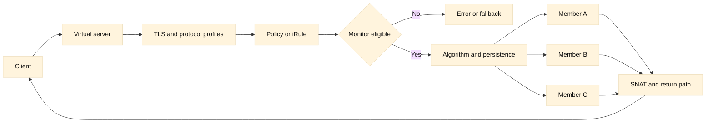

# 10. F5 LTM in depth

## Learning objectives

By the end of this chapter, you should be able to trace an LTM request from a client-facing virtual server to a pool member and back, explain how nodes and members differ, and choose evidence when a health check or application request fails. You will connect profiles, monitors, persistence, SNAT, TLS, policies, iRules, and high availability into one operational model. The aim is transferable reasoning, not a copy-and-paste production configuration.

**Fact:** BIG-IP Local Traffic Manager (LTM) uses virtual servers, pools, pool members, nodes, monitors, and profiles as distinct configuration objects. **Inference:** Keeping those objects separate makes a failure easier to localize: a listener can be available while its pool is empty, or a member can pass a TCP monitor while HTTP is broken. Terminology and object relationships are documented in the [F5 virtual server reference](https://clouddocs.f5.com/cli/tmsh-reference/v14/modules/ltm/ltm_virtual.html), [pool reference](https://clouddocs.f5.com/cli/tmsh-reference/latest/modules/ltm/ltm_pool.html), and [monitor reference](https://clouddocs.f5.com/cli/tmsh-reference/latest/modules/ltm/ltm_monitor.html).

## Prerequisites

Know IPv4/IPv6 routing, TCP connection establishment, HTTP status and headers, TLS termination, DNS, and basic load-balancing vocabulary. Review the earlier reverse-proxy chapter and [RFC 9293](https://www.rfc-editor.org/rfc/rfc9293) for TCP. You should understand that a virtual server address is a destination clients use, while an origin address is a destination selected after policy evaluation. This chapter deliberately avoids tenant names, credentials, and release-specific commands.

## Mental model

Think of LTM as a stateful decision pipeline. A client packet reaches a virtual server address and port. The virtual server owns listener behavior and references profiles that define TCP, HTTP, TLS, persistence, and other protocol handling. A policy or iRule may inspect a request and select, reject, rewrite, or redirect it. A pool is a set of candidate members, each normally an address and service port. A node represents an endpoint address that may be reused by members on different ports. A monitor periodically tests eligibility; its result is not the same thing as request success.

**Fact:** A pool member is commonly modeled as a node plus a service port, while a node is an address-level object. **Inference:** If port 443 is healthy but port 8080 is not, the member state can differ even though the node address is identical. Always identify the exact virtual server, pool, member, port, route domain, and monitor when comparing observations.

Selection algorithms encode assumptions. Round robin distributes selections in sequence and is understandable when members have similar capacity. Ratio or weighted selection expresses a known capacity relationship. Least connections considers active connection counts, but a long-lived WebSocket can make a member look busy while another member handles expensive short requests. Hash methods preserve affinity to a key but make rebalancing sensitive to membership changes. **Inference:** An algorithm is a capacity hypothesis; validate it with request cost, latency, queue depth, and saturation rather than a single average.

Persistence maps a key such as a cookie, source address, or TLS/session attribute to a member for a lifetime. It can preserve in-memory session state, but creates hotspots and delays recovery after topology changes. A persistence record is not a durable application session. Prefer shared or external session state when practical, use bounded timeouts, and define what happens when the selected member is unavailable.

SNAT changes the source address used on the server-side connection. It can make return traffic pass through BIG-IP when the origin’s route would otherwise be asymmetric. The trade-off is loss of the original source address at Layer 3 and finite source-port capacity. An HTTP header such as `X-Forwarded-For` can carry identity only when inserted or authenticated at a trusted boundary; an incoming client-supplied header is not proof. **Inference:** SNAT design is simultaneously a routing, capacity, audit, and security decision.

Profiles describe protocol behavior. A TCP profile influences connection timers and options; an HTTP profile enables parsing and header processing; a client SSL profile terminates TLS from the client; a server SSL profile initiates TLS toward the member. Terminating and re-encrypting TLS creates two cryptographic sessions and two certificate-validation questions. A certificate can be valid on one leg and wrong or expired on the other. Modern TLS behavior should be checked against [RFC 8446](https://www.rfc-editor.org/rfc/rfc8446) and the organization’s approved cipher policy.

Policies provide declarative matching and actions such as host/path routing or redirects. iRules are event-driven Tcl programs that can inspect and alter traffic. **Fact:** F5 documents iRule events and commands in its [iRules reference](https://clouddocs.f5.com/api/irules/). **Inference:** A policy is usually easier to review and constrain, while an iRule can express exceptions but adds code, event-order, performance, and upgrade risk. Record ownership, tests, logging limits, and rollback for either mechanism.

High availability usually means peers share configuration and state according to the selected BIG-IP architecture. A failover can move traffic ownership, but existing TCP connections, persistence state, SNAT mappings, and TLS sessions may not all survive identically. Device health, traffic-group ownership, configuration synchronization, network paths, and upstream/downstream convergence are separate checks. **Inference:** “Standby is ready” is not evidence that an application failover has been exercised.

## Worked example

Suppose `api.example` resolves to a virtual server on 443. The virtual server has a client TLS profile, HTTP profile, a persistence profile, and a pool with three members. A request arrives with a valid certificate handshake but returns 503. Start at the client-side flow: confirm DNS answer, TCP handshake, TLS alert or completion, and HTTP request receipt. If TLS completed, certificate and cipher negotiation are not the immediate cause of this response.

Next inspect the selected pool and member eligibility. A monitor may be requesting `/healthz` on port 8080 while production traffic uses 8443. A passing monitor on the wrong service is false confidence. If all members are down, compare monitor send string, receive expression, Host header, SNI, timeout, and source route with a controlled request. If one member is down, compare it with a known-good member without changing configuration.

Assume all members pass, but checkout returns intermittent 504. Connection counters show member A has many persistent sessions, while B has fewer but higher response latency. The persistence key is a cookie with a long lifetime, so a small set of clients is pinned to A. The immediate mitigation can be bounded draining or a carefully scoped persistence change; the durable fix is to remove hidden in-memory state or distribute sessions. Do not increase retries blindly: a timed-out payment request may have committed.

Finally, inspect SNAT port use and server-side return routing. If many clients share one SNAT address and a busy destination port, ephemeral ports can exhaust before CPU does. If SNAT is disabled, verify the member routes responses through BIG-IP and that firewalls permit the client source range. Correlate client-side, BIG-IP, and origin timestamps with a request ID. This sequence separates listener, selection, transport, application, and return-path hypotheses.

## When this breaks

An LTM device can accept connections while an incorrect pool, policy branch, or monitor makes every application request fail. A monitor can be green because it omits authentication, cache behavior, a dependency, or the production Host/SNI value. Conversely, an overly deep monitor can overload an application or mark it down during a transient dependency event. Define the user-visible contract and safe test cost explicitly.

TLS failures often appear as generic connection resets. Determine which leg failed, capture the negotiated name and certificate chain where authorized, and compare expiry, trust, SAN, SNI, and time. A certificate update on the client profile does not automatically correct the server profile. Never paste private keys or secrets into tickets.

HA incidents include split ownership, unsynchronized changes, failed interfaces, and stale ARP or routing outside the pair. Check device and traffic-group state, synchronization status, peer health, upstream next hops, and application connection behavior. A planned drain should account for long-lived connections and persistence. A forced failover is a change with blast radius, not a diagnostic shortcut.

Logging can itself fail: excessive iRule logging consumes CPU, rate limits hide repeated events, and a missing request ID prevents correlation. Capture representative samples and redact sensitive values. When a policy and iRule both act, document event order and prove the effective branch with a test request.

## Operational checklist

1. Name the virtual server, address, port, route domain, profiles, and effective policy.
2. Trace DNS, TCP, TLS, HTTP, pool selection, member response, and return routing.
3. Verify monitor protocol, port, path, Host/SNI, expected response, timeout, and interval.
4. Compare member state with direct, authorized tests and origin logs.
5. Check algorithm assumptions against capacity, latency, connection lifetime, and queues.
6. Inspect persistence key, age, table pressure, hotspots, and failover behavior.
7. Calculate SNAT source-port demand and validate symmetric return routing.
8. For TLS, identify each leg and check certificate name, chain, time, trust, and SNI.
9. Review policy/iRule ownership, event order, logging, tests, and rollback.
10. For HA, check peer health, synchronization, traffic-group ownership, and convergence.

## Diagram

## Questions and answers

1. **What does a virtual server represent?** A client-facing listener and its traffic-processing contract; it is not the origin pool itself.
2. **How does a member differ from a node?** A node is an address object; a member combines an address with a service port, so ports can have different health.
3. **Why can a green monitor coexist with errors?** The test may use the wrong port, path, Host/SNI, dependency scope, or authentication context.
4. **When is persistence harmful?** When it creates hotspots, preserves failed-member mappings, or hides a need for shared session state.
5. **What does SNAT solve?** It helps force a predictable return path through BIG-IP, at the cost of source identity and finite ports.
6. **Why inspect both TLS profiles?** Client-side termination and server-side re-encryption are independent sessions with independent certificates and trust.
7. **Policy or iRule?** Prefer the simplest reviewable mechanism that meets the requirement; iRules need code review, event-order tests, and resource controls.
8. **What does HA failover not guarantee?** It does not prove every existing connection, persistence entry, SNAT mapping, or external route converges identically.
9. **How should a 504 be investigated?** Correlate queue, connect, TLS, origin response, timeout, retry, SNAT, and origin-log timings using a request ID.
10. **Why avoid universal algorithm claims?** Request cost and member capacity vary; measure the workload and validate the algorithm hypothesis.

Primary references: [F5 virtual server](https://clouddocs.f5.com/cli/tmsh-reference/v14/modules/ltm/ltm_virtual.html), [F5 pool](https://clouddocs.f5.com/cli/tmsh-reference/latest/modules/ltm/ltm_pool.html), [F5 monitors](https://clouddocs.f5.com/cli/tmsh-reference/latest/modules/ltm/ltm_monitor.html), [F5 iRules](https://clouddocs.f5.com/api/irules/), [RFC 8446](https://www.rfc-editor.org/rfc/rfc8446), and [RFC 9293](https://www.rfc-editor.org/rfc/rfc9293). **Fact/inference ledger:** object names, protocol definitions, and documented event concepts are facts; recommendations about monitor depth, algorithms, persistence, SNAT capacity, and HA testing are engineering inferences to validate locally.
