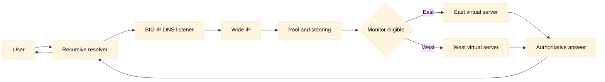

# 11. F5 GTM and BIG-IP DNS in depth

## SDE2 integration lens

Separate GTM control-plane health from DNS cache behavior and LTM dataplane
health. Record Wide IP, pool, steering decision, TTL, resolver, and site
capacity. A failover plan must model stale answers and long-lived connections;
lowering TTL is not an instant drain mechanism.

## Learning objectives

This chapter explains how BIG-IP DNS, historically called Global Traffic Manager (GTM), answers DNS questions using Wide IPs, pools, data centers, servers, virtual servers, monitors, and steering methods. You will distinguish authoritative selection from LTM request forwarding, reason about TTL and caches, and design evidence-led failover and high-availability checks. Examples are conceptual and omit tenant-specific commands or secrets.

**Fact:** BIG-IP DNS uses Wide IP and pool objects to associate a DNS name with resources and select an answer. **Inference:** DNS steering is an answer-generation decision; it does not itself proxy the subsequent application connection. See F5’s [GTM concepts](https://techdocs.f5.com/en-us/bigip-14-1-0/big-ip-dns/managing-gtm.html) and [Wide IP reference](https://clouddocs.f5.com/cli/tmsh-reference/latest/modules/gtm/gtm_wideip.html).

## Prerequisites

Know recursive and authoritative DNS, A/AAAA/CNAME records, TTL and negative caching, UDP/TCP transport, health checks, HTTP load balancing, and basic routing. Read [RFC 1034](https://www.rfc-editor.org/rfc/rfc1034), [RFC 1035](https://www.rfc-editor.org/rfc/rfc1035), and [RFC 2308](https://www.rfc-editor.org/rfc/rfc2308). Understand that a resolver may continue returning cached data after the authoritative system has changed it.

## Mental model

Start with a DNS question for `api.example`. An authoritative BIG-IP DNS listener receives the question, identifies the Wide IP by name and type, evaluates its pools and policies, and returns one or more records. A Wide IP is the service-level name; a Wide IP pool contains candidate virtual servers. A data center groups resources geographically or administratively. A server represents a BIG-IP system or other host participating in DNS monitoring; its virtual servers describe the reachable application endpoints and ports. Monitors supply availability evidence for those endpoints.

**Fact:** A DNS answer contains an address or alias, while the client later opens a connection to the returned destination. **Inference:** A perfect DNS response can precede an LTM, firewall, route, TLS, or application failure. Incident ownership must therefore follow the whole path, not stop at `dig`.

Pool selection methods express intent. Round robin rotates eligible resources. Ratio assigns relative shares. Global availability (often abbreviated G-A) prefers resources by configured availability order and falls back when higher-priority resources are unavailable. Topology maps the requester or resolver location to a preferred data center or region. Quality-of-service (QoS) methods can use measured latency or other signals, but the measurement scope and freshness matter. **Inference:** “Nearest” is not automatically “fastest,” especially when the recursive resolver is far from the end user or measurements follow a different network path.

A monitor can test ICMP, TCP, HTTP, HTTPS, DNS, or another supported protocol. It can target a virtual server, a server, or a dependency-specific endpoint depending on the design. A passing monitor proves only what it tested from its observation point at that time. A monitor from one BIG-IP device may not see a regional routing problem experienced by clients. Keep monitor intervals, timeouts, failure counts, and recovery hysteresis explicit.

TTL is a cache-control input, not an instant invalidation switch. A resolver or downstream client can retain an answer until its TTL expires, and negative answers have their own caching semantics. Lowering TTL before an incident helps only after old caches age out. Raising TTL reduces query load but slows failover. **Inference:** DNS failover has two timelines: authoritative decision time and cache convergence time. Communicate both.

Resolvers may also cache CNAME chains, serve stale data according to local policy, or retry over TCP when a response is truncated. EDNS behavior, DNSSEC validation, transport reachability, and anycast routing can affect which authoritative instance receives a query. Never infer end-user behavior from one resolver alone. Compare authoritative responses, several recursive resolvers, and client locations while recording timestamps and TTLs.

GTM/BIG-IP DNS high availability includes device peers, synchronization, listener addresses, health state, and upstream delegation. If the parent zone delegates to two nameservers but both addresses share one failure domain, DNS is not meaningfully redundant. A failover may return a different answer, yet cached answers keep sending clients to the former site. **Inference:** DNS HA is a system property involving delegation, transport, control-plane state, data-plane listeners, monitors, and cache behavior.

## Worked example

`shop.example` is a Wide IP with east and west pools. East contains two virtual servers in one data center; west contains two in another. The policy is topology first, then ratio within the selected pool, then global-availability fallback. The authoritative answer has a 60-second TTL.

During an east database outage, an HTTP monitor on east’s homepage remains green because the homepage is cached and does not query the database. DNS continues returning east addresses. Improve the monitor to exercise a read-only readiness contract that includes the required dependency, with a bounded timeout. Before changing it, verify that the endpoint is safe at monitor frequency and that a dependency outage should truly remove the site rather than degrade one feature.

After east is marked unavailable, a test against BIG-IP DNS shows west answers immediately. A public recursive resolver still returns east for 45 seconds because its cached TTL has not expired. That is expected cache behavior, not a failed failover. If clients continue seeing east after the TTL window, compare resolver time, authoritative serial/configuration, EDNS responses, and delegation. Do not repeatedly change the record without evidence; oscillation can make diagnosis harder.

Next, west receives excessive traffic. Ratio is distributing evenly, but one west virtual server has half the capacity and long-running connections. Ratio weights should represent a measured, stable capacity relationship; otherwise use an approach aligned with the workload and verify LTM’s own pool algorithm. If topology is based on resolver source, mobile users behind a centralized resolver may all be classified in the wrong region. Consider the available client-subnet or application-level approach only after privacy, support, and measurement implications are understood.

Finally, test the DNS listener itself during a peer failure. Query both authoritative addresses over UDP and TCP, inspect response flags and TTL, check synchronization and traffic-group ownership, and confirm the parent delegation remains reachable. Validate restoration: old caches, monitor recovery thresholds, and pool priority should return without causing a traffic stampede.

## When this breaks

The most common false diagnosis is “DNS is down” when the authoritative server answers but the returned endpoint is unreachable. Separate SERVFAIL, NXDOMAIN, timeout, stale answer, and application error. Check the exact query name and type, recursion expectations, delegation, authoritative listener, firewall, and response size. A resolver timeout can be path-specific.

Steering can be wrong while every object is healthy. An incomplete data-center mapping, centralized resolver, stale topology database, or unexpected policy order can select a distant site. Record the policy evaluation and selected pool, not only the final IP. If multiple answers are returned, clients may choose among them according to resolver and application behavior.

Monitor failures can be noisy. Packet loss, certificate expiry, wrong SNI, a missing Host header, or an overloaded monitor endpoint may mark an otherwise usable site down. Add hysteresis and compare monitor origin, path, and protocol with a real client. Never make a readiness endpoint mutate data or expose credentials.

TTL incidents are communication incidents as well as technical incidents. A planned migration must account for existing caches, negative caching, resolver prefetch, and clients that ignore TTLs. A very low TTL does not guarantee fast convergence if delegation or transport is broken. A very high TTL can make a correct emergency change appear ineffective.

HA failures include unsynchronized Wide IP changes, a failed listener, broken peer communication, and a parent delegation pointing at a dead address. Confirm configuration provenance and which device is authoritative for the change. A forced failover can create duplicate ownership or stale state; use the documented procedure and capture before/after evidence.

## Operational checklist

1. Record query name/type, resolver, client location, timestamp, flags, answer, and TTL.
2. Test every authoritative listener over UDP and TCP, including response-size behavior.
3. Trace Wide IP, pool order, steering method, policy precedence, and selected resource.
4. Verify data-center, server, virtual-server, and member health states separately.
5. Validate monitor path, Host/SNI, expected response, timeout, and observation point.
6. Compare authoritative results with multiple recursive resolvers and client vantage points.
7. Model TTL, negative caching, stale data, and resolver convergence before declaring failure.
8. Check delegation, anycast/routing, firewall access, DNSSEC validation, and synchronization.
9. Test failover and restoration, including cache-aged and newly queried clients.
10. Document steering assumptions, privacy constraints, rollback, and evidence.

## Diagram

## Questions and answers

1. **What is a Wide IP?** A service-level DNS name whose policy selects eligible destinations, rather than a proxy connection to the destination.

Interview reasoning: For “What is a Wide IP,” separate the DNS decision from the later LTM connection. BIG-IP DNS evaluates Wide IP pool state, monitors, topology or other steering, and returns an address; recursive caches can serve it until TTL expiry. Compare authoritative and recursive answers and then test the selected VIP. DNS steering cannot revoke an already cached answer or repair data consistency.

2. **Why distinguish server and virtual server?** A server groups an endpoint system; virtual servers identify reachable application addresses and ports on it.

Interview reasoning: For “Why distinguish server and virtual server,” distinguish the address from the LTM listener contract: the virtual server owns profiles, policies, pool selection, SNAT, and persistence. Trace a client tuple to the VIP and a second tuple to the member, then compare direct-member and VIP tests. The caveat is that a reachable VIP can still have no eligible pool member or an incorrect route domain.

3. **What does a monitor prove?** Only that a particular test succeeded from a particular observation point at that time.

Interview reasoning: For “What does a monitor prove,” state exactly what the probe sends and expects: source, destination port, Host/SNI, URI, status or body, interval, and timeout. Replay it from the same path and compare a real request and origin logs. A deeper F5 monitor improves fidelity but can make a dependency outage eject every member, so its dependency budget must be explicit.

4. **What is topology steering?** A rule that maps requester or resolver context to a preferred location or pool.

Interview reasoning: For “What is topology steering,” state the mechanism and where it operates, then give the tuple, state transition, and evidence that distinguish the leading hypotheses. Explain the operational trade-off and a worked diagnostic. The caveat is that a successful local check proves only that check, so validate the complete request path and define rollback.

5. **How does G-A differ from ratio?** G-A prioritizes configured availability order and falls back; ratio distributes eligible selections by relative weights.

Interview reasoning: For “How does G-A differ from ratio,” state the mechanism and where it operates, then give the tuple, state transition, and evidence that distinguish the leading hypotheses. Explain the operational trade-off and a worked diagnostic. The caveat is that a successful local check proves only that check, so validate the complete request path and define rollback.

6. **Why does failover appear slow?** Recursive and client caches can retain the old answer until TTL and local caching rules permit refresh.

Interview reasoning: For “Why does failover appear slow,” define the SLO numerator, denominator, threshold, window, and exclusions, then decompose the symptom into DNS, connect, TLS, queue, origin, and retry time. Use request IDs and tail percentiles rather than averages. Retries may improve apparent success while consuming capacity, so report attempts, outcomes, and retry amplification separately.

7. **Can BIG-IP DNS repair a dead application?** No. It can stop advertising an endpoint when evidence says it is unavailable; the client still connects elsewhere.

Interview reasoning: For “Can BIG-IP DNS repair a dead application,” record resolver identity, A/AAAA/CNAME data, flags, response code, authority, and TTL, then compare the recursive answer with an authoritative query. Split-horizon DNS, `/etc/hosts`, and service discovery can produce different views. A correct DNS answer proves only name resolution; route, VIP, TLS, policy, and application health still require separate probes.

8. **Why test DNS over TCP?** Large or truncated responses and some DNSSEC/EDNS situations require TCP fallback.

Interview reasoning: For “Why test DNS over TCP,” record resolver identity, A/AAAA/CNAME data, flags, response code, authority, and TTL, then compare the recursive answer with an authoritative query. Split-horizon DNS, `/etc/hosts`, and service discovery can produce different views. A correct DNS answer proves only name resolution; route, VIP, TLS, policy, and application health still require separate probes.

9. **What makes DNS HA real?** Independent delegated nameserver paths, healthy listeners, synchronized state, resilient routing, and tested cache convergence.

Interview reasoning: For “What makes DNS HA real,” record resolver identity, A/AAAA/CNAME data, flags, response code, authority, and TTL, then compare the recursive answer with an authoritative query. Split-horizon DNS, `/etc/hosts`, and service discovery can produce different views. A correct DNS answer proves only name resolution; route, VIP, TLS, policy, and application health still require separate probes.

10. **Why can “nearest” disappoint?** Resolver location may not represent the end user, and latency measurements may not match the client path.

Interview reasoning: For “Why can “nearest” disappoint,” state the mechanism and where it operates, then give the tuple, state transition, and evidence that distinguish the leading hypotheses. Explain the operational trade-off and a worked diagnostic. The caveat is that a successful local check proves only that check, so validate the complete request path and define rollback.

Primary references: [F5 GTM management](https://techdocs.f5.com/en-us/bigip-14-1-0/big-ip-dns/managing-gtm.html), [F5 Wide IP](https://clouddocs.f5.com/cli/tmsh-reference/latest/modules/gtm/gtm_wideip.html), [RFC 1034](https://www.rfc-editor.org/rfc/rfc1034), [RFC 1035](https://www.rfc-editor.org/rfc/rfc1035), and [RFC 2308](https://www.rfc-editor.org/rfc/rfc2308). **Fact/inference ledger:** DNS protocol behavior and F5 terminology are facts; monitor depth, steering suitability, TTL policy, and HA sufficiency are engineering inferences requiring local validation.
