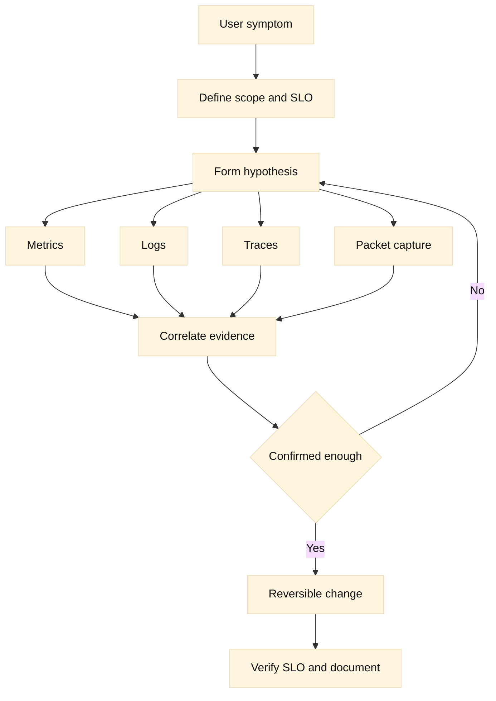

# 12. Observability and troubleshooting

## SDE2 integration lens

Build evidence bundles that join DNS timing, route state, TCP/TLS events, LTM
client/server counters, monitor reasons, WAF decisions, and application traces
by request ID and UTC time. Metrics show trends; logs and captures explain a
transaction. Redact payloads while preserving reproducibility.

## Learning objectives

This chapter gives you a disciplined method for diagnosing networked services across DNS, TCP, TLS, HTTP, load balancing, and DDI boundaries. You will distinguish metrics, logs, traces, and packet captures; define useful SLO evidence; build layered runbooks; and communicate incident hypotheses without confusing correlation for causation. The examples use F5 terminology where helpful, but the method applies to any distributed service.

**Fact:** Metrics aggregate measurements, logs record events, traces connect work across services, and packet captures show observed packets. **Inference:** No one signal is a complete truth source; confidence rises when independent layers agree. OpenTelemetry’s [observability concepts](https://opentelemetry.io/docs/concepts/observability-primer/) and [RFC 9457](https://www.rfc-editor.org/rfc/rfc9457) provide useful primary context for telemetry and HTTP problem details.

## Prerequisites

Know DNS resolution, IP routing, TCP handshakes, TLS certificates, HTTP status codes, reverse proxies, F5 LTM pools, BIG-IP DNS steering, and basic Linux command output. Review [RFC 9293](https://www.rfc-editor.org/rfc/rfc9293), [RFC 8446](https://www.rfc-editor.org/rfc/rfc8446), and [RFC 9110](https://www.rfc-editor.org/rfc/rfc9110). You should also know that a timestamp, identity, and scope are needed to interpret almost every observation.

## Mental model

Troubleshooting is a sequence of falsifiable hypotheses. First define the user-visible symptom, start time, scope, and a request or transaction identifier. Then draw the path: client, recursive resolver, authoritative DNS or BIG-IP DNS, route and firewall, virtual server, TLS leg, policy, pool, member, dependency, and return path. At each boundary ask whether packets, connections, requests, and responses crossed it.

Metrics answer “how much, how often, and for whom?” Useful series include request rate, error rate, latency percentiles, active connections, queue depth, DNS response codes, monitor state, TLS alerts, retransmissions, and saturation. Percentiles describe tail experience better than averages, but a percentile without population, time window, and aggregation is ambiguous. **Inference:** An SLO should name the eligible traffic, success definition, time window, and measurement point.

Logs answer “what event did this component believe happened?” Include synchronized timestamps, request ID, source and destination identity, status, bytes, timings, selected pool/member, retry count, and error class. Structured fields are easier to correlate than free text. Redact tokens, cookies, personal data, and private keys. A missing log is itself a hypothesis: sampling, rate limiting, a dead agent, clock skew, or traffic bypass may explain it.

Traces answer “where did this transaction spend time?” A trace context should cross the proxy and application boundaries when policy permits. A span showing a 2-second origin call does not prove the proxy caused the delay; it proves the span’s measured interval. **Fact:** Distributed tracing uses context propagation to associate spans with a trace. **Inference:** Propagation must be tested at each hop, especially when TLS termination, retries, asynchronous queues, or protocol translation intervene.

Packet captures answer “what bytes and transport events were observed at this vantage point?” A capture can reveal DNS flags, TCP SYN retries, retransmissions, MTU symptoms, TLS alerts, HTTP cleartext headers, or connection resets. It cannot show packets outside the capture point and may not decrypt TLS. Capture narrowly by interface, host, port, and time; protect payloads and obtain authorization. Compare both sides of a proxy when the return path is suspect.

SLOs turn symptoms into decisions. Availability might count an HTTP response meeting an explicit success rule; latency might count completed requests under a threshold; DNS might count valid answers from a defined resolver population. Error budgets help decide whether to ship a change or pause for reliability work. **Inference:** A green infrastructure dashboard can coexist with a violated user SLO when the dashboard measures CPU instead of successful user transactions.

Layered runbooks prevent random changes. Begin with read-only checks and preserve a timeline. Move from broad scope to narrow: global versus region, all names versus one name, all members versus one member, every method versus one endpoint. Change one variable at a time, record expected and observed effects, and define rollback. Avoid “flush everything” or repeated failover as first actions; they destroy evidence and can amplify impact.

## Worked example

Users report intermittent checkout failures at 10:05. The SLO dashboard shows 99.5% availability, but the checkout-specific error budget is burning. A trace sample shows some requests ending with a 504 at the LTM virtual server. Metrics show normal CPU but rising active connections and a long tail on member A.

The first hypothesis is an overloaded or stuck member. Compare LTM monitor state, pool selection, persistence records, member queues, server-side connect time, response time, and origin logs. Member A passes a shallow TCP monitor. An HTTP readiness request with the production Host header is slow because its database pool is exhausted. This explains why the TCP monitor is green and why only persisted clients of A are affected.

Before draining A, check whether checkout is idempotent and whether timed-out requests may have committed. Capture a request ID from LTM and origin logs. Drain new selections, keep existing connections within a bounded window, and watch error rate and member queue. If errors fall, the hypothesis gains support; document the change and repair the dependency. Do not claim causation from improvement alone if a concurrent deploy occurred.

Another incident begins with DNS complaints. One resolver returns an old address while authoritative BIG-IP DNS returns the new west address with a 60-second TTL. Query timestamps show the resolver cached the east answer 20 seconds ago. The correct action is to wait for the cache window while verifying delegation and west reachability, not to keep changing the Wide IP. If the old answer persists beyond TTL, investigate resolver policy, negative caching, stale serving, or a different name/type.

For a TLS failure, a packet capture shows TCP completes but the client sends an alert after ServerHello. The certificate presented on the client leg lacks the requested SAN. Check the active client SSL profile, SNI selection, certificate chain, and time. A successful server-side TLS test would not clear the client leg. Record the exact hostname and profile version, then make a reviewed certificate change and retest with a fresh connection.

## When this breaks

Observability fails through cardinality explosions, dropped spans, unsynchronized clocks, sampling bias, and dashboards that hide empty data. A zero can mean no traffic or no telemetry. Alert on telemetry health and compare independent sources. Do not infer a regional outage from one synthetic probe.

DNS cases often mix NXDOMAIN, SERVFAIL, timeout, stale cache, and an unhealthy returned address. Record query type, flags, authority section, resolver identity, and TTL. TCP cases require separating no SYN response, handshake reset, retransmission, and post-handshake application closure. A packet capture at the client cannot prove the origin saw the request.

TLS cases include wrong SNI, expired or untrusted chains, protocol mismatch, client-certificate rejection, and middlebox resets. Identify the leg and preserve the negotiated name, alert direction, and certificate metadata without copying secrets. HTTP 4xx may be an intentional policy result; 5xx may be origin, proxy, or dependency failure. Correlate status with timings and headers.

Load-balancer failures include no eligible members, wrong policy branch, persistence hotspot, SNAT port exhaustion, and asymmetric return routing. A monitor state is a control signal, not proof of user success. DDI failures add stale DNS, DHCP exhaustion, duplicate leases, and IPAM ownership drift. Establish which system is authoritative before editing records or leases.

Incident pressure encourages harmful actions: disabling TLS verification, deleting persistence, flushing caches, forcing HA failover, or raising retries globally. Each can mask evidence or increase load. Use a change record, narrow scope, approval appropriate to impact, and a concrete rollback. After recovery, preserve captures and timelines, explain contributing conditions, and add a regression check to the runbook.

## Operational checklist

1. State symptom, SLO, scope, start time, affected path, and request IDs.
2. Check telemetry freshness, clock alignment, sampling, and missing-data signals.
3. Compare metrics, logs, traces, and packets at the same time window.
4. Test DNS answer, TCP handshake, TLS leg, HTTP status, and return route separately.
5. Inspect LTM virtual server, policy, pool eligibility, member timings, persistence, and SNAT.
6. For BIG-IP DNS, record Wide IP policy, monitor evidence, TTL, resolver, and delegation.
7. Check dependencies, queues, saturation, retries, and idempotency before changing traffic.
8. Capture narrowly and lawfully; redact payloads and protect identifiers.
9. Make one reversible change, predict its effect, and watch the SLO.
10. Close with timeline, evidence, root/contributing causes, and a runbook improvement.

## Diagram

## Questions and answers

1. **What is the first troubleshooting step?** Define symptom, scope, start time, path, and success criteria before changing anything.

Interview reasoning: For “What is the first troubleshooting step,” state the mechanism and where it operates, then give the tuple, state transition, and evidence that distinguish the leading hypotheses. Explain the operational trade-off and a worked diagnostic. The caveat is that a successful local check proves only that check, so validate the complete request path and define rollback.

2. **What does a metric provide?** Aggregated magnitude and trend; it needs population, window, labels, and measurement location.

Interview reasoning: For “What does a metric provide,” define the SLO numerator, denominator, threshold, window, and exclusions, then decompose the symptom into DNS, connect, TLS, queue, origin, and retry time. Use request IDs and tail percentiles rather than averages. Retries may improve apparent success while consuming capacity, so report attempts, outcomes, and retry amplification separately.

3. **What does a log provide?** A component’s recorded event and context; missing or misleading logs require independent corroboration.

Interview reasoning: For “What does a log provide,” state the mechanism and where it operates, then give the tuple, state transition, and evidence that distinguish the leading hypotheses. Explain the operational trade-off and a worked diagnostic. The caveat is that a successful local check proves only that check, so validate the complete request path and define rollback.

4. **What does a trace provide?** Timing and causal context across instrumented spans, provided propagation and clocks are usable.

Interview reasoning: For “What does a trace provide,” state the mechanism and where it operates, then give the tuple, state transition, and evidence that distinguish the leading hypotheses. Explain the operational trade-off and a worked diagnostic. The caveat is that a successful local check proves only that check, so validate the complete request path and define rollback.

5. **When is a packet capture decisive?** When the relevant event is visible at that vantage point, such as retransmission or a TLS alert; it cannot prove unseen traffic.

Interview reasoning: For “When is a packet capture decisive,” state the mechanism and where it operates, then give the tuple, state transition, and evidence that distinguish the leading hypotheses. Explain the operational trade-off and a worked diagnostic. The caveat is that a successful local check proves only that check, so validate the complete request path and define rollback.

6. **Why can CPU be green during an outage?** The bottleneck may be ports, queues, database connections, certificates, routing, or a small saturated component.

Interview reasoning: For “Why can CPU be green during an outage,” state the mechanism and where it operates, then give the tuple, state transition, and evidence that distinguish the leading hypotheses. Explain the operational trade-off and a worked diagnostic. The caveat is that a successful local check proves only that check, so validate the complete request path and define rollback.

7. **How do you investigate a 504?** Correlate proxy queue/connect/response timing, member state, retries, SNAT, and origin logs by request ID.

Interview reasoning: For “How do you investigate a 504,” state the mechanism and where it operates, then give the tuple, state transition, and evidence that distinguish the leading hypotheses. Explain the operational trade-off and a worked diagnostic. The caveat is that a successful local check proves only that check, so validate the complete request path and define rollback.

8. **How do you separate DNS from application failure?** Compare authoritative and recursive answers, TTL and resolver behavior, then test the returned endpoint independently.

Interview reasoning: For “How do you separate DNS from application failure,” record resolver identity, A/AAAA/CNAME data, flags, response code, authority, and TTL, then compare the recursive answer with an authoritative query. Split-horizon DNS, `/etc/hosts`, and service discovery can produce different views. A correct DNS answer proves only name resolution; route, VIP, TLS, policy, and application health still require separate probes.

9. **Why avoid global retries?** A timeout may follow a committed operation; retries can duplicate side effects and amplify overload.

Interview reasoning: For “Why avoid global retries,” state the mechanism and where it operates, then give the tuple, state transition, and evidence that distinguish the leading hypotheses. Explain the operational trade-off and a worked diagnostic. The caveat is that a successful local check proves only that check, so validate the complete request path and define rollback.

10. **What makes a runbook safe?** Read-only first steps, explicit evidence, narrow reversible changes, approvals, rollback, and post-incident learning.

Interview reasoning: For “What makes a runbook safe,” state the mechanism and where it operates, then give the tuple, state transition, and evidence that distinguish the leading hypotheses. Explain the operational trade-off and a worked diagnostic. The caveat is that a successful local check proves only that check, so validate the complete request path and define rollback.

Primary references: [OpenTelemetry observability primer](https://opentelemetry.io/docs/concepts/observability-primer/), [RFC 9293](https://www.rfc-editor.org/rfc/rfc9293), [RFC 8446](https://www.rfc-editor.org/rfc/rfc8446), [RFC 9110](https://www.rfc-editor.org/rfc/rfc9110), and [RFC 9457](https://www.rfc-editor.org/rfc/rfc9457). **Fact/inference ledger:** protocol and telemetry definitions are facts; SLO design, evidence correlation, monitor depth, capture scope, and remediation sequencing are engineering inferences to validate for the service.
