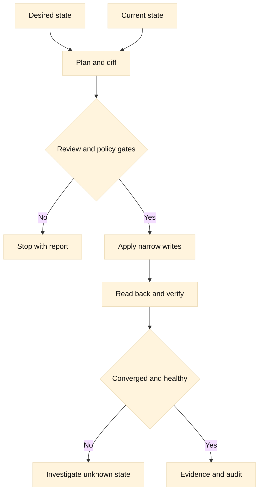

# 13. Automation, F5 SDK, REST, and SSH

## SDE2 integration lens

Make every network change a plan: observed version and partition, normalized
diff, preconditions, approval, post-checks, and rollback. Pin SDK versions,
classify retryable errors, reconcile idempotently, and prefer read-only REST or
SDK evidence. SSH remains a constrained diagnostic fallback.

## Learning objectives

By the end of this chapter you can design a network automation change that is repeatable, reviewable, and safe to stop. You will distinguish declarative desired state from imperative commands, explain idempotency, and choose read-only discovery before a write. You will recognize where the F5 Python SDK wraps iControl REST, how authentication and secrets should be handled, and why a successful HTTP response is not proof that traffic is healthy. You will also be able to reason about SSH host keys, bastion or jump hosts, test doubles, and CI gates.

**Fact:** BIG-IP exposes iControl REST resources and the F5 Python SDK provides Python objects and managers for many of those resources. **Inference:** A team should treat SDK behavior as a convenience layer over an API contract and verify the exact BIG-IP version, endpoint, and SDK release before relying on it.

## Prerequisites

Know Python functions, exceptions, virtual environments, JSON, HTTP methods and status codes, TLS, DNS, F5 LTM objects, and basic SSH. Review [RFC 9110](https://www.rfc-editor.org/rfc/rfc9110) for HTTP semantics, [RFC 8446](https://www.rfc-editor.org/rfc/rfc8446) for TLS, and the [OpenSSH client manual](https://man.openbsd.org/ssh) for host-key options. Familiarity with a version-control review and a CI pipeline is useful. Examples intentionally use placeholders and local or fictional names; they do not authorize access to a device.

## Mental model

Automation is a controlled reconciliation loop. A desired state says what should exist and which properties matter: for example, a virtual server should reference pool `web_pool`, use an approved profile, and have a monitor attached. An imperative script instead says “create this object, then change that field.” Imperative scripts can be valid, but repeated execution often creates duplicate objects, overwrites drift, or fails halfway through. **Inference:** Desired-state descriptions reduce accidental variation, but only when ownership, defaults, and deletion behavior are explicit.

Separate four concerns. Discovery reads the current state. Planning compares current state with desired state and produces a human-reviewable diff. Apply performs narrowly scoped writes. Verification reads state and behavior afterward. Keep these phases separately callable so a pull request can show a plan without credentials that permit mutation. A plan should identify object paths, fields, old values, new values, dependencies, and whether an operation is create, update, or delete. Treat unknown fields as unknown rather than silently resetting them.

Idempotency means repeating the same operation produces the same intended result after the first successful application. An idempotent “ensure pool exists” operation identifies the object by a stable path, compares relevant properties, and updates only differences. It does not blindly POST a new object on every run. HTTP defines method semantics, but an API endpoint may still implement a non-idempotent action behind POST. **Fact:** HTTP method names communicate semantics; **inference:** the automation author must inspect the device API’s action endpoint and implement an application-level idempotency key, lock, or precondition when repetition could have side effects.

The F5 Python SDK commonly represents BIG-IP resources through a management client and collection managers. A read-only audit can authenticate, retrieve a collection, normalize fields, and print a redacted report. SDK calls may fetch lazy objects, use defaults, or make multiple REST requests. Pin the SDK version, inspect its documentation and source when behavior matters, set explicit timeouts if supported, and log request identity without logging tokens. A read operation can still be sensitive: object names, addresses, certificates, and device metadata may reveal topology.

iControl REST is HTTP over TLS with resource paths, JSON payloads, status codes, and BIG-IP-specific task or action behavior. Use the narrowest URI and fields needed. GET is normally used for retrieval; POST, PATCH, PUT, and DELETE have different endpoint-specific effects. Check response status, response body, and subsequent GET. Some changes are asynchronous or require a transaction, and a 2xx response may only mean that the request was accepted. **Inference:** “write succeeded” should mean accepted, converged, and verified against a safe observable outcome, not merely “the client got 200.”

Authentication is a boundary, not a string in source code. Prefer a short-lived identity, least-privilege role, device-side audit trail, and a secret store provided by the execution environment. Pass credentials through protected environment injection or an agent, not command-line arguments, notebooks, Git, or exception messages. Never print Authorization headers, passwords, private keys, session tokens, or complete response bodies without redaction. Rotate credentials and revoke them when a runner, host, or log store is suspected. **Fact:** TLS protects credentials in transit only when certificate validation and endpoint identity are checked. **Inference:** Disabling certificate verification to “make automation work” converts an operational inconvenience into credential exposure.

SSH is useful for diagnostics, bootstrap, and systems without an API, but it is a stateful shell protocol. Verify host keys using a trusted out-of-band source and maintain a managed `known_hosts` file. Do not use `StrictHostKeyChecking=no` as a permanent fix. A jump host or bastion should constrain destination, identity, forwarding, and logging; ProxyJump is preferable to manually piping commands through an untrusted shell. Use separate keys or certificates, restrictive permissions, agent forwarding only when justified, and non-interactive commands with bounded timeouts. **Fact:** SSH authenticates the server using host keys and can authenticate users with keys or other methods. **Inference:** A bastion concentrates control but does not make a compromised destination trustworthy.

Testing must exercise intent, not merely Python syntax. Unit tests can validate normalization, diffing, retries, secret redaction, and refusal to delete unknown objects. Contract tests can replay representative REST responses and status codes. Integration tests should use an authorized lab BIG-IP or a simulator, with a disposable partition and explicit cleanup. A smoke test should prove that a read-only account cannot perform a write. CI should lint, type-check, run tests, inspect the plan, require review for destructive operations, and fail if secrets or disabled host-key checks appear. **Inference:** A dry run is a safety feature only if apply is impossible in dry-run mode, rather than a flag that is accidentally ignored.

## Worked example

Suppose a service team wants a pool named `orders_pool` with two members and an HTTPS monitor. The desired document includes an owner, partition, pool path, member addresses, monitor reference, and an explicit “deletions disabled” policy. Discovery first performs GET requests for the pool, members, and monitor. The normalizer sorts members and removes server-generated timestamps. The planner reports that the pool exists, one member is missing, and the monitor already matches. It does not propose deleting an unowned member.

The reviewer checks the diff and approves a plan that creates one member. Apply uses the SDK’s resource manager or a narrowly specified REST request, catches a timeout, and records a correlation ID. If the timeout occurs after the device may have committed, the script does not retry an unknown create blindly. It performs discovery again, finds the member, and treats the result as converged. Verification then checks object fields and runs an authorized health observation; it does not send production transactions merely to prove a configuration call.

A read-only audit can look like this conceptual sequence:

```text
client = connect_with_validated_tls(short_lived_identity)
current = read_pool(client, "partition-a/orders_pool")
report = compare(normalize(current), desired)
print(redact(report))
```

The pseudocode is deliberately incomplete: connection construction, endpoint validation, and credential injection depend on the deployment. In a CI job, `connect_with_validated_tls` must fail closed if a CA bundle is absent. The report should be an artifact with restricted access and a retention policy. A separate apply job consumes an approved plan hash, rechecks current state, and refuses to apply if the state changed unexpectedly. This prevents a stale review from overwriting a concurrent operator’s change.

## When this breaks

SDK and device versions can disagree about property names, defaults, pagination, authentication endpoints, or transaction support. A field that appears absent may be a default, an omitted response property, or a permission-filtered value. Pin versions and record the tested compatibility matrix. Prefer capability detection and explicit failure to guessing. If the API returns a task identifier, poll it with a deadline and classify timeout as unknown state.

Partial failure is normal. A script may create a monitor, fail while attaching it, and then lose its process. Design each step with an observable postcondition and a recovery path. Avoid broad rollback that deletes resources shared by another owner. Resource tags, partitions, naming conventions, and ownership metadata help, but they are not proof; validate them before mutation.

Retries can duplicate actions, overload a recovering device, or hide a permission error. Retry only transient transport failures and documented status codes, with bounded exponential backoff and jitter. Do not retry authentication failures, validation errors, or an ambiguous non-idempotent action without first reading state. Set connect, read, write, and total-operation deadlines separately. A timeout is a lack of knowledge, not evidence that the device did nothing.

SSH automation breaks through changed host keys, DNS pointing at a different host, locale-dependent output, interactive prompts, shell quoting, and a jump host that cannot reach the target. Prefer structured APIs. If SSH is required, use a fixed command, explicit environment, a known interpreter, and machine-readable output. Treat host-key changes as an incident requiring verification, not as a prompt to accept a new key automatically.

## Operational checklist

1. Define ownership, desired fields, allowed deletions, and the verification condition.
2. Pin SDK and API compatibility; document tested BIG-IP versions.
3. Implement discovery, plan, apply, and verify as separate phases.
4. Normalize only known server-generated fields and preserve unknown fields.
5. Use least privilege, short-lived identities, validated TLS, and redacted logs.
6. Make retries bounded and classify ambiguous outcomes before repeating writes.
7. Validate SSH host keys; constrain bastion routes and avoid uncontrolled agent forwarding.
8. Require a plan artifact, review, concurrency check, and rollback or repair path.
9. Test read-only behavior, API errors, partial commits, timeouts, and secret leakage.
10. Record correlation IDs, change owner, device version, result, and follow-up evidence.

## Diagram



## Questions and answers

1. **What is idempotency?** It is the property that repeating an operation reaches the same intended state. Explain it at the resource and API-action level; a POST action may still need a read-before-retry guard.
2. **Why separate plan from apply?** A plan exposes the proposed diff for review and policy checks without granting mutation authority. It also makes an unexpected state change visible before a write.
3. **Is the F5 SDK a separate control plane?** No. It is a client abstraction over BIG-IP management interfaces, so endpoint, version, permissions, and device behavior still matter.
4. **Does a 2xx response prove success?** No. It may indicate acceptance. Read the response, poll documented tasks, read back state, and verify an appropriate behavioral signal.
5. **How should secrets enter a job?** Use a protected short-lived identity or secret injection mechanism, never source files, command arguments, Git, or unredacted logs.
6. **Why validate TLS certificates in automation?** Without endpoint authentication, credentials and configuration can be sent to an impostor even though the channel is encrypted.
7. **What does a host key verify?** It binds a server identity to a key known through a trusted process. It does not prove that commands on the server are safe.
8. **When is SSH preferable to REST?** For narrow diagnostics or systems that lack a suitable API. Prefer structured output and tightly constrained commands; do not use SSH as an excuse to bypass change control.
9. **How should an ambiguous timeout be handled?** Stop blind retries, query state, use the correlation ID, and classify the result as committed, not committed, or unknown before deciding.
10. **What belongs in CI?** Tests, linting, secret scans, plan review, destructive-operation policy, host-key checks, compatibility checks, and a proof that dry-run cannot mutate.

Primary references: [F5 Python SDK documentation](https://clouddocs.f5.com/sdk/f5-sdk-python/), [F5 iControl REST API documentation](https://clouddocs.f5.com/api/icontrol-rest/), [RFC 9110](https://www.rfc-editor.org/rfc/rfc9110), [RFC 8446](https://www.rfc-editor.org/rfc/rfc8446), and [OpenSSH manual](https://man.openbsd.org/ssh). **Fact/inference ledger:** HTTP, TLS, and SSH protocol behavior and the existence of F5 interfaces are facts from primary references; phase separation, normalization, deletion policy, retry classification, bastion controls, and CI gates are engineering inferences that must be adapted and tested for a specific estate.
