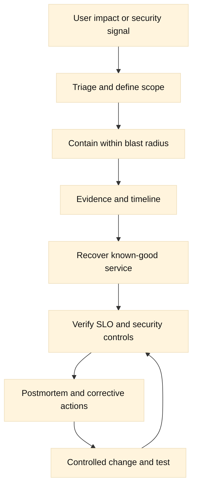

# 14. Reliability, Security, and Change Management

## Learning objectives

This chapter connects reliability engineering, security engineering, and operational change. You will define useful service-level objectives (SLOs), reason about capacity and failure domains, design high availability (HA) without assuming that redundancy removes risk, and choose bounded timeouts and retries. You will practice an incident-response flow, build a threat model for network control planes, and plan changes with review, canaries, rollback, and postmortems. The goal is not a universal policy; it is a habit of making assumptions, evidence, and blast radius visible.

**Fact:** An SLO is a target for a service-level indicator (SLI), and an error budget represents the tolerated unreliability implied by that target. **Inference:** Teams should spend the budget according to user impact and risk, not treat it as permission to cause a predictable outage.

## Prerequisites

Know DNS, TCP, TLS, HTTP, reverse proxies, F5 LTM pools, BIG-IP DNS steering, monitoring, and basic incident terminology. Review [Google’s SRE workbook](https://sre.google/workbook/implementing-slos/), [RFC 9293](https://www.rfc-editor.org/rfc/rfc9293), [RFC 8446](https://www.rfc-editor.org/rfc/rfc8446), and [NIST SP 800-61 Rev. 3](https://csrc.nist.gov/pubs/sp/800/61/r3/final). This chapter uses “security” to include confidentiality, integrity, availability, accountability, and recovery. It does not replace organization-specific legal, privacy, or emergency procedures.

## Mental model

Reliability is the probability that a user receives an acceptable result over a stated period and population. Start with an SLI that is close to the user: successful HTTP transactions, usable DNS answers, completed checkout operations, or a connection that reaches an eligible member. Define exclusions carefully. An infrastructure metric such as CPU can explain a failure, but it is usually not the user-facing SLI. **Inference:** A good SLO must name the event, denominator, measurement point, window, and acceptable threshold; otherwise two teams can report different “availability” for the same service.

Capacity is a constraint on work, not a single percentage. Consider request rate, connection rate, concurrent connections, memory, CPU, TLS handshakes, SNAT ports, queue depth, DNS query rate, storage, upstream database connections, and operator attention. Measure normal and peak behavior, but do not invent a safety factor from a blog or a benchmark that does not match the workload. Use a workload model and observe saturation signals. **Inference:** Headroom is valuable only when the assumed failure and growth scenarios are stated; unused capacity in one layer does not compensate for an exhausted dependency.

HA reduces some failure probabilities by providing independent ways to serve traffic. Independence is the hard part. Two devices in one rack may share power, cooling, a control-plane bug, a route, a certificate, a secret, or an operator. Failure domains should be named: process, host, rack, zone, region, provider, identity system, and human change. Active-standby failover can preserve a virtual address but may lose state or create split-brain if health and fencing are weak. Active-active can use capacity better but must handle consistency, persistence, and asymmetric routing.

Retries and timeouts are part of load management. A timeout should be based on a deadline budget for the complete user operation, then divided across DNS, connect, TLS, queue, origin, and response phases. Retries consume additional work. They can help with a transient connection refusal, but they can multiply load during overload and duplicate a non-idempotent operation. **Fact:** TCP and TLS have protocol timers and state transitions; **inference:** application retries must be bounded by a total deadline and restricted to operations whose side effects are safe or explicitly deduplicated.

Security begins with a threat model rather than a list of products. Name assets, actors, trust boundaries, entry points, assumptions, and unacceptable outcomes. For F5 and DNS operations, assets include management interfaces, configuration, certificates, private keys, tokens, traffic policy, logs, and availability. Actors may include an internet client, compromised application, rogue administrator, stolen CI identity, malicious insider, or supply-chain dependency. Threats include credential theft, unauthorized policy changes, DNS poisoning or delegation abuse, stale certificates, exposed management ports, log tampering, denial of service, and lateral movement.

Apply layered controls: network isolation for management, validated TLS, least privilege, MFA where available, short-lived credentials, approval and audit trails, secure backups, tested restore, key rotation, patching, and detection of unusual changes. A firewall rule is not a threat model. **Inference:** Every control needs an owner, evidence of operation, and a failure mode; otherwise a dashboard can report compliance while an attacker or outage bypasses it.

Incident response is a decision process under uncertainty. Detect and page on user impact or credible risk. Triage scope and severity, establish a commander, assign communications and technical leads, preserve evidence, and choose containment that limits blast radius. Recovery should restore a known-good service while avoiding irreversible forensic loss. Keep an objective timeline with timestamps and time zones. NIST describes preparation, detection and analysis, containment, eradication and recovery, and post-incident activity; local roles and escalation paths must be explicit.

Change management is reliability work. A change record states intent, scope, dependencies, risk, owner, test evidence, rollout steps, observation window, abort criteria, and rollback. A canary or small partition tests assumptions before broad rollout. Rollback should be a tested path to a known configuration, not a hopeful inverse command. Some migrations are irreversible; then use expand-and-contract, dual reads, backups, or a forward fix. **Inference:** Approval quality depends more on a concrete stop condition and recovery proof than on the number of approvers.

Postmortems should be blameless about human error while being precise about system conditions. Describe impact, detection, timeline, contributing factors, what worked, and prioritized corrective actions with owners and dates. Do not call “human error” a root cause that ends investigation. Ask why a safe action was difficult, why a warning was missed, and which guardrail would have reduced exposure. Track actions to completion and test the resulting runbook or alert.

## Worked example

An online service has an SLO that 99.9% of eligible requests in a 30-day window return a defined successful response within the latency objective. The service uses BIG-IP DNS to direct users to two regions and LTM to select pool members. During a certificate rotation, one region starts returning TLS failures. The user SLI falls, but aggregate CPU and device health remain green.

The incident commander freezes further changes, confirms the affected hostname and client population, and compares DNS answers, TLS certificate SANs, expiry, chain, SNI selection, and active client profiles in each region. The team routes new traffic away from the affected region only if the other region has verified capacity and the DNS TTL and cache behavior are understood. Existing connections are handled according to the protocol and application semantics. The certificate is corrected through a reviewed change, then a canary query and TLS test verify both regions before traffic is restored.

The review finds a shared certificate inventory did not identify the client profile using the old certificate, and the pre-change test covered only the origin-side TLS leg. Corrective actions include inventory ownership, a test matrix for both TLS legs and SNI names, a monitor that validates the expected certificate identity, and an alert on certificate lifetime. These actions are hypotheses until exercised in a lab or controlled canary; the incident itself does not prove that each action prevents recurrence.

For capacity, the team models a regional loss. They measure current connection and request rates, TLS handshake cost, pool member limits, SNAT usage, queue behavior, database connections, and DNS response capacity. They then run an authorized load test with representative request mixes and explicit stop criteria. No number is copied from another system as a benchmark. The capacity decision records the workload, measurement point, test date, and uncertainty.

## When this breaks

SLOs become misleading when the denominator excludes painful traffic, synthetic checks do not represent users, or retries turn one failed operation into several counted successes. Define eligibility and count at a stable boundary. Latency percentiles can hide a small but critical cohort; segment by region, client, endpoint, and protocol when appropriate while controlling cardinality.

HA fails through shared dependencies, stale health checks, split-brain, state loss, asymmetric return paths, expired certificates, and an operator changing both sides at once. Test failure domains independently and document what is not redundant. A backup that has never been restored is an assumption, not a recovery capability.

Capacity plans break when traffic mix, connection lifetimes, TLS versions, payload size, dependency limits, or cache hit rates change. Watch leading indicators such as queue growth and connection exhaustion. Do not solve overload by adding unlimited retries or timeouts; both can retain work longer and increase pressure.

Security controls fail through leaked CI logs, overbroad roles, unmanaged SSH keys, unpatched management planes, weak DNS delegation, missing time synchronization, and alerts that nobody owns. Make secrets non-exportable where possible, limit access paths, test detection, and rehearse revocation. Incident responders need access that is authorized before the emergency.

Changes fail when rollback depends on the same broken control plane, a database migration is irreversible, caches hide behavior, or the canary is too small to exercise the risk. Prefer reversible increments and forward-compatible schemas. If rollback is impossible, state that plainly and require a stronger pre-change proof and recovery plan.

## Operational checklist

1. Define user-facing SLI, SLO, denominator, window, latency rule, and error budget.
2. Map dependencies and failure domains, including shared power, identity, routes, keys, and operators.
3. Measure capacity by workload and bottleneck; record assumptions, date, and uncertainty.
4. Set phase and total deadlines; retry only bounded, safe, and observable operations.
5. Maintain a threat model for management, data, DNS, CI, credentials, and logs.
6. Isolate management, validate TLS and host identity, enforce least privilege, and audit changes.
7. Keep incident roles, escalation, communications, evidence handling, and severity criteria ready.
8. Require change intent, test evidence, canary scope, abort criteria, and tested rollback.
9. Verify both traffic legs, DNS caches and TTLs, HA transitions, and dependency behavior.
10. Write postmortems with contributing conditions, owners, due dates, and verification tests.

## Diagram

## Questions and answers

1. **What makes an SLO useful?** It ties a named user-facing event to a denominator, time window, measurement point, and target. Without those, “99.9% available” is not reproducible.
2. **What is an error budget?** The allowed unreliability implied by an SLO. It supports a risk discussion; it is not a license to spend failures carelessly.
3. **Why are two redundant devices not automatically independent?** They may share power, software defects, routes, credentials, certificates, or human changes. Enumerate failure domains explicitly.
4. **Why cap retries?** Retries consume capacity and may repeat side effects. Use a total deadline, bounded attempts, backoff, and idempotency or deduplication.
5. **What belongs in a threat model?** Assets, actors, trust boundaries, entry points, assumptions, threats, impacts, and controls with owners and evidence.
6. **What is the first incident-response goal?** Establish scope and stabilize user impact while preserving evidence. Assign roles and avoid uncontrolled changes that enlarge the incident.
7. **What is a canary?** A limited rollout that exercises a change on a bounded population or partition with explicit success and abort criteria. It is not proof that every failure mode is absent.
8. **What makes rollback credible?** It is tested, observable, authorized, and reaches a known-good state within the remaining incident budget. An inverse command alone is not proof.
9. **Why are postmortems blameless?** They focus on conditions and guardrails so people report facts; blameless does not mean vague, consequence-free, or without accountable actions.
10. **How should capacity tests be reported?** Name workload mix, traffic rate, connection behavior, dependencies, measurement points, limits, test date, stop criteria, and uncertainty. Do not present an unrelated benchmark as a guarantee.

Primary references: [Google SRE Workbook: Implementing SLOs](https://sre.google/workbook/implementing-slos/), [NIST SP 800-61 Rev. 3](https://csrc.nist.gov/pubs/sp/800/61/r3/final), [NIST Cybersecurity Framework 2.0](https://www.nist.gov/cyberframework), [RFC 9293](https://www.rfc-editor.org/rfc/rfc9293), and [RFC 8446](https://www.rfc-editor.org/rfc/rfc8446). **Fact/inference ledger:** SLI/SLO terminology, TCP/TLS protocol facts, and NIST incident-response guidance come from primary references; capacity assumptions, failure-domain analysis, retry budgets, control ownership, canary design, and rollback criteria are engineering inferences that require service-specific evidence.
