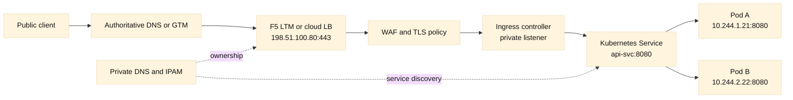
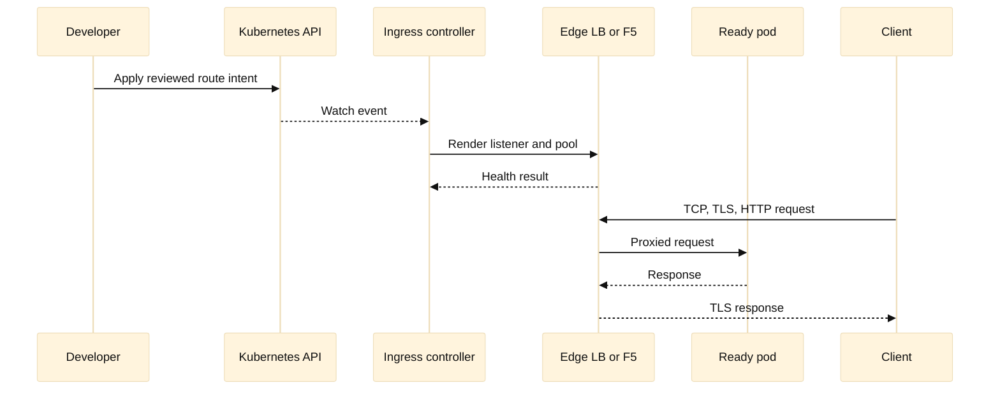

# 15. Cloud Networking and Kubernetes Ingress

Cloud networking is still networking. A managed control plane, an overlay
network, or a service of type `LoadBalancer` changes who operates a component,
but it does not remove the need to reason about addresses, routes, stateful
connections, DNS, certificates, or failure domains. This chapter connects the
traditional enterprise path of client, F5, and application servers to a cloud
path containing a virtual network, a Kubernetes cluster, and an ingress
controller.

The examples use the fictional `harbor.example` domain and documentation
addresses. Provider names are illustrative. Exact names, limits, and behavior
vary by cloud and Kubernetes distribution, so verify a claim against the
provider and controller documentation before applying it.

## Learning objectives

After completing this chapter, you should be able to:

- trace a request from a public cloud VIP to a Kubernetes pod;
- distinguish cloud routes, security groups, network ACLs, and Kubernetes
  policy;
- explain the difference between a `Service`, an ingress resource, an ingress
  controller, and a Gateway API implementation;
- choose where TLS termination, WAF inspection, SNAT, and health checking
  belong;
- design DDI and IPAM ownership for ephemeral load balancers and pods;
- automate an ingress change as a plan, diff, apply, and verification cycle;
- troubleshoot a path by separating DNS, network, controller, service, pod,
  TLS, and application evidence.

## Prerequisites

Know IPv4 subnets, default gateways, routing, ARP/neighbor discovery, TCP,
HTTP, DNS, and TLS from Chapters 1-8. You should recognize a reverse proxy,
pool member, virtual server, and health monitor from Chapters 9-10. Basic YAML,
containers, and `kubectl` are useful but not required; the commands below are
read-only unless explicitly marked as a lab mutation.

## Mental model

A cloud network has at least three views:

1. The **underlay** is the provider-managed physical or virtual fabric. It
   delivers packets between virtual network interfaces and regions.
2. The **tenant network** is the customer-visible virtual network: subnets,
   route tables, gateways, firewall rules, load balancers, and private DNS.
3. The **cluster network** is Kubernetes' logical model: nodes, pod CIDRs,
   services, endpoints, ingress objects, and network policies. A CNI plugin
   maps this model onto cloud interfaces or an overlay.

These views can disagree. A pod may be healthy according to its process while
its node security rule denies the load balancer. A Kubernetes service may have
endpoints while the cloud load balancer health check uses the wrong port. A DNS
record may point at a valid public VIP while a private resolver returns a stale
private address. Good diagnosis asks which view produced each observation.

In Kubernetes, a `Service` is a stable logical destination for a changing set
of endpoints. A `ClusterIP` is normally reachable inside the cluster. A
`NodePort` exposes a port on nodes. A `LoadBalancer` asks an integration to
provision or associate an external load balancer. An ingress resource describes
HTTP routing intent; an ingress controller watches that intent and programs a
proxy or load balancer. The controller may be an in-cluster proxy, a cloud
integration, or an F5 Container Ingress Services-style control-plane adapter
that programs BIG-IP objects. Gateway API provides a more expressive,
role-oriented set of resources, but the same data-plane questions remain.

| Layer | Typical object | Key question | F5 or DDI relationship |
| --- | --- | --- | --- |
| Name | `api.harbor.example` | Which resolver answered, and with what TTL? | GTM/Wide IP or authoritative DNS |
| Cloud edge | Public or private VIP | Which listener and security policy received it? | BIG-IP virtual server or cloud LB |
| Cluster edge | Ingress/Gateway listener | Which host/path/TLS rule matched? | CIS or ingress controller |
| Service | `api-svc:443` | Which endpoints are eligible? | Pool-like membership |
| Pod | Pod IP and port | Is the process listening and ready? | Pool member analogue |
| Policy | SG, ACL, NetworkPolicy, WAF | Which identity and flow are permitted? | Firewall/WAF/iRule policy |

The most important cloud-specific distinction is **security group versus
route**. A route determines where a packet is sent; a security group or ACL
determines whether it is allowed. A route that exists does not imply a packet
will pass. Conversely, an allow rule cannot fix a missing route. For return
traffic, inspect the reverse route and whether a stateful device expects the
same flow to return through it.

## Worked example

### Public HTTPS to a private Kubernetes service

Harbor operates `api.harbor.example` in two availability zones. The public
DNS name resolves to `198.51.100.80`, a fictional edge VIP. The edge proxy
terminates public TLS, applies WAF policy, and forwards to an internal
Kubernetes ingress listener. The cluster nodes live in private subnets. The
application pods use a separate pod CIDR. A private resolver returns an
internal name for service-to-service callers, while public clients use the
edge name.

The intended path is:



At the first hop, the client performs DNS resolution. Record existence,
resolver choice, and TTL are separate facts. The client then establishes a
TCP connection to `198.51.100.80:443`, followed by a TLS handshake containing
the requested server name. The edge chooses a certificate and WAF policy from
that name. If TLS is terminated at the edge, the edge creates a second
connection to the ingress listener. It can preserve the original client
identity in a controlled header, but that header is trustworthy only if the
next hop accepts it from the edge and strips untrusted copies from clients.

The ingress controller matches host and path. It chooses a Kubernetes service,
which chooses ready endpoints. Depending on the CNI and service mode, the
source address observed by a pod may be the original client, the ingress
controller, a node, or a translated address. Never infer the exact tuple from
the YAML alone; inspect proxy logs, conntrack, packet capture, and controller
documentation. If the pod must enforce client identity, use authenticated
metadata or end-to-end mTLS rather than relying on an easily forged source IP.

A safe, read-only inspection sequence is:

```sh
kubectl get ingress,gateway,svc,endpointslice -n harbor-api -o wide
kubectl describe ingress api -n harbor-api
kubectl get networkpolicy -n harbor-api
dig +noall +answer api.harbor.example
curl --resolve api.harbor.example:443:198.51.100.80 \
  --connect-timeout 3 -sS -o /dev/null -w '%{http_code} %{remote_ip}\n' \
  https://api.harbor.example/healthz
```

The `curl --resolve` command tests the selected VIP while retaining the host
name for TLS SNI and HTTP routing. It does not prove that every public resolver
has the same answer. For a local lab, substitute a reserved address or a
container network and avoid a production target.

Automation should model desired state before applying it. A small Python plan
can detect a missing host rule without contacting a cluster:

```python
from dataclasses import dataclass


@dataclass(frozen=True)
class Route:
    host: str
    path: str
    service: str


def route_for(host: str, path: str, routes: list[Route]) -> Route | None:
    """Return the longest matching path for a host, or None."""
    candidates = [r for r in routes if r.host == host and path.startswith(r.path)]
    return max(candidates, key=lambda r: len(r.path), default=None)


routes = [
    Route("api.harbor.example", "/", "api-svc"),
    Route("api.harbor.example", "/v2/", "api-v2-svc"),
]
print(route_for("api.harbor.example", "/v2/orders", routes))
```

The real controller remains the source of truth for precedence rules, but a
pure model is valuable in CI: it can reject duplicate host/path intentions,
missing certificates, or a route that points to a nonexistent service before
the controller changes a live listener.

## When this breaks

Cloud incidents often look like one failure because a browser shows only
“connection failed.” Separate the failure domains:

- **DNS failure:** `dig` returns `SERVFAIL`, NXDOMAIN, a stale answer, or the
  wrong private/public view. Check authoritative data, delegation, and TTL.
- **Edge reachability failure:** the VIP is not announced, the listener is
  absent, a route is missing, or an SG/NACL/firewall denies the SYN.
- **Health-check failure:** the load balancer checks `/` on port 80 while the
  ingress only serves `/healthz` on 8080. A red member is not necessarily a
  dead application.
- **Ingress mismatch:** a host, path, class, or Gateway listener does not
  match. The default backend may return a misleading 404.
- **Service endpoint failure:** selectors do not match labels, readiness gates
  remove all endpoints, or the service target port differs from the pod port.
- **Return-path or SNAT failure:** the pod reply follows a route that bypasses
  the stateful edge, or a network policy allows ingress but denies egress.
- **TLS failure:** the edge certificate lacks the host, the backend trust
  bundle is stale, or an mTLS client certificate is rejected at the wrong hop.
- **Capacity failure:** conntrack, NAT ports, node interfaces, ingress workers,
  or cloud quotas are exhausted. A healthy pod cannot compensate for an edge
  quota.

For packet-level work, capture only on an authorized lab interface. A useful
filter is `tcp port 443 or tcp port 8080`; redact payloads and certificates
before sharing. Compare a successful and failed request with timestamps, flow
IDs, and the same resolver and VIP. Kubernetes events and controller logs are
control-plane evidence, not proof that a data-plane packet reached a pod.

## Operational checklist

Before a cloud ingress change, record the owner, scope, rollback, and expected
propagation time. Confirm the public and private DNS views, certificate SANs,
listener ports, health-check path, backend protocol, and source identity
behavior. Verify that cloud routes, firewall rules, security groups, and
Kubernetes NetworkPolicies cover both directions. Confirm the service selector
and ready endpoints. Check that the ingress controller has observed the
resource and that its rendered configuration is valid. Apply through a
reviewed plan, then test DNS, TCP, TLS, HTTP status, and a known application
transaction separately. Watch error rate, latency, resets, WAF blocks, pod
readiness, node saturation, and load-balancer member state. Keep the previous
VIP, certificate, route, and manifest available until rollback is tested.

## Diagram: packet and control-plane relationship



The control flow is asynchronous: a successful API write does not mean the
edge has converged. The data flow is independent: a rendered listener can
serve traffic while a later endpoint update is still propagating. This is why
verification must inspect both control-plane status and an actual request.

## Questions and answers

1. **Is a Kubernetes Ingress itself a load balancer?** No. It is an API object
   describing HTTP routing. The controller or external integration implements
   the data plane and may provision a load balancer.
2. **Why can a service have endpoints while traffic still fails?** Endpoint
   existence does not prove routes, firewall rules, readiness behavior, port
   translation, TLS, or application response correctness.
3. **What does `externalTrafficPolicy` change?** It can influence source-address
   preservation and node selection, but the exact behavior depends on service
   implementation and cluster networking. Verify the resulting tuples.
4. **Where should TLS terminate?** At the edge when centralized inspection
   and certificate operations are desired; again at the backend when hop
   confidentiality or workload identity requires it. Many designs use both.
5. **Why is SNAT sometimes required?** It makes the return path point back
   through the proxy when the backend lacks a route to the original client.
   The trade-off is loss of source-IP visibility unless trusted metadata is
   added.
6. **How does F5 LTM fit Kubernetes?** It can be the external VIP and proxy,
   while a controller synchronizes Kubernetes routes and endpoints into BIG-IP
   objects. Treat synchronization lag and permissions as failure modes.
7. **How does GTM or BIG-IP DNS fit?** It can steer the client to a regional
   edge VIP using health, topology, or other policy. It does not replace
   per-request L7 routing inside the selected region.
8. **What is the first check for a 404?** Confirm the request host and path at
   the edge and ingress logs. A default route, wrong DNS name, or missing host
   rule can produce a valid HTTP response from the wrong application.
9. **Does a pod IP belong in public IPAM?** Usually no. Pod addresses are
   ephemeral cluster inventory; public VIPs, node ranges, and service ranges
   need explicit ownership and collision controls. Record the boundary in DDI.
10. **Why can a health check pass while users fail?** A shallow check may
    verify a process but not dependencies, routing, TLS, authorization, or the
    real host/path. Use layered checks with carefully bounded cost.
11. **What should a CI policy reject?** Duplicate host/path ownership, an
    absent certificate or secret reference, an unapproved public listener, an
    impossible service port, and a change without rollback and owner metadata.
12. **How should cloud limits be handled?** Treat addresses, listeners, NAT
    ports, routes, interfaces, and load-balancer quotas as capacity resources;
    monitor them and test quota behavior before a scale event.

## Further practice

Build a local two-container service and reverse proxy, then add a health
endpoint that intentionally fails. Record the distinction between DNS failure,
TCP refusal, TLS alert, HTTP 404, and HTTP 503. Next, write a plan generator
that compares desired ingress hosts with observed hosts and emits additions,
deletions, and conflicts without applying them. Finally, map the same design
to an F5 VIP, pool, monitor, server-side SSL profile, and GTM Wide IP. The
mapping exercise reveals which properties are Kubernetes intent and which are
data-plane implementation choices.
