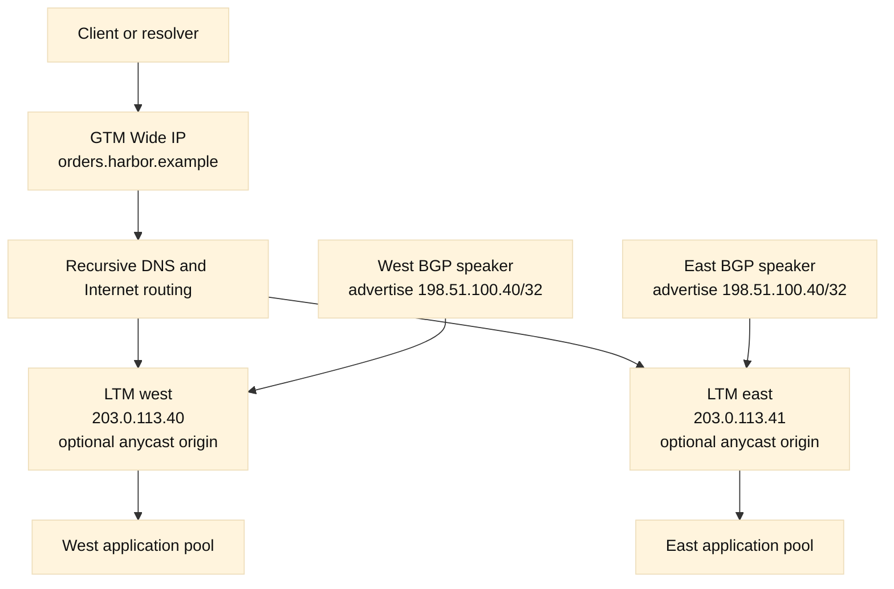
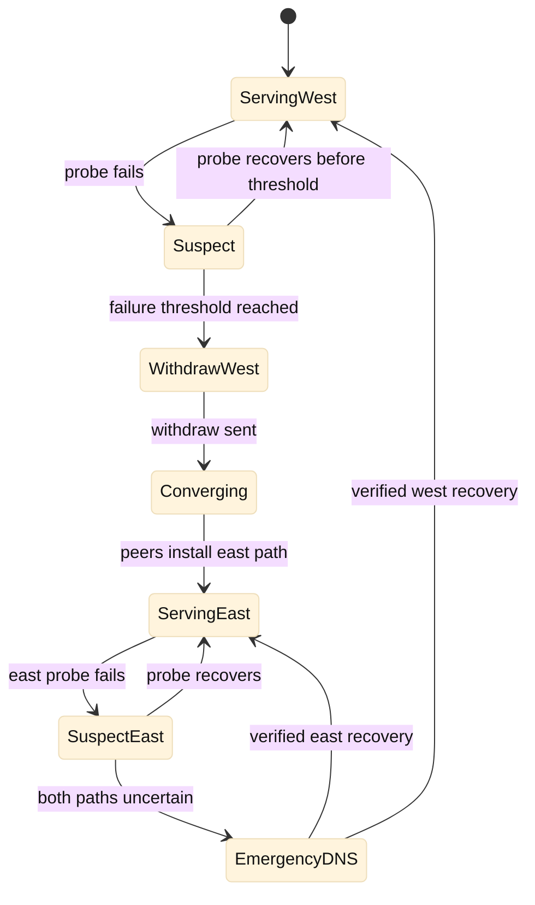

# 16. BGP, Anycast, and Multi-Region Traffic Engineering

Multi-region availability is often described as “send users to the nearest
healthy site.” That sentence hides several different systems. DNS can select
an address. BGP can advertise an address from multiple locations. A global
load balancer can proxy the request. An application can retry or redirect. Each
mechanism has different state, convergence, visibility, and failure semantics.
This chapter builds a practical model for BGP, anycast, and their relationship
to F5 GTM/BIG-IP DNS and LTM.

All prefixes and domains below are fictional or documentation ranges. BGP
changes affect real networks and require authorization, peer review, route
filters, and a tested rollback. The commands shown for route inspection are
read-only.

## Learning objectives

You should be able to:

- distinguish an autonomous system, prefix, route advertisement, and data path;
- explain how anycast differs from unicast and DNS steering;
- reason about BGP selection, convergence, withdrawal, and route leakage;
- design health-gated multi-region advertisements without creating black holes;
- decide whether GTM DNS, anycast, or an application/global proxy is appropriate;
- troubleshoot a regional incident using route, DNS, flow, and application data;
- automate route policy safely with validation, staged rollout, and rollback.

## Prerequisites

Read Chapters 2, 6, 9, and 11. Be comfortable with CIDR, DNS TTL, TCP
state, NAT, load-balancer health, and the distinction between a control plane
and a data plane. BGP syntax is introduced here; production peering belongs to
network operators and should not be experimented with on an unapproved router.

## Mental model

BGP is a path-vector control protocol. A speaker tells a neighbor that it can
reach a prefix and includes path attributes such as AS path. The neighbor
selects a best path according to implementation policy and installs an eligible
route. Routers then forward packets using the resulting next hop. A BGP route
is not a health check and an installed route is not proof that an application
will answer.

**Anycast** gives the same IP address to multiple sites and advertises the
address from each site. Internet routing generally sends a client toward one
of those advertisements according to routing policy and topology. “Nearest”
means best according to routing decisions, not necessarily lowest latency or
geographic distance. Once a TCP connection chooses a site, it normally remains
there until the connection ends; a later route change does not migrate the
connection safely.

**DNS steering** returns different addresses to different resolvers or clients.
It is easy to express region, geography, weights, and service state, but cached
answers remain in use until TTL and resolver behavior permit a change. **A
global proxy** terminates the client connection at a stable edge and chooses a
backend per request or connection; this can improve policy and observability,
but introduces a global data-plane dependency and cost.

| Mechanism | Decision point | Change speed | Client visibility | Main risk |
| --- | --- | --- | --- | --- |
| GTM DNS | Resolver/client lookup | TTL plus resolver behavior | Client sees an address | Stale caches and resolver location |
| Anycast BGP | Network routing | BGP convergence and policy | Client sees one address | Black hole or route leak |
| Global proxy | Edge data plane | Request or connection time | Client sees edge | Edge capacity and dependency |
| Application redirect | Application | Per response | Client follows new URL | Client behavior and extra hop |

F5 GTM/BIG-IP DNS commonly participates in the DNS-steering row: a Wide IP
maps a name to pools of virtual servers, and monitors influence eligible
answers. F5 LTM owns the regional VIP and pool behavior. Anycast may front
multiple LTM sites, but it should not be assumed that GTM health automatically
withdraws a BGP prefix. That coupling requires an explicit, tested automation
path with conservative failure behavior.

## Worked example

### Two regional LTM sites with DNS and anycast options

Harbor serves `orders.harbor.example` from west and east regions. Each region
has an LTM VIP `203.0.113.40:443` in the west and `203.0.113.41:443` in the
east. A GTM Wide IP returns one of these addresses using health and topology.
The organization also considers advertising a shared anycast VIP
`198.51.100.40/32` from both sites.

The DNS design is straightforward: if the west LTM virtual server and its
critical pool are down, GTM stops returning the west address. But TTL means a
client or recursive resolver may continue using it. For short-lived APIs, the
application can retry another address; for long-lived connections, the client
needs reconnect logic.

The anycast design removes some DNS-cache delay. A site advertises the /32 only
when the local edge, LTM listener, critical pool, and required dependencies are
ready. If west withdraws, new flows should converge toward east. However,
withdrawal propagation is not instantaneous, existing sessions can reset, and
an overly optimistic health script can advertise a black hole.



For an approved lab, inspect the local route table and DNS behavior without
changing routing:

```sh
ip route get 198.51.100.40
dig +noall +answer orders.harbor.example
dig +trace orders.harbor.example
```

On a router platform, use its read-only equivalent of `show bgp ipv4
unicast 198.51.100.40/32`, `show bgp neighbors`, and `show route`. Do not copy
vendor commands between platforms without checking syntax and privilege. A
route inspection should record prefix, next hop, AS path, local preference,
MED, communities, age, and origin. Compare the control-plane result with a
real TCP/TLS request and LTM pool state.

A health-gated advertisement should have explicit stages. First, a local probe
checks the listener and a synthetic transaction. Second, a controller verifies
that the probe is fresh and that the site is inside its change window. Third,
the route agent advertises or withdraws the prefix. Fourth, an observer checks
that upstream peers see the intended state. If any step is uncertain, fail
closed by withdrawing the more-specific service prefix rather than advertising
a route to an unhealthy site. A route script must not blindly use “process is
running” as health.

A lightweight Python policy model can make the decision auditable:

```python
from dataclasses import dataclass


@dataclass(frozen=True)
class Site:
    name: str
    listener_ok: bool
    pool_ready: bool
    dependency_ok: bool
    change_allowed: bool


def should_advertise(site: Site) -> bool:
    """Return whether all independent gates allow a service advertisement."""
    return all((site.listener_ok, site.pool_ready,
                site.dependency_ok, site.change_allowed))


west = Site("west", True, True, True, True)
print(f"advertise {west.name}: {should_advertise(west)}")
```

The model is intentionally conservative. A production implementation would
also enforce prefix length, origin authorization, peer allow-lists, maximum
prefixes, rate limits, dampening policy, and an operator-approved rollback.
RPKI origin validation can reduce accidental acceptance of an unauthorized
origin, but it does not prove application health or protect every routing
mistake.

## When this breaks

The most dangerous multi-region failure is a **black hole**: a route exists,
so packets are attracted to a site, but the service is not listening or return
traffic is discarded. A related error is a **route leak**, where a prefix is
announced to peers that should never receive it. A **more-specific route** can
override a healthy aggregate and send only part of the population to the
wrong site. A **withdrawal delay** can leave some networks using a failed path.

Other failures include:

- GTM health sees the LTM VIP as available while an application dependency is
  broken, so DNS continues returning a bad region.
- GTM returns the correct region, but a recursive resolver is outside the
  intended geography and caches the answer for the TTL.
- Anycast splits a stateful flow when route changes cause packets to arrive at
  different sites. Stateless services tolerate this better than sessions tied
  to local state.
- Asymmetric routing causes firewalls, SNAT, or TCP state tables to drop
  replies. The server may see the SYN while the client never sees the SYN-ACK.
- A health agent has stale state and continues advertising after the site is
  down. A second observer should verify liveness from outside the site.
- Capacity is uneven: routing sends a “nearby” population to a site with
  insufficient NAT ports, LTM connections, certificate workers, or application
  capacity.
- A DNS migration lowers TTL only shortly before the event. Existing cached
  answers remain governed by the previous TTL; TTL is not a remote invalidation
  button.

During an incident, preserve evidence before changing advertisements. Record
DNS answers from several vantage points, BGP paths from authorized collectors,
LTM VIP/pool state, TCP resets and latency, and the timeline of health-agent
decisions. If safety requires withdrawal, communicate that new connections may
fail during convergence and that existing connections may reset. Do not claim
global recovery from one successful curl.

## Operational checklist

Document ownership of each prefix, AS relationship, VIP, Wide IP, health
signal, and rollback. Filter outbound announcements by exact prefix and
maximum length. Validate origin, communities, local preference, MED, and
prepend behavior in a non-production or maintenance window. Define what “site
healthy” means: edge listener, LTM pool, DDI, authentication, dependencies,
capacity, and synthetic transaction. Test withdrawal, re-advertisement, peer
loss, and stale health state. Monitor route visibility from multiple networks,
DNS answers, TTL age, new connections, established connection resets, and
regional saturation. Keep a DNS fallback and a documented route rollback.

## Diagram: failover timing and state



This state machine separates a local probe failure from a routing action. The
threshold prevents a transient packet loss from flapping advertisements; the
convergence state acknowledges that upstream networks need time; the emergency
state avoids pretending that a single control signal describes global health.

## Questions and answers

1. **Is anycast the same as load balancing?** No. Anycast influences which
   site receives a flow through routing. LTM still load-balances within a site.
2. **Does BGP choose the geographically nearest site?** Not necessarily. It
   chooses according to policy and path attributes; topology and policy may
   prefer a farther site.
3. **Why not use only GTM?** DNS is often sufficient and simpler, but caches,
   resolver location, and long-lived connections limit how quickly all clients
   move.
4. **Why not use only anycast?** It reduces dependence on DNS steering but
   increases routing and stateful-edge complexity. A bad advertisement can
   attract traffic at Internet scale.
5. **What does a BGP withdrawal do to existing TCP sessions?** It changes the
   preferred route for future packets; sessions are not migrated, and packets
   can be dropped or reset during convergence.
6. **Can GTM health automatically withdraw BGP?** It can be connected through
   automation, but that is not implicit. The coupling needs authorization,
   freshness checks, route filters, and rollback.
7. **What is RPKI useful for?** It helps validate whether an origin is
   authorized for a prefix. It does not test an HTTP endpoint or guarantee
   route correctness.
8. **Why use a /32 or /128 service route?** A precise service prefix can be
   withdrawn independently, but prefix filters and provider policies may limit
   what is accepted. Use only an approved allocation and policy.
9. **What should a runbook compare first?** Compare DNS answer, selected route,
   VIP/LTM state, and return path for the same timestamp and client vantage.
10. **How does DDI matter to anycast?** IPAM must record prefix ownership,
    announcement authority, VIP purpose, and site mapping. DNS must agree with
    the routing plan or operators will troubleshoot the wrong layer.
11. **Why can a route be healthy but HTTP be broken?** BGP tests reachability
    to a prefix, not listener, TLS, WAF, pool, dependency, or application
    behavior.
12. **What is a safe first rollback?** Stop the unhealthy advertisement or
    restore the last known-good route policy, then verify route visibility and
    new connections from several vantage points.

## Further practice

Use a local network namespace lab or a routing simulator to model two speakers,
one prefix, a withdrawal, and a more-specific route. Keep it disconnected from
production. Add a fake LTM health endpoint and write tests for flapping,
stale-probe age, and “both sites unhealthy.” Then compare the simulated
convergence story with DNS TTL behavior. The exercise should end with a change
plan and rollback, not a live Internet advertisement.
