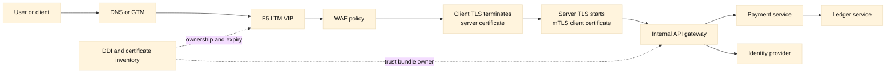
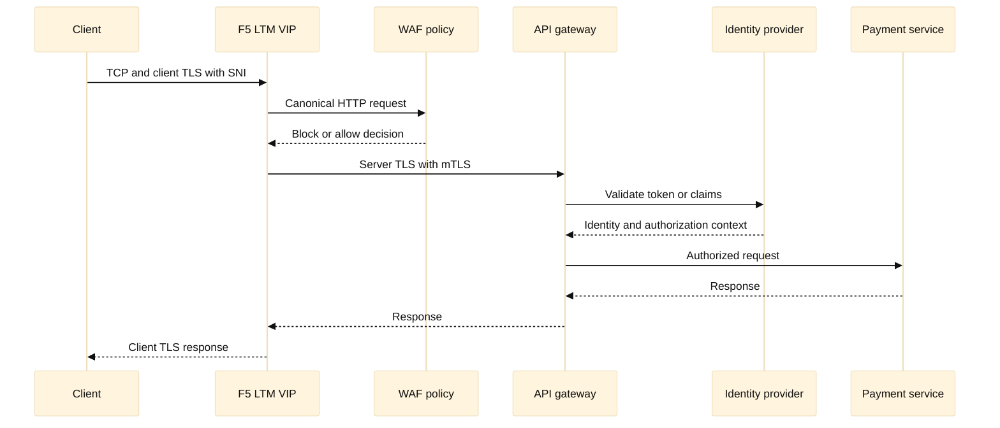

# 17. Network Security, WAF, and Zero Trust

Network security is a set of boundaries and decisions, not a single firewall
box. A request can cross a cloud security group, network firewall, F5 virtual
server, WAF policy, TLS endpoint, service mesh, and application authorization
layer before it reaches data. Each layer observes different identity and
protocol facts. Security troubleshooting becomes effective when those facts
are named explicitly instead of treating “the network” as one hop.

This chapter explains perimeter controls, segmentation, reverse proxies, web
application firewalls, zero-trust principles, SSH, encryption, certificates,
TLS, and mTLS. Product names such as F5 BIG-IP Advanced WAF/ASM are used as
vendor terminology, not as a claim that one product implements every security
control. Policy examples are fictional and should be reviewed before use.

## Learning objectives

By the end, you should be able to:

- distinguish network reachability, transport authorization, TLS identity, and
  application authorization;
- place firewalls, F5 LTM, WAF, and identity-aware controls in a request path;
- explain why segmentation and zero trust are complementary rather than
  interchangeable;
- design TLS termination and mTLS trust boundaries with certificate rotation;
- write safer SSH and automation practices without embedding credentials;
- investigate a WAF block, certificate error, denied flow, or suspected bypass;
- build a security change plan with tests, observability, and rollback.

## Prerequisites

Know IP routing, TCP state, HTTP, DNS, TLS handshakes, reverse proxies, F5
LTM/GTM, and basic Linux permissions. Chapters 8, 10, 12, and 13 provide the
protocol and operations foundations. You do not need to memorize cryptographic
algorithms, but you must understand keys, certificates, trust stores, identity,
and the difference between encryption and authorization.

## Mental model

Use four questions for every hop:

1. **Can packets reach the listener?** Routes, ACLs, firewalls, security
   groups, and NetworkPolicies answer this.

2. **Can a transport connection be created?** TCP state, listener ports,
   proxies, NAT, and resource limits answer this.

3. **Is the peer who it claims to be?** TLS certificate validation, SNI,
   hostname verification, and mTLS client authentication answer this.

4. **Is this action allowed?** WAF rules, identity, authorization, rate
   limits, and application policy answer this.

Encryption protects data in transit from observers who do not hold the keys; it
does not make an authorized request safe. A certificate binds a public key to
an identity under a CA trust model; it does not itself grant application
permissions. A WAF can detect suspicious HTTP shape, but it cannot replace
secure application code. Zero trust is an architectural approach that avoids
implicit trust based solely on network location and continuously evaluates
identity, device/workload context, policy, and request.

| Control | Primary observation | Helps with | Does not prove |
| --- | --- | --- | --- |
| Firewall/ACL | IP, port, direction, state | Reachability and coarse segmentation | User identity or safe HTTP |
| F5 LTM | VIP, pool, profile, connection | Proxying, TLS boundary, availability | Business authorization |
| WAF | HTTP method, path, headers, body | Common web attack patterns and policy | Absence of all vulnerabilities |
| TLS | Certificate, cipher, transcript | Confidentiality and peer identity | User entitlement |
| mTLS | Client and server certificates | Workload/device authentication | Correct business action |
| IAM/application auth | Token, claims, role, resource | Authorization and accountability | Network path safety |
| DDI/IPAM | Name, address, ownership | Inventory and change traceability | Runtime packet permission |

The best design treats each control as a signal and limits trust crossing the
boundary. For example, an edge F5 can terminate public TLS and pass a
carefully controlled identity header to an internal service, but the service
must accept that header only from an authenticated, restricted F5 source. For
strong workload identity, use re-encryption and mTLS on the server side. Strip
client-supplied copies of security headers before adding canonical values.

## Worked example

### Public API with WAF and end-to-end workload identity

Harbor exposes `payments.harbor.example` through a public F5 LTM VIP. The
client connection uses TLS with SNI. An F5 WAF policy applies size limits,
method rules, rate controls, and narrowly tuned signatures. LTM then opens a
new TLS connection to an internal API gateway. The gateway verifies the F5
client certificate using a dedicated trust bundle and performs application
authorization with a token. The payment service uses another mTLS hop to a
ledger service.



There are two distinct TLS sessions. The first proves the public hostname to
the client. The second proves the gateway is talking to an authorized edge
identity and encrypts the internal hop. If the gateway merely disables
certificate verification, the diagram looks secure while the trust boundary
is absent. If it verifies only a CA but not a specific identity or SAN, an
unintended certificate issued by that CA may be accepted. The exact policy
should be documented: trust anchor, hostname/SAN check, EKU, revocation
strategy, allowed algorithms, and rotation overlap.

A safe certificate observation command is:

```sh
printf '' | openssl s_client -connect 127.0.0.1:8443 \
  -servername payments.harbor.example -showcerts 2>/dev/null \
  | openssl x509 -noout -subject -issuer -dates -ext subjectAltName
```

Use a local lab endpoint or the repository's `demos/tls_inspect.sh`; do not
place private keys in a repository or paste them into incident channels. For
SSH, prefer a short-lived key or certificate, an explicit host-key policy,
least-privilege account, agent forwarding avoidance, and command logging. A
read-only probe can use `ssh -o BatchMode=yes -o StrictHostKeyChecking=yes`
against an approved lab host. Never “fix” a host-key warning with a blanket
`StrictHostKeyChecking=no` in automation.

Security policy should be expressed as testable intent. For example:

```python
from dataclasses import dataclass


@dataclass(frozen=True)
class Request:
    source_zone: str
    destination: str
    method: str
    authenticated: bool
    mtls_identity: str | None


def allow_payment(request: Request) -> bool:
    """Model a narrow policy; production enforcement belongs to reviewed controls."""
    return (
        request.source_zone == "edge"
        and request.destination == "payments"
        and request.method in {"GET", "POST"}
        and request.authenticated
        and request.mtls_identity == "f5-edge.harbor.example"
    )


probe = Request("edge", "payments", "POST", True, "f5-edge.harbor.example")
print(allow_payment(probe))
```

This model is deliberately not a WAF engine. It gives CI and review a place to
test decisions such as “a client cannot claim to be the F5” and “a read-only
identity cannot invoke a write route.” Production controls still need logging,
rate limits, canonicalization, body-size limits, and safe fail behavior.

## WAF and proxy boundaries

A reverse proxy normalizes connections and can apply routing, TLS, headers,
timeouts, and pool selection. A WAF inspects application messages and may block,
alarm, or pass them. Put the WAF where it can see the protocol version and
canonical request that the application will interpret. Double parsing by two
proxies can create request-smuggling risk when they disagree about framing or
headers. Define whether the edge strips hop-by-hop headers, how it handles
duplicate headers, maximum URI/body size, allowed methods, and decompression.

F5 LTM profiles determine TCP, HTTP, client SSL, server SSL, persistence, and
other proxy behavior. iRules or policies can add powerful custom decisions;
they also create code paths that need review, testing, rate limits, and a
rollback. A WAF signature in blocking mode can protect a route and also cause
false positives for a newly deployed payload. Start with an explicit learning
or alerting process where appropriate, but do not leave a known critical rule
in an ineffective mode without an owner and expiry.

Zero trust does not mean “put a WAF on the Internet.” A zero-trust request
should carry or obtain an identity, be authorized for a resource and action,
be evaluated in context, and produce an auditable decision. Network location
still matters for reducing exposure and blast radius; it is simply not the
sole proof of trust. Segment management planes from data planes, isolate DDI
administration, restrict F5 management interfaces, and use separate trust
anchors for unrelated environments.

## When this breaks

Security failures are often caused by a mismatch between what one layer sees
and what another layer trusts:

- A firewall allows TCP 443, but the WAF blocks a request because the host,
  method, body, or signature violates policy.
- The WAF sees a benign encoded form while the application decodes it
  differently. Normalize consistently and test parser disagreement.
- TLS succeeds at the edge but server-side TLS fails because the gateway lacks
  the intermediate CA, rejects the SNI, or sees the wrong hostname.
- mTLS rotation removes the old client CA before every gateway has the new
  trust bundle. Use an overlap window and verify both directions.
- A certificate is valid by date but lacks the requested DNS SAN, has an
  unsuitable extended key usage, or is signed by a CA not trusted on that hop.
- An identity header is accepted from the public client because the proxy did
  not strip it. Treat headers as untrusted until a controlled hop recreates
  them.
- A network policy denies return traffic or DNS, and the application reports a
  generic authorization failure. Capture the actual denied flow and correlate
  it with policy logs.
- An emergency WAF bypass is left in place. A bypass must have owner, reason,
  scope, expiry, alerting, and a removal verification.
- SSH automation works from a laptop but fails from CI because host-key files,
  certificate validity, agent sockets, or source-network policy differ.

During an incident, preserve a request ID, edge decision, WAF rule ID, TLS
handshake result, mTLS identity, backend status, and authorization decision.
Redact tokens, cookies, private identifiers, and payment data. Compare a known
good request and a failing request with the same method, host, path, and
payload shape. A 403 from the WAF is not evidence that the backend was reached;
a 401 from the application is not evidence that the network was open to all
clients.

## Operational checklist

Inventory every public VIP, listener, certificate, WAF policy, pool, trust
bundle, and management endpoint in DDI/IPAM with an owner and expiry. Separate
management and data-plane networks. Require authenticated administrative
access, MFA where supported, least privilege, reviewed SSH host keys, and no
embedded secrets. Define TLS versions, cipher policy, SANs, EKU, trust anchors,
rotation overlap, and failure behavior. Test WAF policy with positive and
negative requests, parser edge cases, rate limits, large bodies, and safe
false-positive handling. Verify both client-side and server-side TLS. Confirm
NetworkPolicies, firewall rules, and return routes. Monitor blocks, allowed
requests, certificate expiry, trust-bundle version, mTLS failures, resets,
latency, backend codes, and policy changes. Every exception needs a ticket,
owner, scope, expiry, alert, and rollback.

## Diagram: trust and enforcement sequence



The sequence makes two boundaries visible: WAF inspection happens before the
backend, and mTLS authenticates the proxy-to-gateway hop. Authorization is a
separate decision from either. If a control is unavailable, the runbook must
state whether the system fails closed, serves a bounded degraded mode, or
rejects only a sensitive route.

## Questions and answers

1. **Does a firewall replace a WAF?** No. A firewall usually reasons about
   network flows; a WAF reasons about application requests. They address
   different layers and failure modes.

Interview reasoning: For “Does a firewall replace a WAF,” name the trust boundary, identity, resource, decision, telemetry, and recovery path. Start a new WAF or rate rule in observation, measure false positives, then enforce with a rollback threshold. Stronger inspection can add latency and block valid clients; TLS termination determines what fields are visible, and “blocked attack” metrics must be balanced with user success.

2. **Does TLS provide authorization?** No. It can authenticate a server or
   client and protect bytes, while IAM and application policy decide actions.

Interview reasoning: For “Does TLS provide authorization,” walk the handshake fields rather than saying only “encrypted”: SNI selects identity, SAN matches the name, the chain reaches a trusted root, and protocol policy permits negotiation. Test client-to-LTM and LTM-to-member independently. Re-encryption protects the second hop but creates a second certificate/trust lifecycle; front-end success does not prove backend authorization or readiness.

3. **What is mTLS?** Mutual TLS authenticates both endpoints with certificates
   during the TLS handshake. It is useful for workload identity but still needs
   authorization and rotation operations.

Interview reasoning: For “What is mTLS,” walk the handshake fields rather than saying only “encrypted”: SNI selects identity, SAN matches the name, the chain reaches a trusted root, and protocol policy permits negotiation. Test client-to-LTM and LTM-to-member independently. Re-encryption protects the second hop but creates a second certificate/trust lifecycle; front-end success does not prove backend authorization or readiness.

4. **Where should a public certificate be installed?** On the endpoint that
   terminates public TLS, such as an F5 client SSL profile. Internal hops need
   their own server certificates and trust policy when re-encrypted.

Interview reasoning: For “Where should a public certificate be installed,” walk the handshake fields rather than saying only “encrypted”: SNI selects identity, SAN matches the name, the chain reaches a trusted root, and protocol policy permits negotiation. Test client-to-LTM and LTM-to-member independently. Re-encryption protects the second hop but creates a second certificate/trust lifecycle; front-end success does not prove backend authorization or readiness.

5. **Why keep separate CA trust bundles?** Separation limits blast radius and
   prevents a certificate valid for one environment or role from being trusted
   everywhere.

Interview reasoning: For “Why keep separate CA trust bundles,” name the trust boundary, identity, resource, decision, telemetry, and recovery path. Start a new WAF or rate rule in observation, measure false positives, then enforce with a rollback threshold. Stronger inspection can add latency and block valid clients; TLS termination determines what fields are visible, and “blocked attack” metrics must be balanced with user success.

6. **Can a WAF stop all attacks?** No. It can reduce selected classes of
   malicious traffic and provide visibility, but secure code, authentication,
   authorization, patching, and data controls remain necessary.

Interview reasoning: For “Can a WAF stop all attacks,” name the trust boundary, identity, resource, decision, telemetry, and recovery path. Start a new WAF or rate rule in observation, measure false positives, then enforce with a rollback threshold. Stronger inspection can add latency and block valid clients; TLS termination determines what fields are visible, and “blocked attack” metrics must be balanced with user success.

7. **What is zero trust in one sentence?** Make each request prove the relevant
   identity and authorization instead of granting implicit trust from location.

Interview reasoning: For “What is zero trust in one sentence,” name the trust boundary, identity, resource, decision, telemetry, and recovery path. Start a new WAF or rate rule in observation, measure false positives, then enforce with a rollback threshold. Stronger inspection can add latency and block valid clients; TLS termination determines what fields are visible, and “blocked attack” metrics must be balanced with user success.

8. **Why strip security headers at the proxy?** A client can send a header that
   claims an identity. The proxy should remove untrusted copies and add a
   canonical value only across a constrained, authenticated hop.

Interview reasoning: For “Why strip security headers at the proxy,” identify where each connection terminates and which method, headers, authority, body framing, and timeout cross the boundary. Compare downstream and upstream tuples with request IDs. A proxy improves policy and pooling but can introduce queueing, stale connections, header trust, and retry errors; a timeout after a POST may mean the server changed state even if the client saw no response.

9. **Why can a valid certificate still fail?** Hostname SAN, SNI selection,
   EKU, chain completeness, trust store, validity clock, or protocol policy can
   be wrong even when the date is current.

Interview reasoning: For “Why can a valid certificate still fail,” walk the handshake fields rather than saying only “encrypted”: SNI selects identity, SAN matches the name, the chain reaches a trusted root, and protocol policy permits negotiation. Test client-to-LTM and LTM-to-member independently. Re-encryption protects the second hop but creates a second certificate/trust lifecycle; front-end success does not prove backend authorization or readiness.

10. **What is a safe WAF rollout?** Validate rule scope in a test environment,
    observe representative traffic, stage blocking with an exception owner,
    monitor false positives, and retain a tested narrow rollback.

Interview reasoning: For “What is a safe WAF rollout,” name the trust boundary, identity, resource, decision, telemetry, and recovery path. Start a new WAF or rate rule in observation, measure false positives, then enforce with a rollback threshold. Stronger inspection can add latency and block valid clients; TLS termination determines what fields are visible, and “blocked attack” metrics must be balanced with user success.

11. **How should an SSH host-key warning be handled?** Verify the expected key
    through an independent trusted channel. Do not disable host-key checking
    globally to make automation pass.

Interview reasoning: For “How should an SSH host-key warning be handled,” describe the safe control loop: discover, normalize an allow-listed state, calculate a minimal diff, obtain approval, apply idempotently, validate behavior, and record redacted evidence. For F5, resolve version, partition, folder, and self-link before mutation and read back after uncertain results. A successful HTTP response is not traffic health, and retries are safe only when reconciliation prevents duplicates.

12. **How does F5 GTM relate to security?** It can steer names toward eligible
    regional VIPs and reduce exposure to an unhealthy site, but it does not
    authenticate HTTP requests or replace LTM/WAF policy.

Interview reasoning: For “How does F5 GTM relate to security,” separate the DNS decision from the later LTM connection. BIG-IP DNS evaluates Wide IP pool state, monitors, topology or other steering, and returns an address; recursive caches can serve it until TTL expiry. Compare authoritative and recursive answers and then test the selected VIP. DNS steering cannot revoke an already cached answer or repair data consistency.

13. **What should an incident log contain?** Timestamp, request ID, source
    zone, VIP, WAF decision/rule, TLS and mTLS identities, backend status,
    authorization result, and the policy versions involved.

Interview reasoning: Walk through the handshake fields and the trust decision rather than saying only that TLS encrypts traffic. Check the hostname/SNI, negotiated protocol and cipher, certificate validity interval, SAN, chain order, trust store, and—when applicable—the client certificate and mapped identity. A practical example is testing each proxy leg independently with an explicit SNI name. The caveat is that front-end certificate success says nothing about backend TLS, authorization, or application readiness.

## Further practice

Create a local reverse-proxy lab with a self-signed certificate and two backend
responses. Demonstrate the difference between a TCP denial, TLS hostname
failure, WAF-like method rejection, mTLS trust failure, and application 403.
Write a certificate inventory script that reports SANs and expiry without
reading private keys. Then create a change plan for rotating the gateway trust
bundle with old/new overlap, positive and negative tests, an alert threshold,
and a rollback. The result should make every trust boundary observable.
