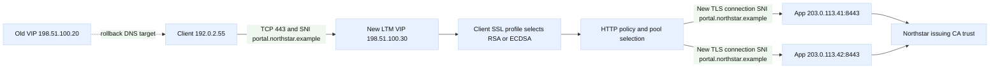

# Case study 1: LTM VIP and certificate migration

## Context and goals

This fictional change concerns `portal.northstar.example`, a customer portal
served through an F5 BIG-IP Local Traffic Manager (LTM). The service owner,
Northstar Labs, wanted to replace an expiring RSA certificate with an ECDSA
certificate and move the public VIP from an old pair of BIG-IP devices to a
new pair. The address space is deliberately reserved for examples: clients
use `192.0.2.0/24`, the old VIP is `198.51.100.20`, the new VIP is
`198.51.100.30`, and backend nodes are `203.0.113.41` and `203.0.113.42`.
Names such as `ltm-a.blue.example` are fictional and are not instructions for
changing a production system.

The goals were to preserve the URL, keep both RSA-capable older clients and
modern ECDSA clients working, maintain HTTP redirects and security headers,
and avoid exposing the application nodes directly. The intended request path
was client to VIP over TLS, TLS termination at the new LTM, HTTP policy and
load balancing, then a fresh TLS connection from LTM to each pool member.
That last leg is re-encryption, not merely forwarding encrypted bytes.

In this narrative, **Observed** means a timestamped measurement, log line, or
configuration export. **Inferred** means a reasoned explanation that could be
wrong until tested. This distinction matters during a migration: a browser
error is an observation; “SNI selected the wrong certificate” is an inference.
The protocol facts used here follow [RFC 6066, TLS server name indication](https://www.rfc-editor.org/rfc/rfc6066),
[RFC 8446, TLS 1.3](https://www.rfc-editor.org/rfc/rfc8446), and
[RFC 5280, X.509 PKI](https://www.rfc-editor.org/rfc/rfc5280). F5 terminology
is aligned with the [BIG-IP SSL profiles overview](https://techdocs.f5.com/en-us/bigip-17-1-0/big-ip-local-traffic-management-profiles-reference-17-1-0/client-ssl-profile.html)
and the [virtual server documentation](https://techdocs.f5.com/en-us/bigip-17-1-0/big-ip-local-traffic-management-virtual-server.html).

## Architecture

The old active/standby LTM pair had VIP `198.51.100.20`, a client SSL
profile containing `portal-rsa-2024`, and a server SSL profile that validated
the pool certificate loosely. The new pair owns `198.51.100.30` and uses a
client SSL profile with both `portal-rsa-2026` and `portal-ecdsa-2026`.
SNI-based certificate selection maps `portal.northstar.example` to that
certificate set; a deliberately explicit default certificate handles clients
that omit SNI. The virtual server has an HTTP profile, a persistence policy
based on a secure cookie, and a pool monitor that checks `/healthz`.

The server SSL profile re-encrypts traffic to the pool. It sends SNI
`portal.northstar.example` to the application tier and trusts the fictional
Northstar issuing CA. Backend TLS therefore has its own handshake, cipher
negotiation, certificate validation, and failure modes. The LTM is a proxy:
the client-side TCP/TLS session and server-side TCP/TLS session are separate.
SNAT uses a documentation address `192.0.2.200`, so return traffic comes back
through the LTM. The application nodes listen on TCP 8443, not on the public
VIP.

The sequence is: DNS returns a VIP; the client opens TCP; it sends a TLS
ClientHello with SNI; LTM chooses a client certificate and completes the
front-end handshake; LTM creates or reuses a pool-side TCP connection; the
server SSL profile performs a second handshake; HTTP headers and cookies are
processed; the selected member replies; LTM encrypts the response to the
client. A state transition from `Pending` to `Active` is allowed only after
certificate chain, SNI, monitor, and end-to-end HTTP checks succeed.

## Timeline

At 2026-08-30 08:00 UTC, the change ticket entered a maintenance window.
**Observed:** the old certificate had 19 days remaining and the new private
key fingerprint matched the approved vault export. **Inferred:** expiry risk,
not a current outage, justified the migration.

At 08:12, **Observed:** a configuration diff showed the new VIP, client SSL
profile, server SSL profile, pool, monitor, SNAT, and iRule equivalents. The
new server profile had certificate validation enabled. **Inferred:** the
design could detect an invalid backend chain instead of masking it.

At 08:27, **Observed:** a test client without SNI received the explicit RSA
default certificate; an SNI client received the expected ECDSA certificate.
At 08:41, **Observed:** both pool members returned HTTP 200 on `/healthz` and
the LTM marked them available.

At 09:00, DNS was changed to return `198.51.100.30` with a 300-second TTL.
At 09:06, **Observed:** synthetic clients in two test resolvers succeeded.
At 09:11, **Observed:** 3.4% of public probes reported a certificate-name
mismatch, while direct probes to the new VIP were clean. **Inferred:** some
clients were reaching a stale path, or one path selected the default profile.

At 09:18, **Observed:** packet capture on the new VIP showed ClientHello
messages both with and without SNI. The no-SNI traffic correctly received RSA;
the mismatch probes were not all explained. At 09:25, **Observed:** an
upstream health dashboard still displayed connections to `198.51.100.20`.

At 09:32, **Observed:** the old VIP served the old certificate and returned
HTTP 200. The team held the migration rather than deleting it. At 09:44,
**Observed:** after the 300-second TTL plus a safety interval, mismatch probes
dropped to zero. At 10:05, the old VIP was disabled from DNS but retained as a
rollback object. At 10:30, **Observed:** error rate, handshake failures, and
backend 5xx remained at baseline.

## Evidence

**Observed:** the certificate SAN contained `portal.northstar.example`, the
chain included the approved intermediate, and the public key fingerprint was
the ticketed value. **Observed:** the client SSL profile had SNI matching for
the hostname and a known default certificate. **Observed:** TLS 1.2 and 1.3
handshakes completed from representative clients.

**Observed:** LTM statistics separated client-side handshake failures from
server-side handshake failures. The initial mismatch period had client-side
success on the new VIP and no corresponding server-side TLS errors.
**Observed:** backend access logs recorded the expected Host header and two
pool members shared requests. **Observed:** monitor requests used HTTPS and
validated the expected status.

**Observed:** DNS answers from the test resolvers changed at different times;
this is compatible with recursive-cache behavior even when the authoritative
TTL is five minutes. **Inferred:** stale recursive answers explain the
remaining old-VIP observations better than a broken certificate profile.

The evidence package included redacted certificate metadata, LTM object
exports, resolver answer timestamps, synthetic transaction IDs, and packet
captures containing no credentials. TLS server-name behavior is specified by
RFC 6066; certificate identity and chain processing are described by RFC 5280.
These references establish protocol expectations, while the LTM manuals
establish the vendor profile vocabulary; neither proves the local root cause.

## Competing hypotheses

The first hypothesis was a missing SAN. It predicted a mismatch on every new
VIP handshake, but the SAN inspection and direct probes disproved it.

The second was an incomplete chain. It predicted trust failures, especially
from clients with a smaller trust store, rather than a cleanly reported name
mismatch. Chain tests were clean, so this became unlikely.

The third was incorrect SNI mapping or default-certificate selection. It was
partly supported by no-SNI observations, but the default was intentionally RSA
and had the right name. It remained a client-compatibility concern, not the
main incident cause.

The fourth was stale DNS or an unexpired connection to the old VIP. Resolver
timestamps and old-VIP logs supported it. **Inferred:** cache diversity caused
the transient public mismatch. A fifth hypothesis, backend re-encryption
failure, was contradicted by healthy server-side handshakes and HTTP 200s.

## Decision points

The team chose a parallel VIP and a short, documented TTL instead of replacing
the old VIP in place. This cost an extra address and required cache patience,
but made rollback a DNS decision and preserved the old certificate for clients
that had not moved. They retained the old VIP through one full observation
period rather than treating DNS propagation as instantaneous.

They also chose dual RSA/ECDSA certificate capability. ECDSA reduces handshake
size for capable clients, but a mixed population and explicit default reduce
surprises for older clients. The team required SNI tests, no-SNI tests, and
backend SNI tests before activation. Finally, they enabled backend validation;
this can expose an incorrectly issued pool certificate, but silently accepting
any certificate would hide a security defect.

## Remediation

The final change attached the approved client SSL profile to the new VIP,
confirmed the server SSL profile's trust store and expected server name, and
kept HTTP policy behavior identical to the old object. The monitor checked a
small endpoint that did not mutate data. DNS was updated at the authoritative
service, and the change record named the 300-second TTL, cache wait, owner,
and abort thresholds.

The team added dashboards for client TLS alerts, certificate expiry, SNI
selection, server TLS failures, pool availability, and HTTP status. Runbooks
now say which side of the proxy a metric describes. A certificate renewal test
uses a staging hostname and a synthetic transaction, never a real customer
private key. Configuration exports are stored with hashes and access control.

## Verification

Verification covered DNS, TCP, TLS, HTTP, and the pool separately. Resolvers
returned the new VIP after their caches expired. A TCP connect to port 443
succeeded. TLS clients checked hostname, chain, negotiated version, and
certificate public-key type. A no-SNI client received the safe default. An
SNI client received the intended certificate. HTTP checks verified status,
redirect location, Host preservation, secure cookies, and a correlation ID.

The team forced each member out of service in the lab and confirmed the pool
failed over without exposing the node address. They inspected server-side
handshakes for the expected SNI and issuing CA. **Observed:** 30 minutes of
synthetic probes had zero mismatch, zero client handshake errors, zero backend
TLS failures, and normal latency. **Inferred:** confidence was sufficient for
completion, while the old VIP remained available for emergency recovery.

## Rollback or recovery

If name mismatch or handshake errors exceeded the ticket threshold, the first
action was to restore the authoritative DNS answer to `198.51.100.20`, wait
for the documented TTL, and monitor old-VIP health. Existing clients could
continue on established TCP sessions; new clients would gradually move back.
The second action was to leave the new configuration intact but disabled, so
the evidence was preserved. The third was to restore the old client profile or
certificate only after checking the old private-key and chain metadata.

If backend re-encryption failed, the recovery path was to mark the new pool
members unavailable, not to bypass certificate validation globally. A member
could be repaired with the correct server certificate and SNI configuration,
then reintroduced through a single-member test. Recovery records must state
which caches, sessions, and certificates were affected; DNS rollback is not
instantaneous deletion of all traffic.

## Postmortem lessons

The central lesson is that a VIP migration has at least two TLS handshakes and
one DNS distribution process. Treating “the browser sees a certificate” as a
single operation hides SNI, default selection, chain trust, and backend
re-encryption. A second lesson is that observed traffic on an old VIP after a
DNS change is expected for a period; it needs timestamped resolver evidence
before it is called a configuration defect.

The team improved the change template with a topology diagram, fingerprints,
SNI matrix, no-SNI expectation, backend trust test, TTL, abort criteria, and
rollback owner. Recommendations such as keeping a parallel VIP are engineering
inferences for this scenario, not universal F5 requirements. Protocol facts
remain anchored to RFC 6066, RFC 5280, and RFC 8446; vendor behavior remains
anchored to the cited F5 documentation and must be checked against the local
BIG-IP release.

## Decision matrix

## Questions and answers

1. **Why is the LTM called a TLS termination point?** It decrypts the client
   session and makes policy decisions, so the first TLS session terminates
   there. Re-encryption creates a separate protected server session.

Interview reasoning: Walk through the handshake fields and the trust decision rather than saying only that TLS encrypts traffic. Check the hostname/SNI, negotiated protocol and cipher, certificate validity interval, SAN, chain order, trust store, and—when applicable—the client certificate and mapped identity. A practical example is testing each proxy leg independently with an explicit SNI name. The caveat is that front-end certificate success says nothing about backend TLS, authorization, or application readiness.

2. **What does SNI change?** SNI supplies the hostname in ClientHello, allowing
   a client SSL profile to choose a matching certificate before HTTP exists.

Interview reasoning: Walk through the handshake fields and the trust decision rather than saying only that TLS encrypts traffic. Check the hostname/SNI, negotiated protocol and cipher, certificate validity interval, SAN, chain order, trust store, and—when applicable—the client certificate and mapped identity. A practical example is testing each proxy leg independently with an explicit SNI name. The caveat is that front-end certificate success says nothing about backend TLS, authorization, or application readiness.

3. **Why retain a default certificate?** Clients without SNI still need a
   deterministic response; the default should be explicitly selected and
   monitored rather than accidental.

Interview reasoning: Walk through the handshake fields and the trust decision rather than saying only that TLS encrypts traffic. Check the hostname/SNI, negotiated protocol and cipher, certificate validity interval, SAN, chain order, trust store, and—when applicable—the client certificate and mapped identity. A practical example is testing each proxy leg independently with an explicit SNI name. The caveat is that front-end certificate success says nothing about backend TLS, authorization, or application readiness.

4. **Does a valid front-end certificate prove backend health?** No. The pool
   handshake has its own trust, name, protocol, and certificate checks.

Interview reasoning: Walk through the handshake fields and the trust decision rather than saying only that TLS encrypts traffic. Check the hostname/SNI, negotiated protocol and cipher, certificate validity interval, SAN, chain order, trust store, and—when applicable—the client certificate and mapped identity. A practical example is testing each proxy leg independently with an explicit SNI name. The caveat is that front-end certificate success says nothing about backend TLS, authorization, or application readiness.

5. **Why test RSA and ECDSA?** Client populations differ. Dual coverage tests
   compatibility while allowing capable clients to use ECDSA.

Interview reasoning: Walk through the handshake fields and the trust decision rather than saying only that TLS encrypts traffic. Check the hostname/SNI, negotiated protocol and cipher, certificate validity interval, SAN, chain order, trust store, and—when applicable—the client certificate and mapped identity. A practical example is testing each proxy leg independently with an explicit SNI name. The caveat is that front-end certificate success says nothing about backend TLS, authorization, or application readiness.

6. **Why did old-VIP traffic persist?** Recursive caches and existing sessions
   can outlive the authoritative update; TTL is a cache lifetime hint, not a
   synchronized global switch.

Interview reasoning: Walk through the handshake fields and the trust decision rather than saying only that TLS encrypts traffic. Check the hostname/SNI, negotiated protocol and cipher, certificate validity interval, SAN, chain order, trust store, and—when applicable—the client certificate and mapped identity. A practical example is testing each proxy leg independently with an explicit SNI name. The caveat is that front-end certificate success says nothing about backend TLS, authorization, or application readiness.

7. **Why use SNAT here?** SNAT makes return traffic route through the LTM in
   this fictional topology; without it, asymmetric routing could break state.

Interview reasoning: Walk through the handshake fields and the trust decision rather than saying only that TLS encrypts traffic. Check the hostname/SNI, negotiated protocol and cipher, certificate validity interval, SAN, chain order, trust store, and—when applicable—the client certificate and mapped identity. A practical example is testing each proxy leg independently with an explicit SNI name. The caveat is that front-end certificate success says nothing about backend TLS, authorization, or application readiness.

8. **What evidence distinguishes chain failure from name mismatch?** Trust
   errors and issuer/path diagnostics point toward the chain; a name mismatch
   points toward SAN, SNI, or the selected certificate. Both require testing.

Interview reasoning: Walk through the handshake fields and the trust decision rather than saying only that TLS encrypts traffic. Check the hostname/SNI, negotiated protocol and cipher, certificate validity interval, SAN, chain order, trust store, and—when applicable—the client certificate and mapped identity. A practical example is testing each proxy leg independently with an explicit SNI name. The caveat is that front-end certificate success says nothing about backend TLS, authorization, or application readiness.

9. **Why not disable backend validation for speed?** That would conceal an
   identity failure and weaken the security boundary. Repair the trust path.

Interview reasoning: Walk through the handshake fields and the trust decision rather than saying only that TLS encrypts traffic. Check the hostname/SNI, negotiated protocol and cipher, certificate validity interval, SAN, chain order, trust store, and—when applicable—the client certificate and mapped identity. A practical example is testing each proxy leg independently with an explicit SNI name. The caveat is that front-end certificate success says nothing about backend TLS, authorization, or application readiness.

10. **What is the safest first rollback?** Restore the old DNS target while
    retaining the new objects and observing TTL-driven convergence.

Interview reasoning: Walk through the handshake fields and the trust decision rather than saying only that TLS encrypts traffic. Check the hostname/SNI, negotiated protocol and cipher, certificate validity interval, SAN, chain order, trust store, and—when applicable—the client certificate and mapped identity. A practical example is testing each proxy leg independently with an explicit SNI name. The caveat is that front-end certificate success says nothing about backend TLS, authorization, or application readiness.

11. **Why preserve the old VIP after success?** It provides a reversible path
    while caches drain and makes recovery measurable rather than destructive.

Interview reasoning: Walk through the handshake fields and the trust decision rather than saying only that TLS encrypts traffic. Check the hostname/SNI, negotiated protocol and cipher, certificate validity interval, SAN, chain order, trust store, and—when applicable—the client certificate and mapped identity. A practical example is testing each proxy leg independently with an explicit SNI name. The caveat is that front-end certificate success says nothing about backend TLS, authorization, or application readiness.

12. **Which claims are inferred?** The stale-cache explanation and the value of
    parallel VIPs are inferences; certificate SAN contents, timestamps, and
    counters are scenario observations.
| Decision | Evidence | Trade-off |
| --- | --- | --- |
| Re-encrypt to origin | Backend trust and audit boundary required | Two certificate policies to operate |
| Keep old VIP briefly | DNS and client cache overlap | Extra capacity and monitoring |

Interview reasoning: Walk through the handshake fields and the trust decision rather than saying only that TLS encrypts traffic. Check the hostname/SNI, negotiated protocol and cipher, certificate validity interval, SAN, chain order, trust store, and—when applicable—the client certificate and mapped identity. A practical example is testing each proxy leg independently with an explicit SNI name. The caveat is that front-end certificate success says nothing about backend TLS, authorization, or application readiness.
