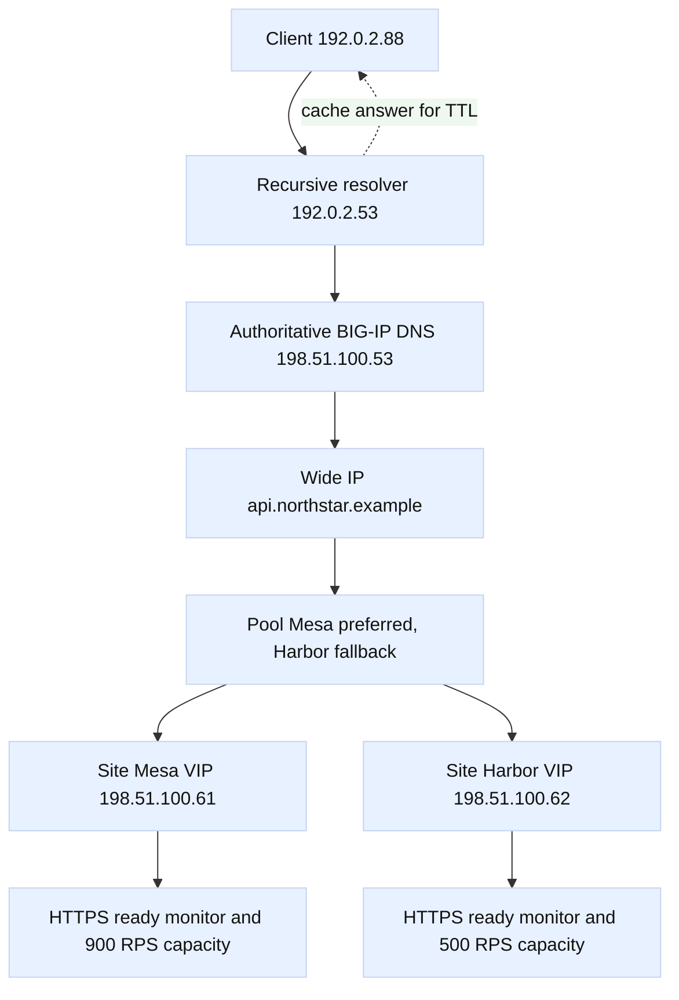

# Case study 2: GTM multi-site failover

## Context and goals

Fictional company Northstar Labs runs `api.northstar.example` in two sites:
`Mesa` and `Harbor`. BIG-IP DNS, historically called GTM, answers DNS for the
service. Mesa has virtual server `198.51.100.61` with a sustainable capacity of
900 requests per second; Harbor has `198.51.100.62` with capacity of 500
requests per second. Client and resolver addresses use documentation ranges
`192.0.2.0/24` and `2001:db8:100::/48`. The site names, addresses, and metrics
are fictional.

The goal was to survive a Mesa application failure while avoiding overload at
Harbor. The design uses Wide IP `api.northstar.example`, a topology-aware pool
with Mesa preferred and Harbor as fallback, HTTPS monitors, and a 30-second
authoritative TTL. The incident illustrates that BIG-IP DNS changes the DNS
answer; it does not move existing TCP connections, flush every recursive
cache, or create capacity at the surviving site.

**Observed** labels identify logs, DNS responses, monitor results, or measured
capacity. **Inferred** labels identify explanations. DNS terms follow
[RFC 1034](https://www.rfc-editor.org/rfc/rfc1034), [RFC 1035](https://www.rfc-editor.org/rfc/rfc1035),
and negative caching behavior follows [RFC 2308](https://www.rfc-editor.org/rfc/rfc2308).
The BIG-IP DNS concepts use F5's [Wide IP documentation](https://techdocs.f5.com/en-us/bigip-17-1-0/big-ip-dns-load-balancing-configuration-17-1-0/wide-ips.html)
and [DNS pools and members](https://techdocs.f5.com/en-us/bigip-17-1-0/big-ip-dns-load-balancing-configuration-17-1-0/dns-pools.html).

## Architecture

Authoritative BIG-IP DNS listeners at `198.51.100.53` and `198.51.100.54`
serve the Northstar zone. The Wide IP maps the hostname to a pool. The pool
contains site virtual servers, each associated with a data center and monitor.
The Mesa member is preferred for clients in the fictional southwest region;
Harbor is fallback. A monitor performs HTTPS `/ready` checks and expects a
specific status and response marker. A separate capacity guard removes a site
when its safe concurrency budget is reached.

Resolvers, not end users, usually query the authoritative service. A recursive
resolver caches an answer for the TTL and then returns that cached address to
many clients. Thus failover is a sequence of cache expirations, fresh queries,
new answers, TCP connection attempts, and application retries. Existing
connections to Mesa remain Mesa connections until they fail or close.

The state model is `Available`, `Degraded`, or `Unavailable` per site. A
successful monitor and capacity below the guard keep a member Available.
Repeated monitor failures move it to Unavailable after the configured quorum;
recovery requires consecutive successes. The Wide IP then selects Harbor for
new eligible queries. This is policy evaluation at query time, not a routing
protocol convergence event. Resolver geography can be imperfect because a
resolver's source location may differ from the end user's location.

## Timeline

At 2026-08-30 14:00 UTC, both sites were Available. **Observed:** Mesa served
about 410 requests per second, Harbor 120, and DNS answers favored Mesa.
**Observed:** the authoritative TTL was 30 seconds; test resolver caches showed
remaining TTLs from 0 to 29 seconds.

At 14:17, **Observed:** a Mesa dependency deployment caused `/ready` to return
503 from both Mesa members. At 14:18, the BIG-IP DNS monitor marked Mesa
Degraded, then Unavailable after the configured consecutive failures.
**Inferred:** the dependency failure made Mesa unsafe for new traffic, but the
monitor alone did not prove every existing request was broken.

At 14:19, **Observed:** fresh queries at the authoritative service returned
Harbor. Some recursive resolvers continued returning Mesa until their cached
TTL reached zero. At 14:20, **Observed:** Harbor rose to 390 requests per
second and latency crossed the warning threshold.

At 14:21, **Observed:** several resolvers still returned Mesa and clients saw
connection resets. At 14:22, the capacity guard removed Harbor from ordinary
selection because projected demand exceeded 500 requests per second. This
prevented a total Harbor overload but left some resolvers with an answer that
could not represent live capacity.

At 14:24, the incident commander enabled a controlled emergency response:
Harbor accepted only a reduced API feature set and clients were told to retry
with jitter. **Observed:** Harbor stabilized near 470 requests per second.
At 14:28, Mesa `/ready` recovered for one check but failed the next; the state
remained Unavailable because recovery required consecutive successes.

At 14:36, **Observed:** Mesa passed the recovery threshold and Harbor demand
fell as new resolver queries received Mesa again. At 14:45, error rate and
latency returned to baseline. At 15:00, the team held the change and collected
resolver, monitor, pool, and capacity evidence before closing the incident.

## Evidence

**Observed:** authoritative DNS query logs show Mesa answers before 14:18 and
Harbor answers after Mesa became Unavailable. **Observed:** recursive resolver
logs show cached Mesa answers with nonzero remaining TTL after the authoritative
answer changed. **Observed:** client telemetry records resets for connections
whose destination remained Mesa.

**Observed:** Mesa HTTPS monitor responses were 503; Harbor responses had the
expected status and marker. **Observed:** Harbor request rate peaked at 490
requests per second before the guard acted. The capacity number is measured
against the scenario's stated safe budget, not a universal BIG-IP limit.

**Observed:** existing client TCP sessions did not change destination when the
Wide IP changed. **Inferred:** users experienced a mixed population because
resolver caches, connection lifetimes, and retry timing differed. **Observed:**
after Mesa recovered, fresh answers and new connections gradually redistributed
traffic; no mechanism forcibly migrated established sockets.

The evidence set included authoritative query logs, resolver timestamps,
monitor response bodies, pool state transitions, per-site request rates,
latency, reset counts, and redacted client traces. RFC 1034 and RFC 1035
describe delegation, authoritative answers, and caching; RFC 2308 explains why
negative and stale-looking DNS observations require careful TTL interpretation.
The F5 references establish Wide IP, pool, and monitor terminology. Local
policy and capacity conclusions remain scenario-specific inferences.

## Competing hypotheses

One hypothesis was that BIG-IP DNS failed to update the Wide IP. Authoritative
logs and direct queries contradicted it: the policy returned Harbor promptly.

A second was that DNS TTL promised all clients would switch in 30 seconds. The
resolver observations contradicted that simplistic claim: clients behind
different caches saw different remaining TTLs, and established connections did
not re-resolve.

A third was that Harbor lacked capacity. Its measured rate near 490 of 500 and
the guard action supported a real capacity risk, but it did not explain the
original Mesa readiness failures.

A fourth was a bad monitor. Harbor's successful status and marker, plus Mesa's
correlation with the dependency deployment, made monitor malfunction unlikely.
A fifth was geographic steering error. Resolver source regions may contribute
to selection differences, but the direct cause of mixed traffic was cache and
connection state, not proof of a broken topology map.

## Decision points

The team selected health-based fallback over unconditional round-robin. This
can keep an unhealthy site from receiving new answers, but it cannot repair
already cached answers. They chose a 30-second TTL to limit normal failover
staleness while accepting higher query volume; a shorter TTL would not erase
existing connections and could increase authoritative load.

The capacity guard was retained even though it caused a difficult partial
service state. Sending unlimited traffic to Harbor would have produced a
larger outage. The incident commander preferred an explicit reduced feature
mode and jittered retries to uncontrolled retry storms. These are engineering
inferences for this fictional service, not universal F5 recommendations.

## Remediation

Northstar fixed the Mesa dependency and made `/ready` represent end-to-end
application readiness, not merely a listening socket. The monitor now checks a
versioned response marker and records latency. Monitor quorum and recovery
thresholds are documented with owners. Pool members carry explicit data-center
and capacity metadata so a topology policy can be reviewed as a table.

The service added client retry budgets, exponential backoff with jitter, and a
cached-answer diagnostic header at the application edge. Capacity planning
requires Harbor to sustain the maximum plausible Mesa loss with safety margin,
or requires a documented degraded mode. Resolver tests now query from several
fictional regions and record both answer and remaining TTL.

## Verification

In a safe test environment, the team failed Mesa monitors and confirmed that
new authoritative queries selected Harbor. They queried through recursive
resolvers and waited through the advertised TTL, recording that convergence is
distributed rather than instantaneous. They opened a long-lived connection to
Mesa, failed Mesa, and confirmed that the socket remained an old destination
until application timeout; a new connection followed the new DNS answer.

They generated controlled load below Harbor's safe budget, then tested the
capacity guard and reduced mode. **Observed:** Harbor did not exceed its guard,
monitor state transitions were repeatable, and recovery required consecutive
healthy checks. **Observed:** DNS query logs, pool decisions, and client
telemetry agreed. **Inferred:** the failover policy behaved as designed under
the tested failure, while a real regional event would still require capacity
and resolver diversity review.

## Rollback or recovery

If the monitor falsely removed Mesa, operators would first compare monitor
requests with independent synthetic checks and application logs. They would
not simply mark every member available. If Harbor approached capacity, they
would keep Mesa out until its readiness was trustworthy, enable the documented
degraded mode, and slow retries. A policy rollback would restore the previous
Wide IP pool only after recording its health assumptions.

During recovery, Mesa would return after consecutive good checks and a canary
query. The team would watch Harbor rate, Mesa rate, resolver answer mix, error
rate, and latency for at least several TTL intervals. If DNS service itself
failed, the last cached answers might persist at recursive resolvers; this is a
reason to maintain authoritative redundancy and an application-level recovery
plan, not a reason to claim DNS can instantly redirect all traffic.

## Postmortem lessons

The key lesson is that a Wide IP controls answers, while recursive resolvers,
caches, clients, and connections control when those answers matter. “The GTM
failed over” is incomplete unless it says whether the observation came from an
authoritative query, a recursive cache, or a new application connection.

The second lesson is capacity: a healthy fallback that cannot absorb demand is
not a complete failover design. Monitors should express service readiness, and
capacity guards should be treated as state transitions with a deliberate
degraded mode. The third lesson is attribution. RFC facts about DNS do not
prove a local steering or monitor cause; measured logs must establish that
link. The runbook now includes Wide IP, pool, monitor, TTL, resolver location,
connection age, retry, and capacity fields for every incident.

## Decision matrix

| Signal | Observed result | Operational meaning |
| --- | --- | --- |
| Mesa monitor | Failing readiness check | Remove Mesa from eligible pool |
| Resolver TTL | Mixed remaining values | Migration is staggered |

## Questions and answers

1. **What is a Wide IP?** It is the BIG-IP DNS policy object representing a
   hostname and selecting an answer from one or more DNS pools.

Interview reasoning: Separate DNS decision time from application connection time. BIG-IP DNS/GTM evaluates Wide IP pools, topology or other methods, server/virtual-server health, and sometimes limits before returning an address; recursive caches may continue serving that answer until TTL expiry. Diagnose authoritative and recursive views, monitor state, topology data, TTL, and the resulting LTM path. The caveat is that DNS steering cannot revoke already cached answers or guarantee data consistency during a site failover.

2. **What is a pool in this case?** It is the set of site virtual-server
   candidates, with health, topology, preference, and capacity rules.

Interview reasoning: Separate DNS decision time from application connection time. BIG-IP DNS/GTM evaluates Wide IP pools, topology or other methods, server/virtual-server health, and sometimes limits before returning an address; recursive caches may continue serving that answer until TTL expiry. Diagnose authoritative and recursive views, monitor state, topology data, TTL, and the resulting LTM path. The caveat is that DNS steering cannot revoke already cached answers or guarantee data consistency during a site failover.

3. **Does a monitor move existing connections?** No. It influences new DNS
   answers; existing TCP sessions retain their original destination.

Interview reasoning: Separate DNS decision time from application connection time. BIG-IP DNS/GTM evaluates Wide IP pools, topology or other methods, server/virtual-server health, and sometimes limits before returning an address; recursive caches may continue serving that answer until TTL expiry. Diagnose authoritative and recursive views, monitor state, topology data, TTL, and the resulting LTM path. The caveat is that DNS steering cannot revoke already cached answers or guarantee data consistency during a site failover.

4. **Why did some users still reach Mesa?** Their recursive resolver or client
   held a cached Mesa answer, or an existing connection had not closed.

Interview reasoning: Separate DNS decision time from application connection time. BIG-IP DNS/GTM evaluates Wide IP pools, topology or other methods, server/virtual-server health, and sometimes limits before returning an address; recursive caches may continue serving that answer until TTL expiry. Diagnose authoritative and recursive views, monitor state, topology data, TTL, and the resulting LTM path. The caveat is that DNS steering cannot revoke already cached answers or guarantee data consistency during a site failover.

5. **Does a 30-second TTL guarantee 30-second failover?** No. It bounds normal
   cache freshness under compliant behavior but does not synchronize clients or
   move established sockets.

Interview reasoning: Separate DNS decision time from application connection time. BIG-IP DNS/GTM evaluates Wide IP pools, topology or other methods, server/virtual-server health, and sometimes limits before returning an address; recursive caches may continue serving that answer until TTL expiry. Diagnose authoritative and recursive views, monitor state, topology data, TTL, and the resulting LTM path. The caveat is that DNS steering cannot revoke already cached answers or guarantee data consistency during a site failover.

6. **Why can a resolver's geography be misleading?** The resolver may be far
   from the end user, so topology based on resolver source is an approximation.

Interview reasoning: Separate DNS decision time from application connection time. BIG-IP DNS/GTM evaluates Wide IP pools, topology or other methods, server/virtual-server health, and sometimes limits before returning an address; recursive caches may continue serving that answer until TTL expiry. Diagnose authoritative and recursive views, monitor state, topology data, TTL, and the resulting LTM path. The caveat is that DNS steering cannot revoke already cached answers or guarantee data consistency during a site failover.

7. **Why use an HTTPS monitor instead of ping?** Application readiness can fail
   while an IP stack answers ping; the monitor should test the service promise.

Interview reasoning: Separate DNS decision time from application connection time. BIG-IP DNS/GTM evaluates Wide IP pools, topology or other methods, server/virtual-server health, and sometimes limits before returning an address; recursive caches may continue serving that answer until TTL expiry. Diagnose authoritative and recursive views, monitor state, topology data, TTL, and the resulting LTM path. The caveat is that DNS steering cannot revoke already cached answers or guarantee data consistency during a site failover.

8. **Why remove Harbor at its capacity guard?** Sending more traffic would
   violate its safe budget and could turn partial failure into total failure.

Interview reasoning: Separate DNS decision time from application connection time. BIG-IP DNS/GTM evaluates Wide IP pools, topology or other methods, server/virtual-server health, and sometimes limits before returning an address; recursive caches may continue serving that answer until TTL expiry. Diagnose authoritative and recursive views, monitor state, topology data, TTL, and the resulting LTM path. The caveat is that DNS steering cannot revoke already cached answers or guarantee data consistency during a site failover.

9. **What is the difference between Degraded and Unavailable?** Degraded means
   evidence is concerning but policy may still allow controlled use; Unavailable
   means selection excludes the site under the configured state machine.

Interview reasoning: Separate DNS decision time from application connection time. BIG-IP DNS/GTM evaluates Wide IP pools, topology or other methods, server/virtual-server health, and sometimes limits before returning an address; recursive caches may continue serving that answer until TTL expiry. Diagnose authoritative and recursive views, monitor state, topology data, TTL, and the resulting LTM path. The caveat is that DNS steering cannot revoke already cached answers or guarantee data consistency during a site failover.

10. **What proves the Wide IP worked?** Authoritative query logs showing the
    expected answer after Mesa became unavailable; client success alone cannot
    separate DNS from cache or retry behavior.

Interview reasoning: Separate DNS decision time from application connection time. BIG-IP DNS/GTM evaluates Wide IP pools, topology or other methods, server/virtual-server health, and sometimes limits before returning an address; recursive caches may continue serving that answer until TTL expiry. Diagnose authoritative and recursive views, monitor state, topology data, TTL, and the resulting LTM path. The caveat is that DNS steering cannot revoke already cached answers or guarantee data consistency during a site failover.

11. **Why require consecutive recovery checks?** One successful probe can be a
    transient; consecutive checks reduce flapping at the cost of slower return.

Interview reasoning: Separate DNS decision time from application connection time. BIG-IP DNS/GTM evaluates Wide IP pools, topology or other methods, server/virtual-server health, and sometimes limits before returning an address; recursive caches may continue serving that answer until TTL expiry. Diagnose authoritative and recursive views, monitor state, topology data, TTL, and the resulting LTM path. The caveat is that DNS steering cannot revoke already cached answers or guarantee data consistency during a site failover.

12. **What is the biggest capacity lesson?** Failover capacity must be planned
    for the demand surge, retries, and safety margin, not only nominal traffic.

Interview reasoning: Separate DNS decision time from application connection time. BIG-IP DNS/GTM evaluates Wide IP pools, topology or other methods, server/virtual-server health, and sometimes limits before returning an address; recursive caches may continue serving that answer until TTL expiry. Diagnose authoritative and recursive views, monitor state, topology data, TTL, and the resulting LTM path. The caveat is that DNS steering cannot revoke already cached answers or guarantee data consistency during a site failover.
