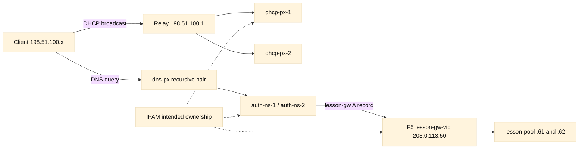
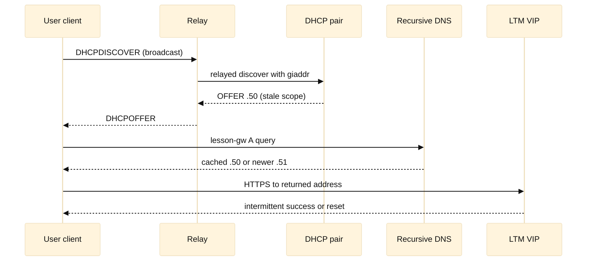

# Case study 3: The address that belonged to two services

## Context and goals

This fictional incident concerns Northstar Learning, a training platform whose regional service is called `lesson-gw`. The names and documentation addresses in this case are invented; the IPv4 space is from RFC 5737 and is not routable. The goal is to show how IPAM, DHCP, DNS, and relay behavior form one DDI system even when different teams own each component. It is a learning narrative, not a production runbook.

Northstar operates a small Phoenix campus and a Denver disaster-recovery site. The campus user VLAN is `198.51.100.0/24`, the application VLAN is `203.0.113.0/24`, and the management VLAN is `192.0.2.0/24`. The IPAM database is the intended source for allocations. Two DHCP servers, `dhcp-px-1` and `dhcp-px-2`, serve the user VLAN through an anycast relay pair. Recursive DNS servers `dns-px-1` and `dns-px-2` answer clients, while authoritative DNS is hosted on `auth-ns-1` and `auth-ns-2`. The fictitious F5 BIG-IP LTM virtual server `lesson-gw-vip` is `203.0.113.50`.

The immediate goal was to restore reliable logins after clients reported intermittent failures. The safety goals were to preserve leases, avoid changing a healthy application pool, establish which system owned each address, and document enough evidence that the same drift could be detected before an outage. A secondary goal was to separate what operators observed from what they inferred: a duplicated address can explain symptoms, but it is not proof until ARP, lease, and DNS evidence agree.

The DDI contract was simple on paper. IPAM reserved `.50` for the VIP, DHCP excluded the application subnet, DNS published `lesson-gw.learn.example` as an A record, and the LTM listener accepted HTTPS. In practice, a spreadsheet export had been imported into an old DHCP scope during a site move. An engineer then manually added `.50` to a temporary test scope, while an automation job changed the DNS record to `.51` without recording the IPAM ticket. No single system showed the complete contradiction.

## Architecture

Clients use DHCP on `198.51.100.0/24`; a relay inserts the gateway address in `giaddr` and forwards broadcasts to both DHCP servers. The servers share a failover relationship. The client resolver points to the recursive pair. Recursive servers follow the authoritative delegation and cache the `lesson-gw` answer for its TTL. The LTM listener owns `.50` and uses a monitor against `lesson-pool` members `.61` and `.62`.

The critical control-plane boundaries are the relay and the lease database. A relay misconfiguration can make a valid DHCP server appear silent, or can send one VLAN to the wrong scope. A lease database can say an address is active while IPAM says it is reserved. DNS adds another time dimension: caches can continue returning an old address after the authoritative record changes. ARP then resolves the address to a MAC locally, so a client may reach whichever machine answered last.

## Timeline

All times are fictional Phoenix local time (UTC-07:00).

| Time | [Observed] event | [Inferred] significance |
| --- | --- | --- |
| 08:40 | IPAM reserved `.50`; DHCP export included `.50` | Ownership drift existed before the outage |
| 09:18 | Two ACKs offered `.50` to different clients | Duplicate allocation was possible |
| 09:26 | Two MAC addresses answered ARP for `.50` | Collision was active on the VLAN |
| 10:05 | Temporary scope disabled; new leases moved to `.74` | New conflicts stopped, old leases remained |
| 10:32 | DNS and ARP converged on `.50` and one MAC | Recovery controls were taking effect |

At 08:40 on 2026-08-17, [Observed] IPAM showed `203.0.113.50` as “reserved—LTM VIP,” while DHCP scope export showed `.50` inside a temporary test range. [Inferred] the records had diverged during the site move, but the import timestamp did not identify the first bad edit.

At 09:02, [Observed] the service desk received 14 reports of login timeouts. Existing sessions remained healthy. [Inferred] the failure affected new connections or clients receiving a changed resolver/lease state rather than the application pool itself.

At 09:11, [Observed] `dig` against `dns-px-1` returned `203.0.113.50` with TTL 300; a query against `dns-px-2` returned `203.0.113.51` with TTL 60. [Inferred] recursive caches were not sharing the same authoritative view, or the record had recently changed.

At 09:18, [Observed] two DHCP ACK logs contained the same address `.50`, one with client identifier `laptop-044` and one with `test-vm-07`, across scopes using the same relay `giaddr`. [Inferred] duplicate allocation was possible; the log alone did not prove both machines were online.

At 09:26, [Observed] an ARP sweep saw `.50` alternate between MAC `02:00:5e:10:00:44` and `02:00:5e:10:00:77`. [Inferred] at least two responders claimed the address, making duplicate use the leading hypothesis.

At 09:34, [Observed] LTM logs showed healthy pool monitors and no increase in server-side failures. [Inferred] changing application members would add risk without addressing the collision.

At 09:45, [Observed] relay counters showed requests for the application VLAN arriving on the temporary test interface. [Inferred] a relay or VLAN mapping error made the wrong DHCP scope eligible.

At 10:05, [Observed] operators disabled the temporary scope and quarantined `test-vm-07`; new clients received `.74`, while already leased clients still held `.50`. [Inferred] recovery would require lease expiry or a controlled release/renew, not merely a DNS edit.

At 10:32, [Observed] authoritative DNS was set to `.50`, recursive caches were flushed according to the normal change procedure, and ARP showed one stable virtual MAC. At 11:10, [Observed] login success returned to baseline.

## Evidence

[Observed] evidence included timestamped DHCP DISCOVER/OFFER/REQUEST/ACK records, relay `giaddr` values, scope membership exports, IPAM audit history, authoritative and recursive DNS answers, packet captures of ARP requests/replies, switch MAC tables, LTM monitor status, and client-side route and resolver settings. Each artifact was copied into an incident folder with a hash and a clock source. [RFC 2131](https://www.rfc-editor.org/rfc/rfc2131) describes DHCP message exchange and relay fields; [RFC 2132](https://www.rfc-editor.org/rfc/rfc2132) documents options such as router and DNS server; [RFC 826](https://www.rfc-editor.org/rfc/rfc826) describes ARP; [RFC 1034](https://www.rfc-editor.org/rfc/rfc1034) and [RFC 1035](https://www.rfc-editor.org/rfc/rfc1035) define DNS operation and message behavior.

The strongest correlation was temporal: duplicate DHCP ACKs preceded the first client errors, and two MAC addresses answered for `.50` during the outage. [Observed] the VIP itself accepted connections when addressed from a controlled test host after the test VM was isolated. [Inferred] traffic failures came from local address contention, not a failed listener. That inference remains bounded because a packet capture did not prove every failed client reached the wrong MAC.

[Observed] authoritative DNS serial was newer than one recursive cache's answer. [Inferred] stale cache explains why some clients used `.51`, but it does not explain two MACs for `.50`. This distinction prevented the team from treating TTL reduction as a complete fix.

## Competing hypotheses

The first hypothesis was an LTM pool failure. It predicted monitor failures, server resets, or a rising ratio of 5xx responses. Those observations were absent, so it was downgraded.

The second was a DNS-only error caused by mismatched authoritative data. It explained `.50` versus `.51` answers and client divergence, but not duplicate DHCP ACKs or alternating ARP owners. It became a contributing condition, not the primary cause.

The third was a relay-to-scope mapping error. It predicted clients on the application VLAN would receive leases from the temporary scope. Relay counters and `giaddr` evidence supported it.

The fourth was a manually configured test VM colliding with a reserved VIP. ARP evidence and the VM inventory supported this as the immediate collision. The most complete explanation was therefore layered: stale IPAM/DHCP ownership enabled the collision, relay mapping selected the wrong scope, and DNS inconsistency widened the visible blast radius.

## Decision points

The incident commander chose isolation over changing the VIP because preserving a stable production endpoint reduced DNS and client-cache effects. The team also chose to stop the temporary DHCP scope rather than delete leases: deletion would have removed useful forensic evidence and could strand clients. A short-term DNS correction was approved only after authoritative ownership was confirmed in IPAM.

The main trade-off was service continuity versus lease cleanliness. Forcing every client to renew would be faster for some users but could overload DHCP and disrupt unrelated devices. The team used a staged renewal for the affected VLAN, watched ACK rates, and left unaffected VLANs alone. This is an engineering inference based on blast-radius reduction, not a universal policy.

## Remediation

Operators removed `.50` from every DHCP pool, added an explicit application-subnet exclusion, and corrected relay interfaces so the application VLAN could not select the temporary scope. They reconciled IPAM, authoritative DNS, and the LTM object in one approved change. The DNS record was set to the intended `.50`; `.51` was retired only after its owner was verified. The test VM received a new address and was blocked from static addressing by its image policy.

Longer-term work added a nightly comparison of IPAM reservations, DHCP leases, DNS A records, and LTM virtual addresses. A mismatch creates a ticket and a warning rather than automatically rewriting records. DHCP failover health, relay `giaddr`, and duplicate-address detection became dashboard panels. The team also documented who approves a reservation, who can edit a lease scope, and which audit event links those actions.

## Verification

Verification used a clean client, an existing leased client, and a controlled test VM. Each obtained a lease from the expected scope; [Observed] the ACK included the correct router and recursive DNS options. Repeated `dig` queries to both recursive servers agreed on `.50` after cache convergence. [Observed] an ARP probe returned one stable virtual MAC, and a switch table showed no unexpected source for the address.

LTM monitor status remained green, and synthetic HTTPS requests succeeded from both campus and Denver test subnets. DHCP logs showed unique client identifiers and no `.50` offers. The comparison job reported zero ownership mismatches. Verification was repeated after the 300-second DNS TTL and after one lease renewal interval, because immediate success could merely reflect warm caches.

## Rollback or recovery

If the DNS correction caused unexpected impact, the recoverable action was to restore the previous authoritative record from its versioned zone change and let the documented TTL expire; no secret or production credential was involved. If clients still held bad leases, support could renew only the affected VLAN after confirming DHCP capacity. If the VIP became unstable, traffic could be drained from the listener while the healthy application pool remained unchanged.

Recovery evidence had to include the IPAM export, DHCP scope version, DNS serial, relay configuration checksum, and ARP/MAC observations. The team explicitly avoided deleting historical leases or disabling both DHCP peers. Those actions would reduce recoverability and could create a second outage.

## Postmortem lessons

DDI is a consistency problem, not three unrelated tools. IPAM expresses intent, DHCP grants temporary identity, and DNS publishes reachability; relay and cache behavior determine when that intent becomes visible. A reservation that exists only in IPAM is not an exclusion in DHCP. A corrected authoritative record is not an instant cache flush everywhere. An LTM health monitor cannot detect a duplicate address on the client VLAN.

The most useful operational improvement was adding observed/inferred labels to incident notes. It made the team test the ARP claim instead of repeating it as fact. Other lessons were to make relay scope selection auditable, treat manual test ranges as production-impacting, and include time-to-live and lease duration in change plans. [RFC 1918](https://www.rfc-editor.org/rfc/rfc1918) explains private space (not used here because documentation ranges make examples unambiguous); [RFC 5737](https://www.rfc-editor.org/rfc/rfc5737) defines documentation IPv4 blocks. F5 BIG-IP documentation on virtual servers and monitors should be consulted through the [F5 documentation portal](https://techdocs.f5.com/) for vendor-specific behavior, while protocol claims should be checked against the RFCs above.

## Evidence matrix

## Questions and answers

1. **Why did one VIP appear to fail intermittently?** Two devices answered ARP for the same address, so different flows could reach different MACs. The duplicate-owner conclusion is [Inferred] from [Observed] alternating ARP replies.
2. **What does a DHCP relay add?** It forwards client broadcasts as routed unicast and identifies the client network, commonly with `giaddr` (RFC 2131). A wrong value can select the wrong scope.
3. **Why did stopping the test scope help new clients first?** New DHCP negotiations stopped receiving the conflicting offer. Existing leases remained valid until renewal or release.
4. **Why was DNS not the whole outage?** DNS answers explained different destination addresses, but cannot by itself create two MAC owners for `.50`.
5. **What is IPAM’s role?** It records intended ownership, reservations, and lifecycle metadata. It does not automatically constrain every DHCP or DNS server unless integrated.
6. **Why keep the old lease logs?** They establish who was offered the address and when, supporting both diagnosis and safe rollback.
7. **What does a green LTM monitor prove?** It indicates the configured monitor reached pool members successfully; it does not prove DDI uniqueness or client-side routing.
8. **How does TTL affect recovery?** Recursive resolvers may retain an answer until TTL expiry, so different clients can legitimately observe different records during convergence (RFC 1034/1035).
9. **Why stage renewals?** Staging limits DHCP load and avoids disrupting unrelated clients; it is an engineering choice tied to blast radius.
10. **What check best prevents recurrence?** A scheduled, read-only comparison of IPAM, DHCP, DNS, relay, and LTM ownership creates early evidence without making an unsafe automatic change.
11. **Why use documentation addresses?** RFC 5737 blocks prevent examples from being mistaken for reachable customer infrastructure.
12. **What should an engineer label as inferred?** Causal claims such as “the relay caused the outage” should remain inferred until packet, configuration, and timing evidence support them.
