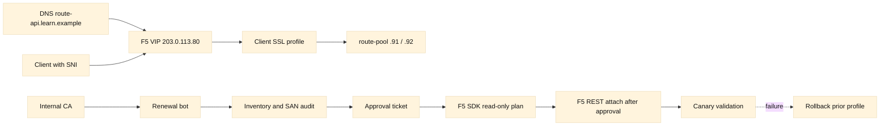
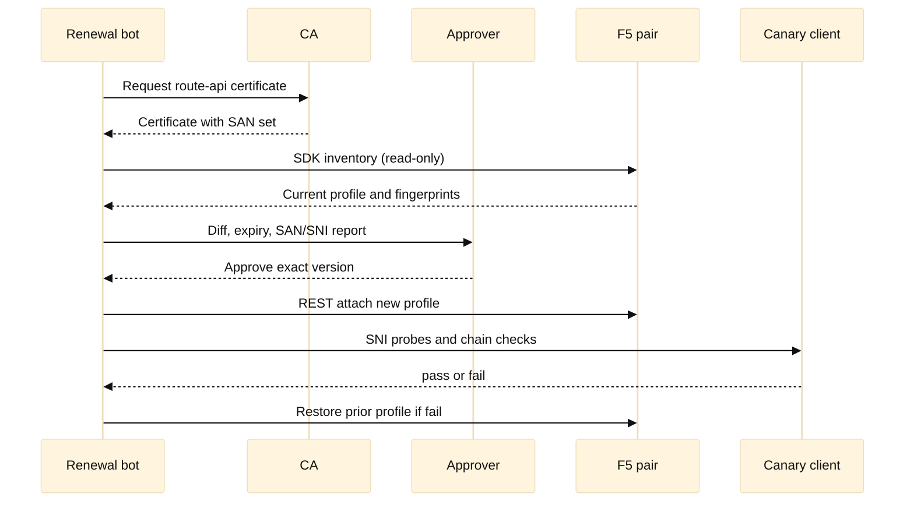

# Case study 4: A renewal pipeline that learned to pause

## Context and goals

This fictional case follows Meridian Maps, whose public service is `route-api.learn.example`. Its edge is a pair of F5 BIG-IP LTM appliances named `ltm-phx-a` and `ltm-phx-b`; the names, domains, and addresses are fictional, and all addresses use RFC 5737 documentation space. The service presents certificates for `route-api.learn.example` and `tiles.learn.example` on a shared HTTPS virtual server at `203.0.113.80`. The goal is to renew certificates automatically while keeping SAN coverage, SNI selection, approval, and rollback safe.

The existing process had three disconnected inventories: a spreadsheet owned by security, certificate objects on the F5 pair, and DNS names in an application catalog. A renewal bot used an F5 SDK wrapper to upload a certificate and key, then used REST to attach the resulting client-SSL profile. It could not distinguish a harmless certificate-object upload from an unsafe profile change. Approvals were recorded in a ticket, but the bot checked only that a ticket number existed.

The change objective was to remove expiring certificates before the 30-day warning window, preserve private-key handling, and prove that the selected certificate matched every required SAN and SNI hostname. Safety objectives were read-only discovery first, explicit human approval for attachment, a limited canary, and a tested rollback. The narrative separates [Observed] measurements from [Inferred] causes and cites primary standards or vendor documentation rather than claiming all F5 behavior is universal.

## Architecture

DNS points `route-api.learn.example` to the virtual server. Clients negotiate TLS with SNI; the LTM client-SSL profile selects a certificate chain and policy, then the HTTP request is sent to a pool. The renewal service obtains a certificate from a fictional internal ACME-compatible CA, stores it in a vault, and creates a change proposal containing fingerprint, issuer, validity, SANs, and target profile. The pipeline uses an F5 Python SDK for inventory and an authenticated REST call only after approval. No credential values appear in this case.

Certificate identity comes from the Subject Alternative Name extension (RFC 5280); modern clients generally verify the requested DNS name against SAN rather than relying on the common name. SNI is specified by RFC 6066. TLS 1.3 behavior is defined by RFC 8446. The F5 BIG-IP REST API and Python SDK are vendor interfaces whose exact endpoints and object fields vary by TMOS release; the examples therefore describe intent and validation rather than a copy-paste production command.

## Timeline

Times are fictional Phoenix local time (UTC-07:00).

| Time | [Observed] event | Decision or implication |
| --- | --- | --- |
| 07:30 | Inventory showed 19 days to expiry and SAN count mismatch | Renewal required parser and ownership review |
| 08:22 | Decoded certificate had all 11 SANs; parser had reported none | Pause automation and fix evidence collection |
| 10:14 | Canary SNI probes passed; one trust store rejected chain | Correct intermediate before promotion |
| 10:51 | Corrected canary passed | Production attachment became eligible |
| 11:30 | Both production devices and probes passed | Retain old object for rollback window |

At 07:30 on 2026-08-24, [Observed] inventory reported `route-api` expiring in 19 days. The spreadsheet said 11 SANs, while the F5 certificate object showed 10. [Inferred] one name had been added to DNS without a corresponding certificate update.

At 08:05, [Observed] the bot requested a replacement containing `route-api.learn.example`, `tiles.learn.example`, and nine documented aliases. The CA issued it with a new serial and SHA-256 fingerprint. [Observed] an inventory parser initially reported no SANs because it read the common-name field only. [Inferred] parser behavior, not certificate content, caused the apparent omission.

At 08:22, [Observed] a human reviewed the decoded certificate and found all 11 SANs, a 90-day validity period, and the expected intermediate. Approval was denied pending parser correction. This pause prevented an incomplete attachment.

At 09:10, [Observed] the corrected parser produced a set comparison: certificate SANs equaled the application catalog, while DNS contained one additional `legacy-route` alias. [Inferred] the alias was either stale or a real compatibility dependency; it could not be removed during renewal.

At 09:42, [Observed] the bot used the F5 SDK to read both devices. Their active profiles had the same old fingerprint, but the standby contained an unused certificate object from a prior failed renewal. [Inferred] object inventory alone was insufficient; profile attachment and sync state mattered.

At 10:00, [Observed] the approval ticket named the exact fingerprint, profile, two-device scope, canary host, and rollback profile. The approver authorized attachment only, not deletion of the old object.

At 10:14, [Observed] REST attached the new profile to the canary virtual server `route-api-canary` on `ltm-phx-a`. SNI probes for every SAN succeeded, while a no-SNI probe returned the documented default certificate. [Inferred] the canary covered certificate selection but not every client library.

At 10:28, [Observed] one synthetic client rejected the chain because its trust store lacked the new intermediate. The public browser probe passed. The rollout paused, and the intermediate bundle was corrected in the profile.

At 10:51, [Observed] the corrected canary passed chain, hostname, expiry, protocol, and HTTP checks. At 11:05, [Observed] the profile was attached to the production VIP on both devices through the normal sync mechanism.

At 11:30, [Observed] all probes passed. The old certificate object remained for the rollback window. At 2026-08-31 11:30, after seven days of clean metrics, [Observed] a separate approved cleanup removed only the unreferenced obsolete object.

## Evidence

Evidence consisted of the CA issuance record, DER certificate hash, `openssl`-style decoded SAN and validity output from a controlled workstation, application catalog export, DNS names, SDK read-only inventory, F5 profile references, device sync status, approval ticket, and before/after TLS probe results. [Observed] fingerprints matched the approved artifact at every stage. [Observed] the profile referenced the new certificate and complete chain after the final attachment.

The standards basis is [RFC 5280](https://www.rfc-editor.org/rfc/rfc5280) for X.509 certificate and SAN concepts, [RFC 6066](https://www.rfc-editor.org/rfc/rfc6066) for SNI, [RFC 8446](https://www.rfc-editor.org/rfc/rfc8446) for TLS 1.3, and [RFC 6125](https://www.rfc-editor.org/rfc/rfc6125) for service identity verification. F5’s [BIG-IP iControl REST reference](https://clouddocs.f5.com/api/icontrol-rest/) and [f5-common-python SDK](https://github.com/F5Networks/f5-common-python) are the primary vendor references for endpoint and object semantics. The case does not infer that every TMOS version treats sync, partitions, or profile replacement identically; those behaviors require release-specific verification.

## Competing hypotheses

One hypothesis was that the CA issued an incomplete certificate. Decoding the DER artifact disproved it: [Observed] all expected SANs were present. A second was that DNS had propagated incorrectly. DNS answers were stable; the discrepancy was a stale alias in the catalog, not propagation.

A third hypothesis was that SNI routing selected the wrong profile. The no-SNI default behavior was expected, and each named SNI probe selected the approved fingerprint. It was downgraded after canary evidence. A fourth was an incomplete chain, supported by the synthetic client's trust failure. The corrected intermediate bundle fixed that symptom.

A fifth was an unsafe automation authorization. The bot could have attached any ticketed artifact, but the exact fingerprint and approval diff constrained it. The remaining risk was inferred from the bot's ability to call REST, so the team retained a policy gate and rate limit.

## Decision points

The team chose SAN set equality as a release gate because common-name-only parsing had already failed. It chose a canary virtual server rather than directly changing the production VIP, accepting a small amount of duplicated configuration to gain an observable checkpoint. It retained the prior profile and certificate object, trading storage for rapid rollback.

The approval scope deliberately excluded deletion, DNS changes, and key export. A certificate can be valid yet unsuitable because of wrong SANs, issuer, key usage, chain, or profile selection. The team treated an approval as authorization for a specific fingerprint and target, not a general instruction to “renew certificates.”

## Remediation

The parser now reads SAN DNS names, issuer, serial, validity, key algorithm, and chain rather than common name alone. The pipeline compares certificate SANs with the catalog and DNS, classifying extra names as review items and missing names as a hard stop. It records both F5 object identity and profile attachment, because an uploaded object that is not referenced serves no traffic.

The change workflow is split into discover, propose, approve, canary, promote, verify, and retire. The F5 SDK is used for read-only inventory and structured diffs. REST attachment requires an allow-listed endpoint, exact fingerprint, active ticket, and two-person approval for production. Secrets remain in the runtime secret store and never enter logs.

The service now publishes expiry and chain metrics, performs daily SNI probes from two locations, and alerts at 30, 14, and 7 days. A failed canary automatically pauses rather than rolling forward. Automatic rollback is limited to restoring the previously approved profile reference; it does not delete objects or modify DNS.

## Verification

Verification checks the approved fingerprint, complete chain, SAN equality, and validity window on both F5 devices. Probes send each required SNI name and verify the returned certificate using a controlled trust store. They test TLS policy, an HTTP health endpoint, and a representative API request. [Observed] the canary and production results are stored with timestamps and the device identity.

The team also verifies negative cases: an unknown SNI must not silently claim a protected hostname, an expired old profile must not remain attached, and an unapproved fingerprint must fail the policy gate. Device sync state is checked after attachment, and a second read-only SDK inventory confirms that active references, not merely object existence, changed.

## Rollback or recovery

Rollback is a versioned profile-reference change to the prior known-good certificate and chain. The bot records the old reference before making a change, and the approval ticket includes that value. If canary validation fails, the production profile is untouched. If production validation fails, the bot restores the old reference on the same scope, verifies sync, and reruns SNI probes.

If the new intermediate is rejected by a client, the recovery is to restore the prior chain or attach a corrected chain after a new approval; exporting keys or deleting certificates is not a recovery step. If a device is out of sync, operators isolate the affected device according to the vendor-supported procedure and stop promotion until inventory agrees. DNS is not changed during certificate rollback, avoiding a second independent cache problem.

## Postmortem lessons

Certificate automation is identity and change management, not just a timer around an API call. Inventory must connect names to SANs, SANs to profiles, profiles to virtual servers, and virtual servers to devices. SNI tests must exercise the names users send, not merely the default listener. A valid certificate can still break clients through a missing intermediate or unsupported algorithm.

The pause at the parser defect was the most valuable control. A fast bot with a wrong comparison would have made an approved-looking unsafe change. Read-only SDK discovery, exact-fingerprint approval, canary promotion, and reversible profile references create separable evidence. F5 documentation should be checked for the installed TMOS release; RFCs establish protocol identity but do not define vendor object synchronization.

## Change gates

## Questions and answers

1. **Why is SAN equality a gate?** Clients verify requested DNS identities against SAN (RFC 6125); a valid issuer alone does not prove hostname coverage.

Interview reasoning: Walk through the handshake fields and the trust decision rather than saying only that TLS encrypts traffic. Check the hostname/SNI, negotiated protocol and cipher, certificate validity interval, SAN, chain order, trust store, and—when applicable—the client certificate and mapped identity. A practical example is testing each proxy leg independently with an explicit SNI name. The caveat is that front-end certificate success says nothing about backend TLS, authorization, or application readiness.

2. **What does SNI change?** It lets a client identify the intended hostname during the TLS handshake (RFC 6066), enabling a listener to select among certificates or policies.

Interview reasoning: Walk through the handshake fields and the trust decision rather than saying only that TLS encrypts traffic. Check the hostname/SNI, negotiated protocol and cipher, certificate validity interval, SAN, chain order, trust store, and—when applicable—the client certificate and mapped identity. A practical example is testing each proxy leg independently with an explicit SNI name. The caveat is that front-end certificate success says nothing about backend TLS, authorization, or application readiness.

3. **Why keep the old certificate?** It makes rollback a profile-reference change and preserves a known-good artifact during the observation window.

Interview reasoning: Walk through the handshake fields and the trust decision rather than saying only that TLS encrypts traffic. Check the hostname/SNI, negotiated protocol and cipher, certificate validity interval, SAN, chain order, trust store, and—when applicable—the client certificate and mapped identity. A practical example is testing each proxy leg independently with an explicit SNI name. The caveat is that front-end certificate success says nothing about backend TLS, authorization, or application readiness.

4. **What did the F5 SDK do here?** It supplied structured, read-only inventory and diffs. The case avoids assuming SDK write semantics across TMOS versions.

Interview reasoning: Walk through the handshake fields and the trust decision rather than saying only that TLS encrypts traffic. Check the hostname/SNI, negotiated protocol and cipher, certificate validity interval, SAN, chain order, trust store, and—when applicable—the client certificate and mapped identity. A practical example is testing each proxy leg independently with an explicit SNI name. The caveat is that front-end certificate success says nothing about backend TLS, authorization, or application readiness.

5. **Why use REST at all?** The approved attachment operation was available through the vendor API, but it was constrained by endpoint, fingerprint, ticket, and scope gates.

Interview reasoning: Walk through the handshake fields and the trust decision rather than saying only that TLS encrypts traffic. Check the hostname/SNI, negotiated protocol and cipher, certificate validity interval, SAN, chain order, trust store, and—when applicable—the client certificate and mapped identity. A practical example is testing each proxy leg independently with an explicit SNI name. The caveat is that front-end certificate success says nothing about backend TLS, authorization, or application readiness.

6. **Why did one client fail while browsers passed?** Its trust store lacked the new intermediate; chain completeness is a client compatibility concern, not proof of a bad leaf certificate.

Interview reasoning: Walk through the handshake fields and the trust decision rather than saying only that TLS encrypts traffic. Check the hostname/SNI, negotiated protocol and cipher, certificate validity interval, SAN, chain order, trust store, and—when applicable—the client certificate and mapped identity. A practical example is testing each proxy leg independently with an explicit SNI name. The caveat is that front-end certificate success says nothing about backend TLS, authorization, or application readiness.

7. **What is a canary?** A limited target used to observe a change before broader promotion. Here it was a separate virtual server.

Interview reasoning: Walk through the handshake fields and the trust decision rather than saying only that TLS encrypts traffic. Check the hostname/SNI, negotiated protocol and cipher, certificate validity interval, SAN, chain order, trust store, and—when applicable—the client certificate and mapped identity. A practical example is testing each proxy leg independently with an explicit SNI name. The caveat is that front-end certificate success says nothing about backend TLS, authorization, or application readiness.

8. **Why test no-SNI behavior?** Legacy clients may omit SNI; the default certificate and policy must be intentional rather than accidental.

Interview reasoning: Walk through the handshake fields and the trust decision rather than saying only that TLS encrypts traffic. Check the hostname/SNI, negotiated protocol and cipher, certificate validity interval, SAN, chain order, trust store, and—when applicable—the client certificate and mapped identity. A practical example is testing each proxy leg independently with an explicit SNI name. The caveat is that front-end certificate success says nothing about backend TLS, authorization, or application readiness.

9. **Why not delete the old object immediately?** Deletion removes a rapid recovery option and can destroy useful evidence; retirement followed a separate approval.

Interview reasoning: Walk through the handshake fields and the trust decision rather than saying only that TLS encrypts traffic. Check the hostname/SNI, negotiated protocol and cipher, certificate validity interval, SAN, chain order, trust store, and—when applicable—the client certificate and mapped identity. A practical example is testing each proxy leg independently with an explicit SNI name. The caveat is that front-end certificate success says nothing about backend TLS, authorization, or application readiness.

10. **What should approval name?** Exact certificate fingerprint, profile, devices, canary, verification gates, and rollback reference—not merely a hostname.

Interview reasoning: Walk through the handshake fields and the trust decision rather than saying only that TLS encrypts traffic. Check the hostname/SNI, negotiated protocol and cipher, certificate validity interval, SAN, chain order, trust store, and—when applicable—the client certificate and mapped identity. A practical example is testing each proxy leg independently with an explicit SNI name. The caveat is that front-end certificate success says nothing about backend TLS, authorization, or application readiness.

11. **Does a green certificate probe prove the application works?** No. It proves selected TLS properties; HTTP, authorization, and backend checks are separate evidence.

Interview reasoning: Walk through the handshake fields and the trust decision rather than saying only that TLS encrypts traffic. Check the hostname/SNI, negotiated protocol and cipher, certificate validity interval, SAN, chain order, trust store, and—when applicable—the client certificate and mapped identity. A practical example is testing each proxy leg independently with an explicit SNI name. The caveat is that front-end certificate success says nothing about backend TLS, authorization, or application readiness.

12. **Which standards matter most?** RFC 5280 for certificate structure, RFC 6066 for SNI, RFC 8446 for TLS 1.3, and RFC 6125 for service identity.

Interview reasoning: Walk through the handshake fields and the trust decision rather than saying only that TLS encrypts traffic. Check the hostname/SNI, negotiated protocol and cipher, certificate validity interval, SAN, chain order, trust store, and—when applicable—the client certificate and mapped identity. A practical example is testing each proxy leg independently with an explicit SNI name. The caveat is that front-end certificate success says nothing about backend TLS, authorization, or application readiness.
