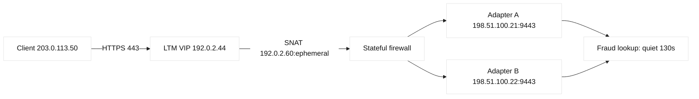
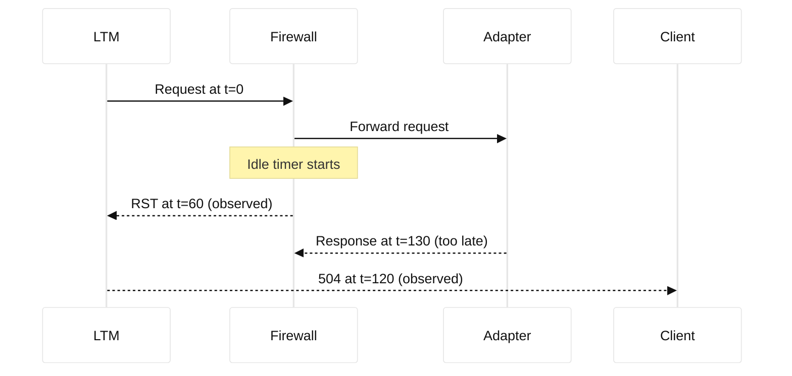

# Case study 05: Firewall TCP timeout

## Context and goals

At 09:10 UTC on 2026-03-18, the fictional Meridian Retail checkout API began returning intermittent 504 responses. Customers could load the storefront, but payment authorization stalled after about two minutes. The service was `pay-api.meridian.example`, a deliberately fictional name, and its public VIP was 192.0.2.44, from the documentation range. The goal was to restore predictable request completion while preserving the firewall's least-privilege policy and avoiding a speculative timeout increase. A second goal was to teach an SDE1 how to separate an application timeout from a TCP idle timeout and an SDE2 how to reason about stateful middleboxes.

The service used HTTPS from browsers to an F5 LTM virtual server. LTM connected to two payment adapters in 198.51.100.0/24. A stateful firewall sat between LTM and the adapters. The adapters streamed a fraud-review response only after a slow external lookup, so a quiet TCP connection was normal for some requests. The incident affected only review-heavy transactions; fast authorizations succeeded. No real network was contacted, and all names and addresses are reserved examples.

## Architecture

The client-to-VIP TCP tuple was `(203.0.113.50,random,192.0.2.44,443)`. The LTM-to-adapter tuple was `(192.0.2.60,random,198.51.100.21,9443)`. LTM terminated client TLS and originated a separate server TLS session. The firewall tracked the latter flow and applied a 60-second established-idle timer. The application server expected a response within 180 seconds and sent no keepalive during fraud review.

| Component | Address/port | Intended behavior | Observed concern |
|---|---|---|---|
| Client | 203.0.113.50:random | Wait for HTTPS response | Receives 504 at 120 s |
| LTM VIP | 192.0.2.44:443 | Proxy and TLS offload | Logs upstream reset |
| Firewall | policy `pay-review` | Permit TCP 9443 | Deletes idle state at 60 s |
| Adapter | 198.51.100.21:9443 | Reply after review | Sends response after 130 s |

## Timeline

At 08:55, a fraud-rule release increased the slow-review population from 3% to 18% (observed application metric). At 09:10, support reported checkout hangs. At 09:17, LTM access logs showed client requests with `upstream_time=120` and status 504. At 09:25, a packet capture on the LTM server-side VLAN showed SYN, SYN-ACK, ACK, request data, then no packets for 60 seconds, followed by a firewall-generated RST. At 09:33, the adapter team demonstrated that the review response was ready at 130 seconds. At 09:45, incident command froze unrelated deployments.

At 10:00, a controlled request using a reserved test client reproduced the failure only when the adapter delayed longer than 60 seconds. At 10:18, a temporary application heartbeat was enabled in a staging adapter; the connection survived. At 10:40, the team agreed to a narrowly scoped firewall idle-time change after validating capacity and change rollback. At 11:05, the timer was changed to 240 seconds for this policy. At 11:20, production probes passed. At 13:00, the fraud release was tuned to return an asynchronous review token, reducing dependence on long quiet connections.

## Evidence

The evidence matrix distinguishes direct observation from interpretation.

| Evidence | Source and result | Classification |
|---|---|---|
| 504 at 120 s | LTM request log | Fact |
| RST at 60 s | synchronized tcpdump timestamps | Fact |
| adapter response at 130 s | adapter trace ID `r-1842` | Fact |
| state deletion caused RST | firewall event `idle-expired` | Fact |
| slow fraud rule increased exposure | deployment comparison | Fact |
| firewall was sole cause of all 504s | Inference from correlated traces | Inference |

Commands used in the lab-like investigation were read-only: `tcpdump -ni 0.0 'host 198.51.100.21 and tcp port 9443'`, `openssl s_client -connect 198.51.100.21:9443 -servername adapter.meridian.example`, and `awk '$9 == 504 {print $0}' ltm.log`. Packet captures were minimized to headers and retained in the fictional incident folder. RFC 9293 defines TCP behavior and connection state; the observed RST timing is a local fact, not a universal TCP timer. RFC 5482 describes TCP user timeout signaling; using it as a design option is an engineering inference.

## Competing hypotheses

The first hypothesis was an overloaded adapter. CPU was normal and delayed responses completed successfully in a direct staging test, weakening it. The second was a client-side browser issue. A command-line client from the same subnet failed at the same elapsed time, weakening it. The third was LTM's one-arm routing or SNAT. The server-side capture showed correct return routing and the same SNAT address for successful requests. The fourth was firewall idle expiration, directly supported by the event and RST. A fifth possibility was the application timeout itself; its 120-second setting explained the client-visible deadline but not the 60-second RST, so it was contributory rather than primary.

## Decision points

The team considered raising the global firewall timer, adding TCP keepalives, or redesigning the API. A global timer would increase state memory and blast radius, so it was rejected. A heartbeat would be safer if the adapter protocol supported it, but deploying it immediately required application release risk. A scoped 240-second policy was chosen because it covered the measured 130-second response plus margin, and the firewall vendor's capacity estimate showed acceptable state growth. The decision explicitly treated the 240-second value as an engineering inference, not an RFC default.

## Remediation

Operations changed only policy `pay-review` from 60 to 240 seconds, with an expiration date for review. The adapter team added a progress frame every 20 seconds in staging and planned an asynchronous status endpoint. LTM retained its 120-second client timeout during the first change so failures remained bounded; then the API timeout was raised to 180 seconds only after product approval. Monitoring added histograms for upstream quiet time, firewall expiry counts, RST direction, and concurrent states. Runbooks now require tuple-level timing before any timeout adjustment.

## Verification

Verification used three delay profiles: 10 seconds, 70 seconds, and 130 seconds. Ten and 70-second requests completed with HTTP 200; 130-second requests completed at 131 seconds without RST. A deliberately delayed 300-second test failed according to the 180-second application deadline, demonstrating that the firewall was not silently permitting unlimited sessions. `curl --connect-timeout 5 --max-time 200 -sk https://192.0.2.44/review` was run against a reserved test host with a Host header. Firewall counters showed no `idle-expired` events for the policy over 30 minutes. LTM pool health and error rates returned to baseline.

## Rollback or recovery

The change record included the previous 60-second value and a one-command rollback in the firewall's documented maintenance interface; this narrative does not provide vendor-specific production syntax. If state memory rose unexpectedly, incident command would restore 60 seconds, disable the slow fraud rule, and route review transactions to an asynchronous queue. Existing sessions might still fail during rollback, so clients were instructed to retry with an idempotency key. Recovery success required no duplicate payment authorization, checked by the fictional payment ledger.

## Postmortem lessons

Timeouts are a chain, not a single knob. The smallest timeout can terminate a healthy operation, and each proxy creates a different TCP flow. Logs must include both tuples, elapsed time, and reset origin. A stateful firewall's idle timer should be measured against protocol silence, not average request latency. RFC 9293 is a standards fact; the exact firewall timer and LTM defaults are vendor facts that need local documentation. The strongest operational improvement was making slow work asynchronous rather than extending every timer. Blamelessly, the fraud release changed latency distribution without a corresponding network review.

## Additional analysis

The most useful operational distinction is between a policy decision and a
transport observation. A firewall log saying “deny” is direct evidence of a
policy match, but silence is not evidence of a deny: logging may be disabled,
the packet may have been lost before the device, or the return packet may be
filtered in the opposite direction. The team therefore compared client and
server captures, flow logs, route tables, and the exact five-tuple. They also
checked whether a new VIP had been added to the intended security zone and
whether an address object still represented the current VIP. This prevented a
plausible but wrong fix—opening a broad subnet—and produced a narrow rule with
an owner, expiry, and rollback record.

## Evidence matrix

| Observation | Supports | Does not prove |
| --- | --- | --- |
| Firewall deny log | Policy blocked flow | All paths are blocked |
| Missing SYN-ACK | Return/path issue | Which hop dropped it |

## Questions and answers

1. **Why did fast requests succeed?** They produced response bytes before the 60-second idle period. The evidence is the delay-profile test.

Interview reasoning: A strong answer names the source and destination prefixes, the longest-prefix decision, the next hop, and the return route. In practice, verify both directions with route-table lookups and a narrowly scoped flow trace, because policy routing, NAT, VRFs, and asymmetric paths can invalidate a simple diagram. The caveat is that a route being present does not prove that ACLs, MTU, ARP/ND, or the receiving process will accept the packet.

2. **Why are there two TCP connections?** LTM terminates and originates TCP, so client and adapter tuples are independent.

Interview reasoning: A strong answer names the source and destination prefixes, the longest-prefix decision, the next hop, and the return route. In practice, verify both directions with route-table lookups and a narrowly scoped flow trace, because policy routing, NAT, VRFs, and asymmetric paths can invalidate a simple diagram. The caveat is that a route being present does not prove that ACLs, MTU, ARP/ND, or the receiving process will accept the packet.

3. **Does TCP guarantee a keepalive?** No. TCP keepalive is optional and operating-system controlled; RFC 9293 does not require application progress frames.

Interview reasoning: A strong answer names the source and destination prefixes, the longest-prefix decision, the next hop, and the return route. In practice, verify both directions with route-table lookups and a narrowly scoped flow trace, because policy routing, NAT, VRFs, and asymmetric paths can invalidate a simple diagram. The caveat is that a route being present does not prove that ACLs, MTU, ARP/ND, or the receiving process will accept the packet.

4. **Why not raise every timeout?** Global increases consume state and can hide stuck peers; scope should follow measured behavior.

Interview reasoning: A strong answer names the source and destination prefixes, the longest-prefix decision, the next hop, and the return route. In practice, verify both directions with route-table lookups and a narrowly scoped flow trace, because policy routing, NAT, VRFs, and asymmetric paths can invalidate a simple diagram. The caveat is that a route being present does not prove that ACLs, MTU, ARP/ND, or the receiving process will accept the packet.

5. **What proves the firewall sent the RST?** Its event log and capture showed the packet's direction and matching flow state.

Interview reasoning: A strong answer names the source and destination prefixes, the longest-prefix decision, the next hop, and the return route. In practice, verify both directions with route-table lookups and a narrowly scoped flow trace, because policy routing, NAT, VRFs, and asymmetric paths can invalidate a simple diagram. The caveat is that a route being present does not prove that ACLs, MTU, ARP/ND, or the receiving process will accept the packet.

6. **Could packet loss cause the symptom?** It could, but repeated exact 60-second termination and the expiry event make it less likely.

Interview reasoning: A strong answer names the source and destination prefixes, the longest-prefix decision, the next hop, and the return route. In practice, verify both directions with route-table lookups and a narrowly scoped flow trace, because policy routing, NAT, VRFs, and asymmetric paths can invalidate a simple diagram. The caveat is that a route being present does not prove that ACLs, MTU, ARP/ND, or the receiving process will accept the packet.

7. **What is the safer API design?** Return a review token and poll or receive a callback, avoiding long silent transactions.

Interview reasoning: A strong answer names the source and destination prefixes, the longest-prefix decision, the next hop, and the return route. In practice, verify both directions with route-table lookups and a narrowly scoped flow trace, because policy routing, NAT, VRFs, and asymmetric paths can invalidate a simple diagram. The caveat is that a route being present does not prove that ACLs, MTU, ARP/ND, or the receiving process will accept the packet.

8. **Why preserve the 120-second client timeout initially?** It limited user waiting while the upstream policy was validated.

Interview reasoning: A strong answer names the source and destination prefixes, the longest-prefix decision, the next hop, and the return route. In practice, verify both directions with route-table lookups and a narrowly scoped flow trace, because policy routing, NAT, VRFs, and asymmetric paths can invalidate a simple diagram. The caveat is that a route being present does not prove that ACLs, MTU, ARP/ND, or the receiving process will accept the packet.

9. **What does SNAT change?** It makes the firewall see LTM's source address, which must be included in policy and captures.

Interview reasoning: Map the answer to the BIG-IP LTM object model: virtual server and profiles admit the client flow, a monitor determines member eligibility, a pool chooses a member, and SNAT/persistence influence the server-side tuple. In a diagnosis, compare VIP-side and member-side captures, monitor logs, pool state, persistence records, and return routing. The caveat is that a green monitor is only evidence for that probe; it is not proof that every user request, TLS name, dependency, or capacity budget is healthy.

10. **What should an SDE1 collect first?** Request ID, elapsed time, status, both endpoint tuples, and whether FIN or RST ended each flow.

Interview reasoning: A strong answer names the source and destination prefixes, the longest-prefix decision, the next hop, and the return route. In practice, verify both directions with route-table lookups and a narrowly scoped flow trace, because policy routing, NAT, VRFs, and asymmetric paths can invalidate a simple diagram. The caveat is that a route being present does not prove that ACLs, MTU, ARP/ND, or the receiving process will accept the packet.

11. **What should an SDE2 model?** State-table capacity, timeout ordering across hops, retry amplification, and idempotency.

Interview reasoning: A strong answer names the source and destination prefixes, the longest-prefix decision, the next hop, and the return route. In practice, verify both directions with route-table lookups and a narrowly scoped flow trace, because policy routing, NAT, VRFs, and asymmetric paths can invalidate a simple diagram. The caveat is that a route being present does not prove that ACLs, MTU, ARP/ND, or the receiving process will accept the packet.

12. **Which claims are inferences?** That the timer increase is safe and that the fraud release caused the incident; both require local measurements.

Interview reasoning: A strong answer names the source and destination prefixes, the longest-prefix decision, the next hop, and the return route. In practice, verify both directions with route-table lookups and a narrowly scoped flow trace, because policy routing, NAT, VRFs, and asymmetric paths can invalidate a simple diagram. The caveat is that a route being present does not prove that ACLs, MTU, ARP/ND, or the receiving process will accept the packet.
