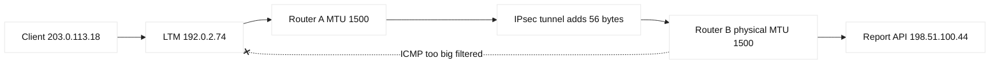

# Case study 06: MTU black hole

## Context and goals

Northstar Analytics moved its fictional API between two data centers over an encrypted IPsec tunnel. Small HTTPS requests worked, while uploads and responses containing large JSON objects hung. The public service was `reports.northstar.example` at 192.0.2.74; clients came from 203.0.113.0/24 and servers from 198.51.100.0/24. The incident began at 14:00 UTC on 2026-04-02 after a provider added tunnel encapsulation. Goals were to prove the packet-size boundary, restore service without disabling encryption, and teach how a path MTU black hole differs from generic packet loss.

## Architecture



The effective tunnel payload MTU was 1444 bytes, but interfaces advertised 1500. TCP ordinarily discovers a smaller path MTU through DF packets and ICMP feedback. A firewall policy filtered ICMP, so senders retransmitted oversized segments indefinitely. IPv4 and IPv6 behavior differs: IPv4 routers may fragment when DF is clear; IPv6 routers do not fragment transit packets and rely on Packet Too Big messages (RFC 8201).

| Layer | Expected | Actual evidence |
|---|---|---|
| Ethernet interface | MTU 1500 | 1500 on both routers |
| Tunnel payload | up to 1500 | 1444 maximum |
| ICMP feedback | permitted | filtered by policy `edge-icmp` |
| Small response | succeeds | 1,200-byte body returns |
| Large response | succeeds | stalls above roughly 1,420 bytes |

## Timeline

At 13:40, the provider enabled IPsec encapsulation. At 14:00, dashboards showed report downloads timing out, but health checks remained green. At 14:15, support supplied a 1,000-byte success and 20-kilobyte failure. At 14:25, engineers compared same-region traffic, which bypassed the tunnel and succeeded. At 14:40, a DF ping sweep found the boundary. At 15:05, a temporary MSS clamp was applied to the tunnel-facing policy. At 15:30, uploads and downloads passed. At 16:10, the team restored filtered ICMP in a change window and removed the temporary clamp after retesting.

```mermaid
%%{init: {"theme":"base","themeVariables":{"primaryColor":"#ffffff","primaryTextColor":"#111111","lineColor":"#222222"}}}%%
sequenceDiagram
 participant C as Client
 participant R as Tunnel router
 participant S as Server
 C->>S: SYN MSS 1404
 S-->>C: SYN-ACK MSS 1404
 C->>R: DF data 1460 bytes
 R--xC: ICMP too big filtered
 C->>S: Retransmit same segment
 Note over C,S: Retry budget exhausted; application hangs
```

## Evidence

`ping -M do -s 1416 198.51.100.44` succeeded while `ping -M do -s 1417 198.51.100.44` failed from the tunnel client. Capture showed repeated TCP retransmissions with no ACK for segments larger than 1444 bytes. The SYN advertised MSS 1460, inconsistent with the measured payload path; an IPv4 MTU of 1444 implies a 1404-byte TCP MSS. The router counter recorded dropped oversized DF packets. These are observed facts. The statement that ICMP filtering caused the black hole is an inference supported by restoring ICMP in staging. RFC 1191 specifies IPv4 path MTU discovery; RFC 8201 specifies IPv6 PMTUD. Their existence is a standards fact, while the exact 1444 boundary is local measurement.

## Competing hypotheses

Packet loss was considered because retransmissions were visible, but loss would not normally align exactly with payload size. A broken API serializer was unlikely because the server generated a complete response in its local capture. TLS record corruption was tested with a same-size local route and did not reproduce. A tunnel cipher failure was rejected because small packets crossed it and IPsec counters matched. The remaining hypotheses were an incorrect interface MTU, blocked ICMP, or a sender that ignored PMTUD. All three participated: the advertised MSS was too large, ICMP was blocked, and the sender had no alternate discovery path.

## Decision points

The immediate choice was MSS clamping, lowering interface MTUs, or permitting ICMP. Clamping gave rapid relief but can miss UDP and non-TCP traffic. Lowering every interface risks unrelated traffic and requires coordinated changes. Permitting the required ICMP types followed standards and addressed discovery, but security reviewers required rate limiting and logging. The team selected ICMP allowance plus a temporary clamp. This ordering is an engineering inference based on reversibility and protocol coverage, not a universal prescription.

## Remediation

The network policy now permits IPv4 ICMP Destination Unreachable, Fragmentation Needed and IPv6 ICMP Packet Too Big from trusted tunnel routers, with rate limits. Tunnel endpoints advertise a payload MTU of 1444, and TCP MSS is derived rather than hard-coded where the platform supports it. Monitoring tracks PMTUD messages, DF drops, retransmission rate, and response-size percentiles. The API added a 64-kilobyte chunked download option so clients have an application fallback. Documentation names the tunnel overhead and owner.

## Verification

The test matrix used 1,000, 1,400, 1,444, 1,445, and 20,000-byte payloads in both directions. All completed after ICMP restoration; captures showed one adjustment followed by segments at or below the discovered size. IPv6 testing used `ping6 -s 1400` and confirmed Packet Too Big delivery. `tracepath 198.51.100.44` reported the lower PMTU. TLS remained enabled, and IPsec sequence counters had no authentication failures. A 30-minute synthetic upload monitored p95 latency and retransmits, both returning to baseline.

## Rollback or recovery

If ICMP allowance caused unacceptable noise, the change could be rolled back while retaining the explicit 1444 MTU and MSS clamp. If the tunnel provider changed overhead again, operators would rerun `tracepath` from each segment and update the documented value. During an outage, reports could be served from the same-region endpoint that bypassed the tunnel. Rollback would be staged, preserving captures and avoiding simultaneous MTU changes on both sides.

## Postmortem lessons

An interface MTU is not necessarily a path MTU. Encapsulation consumes bytes, and filtering control messages can make a standards mechanism appear broken. Health checks with tiny bodies were insufficient. Synthetic checks now vary payload size and address family. Facts from RFC 1191 and RFC 8201 explain expected protocol behavior; claims about router defaults, firewall safety, and MSS values are vendor facts or labeled inferences requiring local validation. Change reviews must include tunnel overhead, ICMP policy, and a recovery route.

The investigation also changed how the team reads traces. A retransmission is not automatically evidence that a server is unhealthy; it is a symptom whose direction, sequence number, payload size, and acknowledgment pattern matter. Engineers now correlate the client capture, tunnel endpoint counters, and server capture using a common clock. The capture filter is deliberately narrow, and packet contents are not retained when headers answer the question. A packet that arrives at the tunnel endpoint but never leaves the router is a different class of fault from a packet that leaves but is rejected by the server firewall. That distinction prevents teams from sending application owners on an unnecessary debugging tour.

The API team documented response-size distributions and added a maximum record size to a streaming format. This is not a substitute for correct PMTUD, because a future client may use another protocol, but it reduces sensitivity to accidental fragmentation. The provider change process now requires an encapsulation worksheet, including ESP, UDP, and any VLAN overhead. The worksheet is reviewed by both network and platform owners. The exercise demonstrates that protocol standards define feedback expectations while local policy determines whether feedback is allowed to arrive.

## Additional analysis

MTU incidents are difficult because small probes and handshake packets can
succeed while a realistic response fails. The investigation compared packet
length, DF behavior, ICMP too-big messages, tunnel overhead, and interface
counters at every hop. A temporary reduction of the client path MTU can be a
diagnostic experiment, but it is not a substitute for repairing the smallest
link or ensuring path-MTU discovery works. The team recorded the experiment’s
scope and expiry so an emergency workaround could not become an undocumented
permanent setting. They also tested both directions and IPv4 versus IPv6,
because a shared “network MTU” label can hide different paths.

## Evidence matrix

| Test | Result | Interpretation |
| --- | --- | --- |
| Small request | Succeeds | Basic path works |
| Large DF packet | Fails | MTU/PMTUD hypothesis |

## Questions and answers

The practical debugging sequence is worth making explicit. Start at the application boundary and record the exact request size, direction, address family, and elapsed time. Then compare a request that succeeds with one that fails while changing only payload size. If the threshold is stable, inspect the SYN MSS, DF flag, PMTUD messages, and tunnel counters. A successful TCP handshake proves little about the data path because SYN packets are small. Likewise, a successful health check may only exercise a short response. The team now keeps a small set of representative payloads and runs them after every tunnel or provider change.

There is a security trade-off in ICMP policy. “Allow all ICMP” is too broad for a change description, while blocking all ICMP breaks useful control signaling. The revised policy names message types, sources, destinations, rate limits, and logging fields. Reviewers can then ask whether an observed message is required by IPv4 PMTUD, IPv6 PMTUD, or neither. This preserves room for threat modeling without turning a standards dependency into a blanket exception. The same reasoning applies to firewall rules around TCP resets: a reset can be diagnostic feedback, but an injected reset is also a security concern.

Finally, MTU is an end-to-end property that can change with routing. A path through a backup tunnel may have a different overhead from the primary path. Mobile clients, IPv6 clients, and regional edges can therefore see distinct boundaries. Synthetic testing records vantage point and selected route, and the runbook asks whether a load balancer changed the tuple or encapsulated traffic. The durable fix is not a memorized number; it is a repeatable measurement, visible feedback, and an application that can make progress in bounded chunks.

1. **What is a black hole?** Packets disappear without useful feedback, so the sender retries until an application timeout.
2. **Why did small responses work?** They fit below the effective 1444-byte path limit.
3. **What does DF mean?** IPv4 “Don't Fragment”; oversized packets require feedback instead of router fragmentation.
4. **Why is IPv6 different?** Transit routers do not fragment IPv6 packets; endpoints depend on Packet Too Big messages.
5. **What did the ping boundary prove?** It measured a local payload threshold, not a global protocol constant.
6. **Why clamp MSS?** TCP peers then choose smaller segments, reducing oversized data on that policy.
7. **Does MSS protect UDP?** No; UDP needs PMTUD, application sizing, or fragmentation-aware design.
8. **Could TLS cause it?** TLS changes record framing, but the size-correlated network drops persisted with test payloads.
9. **Why keep ICMP?** PMTUD depends on control feedback; filtering it can create silent failure.
10. **What is the rollback?** Restore the prior policy while keeping a tested alternate route and capturing impact.
11. **What should monitoring include?** Payload-size probes, retransmits, PMTU signals, and IPv4/IPv6 separately.
12. **Which conclusion is inference?** That the provider change caused the incident; timing and tunnel overhead support it but do not prove exclusivity.
