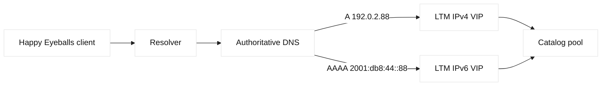
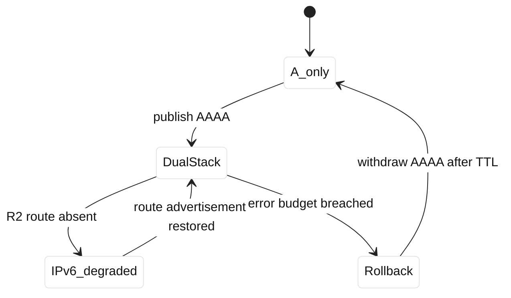

# Case study 07: IPv6 migration

## Context and goals

Fictional CivicCart introduced IPv6 for its public catalog while retaining IPv4 for legacy clients. The service `catalog.civiccart.example` used 192.0.2.88 and 2001:db8:44::88. At 11:00 UTC on 2026-05-12, IPv6-enabled browsers reported slower pages and occasional failures. The goal was to make dual-stack behavior reliable, preserve an orderly rollback, and distinguish an AAAA publication problem from broken IPv6 transport. Documentation prefix 2001:db8 is used only as an example.

## Architecture

LTM had separate virtual servers and client/server profiles. The IPv6 VIP lacked a route advertisement on one upstream router, while DNS published AAAA globally. RFC 8200 defines IPv6; RFC 8305 describes Happy Eyeballs version 2. DNS selection and local resolver behavior remained important.

| Plane | IPv4 | IPv6 | Owner |
|---|---|---|---|
| DNS | A 192.0.2.88 | AAAA 2001:db8:44::88 | DDI |
| VIP | enabled | enabled | Edge |
| Route | present | missing on router R2 | Network |
| Backend | dual-stack | dual-stack | App |
| Probe | HTTP 200 | timeout from R2 | SRE |

## Timeline

At 10:20, AAAA was published with a 300-second TTL. At 11:00, IPv6 traffic rose and errors appeared in one ISP. At 11:15, the team confirmed IPv4 success and IPv6 SYN retries. At 11:40, one region passed while another failed, implicating routing. At 12:10, the missing route advertisement was found. At 12:45, it was restored in staging. At 13:30, production probes passed. At 14:00, TTL was raised to 900 seconds only after stability evidence.

## Evidence

`dig +short A catalog.civiccart.example` returned 192.0.2.88 and `dig +short AAAA` returned the documentation IPv6 address. `curl -6 -vk --connect-timeout 5 https://[2001:db8:44::88]/` failed from the affected probe, while `curl -4` returned 200. Router R2 lacked the `/64` route; router R1 had it. LTM IPv6 counters showed no completed handshakes from the affected path. These are facts. The inference that the route omission caused user impact is supported by restoration and client timing, but Happy Eyeballs can mask some failures.

## Competing hypotheses

DNS caching was considered because rollout began with a new AAAA, but authoritative and direct queries agreed. A certificate SAN omission was checked with `openssl s_client -6` after routing was fixed and was absent. Backend IPv6 binding was tested from LTM and worked. MTU and firewall filtering remained possible but showed no drops once the route existed. The route advertisement was the simplest explanation consistent with regional scope and SYN absence.

## Decision points

The team could withdraw AAAA immediately, fix routing while leaving it published, or disable IPv6 VIP acceptance. Withdrawal reduced impact but waited on TTL and delayed migration. Fixing the route preserved the experiment but needed change review. They fixed the route with a staged advertisement and kept an emergency withdrawal plan. That choice was an engineering inference based on low blast radius and a verified IPv4 fallback.

## Remediation

Every edge router now has an automated check that the service prefix is present before AAAA publication. LTM health checks probe both address families, and dashboards show IPv4 versus IPv6 handshake, TLS, and HTTP success separately. DNS changes require an explicit TTL and rollback time. Applications bind and test `::` and IPv4 intentionally, with firewall rules reviewed for both. Runbooks explain bracketed IPv6 URL syntax and avoid treating an AAAA response as proof of reachability.

## Verification

Probes from three fictional networks tested DNS, TCP, TLS SNI, and HTTP. `curl -6`, `curl -4`, and browser-like dual-stack clients all returned 200. `traceroute -6` reached the VIP, and LTM showed balanced IPv6 server-side flows. Certificate inspection included the DNS name, not the literal address. The team waited through two TTL intervals, checked resolver caches, and compared error budgets. No increase in IPv4 latency occurred.

## Rollback or recovery

Rollback is to withdraw AAAA, retain the IPv4 A record, and wait at least the published TTL plus resolver margin. If route restoration fails, support can direct users to the IPv4-only hostname. Operators must not remove the IPv6 VIP while clients still cache AAAA without an alternate path. Recovery includes validating both DNS answers and actual connections after caches age out.

## Postmortem lessons

Dual stack is two operational systems, not one switch. DNS publication, routing, firewalling, TLS names, load-balancer profiles, and observability must advance together. RFC 8200 and RFC 8305 are primary standards facts; expected browser fallback timing is implementation-dependent. The claim that IPv6 was “ready” based on a DNS answer was an invalid inference. Readiness now means successful end-to-end probes from diverse networks.

The migration review exposed an ownership gap. DDI owned the zone and knew the desired AAAA, network operations owned advertisements, and the edge team owned the VIP. No single checklist required all three to sign the same change. The new change record carries a dependency table with the prefix, origin, route policy, ACL, virtual server, pool, certificate SAN, health probe, and rollback TTL. Each field has an owner and a timestamp. A stale route or a stale resolver is now visible as a specific failed prerequisite rather than a vague “IPv6 issue.”

Address-family parity also affects application assumptions. Logging previously normalized all client addresses into an IPv4-looking field, hiding the failing population. The service now records an address-family label, negotiated protocol, and selected VIP. Rate limits and allow lists were reviewed for IPv6 representation, including compressed notation and prefix boundaries. Security did not mean blocking unfamiliar syntax; it meant expressing equivalent policy for both families and testing it. These are engineering practices derived from the incident, not requirements of RFC 8200.

The team scheduled a gradual TTL change rather than assuming every resolver honors it exactly. During the observation window, synthetic clients retained old answers while new clients obtained the AAAA, so both paths were tested. Support scripts displayed the resolver, answer age, and connection family. The migration succeeded because rollback was treated as a DNS operation with cache delay, not as an instantaneous button. Future services must demonstrate this same recovery behavior before being called dual-stack ready.

## Additional analysis

The migration board treated IPv6 as a second production path, not merely a
checkbox beside IPv4. It documented address ownership, router advertisements,
DNS A and AAAA publication, firewall policy, load-balancer listeners, service
bindings, and monitoring for each tier. Happy-Eyeballs behavior can make a
client appear healthy while one family is consistently failing, so the team
collected family-specific timing and error data. They avoided disabling IPv6
globally as a first response because that would erase evidence and could hide
an asymmetric rollout. The rollback target was a DNS and listener policy that
could be reversed without deleting allocated addresses or routes.

## Rollout matrix

| Layer | IPv4 state | IPv6 evidence |
| --- | --- | --- |
| DNS | A published | AAAA tested by resolver |
| VIP | IPv4 listener | IPv6 listener and policy |

## Questions and answers

The migration also required careful interpretation of client telemetry. A browser that reaches IPv4 after an IPv6 failure may report a successful page, while the user still experiences added delay. Conversely, a resolver that returns only A because it is old or policy-limited can make a service appear healthy. Dashboards therefore count DNS answer families, connection attempts, fallback delay, TLS alerts, and HTTP outcomes separately. Engineers compare these counts by resolver, ISP, geography, and operating-system family. This avoids declaring victory from an aggregate success percentage that is dominated by IPv4.

The edge configuration was reviewed object by object. The IPv6 virtual server needed the same listener policy, client TLS profile, server TLS profile, persistence behavior, and pool member reachability as its IPv4 counterpart. Health checks used the service hostname for SNI and checked the expected Host header. Firewall rules were expressed in prefixes rather than copied as IPv4 literals. Logs preserved compressed IPv6 text and a normalized address field so analysts could join records without losing identity. These checks caught no additional outage, but they turned implicit parity into an auditable contract.

Migration sequencing matters when a dependency has a longer cache life than the team expects. AAAA was published only after routes and probes were ready, yet the rollback plan still had to account for resolvers that retain records beyond the requested TTL. The support team received a temporary IPv4-only hostname and a diagnostic command that displayed resolver, answer, family, and certificate name. The lesson is broader than IPv6: any DNS-based migration needs a serving path before it advertises a name, and a rollback that remains safe while caches disagree.

1. **Why publish AAAA at all?** It enables IPv6 clients but creates an obligation to operate the path.
2. **Does an AAAA answer prove service health?** No; DNS says data, not reachability.
3. **What is Happy Eyeballs?** A client strategy that races address families to reduce user delay; RFC 8305 describes it.
4. **Why did one ISP fail?** Its path reached R2, where the service prefix was absent.
5. **Why use brackets in curl?** Colons in IPv6 literals require bracketed URL authority syntax.
6. **Could certificates differ by family?** Yes, separate VIP profiles can present different chains; test SNI on each.
7. **Why separate dashboards?** Aggregate success can hide one address family's failure.
8. **What is the safe AAAA rollback?** Withdraw it, preserve A, and account for TTL and caches.
9. **Why test literal IPv6 and hostname?** Literal tests isolate routing; hostname tests include DNS and certificate identity.
10. **What does RFC 8200 establish?** IPv6 packet and addressing behavior, not this network's route readiness.
11. **What did the route fix prove?** It reproduced recovery, strongly supporting causation but not excluding every contributor.
12. **What should SDE2 own?** Dependency sequencing, address-family parity, telemetry, and migration rollback.
