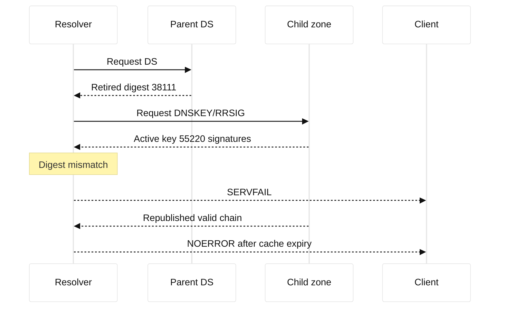

# Case study 08: DNSSEC validation failure

## Context and goals

Fictional HarborBank delegated `payments.harbor.example` to a managed authoritative service and enabled DNSSEC. At 07:30 UTC on 2026-06-21, validating resolvers returned SERVFAIL while non-validating diagnostic tools showed an apparently healthy A record. Card terminals and APIs using validating corporate resolvers could not find the payment endpoint. The goal was to restore authenticated DNS without weakening validation, identify whether the DS, DNSKEY, or signature was wrong, and establish a safe key-roll procedure. All names and addresses are fictional; the authoritative address was 192.0.2.101.

## Architecture

The parent zone held a DS digest for key 38111. The child zone had already removed that key and published key 55220, but its signatures were generated during a partial deployment. RFC 4033 defines DNSSEC concepts, RFC 4034 defines resource records, and RFC 6781 discusses operational practice. The standards describe validation; the exact resolver retry and negative-cache behavior is implementation-specific.

| Check | Expected | Observed |
|---|---|---|
| Parent DS | matches active child DNSKEY | digest for retired key |
| Child DNSKEY | key 55220 published | yes |
| A record | signed | RRSIG references 55220 |
| Validating query | NOERROR | SERVFAIL |
| Non-validating query | A answer | 192.0.2.44 |

## Timeline

At 06:50, the managed provider began key rollover. At 07:20, the DS change was submitted. At 07:30, validating resolver SERVFAIL rose. At 07:45, engineers compared `dig +dnssec` through two resolvers. At 08:10, the DS/key mismatch was confirmed. At 08:30, the provider republished the old DNSKEY and valid signatures. At 09:00, validation succeeded in a test resolver. At 09:30, the parent DS was corrected. At 10:15, caches expired and payment errors returned to baseline.

## Evidence

`dig +dnssec payments.harbor.example A @192.0.2.53` returned SERVFAIL with an Extended DNS Error indicating DNSSEC validation failure. `dig +dnssec DNSKEY payments.harbor.example` showed key 55220; `dig DS payments.harbor.example` showed the old digest. `delv` independently reported the broken chain. A non-validating resolver returned the A record, proving authoritative data existed but not that it was trustworthy. These are facts. The inference that the provider's rollover ordering caused impact is supported by timestamps and successful restoration. RFC citations are primary standards references; vendor dashboards are not standards evidence.

## Competing hypotheses

An authoritative outage was unlikely because non-validating queries answered and TCP/53 worked. An expired record was rejected because the SOA serial advanced. Network ACLs were checked from multiple resolver subnets. Clock skew was considered because signatures have inception and expiration times; resolver clocks were synchronized. A stale DS at the parent and a malformed RRSIG were both plausible. The DS mismatch was decisive, while signature correctness still required a complete chain test.

## Decision points

The team could disable DNSSEC validation, remove the DS, or restore a consistent signed chain. Disabling validation would mask the error and lower security. Removing DS would create an insecure delegation and require parent propagation. Restoring the previous key and signatures was reversible and preserved authentication, so it was selected. The choice to correct the DS only after observing a stable child was an engineering inference based on avoiding another half-rollover.

## Remediation

The provider's rollover runbook now requires: publish new DNSKEY, wait for parent and resolver TTLs, sign with both keys, update DS, wait again, then retire the old key. A preflight script compares DS digests, DNSKEY flags, RRSIG key tags, inception, expiration, and SOA serial from multiple vantage points. Alerts distinguish SERVFAIL caused by DNSSEC from transport failure. Ownership of parent registrar changes is explicit, and emergency contact details are kept in the fictional change system rather than in this book.

## Verification

Validation was tested with `delv`, two validating recursive resolvers, TCP and UDP transport, and both A and AAAA records. `dig +dnssec` showed AD on successful answers. A deliberately altered signature in a staging zone produced SERVFAIL, proving the probe could detect tampering. The team waited through the old DS TTL and checked resolver logs for retry storms. Payment clients recovered without changing application configuration.

## Rollback or recovery

Rollback is to republish the last known-good DNSKEY and signatures, then restore the matching DS if the parent change has already propagated. If the parent cannot be changed quickly, a temporary signed child chain with the currently published DS is preferable to disabling validation. Operators must account for negative caching and resolver diversity. Recovery is complete only when validating clients receive authenticated answers and non-validating comparison is no longer the sole test.

## Postmortem lessons

DNS availability and DNS authenticity are separate dimensions. SERVFAIL can be the correct security result when a chain cannot be validated. RFC 4033, RFC 4034, and RFC 6781 establish protocol and operational facts; TTL timing, provider ordering, and resolver EDE wording are local or vendor facts. The inference that “DNS is up” from one non-validating query was invalid. Key rollovers need staged evidence, dual signatures, and an owner for the parent DS.

## Additional analysis

The incident commander separated an unsigned delegation from a broken signed
delegation. In the first case, a validating resolver can legitimately return
data without an authenticated-data signal; in the second, a bad signature,
expired DNSKEY, or DS mismatch can produce SERVFAIL even when an authoritative
server answers locally. The team compared validating and non-validating
resolvers, captured the AD/CD flags, checked parent and child publications,
and recorded signing-key and TTL timelines. They did not “fix” the incident by
turning off validation for all clients. Any emergency insecure delegation was
treated as a documented, time-bounded risk with an owner and a restoration
plan.

## Evidence matrix

| Resolver | Validation | Observed result |
| --- | --- | --- |
| Validating | On | SERVFAIL |
| Non-validating | Off | Answer returned |

## Questions and answers

The response team learned to preserve the distinction between data-plane and trust-plane evidence. An authoritative server answering an A query proves that it can serve a record, but a validating resolver must also verify the parent-to-child chain and the signature's time window. A packet capture showing DNS traffic proves transport, not authenticity. Incident notes therefore recorded the resolver address, whether the AD bit was present, the queried type, the DO bit, the returned RRSIG, and the local clock. This made it possible to reproduce the failure without asking operators to turn off validation.

Communication was part of the recovery. Product owners initially asked whether the A record could simply be hard-coded into clients. That would bypass DNS policy, defeat future failover, and remove the authentication property under investigation. Instead, support received a short explanation that SERVFAIL was a protective response and a status page that named the affected validating resolvers. The incident commander approved every parent-zone action, while the provider supplied signed change evidence. This kept urgency from turning into an insecure workaround and gave downstream teams a clear criterion for closure.

The final review also required a second person to reproduce the chain from an independent resolver. That small control caught a tempting but misleading local cache result: one recursive server had already refreshed the corrected DS while another still held the earlier failure. Recovery metrics therefore used resolver cohorts and cache age, not a single green dashboard. The team recorded the exact query commands and UTC times so a future incident can distinguish propagation from a new signing error.

Key management was treated as a state machine rather than a single deployment. Before a rollover, the team inventories key tags, algorithms, flags, publication times, signature expiration, parent DS TTL, and child DNSKEY TTL. During overlap, independent validators query from more than one network. Only after the overlap window does the old key become eligible for retirement. If a provider automates these steps, its dashboard is evidence of intent, not proof of what the public chain contains; `dig` and `delv` against independent resolvers remain the authority for incident verification.

Negative caching and retry behavior also influenced recovery. Some resolvers cached SERVFAIL briefly, others retried upstream, and clients differed in how they surfaced the error. The team waited through the relevant TTLs and watched payment requests rather than assuming the first successful diagnostic meant every user had recovered. The resulting runbook names facts that can be asserted immediately, inferences that need a controlled test, and decisions that require security approval. That discipline is useful for any authentication system where “available” and “trusted” are different outcomes.

1. **Why did non-validating DNS work?** It ignored the broken trust chain and returned unsigned-looking data.

Interview reasoning: Describe the resolver chain and the exact record, flags, TTL, and response code involved. A useful diagnostic is to query the configured recursive resolver and an authoritative server separately, then compare the answer, authority section, DNSSEC status, and cache age. The caveat is that DNS is cached and control-plane driven: changing an authoritative record does not instantly change every client, and a healthy answer still does not prove that the selected VIP or origin is healthy.

2. **What does SERVFAIL mean here?** The resolver could not safely produce an authenticated answer.

Interview reasoning: Describe the resolver chain and the exact record, flags, TTL, and response code involved. A useful diagnostic is to query the configured recursive resolver and an authoritative server separately, then compare the answer, authority section, DNSSEC status, and cache age. The caveat is that DNS is cached and control-plane driven: changing an authoritative record does not instantly change every client, and a healthy answer still does not prove that the selected VIP or origin is healthy.

3. **What is a DS record?** A parent-held digest that authenticates a child DNSKEY.

Interview reasoning: Describe the resolver chain and the exact record, flags, TTL, and response code involved. A useful diagnostic is to query the configured recursive resolver and an authoritative server separately, then compare the answer, authority section, DNSSEC status, and cache age. The caveat is that DNS is cached and control-plane driven: changing an authoritative record does not instantly change every client, and a healthy answer still does not prove that the selected VIP or origin is healthy.

4. **Why publish both keys?** Overlap lets validators transition without a gap.

Interview reasoning: Describe the resolver chain and the exact record, flags, TTL, and response code involved. A useful diagnostic is to query the configured recursive resolver and an authoritative server separately, then compare the answer, authority section, DNSSEC status, and cache age. The caveat is that DNS is cached and control-plane driven: changing an authoritative record does not instantly change every client, and a healthy answer still does not prove that the selected VIP or origin is healthy.

5. **What does AD indicate?** A validating resolver asserts the answer was authenticated.

Interview reasoning: Describe the resolver chain and the exact record, flags, TTL, and response code involved. A useful diagnostic is to query the configured recursive resolver and an authoritative server separately, then compare the answer, authority section, DNSSEC status, and cache age. The caveat is that DNS is cached and control-plane driven: changing an authoritative record does not instantly change every client, and a healthy answer still does not prove that the selected VIP or origin is healthy.

6. **Can an expired RRSIG cause this?** Yes; validators check its validity interval and may return SERVFAIL.

Interview reasoning: Describe the resolver chain and the exact record, flags, TTL, and response code involved. A useful diagnostic is to query the configured recursive resolver and an authoritative server separately, then compare the answer, authority section, DNSSEC status, and cache age. The caveat is that DNS is cached and control-plane driven: changing an authoritative record does not instantly change every client, and a healthy answer still does not prove that the selected VIP or origin is healthy.

7. **Why not remove DS immediately?** It weakens the delegation and still waits on caches.

Interview reasoning: Describe the resolver chain and the exact record, flags, TTL, and response code involved. A useful diagnostic is to query the configured recursive resolver and an authoritative server separately, then compare the answer, authority section, DNSSEC status, and cache age. The caveat is that DNS is cached and control-plane driven: changing an authoritative record does not instantly change every client, and a healthy answer still does not prove that the selected VIP or origin is healthy.

8. **What is the safest first action?** Restore a known-good consistent chain while preserving validation.

Interview reasoning: Describe the resolver chain and the exact record, flags, TTL, and response code involved. A useful diagnostic is to query the configured recursive resolver and an authoritative server separately, then compare the answer, authority section, DNSSEC status, and cache age. The caveat is that DNS is cached and control-plane driven: changing an authoritative record does not instantly change every client, and a healthy answer still does not prove that the selected VIP or origin is healthy.

9. **Why test UDP and TCP?** Large DNSSEC responses may trigger TCP fallback.

Interview reasoning: Describe the resolver chain and the exact record, flags, TTL, and response code involved. A useful diagnostic is to query the configured recursive resolver and an authoritative server separately, then compare the answer, authority section, DNSSEC status, and cache age. The caveat is that DNS is cached and control-plane driven: changing an authoritative record does not instantly change every client, and a healthy answer still does not prove that the selected VIP or origin is healthy.

10. **What is fact versus inference?** The mismatched digest is fact; attributing it to provider ordering is inference.

Interview reasoning: Describe the resolver chain and the exact record, flags, TTL, and response code involved. A useful diagnostic is to query the configured recursive resolver and an authoritative server separately, then compare the answer, authority section, DNSSEC status, and cache age. The caveat is that DNS is cached and control-plane driven: changing an authoritative record does not instantly change every client, and a healthy answer still does not prove that the selected VIP or origin is healthy.

11. **What should an SDE1 inspect?** Status, resolver identity, AD flag, EDE, SOA serial, and timestamps.

Interview reasoning: Describe the resolver chain and the exact record, flags, TTL, and response code involved. A useful diagnostic is to query the configured recursive resolver and an authoritative server separately, then compare the answer, authority section, DNSSEC status, and cache age. The caveat is that DNS is cached and control-plane driven: changing an authoritative record does not instantly change every client, and a healthy answer still does not prove that the selected VIP or origin is healthy.

12. **What should an SDE2 design?** Key overlap, parent ownership, cache-aware rollback, and independent validators.

Interview reasoning: Describe the resolver chain and the exact record, flags, TTL, and response code involved. A useful diagnostic is to query the configured recursive resolver and an authoritative server separately, then compare the answer, authority section, DNSSEC status, and cache age. The caveat is that DNS is cached and control-plane driven: changing an authoritative record does not instantly change every client, and a healthy answer still does not prove that the selected VIP or origin is healthy.
