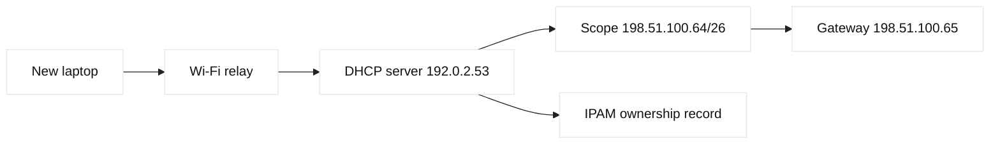
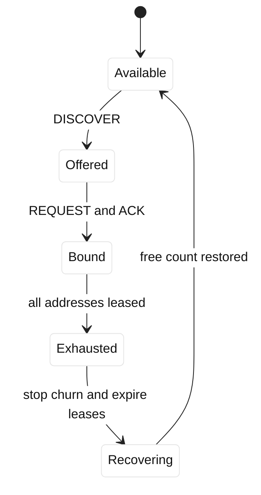

# Case study 09: DHCP exhaustion

## Context and goals

Fictional Redwood Labs opened a temporary device lab and placed it on VLAN 230, `lab-redwood.example`. At 16:00 UTC on 2026-07-09, new laptops could associate with Wi-Fi but received no IPv4 address. Existing devices continued working. The DHCP scope was 198.51.100.64/26, with gateway 198.51.100.65 and DNS 192.0.2.53. Goals were to restore address assignment, identify whether legitimate growth or a rogue client consumed leases, and prevent recurrence without changing production VLANs. RFC 2131 describes DHCP behavior and RFC 2132 option formats.

## Architecture

The scope held 62 usable addresses. A relay inserted giaddr 198.51.100.65 and forwarded broadcasts. Lease duration was eight hours. A device onboarding script mistakenly retried with a new client identifier, creating many active leases for the same physical laptop. A separate unmanaged test appliance generated random identifiers. DHCP is a broadcast-oriented protocol; relay and option behavior can be vendor-specific even though message sequencing is standardized.

| Resource | Intended | Observed |
|---|---|---|
| Scope | 62 addresses | 62 active leases |
| Lease time | 8 hours | appropriate for laptops, not churn |
| Client identifiers | stable per device | changed on retry |
| IPAM free count | authoritative | 0 |
| DHCP OFFER | available | none for new clients |

## Timeline

At 08:00, the lab script was deployed. At 12:00, the device count reached 40. At 15:45, a test appliance started cycling identifiers. At 16:00, new joins failed. At 16:10, DHCP logs showed DISCOVER traffic and no available-address response. At 16:25, operators found all leases active, including 17 identifiers mapped to six MAC addresses. At 16:40, the script was stopped and rogue ports isolated. At 17:00, expired leases became reusable. At 17:20, reservations were created for lab infrastructure and the scope was expanded after IPAM review.

## Evidence

The DHCP server's read-only lease report showed 62 active bindings and 17 duplicate-MAC patterns. Packet capture on the relay showed repeated DHCPDISCOVER messages with no DHCPOFFER after the scope reached zero. IPAM reported the same utilization. `tcpdump -ni eth0 'udp port 67 or udp port 68'` confirmed broadcasts reached the relay. A query of the fictional switch MAC table linked the random identifiers to two test ports. These observations are facts. The inference that the onboarding script was the primary cause is based on deployment timing and identifier correlation, not on DHCP alone.

## Competing hypotheses

The first hypothesis was a failed DHCP server; its process and other scopes were healthy. A broken relay was unlikely because DISCOVER packets arrived and other VLANs received offers. An ACL blocking UDP was discounted by captures in both directions. Duplicate IP use was checked with ARP probes and found only after leases were assigned, so it did not explain zero offers. Legitimate scope sizing contributed, but churn and long leases explain why a temporary lab exhausted sooner than its device count suggested.

## Decision points

The team considered deleting leases, doubling the scope, shortening the lease, or isolating clients. Blind deletion could disconnect active users and create IP conflicts. Expansion required contiguous address ownership and route review. Isolation stopped churn with minimal impact to known devices, while waiting for expiration provided safe recovery. Operators chose isolation, a targeted cleanup of confirmed stale identifiers, then a scoped expansion. The sequence is an engineering inference emphasizing reversibility and IPAM consistency.

## Remediation

The onboarding script now derives a stable client identifier and applies exponential backoff. DHCP detects repeated identifiers per MAC for alerting, not automatic deletion. The scope expanded to 198.51.100.64/25 only after gateway, relay, ACL, and IPAM reservations were checked. Lab leases were reduced to two hours, with longer reservations for printers and servers. Monitoring covers utilization at 70%, 85%, and 95%, DISCOVER-to-OFFER latency, declined leases, and identifier churn. Network access control blocks unknown appliances from the relay path.

## Verification

Thirty new clients completed DISCOVER, OFFER, REQUEST, and ACK. Renewals at T1 and T2 succeeded, and a reboot reused an existing lease rather than consuming another. The server lease count matched IPAM within one reporting interval. A test script generated changing identifiers and triggered an alert without deleting active bindings. `ipconfig /renew` and `dhclient -v` were used only on fictional lab hosts. Gateway reachability, DNS option 6, and route option 3 were verified independently.

## Rollback or recovery

If expansion introduced a routing overlap, the change record retained the previous scope and gateway values; rollback would stop new allocation, restore the prior relay pool, and preserve existing leases until they expired. If exhaustion recurs, support can move noncritical devices to a separately owned test VLAN. Lease deletion is permitted only for bindings corroborated by switch absence, age, and owner approval. Recovery requires confirming no duplicate allocation and reconciling IPAM before reopening onboarding.

## Postmortem lessons

DHCP capacity is a behavior problem as well as a subnet-size problem. Client identifiers, lease duration, retry logic, and rogue devices affect consumption. RFC 2131 and RFC 2132 establish message and option facts; server duplicate-detection heuristics and relay logging are implementation facts. “There are only 40 laptops” was an invalid inference because one physical device had many active identities. Ownership between DHCP and IPAM must be explicit, especially for temporary labs.

## Additional analysis

Lease exhaustion is a capacity incident with identity and lifecycle clues. The
team measured active leases, free addresses, lease durations, discover/request
rates, relay reachability, and the percentage of abandoned or duplicate
entries. Extending the pool without checking subnet size, gateway scope, and
IPAM ownership could create an address collision or route leak. Shortening
leases can recover capacity but may increase renewal traffic and outage risk.
The safe response was to reserve a documented expansion range, identify stale
clients through authoritative lease records, and verify new clients received
the intended gateway and DNS options before declaring recovery.

## Capacity matrix

| Signal | Meaning | Safe response |
| --- | --- | --- |
| Free leases near zero | Scope pressure | Verify expansion range |
| Renewal spike | Client churn or short lease | Check relay and lease policy |

## Questions and answers

Address management became the central design concern after the incident. The lab had treated a /26 as a count of people, but a DHCP server counts bindings, not people. Phones, virtual machines, containers, test appliances, and changing client identifiers all consume state. The team now forecasts peak bindings, renewal traffic, reservations, and quarantine addresses separately. IPAM records the parent prefix, DHCP scope, gateway, relay, and owner in one review. A scope expansion cannot proceed merely because a dashboard shows free addresses; the route and ACL must cover the new range and no neighboring team may already own it.

The service desk also changed its first-response questions. “Can you connect to Wi-Fi?” describes association, not network configuration. Agents now ask whether the host has a lease, what address and gateway it displays, whether a renewal produced an OFFER, and whether the failure follows the device to another port. A captured DHCP transaction includes the relay address and client identifier but omits unrelated payloads. This produces actionable evidence without requesting secrets or a broad packet capture. It also prevents an operator from assigning a static address that conflicts with the managed pool.

Lease cleanup is deliberately conservative. An old timestamp alone does not prove that a device is gone, because a sleeping laptop may renew late or a relay may be temporarily disconnected. Operators correlate lease age with switch presence, authentication logs, and owner confirmation. A decline message, duplicate ARP observation, or unauthorized offer is retained as evidence. Cleanup jobs report candidates and require approval before removal. This is slower than deleting all bindings, but it avoids turning a capacity incident into a duplicate-address incident.

The improved onboarding path also treats retries as a resource concern. A client receives a stable identity, a bounded retry budget, and a clear error when no offer is available. The server exports counts by scope, client identifier, MAC, relay, and vendor class, while privacy controls limit retention. Synthetic clients exercise both cold start and renewal. These practices connect DHCP protocol facts to safe operations: standards define the exchange, but ownership, capacity, telemetry, and recovery determine whether a temporary lab remains a reliable network.

1. **Why did existing laptops work?** They already held valid leases; exhaustion blocks new allocation first.
2. **What is a client identifier?** A DHCP option used to identify a client, potentially distinct from its MAC.
3. **Why can one laptop consume many leases?** Changing identifiers can make the server treat retries as new clients.
4. **What proves the relay worked?** DISCOVER packets were observed at the server through the expected giaddr.
5. **Why not delete every lease?** Active users could lose connectivity and stale clients could collide.
6. **What do T1 and T2 mean?** Renewal and rebinding points in the lease lifecycle described by DHCP behavior.
7. **Should lease time always be short?** No; shorter leases reduce churn residue but increase server traffic.
8. **Why involve IPAM?** It prevents the DHCP pool, routes, reservations, and ownership records from diverging.
9. **What does a 95% alert do?** It creates time to investigate before allocation fails; it is not a guarantee.
10. **Could a rogue DHCP server cause this?** Yes, but captures would show unauthorized offers rather than no offers.
11. **What is fact versus inference?** Lease count is fact; script causation is an evidence-backed inference.
12. **What should SDE2 plan?** Scope headroom, stable identity, relay observability, and reversible ownership-approved changes.
