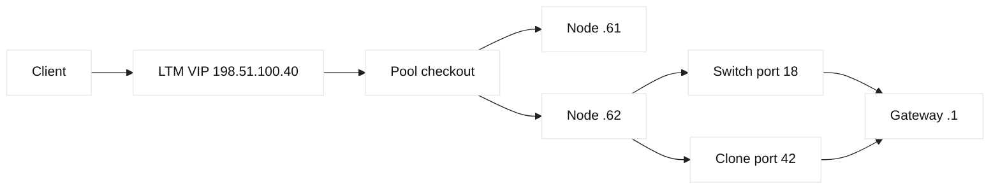
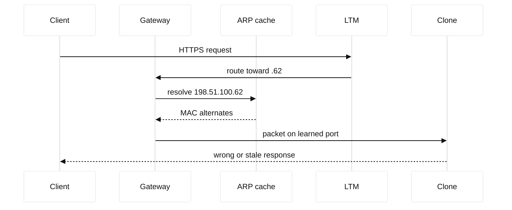

# Case study 10: Duplicate IP detection

## Context and goals

Fictional Northstar Retail operates `checkout.northstar.example` behind an F5 LTM virtual server at 198.51.100.40. The service VLAN is 198.51.100.0/24, reserved for documentation, and its default gateway is 198.51.100.1. At 14:05 UTC on 2026-07-14, a checkout node intermittently returned another store's content and payment requests failed. The goal was to identify whether the fault was an address collision, a stale ARP entry, or an application problem without probing real customer systems. A second goal was to restore service with reversible ownership changes and teach operators why a healthy pool monitor does not prove Layer-2 uniqueness.

**Fact:** clients saw alternating server headers, and two switch ports claimed the same address. **Inference:** a cloned virtual machine probably retained a production-like static address after a lab restore. The address plan, DHCP reservations, IPAM ownership, F5 node list, and switch authentication records were treated as separate evidence sources rather than one presumed truth.

## Architecture

The client reached an LTM VIP over HTTPS. LTM selected pool members 198.51.100.61 and 198.51.100.62, translating server-side source addresses through SNAT 198.51.100.20. Both intended nodes used static reservations documented in IPAM. ARP was resolved by the access switch and gateway; LTM's node health check used TCP and HTTP but did not detect that a different host occasionally answered ARP for .62.

| Object | Intended owner | Evidence source | State at incident |
| --- | --- | --- | --- |
| VIP 198.51.100.40 | Northstar checkout | LTM config | available |
| Node 198.51.100.62 | checkout-blue | IPAM and F5 | disputed |
| MAC aa:bb:cc:00:00:62 | checkout-blue | switch | seen on two ports |
| Gateway 198.51.100.1 | network team | ARP table | flapped |

The duplicate was not assumed to be an LTM duplicate. LTM maintained object names and monitor state, while Ethernet forwarding depended on MAC learning, ARP cache aging, VLAN boundaries, and endpoint behavior. RFC 826 describes ARP operation; RFC 5227 describes IPv4 address-conflict detection. Those standards explain protocol behavior, not the vendor-specific switch command syntax.

## Timeline

At 13:40, a lab image was restored on an isolated hypervisor. At 13:58, a technician connected the restored guest to the checkout VLAN instead of the lab VLAN. At 14:05, support reported sporadic checkout failures. At 14:12, LTM showed both pool members green. At 14:19, a gateway ARP table showed .62 changing MAC addresses. At 14:27, the switch located the same address on ports 18 and 42. At 14:34, port 42 was administratively isolated under an approved incident change. At 14:42, ARP entries were refreshed and transactions stabilized. At 15:10, IPAM and hypervisor inventory were reconciled.

## Evidence

The read-only LTM report showed VIP availability, member monitor timestamps, and normal TCP connect latency. `tmsh show ltm pool checkout members` was used as an illustrative vendor command, with no credentials or production target. A gateway capture using `tcpdump -ni eth0 'arp or host 198.51.100.62'` recorded gratuitous ARP announcements. The switch's fictional `show mac address-table vlan 210` displayed the address on ports 18 and 42 within one minute. Hypervisor inventory identified the restored guest on port 42. **Facts:** ARP ownership changed and two ports were active. **Inference:** the clone caused the collision because its image retained .62.

The application logs added corroboration: request IDs appeared on both checkout-blue and a host banner reading `restore-lab-07`. TLS handshakes were valid because both hosts used the same lab certificate. This explains why certificate and monitor checks were insufficient. An ARP probe from a quarantined diagnostic host produced two replies, but the probe was limited to the reserved VLAN and approved window. No broad scanning was performed.

## Competing hypotheses

One hypothesis was an LTM persistence error. It could explain a user repeatedly reaching one member, but not two MAC addresses claiming one IP. Another was a stale gateway ARP entry; flushing it might temporarily select one host but would not remove the second claimant. A switch loop could cause MAC flapping, yet the port-security logs showed independent authenticated endpoints. A malicious spoof was considered, but the hypervisor event and image checksum made accidental cloning more plausible. Finally, a DNS error was excluded because clients resolved the VIP correctly and the conflict occurred behind it.

## Decision points

The team could disable .62 in LTM, disconnect port 42, or renumber both hosts. Disabling the member protected application traffic but left an unsafe endpoint on the VLAN. Disconnecting the clone was fast and reversible. Renumbering during an incident risked stale ARP and mismatched IPAM records. Operators isolated port 42, retained a packet capture, and then confirmed ownership before changing addresses. This ordering is an engineering inference: containment reduced harm while preserving evidence.

## Remediation

The clone was moved to VLAN 999, an isolated lab network, and its static configuration was removed. The legitimate node obtained a documented reservation, and IPAM became the approval record for all checkout addresses. Switch port security now limits the expected identity and alerts on rapid MAC movement. Endpoint boot scripts run RFC 5227-style duplicate detection before enabling service, while recognizing that detection is a safeguard rather than proof of global uniqueness. LTM node descriptions include owner, VLAN, and reservation ID.

The team added an ARP-flap alert, a daily comparison of IPAM-to-F5 nodes, and a pre-change checklist requiring hypervisor network selection. Monitoring distinguishes member health from address ownership. The application also emits a node identity header in non-sensitive diagnostics, allowing support to correlate a response without exposing payment data. These controls are recommendations, not universal F5 defaults.

## Verification

After isolation, three gateways and two test clients resolved .62 to one MAC for ten consecutive ARP-aging intervals. `arping -D -I eth0 198.51.100.62` returned no conflict from the reserved test host. LTM served 200 synthetic HTTPS requests, and each response carried the expected node identity. The pool monitor remained green, but operators separately verified ARP, switch learning, route reachability, and application correctness. A controlled lab clone triggered the alert and was denied service before joining the checkout VLAN.

## Rollback or recovery

If isolation had removed the legitimate node, the port change could be reversed using the recorded switch transaction and the member could be re-enabled after ARP validation. If the address remained disputed, checkout traffic could temporarily use .61 alone with reduced capacity. Renumbering would be performed only after lowering DNS and operational caches where relevant, updating IPAM, LTM, ACLs, certificates if names changed, and validating both directions. Recovery requires documenting the final MAC, port, owner, and evidence retention period.

## Postmortem lessons

An LTM monitor answers “can this endpoint complete this check?” It does not answer “is this IP uniquely owned on Ethernet?” **Fact:** RFC 826 and RFC 5227 define ARP-related behavior. **Fact:** switch MAC movement and LTM monitor states were observed. **Inference:** image cloning created the duplicate. The durable lesson is to make identity ownership explicit across IPAM, hypervisor, switch, and load balancer systems. Reserved documentation addresses are safe examples but still demand realistic controls.

The review also examined how the incident could have been detected before a customer-visible symptom. IPAM had a reservation, but reservation existence was mistaken for proof that only one interface used the address. The hypervisor template contained a static network file that was copied without a first-boot identity reset. Switch authentication established who connected to a port, yet no control compared that identity with the IPAM owner. LTM descriptions named the intended node but did not receive endpoint identity telemetry. Each system was locally reasonable; the gap was at the ownership boundary.

The new change record therefore includes an explicit “who may answer?” question. A node is not ready merely because its process starts, its certificate verifies, or its LTM monitor turns green. It must have one approved address, one expected MAC or identity binding, one VLAN, and one accountable owner. During incident review, timestamps are normalized to UTC, captures are hashed, and diagnostic probes are limited to reserved prefixes. This preserves chain-of-custody-like discipline without pretending that a teaching case is legal evidence. The same practice helps an SDE1 explain a packet symptom and helps an SDE2 design a durable control.

## Questions and answers

1. **Why did the pool monitor stay green?** Both claimants could answer TCP and HTTP checks, so monitor success did not test unique ARP ownership.
2. **What was the strongest fact?** The switch observed one address on two authenticated ports while the gateway ARP entry changed.
3. **Why not flush ARP first?** Flushing could hide the symptom while the duplicate remained connected and could return later.
4. **What is an inference here?** The restored image caused the conflict; timing, inventory, and banners support it but do not make it a protocol fact.
5. **How did LTM help containment?** Operators could disable one member, preserving service while investigating the Layer-2 condition.
6. **What does RFC 5227 add?** It describes address-conflict detection probes and announcements for IPv4 hosts.
7. **Why involve IPAM?** IPAM records ownership and prevents an apparently free address from being assigned twice.
8. **Can DNS create a duplicate IP?** DNS can point names incorrectly, but it does not make two Ethernet hosts own one address.
9. **Why quarantine instead of power off?** VLAN isolation was reversible and preserved the guest disk and forensic evidence.
10. **What should a pre-change checklist ask?** It should verify VLAN, address, reservation, owner, and duplicate detection before service enablement.
11. **Does a gratuitous ARP prove compromise?** No; it proves an announcement was observed, not whether the cause was malicious.
12. **What is the SDE2 design lesson?** Availability, naming, address ownership, and endpoint identity require cross-system reconciliation.
