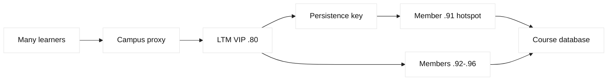
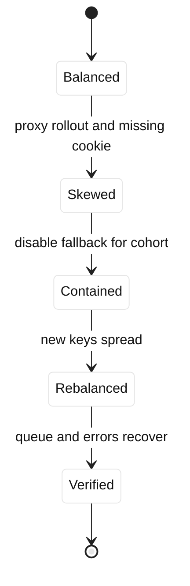

# Case study 11: LTM persistence hotspot

## Context and goals

Fictional Mesa Learning runs `courses.mesa.example` through an F5 LTM VIP at 198.51.100.80. The pool has six application members in 203.0.113.0/24, with SNAT 203.0.113.200. At 09:20 UTC on 2026-07-18, response time rose from 180 ms to 2.4 seconds even though all members were available. The immediate goal was to determine whether persistence, a slow dependency, or insufficient capacity caused the hotspot. The longer goal was to preserve login continuity while distributing new sessions safely. All addresses are documentation ranges and all commands are illustrative read-only diagnostics.

**Fact:** one member held 61% of active sessions and its run queue was high. **Inference:** a persistence key correlated many learners behind a shared egress address, concentrating traffic. The investigation distinguished cookie persistence from source-address persistence and did not assume that equal request counts imply equal work.

## Architecture

Clients terminate TLS at the VIP, where an HTTP profile and persistence policy select a pool member. The application sets a session cookie, but a legacy fallback uses source address when the cookie is absent. A campus proxy collapses thousands of learners onto a small set of egress addresses. LTM health monitors test `/healthz`; they do not measure queue depth or course-render cost.

| Layer | Object or signal | Healthy expectation | Incident observation |
| --- | --- | --- | --- |
| VIP | 198.51.100.80:443 | accepts TLS | accepted |
| Persistence | cookie, fallback source | balanced keys | one key class dominant |
| Pool | six members | 16-17% sessions each | .91 had 61% |
| App | render queue | below 50 | .91 reached 94 |

F5 persistence records are implementation behavior and profile configuration; HTTP cookies and source addresses are protocol/application inputs. RFC 6265 explains cookie semantics, while RFC 7230 describes HTTP message routing context. Those references do not prescribe a universally correct persistence policy. The team treated user continuity, fairness, and failure recovery as separate objectives.

## Timeline

At 08:45, a new campus proxy rollout began. At 09:05, learners authenticated normally. At 09:20, .91 queue depth crossed 80 and support reported slow pages. At 09:28, LTM statistics showed a skewed persistence table. At 09:36, operators confirmed cookies were absent on an embedded course player, activating source fallback. At 09:44, the fallback was disabled for a controlled cohort. At 09:55, new sessions distributed across all members. At 10:30, the application team deployed a cookie fix in staging; production migration remained gated.

## Evidence

`tmsh show ltm persistence persist-records` and pool statistics were collected without changing state. The persistence table contained many source-address records mapped to .91. Application metrics showed .91 had high queue wait but similar CPU per request. A sampled request had no `Set-Cookie` response from the embedded player. A packet capture on a test segment confirmed many learners shared 198.51.100.44 toward the VIP. **Facts:** key concentration, missing cookie, and shared source were observed. **Inference:** the proxy rollout exposed the fallback path.

A dependency slowdown was evaluated by comparing database latency and member-local queue time. Database p95 remained under 90 ms while .91 queue wait grew, reducing confidence in the dependency hypothesis. LTM monitor latency stayed low because `/healthz` did not exercise course rendering. This is a useful distinction between liveness and capacity evidence.

## Competing hypotheses

The first hypothesis was a failing member. It was partly inconsistent with successful health checks and normal error rates, though overload can precede failure. The second was database contention; traces did not show a corresponding database increase. The third was a persistence hotspot caused by source-address fallback; it fit the distribution and proxy timing. The fourth was an LTM hash bug; a lab replay with stable cookies distributed correctly, making configuration and client behavior more likely than a platform defect.

## Decision points

Operators could disable all persistence, disable only source fallback, or drain .91. Removing all persistence risked logouts and duplicate carts. Draining .91 protected latency but could move a large cohort abruptly. A staged policy change for new sessions preserved existing sessions while allowing rebalance. The team chose a cohort test, watched errors and login continuity, then changed the fallback policy. This trade-off is an engineering inference based on session sensitivity.

## Remediation

The embedded player now forwards the application session cookie and rejects silent fallback. The LTM profile uses a bounded cookie lifetime and records a versioned policy name. A source-address fallback remains only for a documented legacy path with a low timeout and alert. Member capacity metrics feed adaptive admission, but health monitors remain simple and deterministic. The campus proxy team documents egress aggregation so application architects do not mistake client IP diversity for user diversity.

Runbooks now graph persistence-key cardinality, sessions per member, queue wait, and rebalance rate together. A synthetic test checks cookie issuance through the player path. Changes are staged with a small learner cohort and a rollback switch. No command in this case modifies a real appliance.

## Verification

After the policy change, six members held between 14% and 19% of new sessions over 30 minutes. Existing authenticated learners retained sessions, and .91 queue depth fell below 35. Synthetic flows tested login, course playback, refresh, and member disablement. A disabled member caused only its expected records to reselect; the VIP remained available. Metrics were compared with application traces because a balanced session count alone does not prove balanced work.

## Rollback or recovery

If the cookie policy caused login loops, operators would restore the previous versioned profile for new connections, leave established sessions untouched, and drain only if error budgets were exceeded. If a member failed during migration, records would expire according to the documented timeout and traffic would reselect. Recovery includes checking cart and course state for duplicate writes, not merely checking HTTP status. The change record retains exports of pre-change persistence statistics.

## Postmortem lessons

Persistence is a fairness constraint that can conflict with capacity distribution. Source addresses may represent proxies, NAT gateways, or whole campuses rather than individuals. **Fact:** cookie behavior follows application responses and client handling; F5 mapping follows configured persistence. **Inference:** the proxy rollout exposed an existing fallback weakness. Health checks should answer a narrowly defined question, and queue telemetry should be paired with them when overload matters.

The review reconstructed a single learner journey rather than relying on aggregate graphs. A browser first received a cookie from the login route, then an embedded player made a request without forwarding it. LTM therefore saw a source key shared by an entire campus proxy. When .91 became slow, retries increased the number of outstanding requests on the same member, creating positive feedback. This did not require a defect in the persistence algorithm. It was a mismatch between the application’s identity model and the network’s address aggregation.

Capacity planning now records both sessions and work units. A video manifest, a report export, and a health request have different costs even when each is one HTTP request. The service owner publishes whether a route is safe to reselect, whether writes are idempotent, and which cookie attributes are required. Operators test privacy and security properties of the cookie separately from distribution properties: a cookie must not contain secrets, and its scope must not accidentally cross unrelated services. These details turn a one-time tuning change into an understandable contract.

During the incident, support initially suggested increasing pool size because the dashboard showed six green members. That would have added capacity without changing key distribution and could have delayed recognition of the missing-cookie defect. The final review asks whether a scale change changes the mapping function, cost per request, or only endpoint count. It records what happens to existing records when a member is drained, restarted, or removed. Those questions make persistence changes testable instead of anecdotal.

The change review also names an owner for session semantics. Network engineers can configure a persistence profile, but application engineers must say whether a request may move after authentication, whether writes can be replayed, and how logout invalidates a cookie. Security reviewers check cookie scope, transport protection, and retention. Capacity reviewers check key cardinality and worst-case aggregation. This shared review prevents a local optimization from becoming an unexamined availability or privacy change.

## Questions and answers

1. **What made the hotspot visible?** One member held most persistence records while its queue wait rose far above peers.

Interview reasoning: Map the answer to the BIG-IP LTM object model: virtual server and profiles admit the client flow, a monitor determines member eligibility, a pool chooses a member, and SNAT/persistence influence the server-side tuple. In a diagnosis, compare VIP-side and member-side captures, monitor logs, pool state, persistence records, and return routing. The caveat is that a green monitor is only evidence for that probe; it is not proof that every user request, TLS name, dependency, or capacity budget is healthy.

2. **Why is source persistence risky at a campus?** Thousands of users can appear as one source address and share one member.

Interview reasoning: Map the answer to the BIG-IP LTM object model: virtual server and profiles admit the client flow, a monitor determines member eligibility, a pool chooses a member, and SNAT/persistence influence the server-side tuple. In a diagnosis, compare VIP-side and member-side captures, monitor logs, pool state, persistence records, and return routing. The caveat is that a green monitor is only evidence for that probe; it is not proof that every user request, TLS name, dependency, or capacity budget is healthy.

3. **Did disabling all persistence seem attractive?** It did, but it could break login continuity and duplicate stateful operations.

Interview reasoning: Map the answer to the BIG-IP LTM object model: virtual server and profiles admit the client flow, a monitor determines member eligibility, a pool chooses a member, and SNAT/persistence influence the server-side tuple. In a diagnosis, compare VIP-side and member-side captures, monitor logs, pool state, persistence records, and return routing. The caveat is that a green monitor is only evidence for that probe; it is not proof that every user request, TLS name, dependency, or capacity budget is healthy.

4. **What was the key inference?** Missing cookies activated source fallback after the proxy rollout; evidence supported, rather than proved, causation.

Interview reasoning: Map the answer to the BIG-IP LTM object model: virtual server and profiles admit the client flow, a monitor determines member eligibility, a pool chooses a member, and SNAT/persistence influence the server-side tuple. In a diagnosis, compare VIP-side and member-side captures, monitor logs, pool state, persistence records, and return routing. The caveat is that a green monitor is only evidence for that probe; it is not proof that every user request, TLS name, dependency, or capacity budget is healthy.

5. **Why was `/healthz` insufficient?** It tested liveness, not course rendering, queue depth, or dependency-heavy work.

Interview reasoning: Map the answer to the BIG-IP LTM object model: virtual server and profiles admit the client flow, a monitor determines member eligibility, a pool chooses a member, and SNAT/persistence influence the server-side tuple. In a diagnosis, compare VIP-side and member-side captures, monitor logs, pool state, persistence records, and return routing. The caveat is that a green monitor is only evidence for that probe; it is not proof that every user request, TLS name, dependency, or capacity budget is healthy.

6. **What does RFC 6265 describe?** Cookie syntax and handling rules that influence whether an application persistence cookie returns.

Interview reasoning: Map the answer to the BIG-IP LTM object model: virtual server and profiles admit the client flow, a monitor determines member eligibility, a pool chooses a member, and SNAT/persistence influence the server-side tuple. In a diagnosis, compare VIP-side and member-side captures, monitor logs, pool state, persistence records, and return routing. The caveat is that a green monitor is only evidence for that probe; it is not proof that every user request, TLS name, dependency, or capacity budget is healthy.

7. **How can a staged change help?** New sessions test the policy while established users retain their current mapping.

Interview reasoning: Map the answer to the BIG-IP LTM object model: virtual server and profiles admit the client flow, a monitor determines member eligibility, a pool chooses a member, and SNAT/persistence influence the server-side tuple. In a diagnosis, compare VIP-side and member-side captures, monitor logs, pool state, persistence records, and return routing. The caveat is that a green monitor is only evidence for that probe; it is not proof that every user request, TLS name, dependency, or capacity budget is healthy.

8. **What metric beats session count alone?** Queue wait and request cost reveal uneven work even when counts look balanced.

Interview reasoning: Map the answer to the BIG-IP LTM object model: virtual server and profiles admit the client flow, a monitor determines member eligibility, a pool chooses a member, and SNAT/persistence influence the server-side tuple. In a diagnosis, compare VIP-side and member-side captures, monitor logs, pool state, persistence records, and return routing. The caveat is that a green monitor is only evidence for that probe; it is not proof that every user request, TLS name, dependency, or capacity budget is healthy.

9. **When is source fallback acceptable?** Only for an explicitly bounded legacy path with known aggregation and a recovery plan.

Interview reasoning: Map the answer to the BIG-IP LTM object model: virtual server and profiles admit the client flow, a monitor determines member eligibility, a pool chooses a member, and SNAT/persistence influence the server-side tuple. In a diagnosis, compare VIP-side and member-side captures, monitor logs, pool state, persistence records, and return routing. The caveat is that a green monitor is only evidence for that probe; it is not proof that every user request, TLS name, dependency, or capacity budget is healthy.

10. **Why involve the proxy team?** Egress aggregation changes the meaning of client IP and can create hidden persistence cardinality.

Interview reasoning: Map the answer to the BIG-IP LTM object model: virtual server and profiles admit the client flow, a monitor determines member eligibility, a pool chooses a member, and SNAT/persistence influence the server-side tuple. In a diagnosis, compare VIP-side and member-side captures, monitor logs, pool state, persistence records, and return routing. The caveat is that a green monitor is only evidence for that probe; it is not proof that every user request, TLS name, dependency, or capacity budget is healthy.

11. **What should rollback preserve?** Versioned profiles, existing sessions, pre-change statistics, and evidence of user-state behavior.

Interview reasoning: Map the answer to the BIG-IP LTM object model: virtual server and profiles admit the client flow, a monitor determines member eligibility, a pool chooses a member, and SNAT/persistence influence the server-side tuple. In a diagnosis, compare VIP-side and member-side captures, monitor logs, pool state, persistence records, and return routing. The caveat is that a green monitor is only evidence for that probe; it is not proof that every user request, TLS name, dependency, or capacity budget is healthy.

12. **What is the SDE2 lesson?** Design persistence around identity and workload semantics, not a convenient but misleading address key.

Interview reasoning: Map the answer to the BIG-IP LTM object model: virtual server and profiles admit the client flow, a monitor determines member eligibility, a pool chooses a member, and SNAT/persistence influence the server-side tuple. In a diagnosis, compare VIP-side and member-side captures, monitor logs, pool state, persistence records, and return routing. The caveat is that a green monitor is only evidence for that probe; it is not proof that every user request, TLS name, dependency, or capacity budget is healthy.
