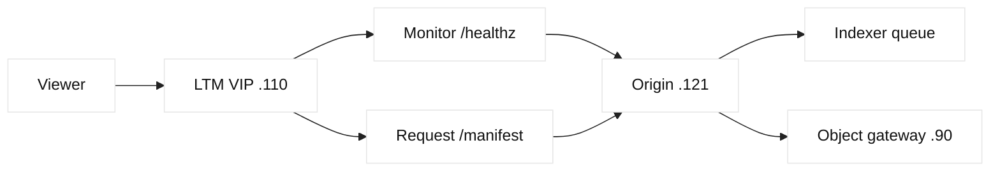
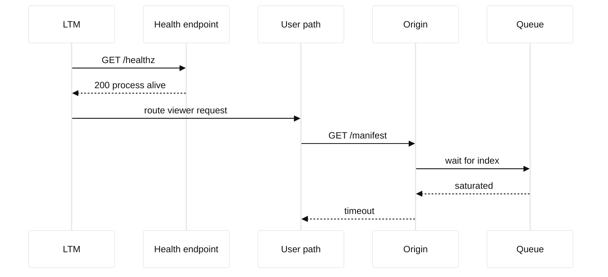

# Case study 12: LTM monitor false positive

## Context and goals

Fictional Copper Valley Media serves `stream.copper.example` through an LTM VIP at 198.51.100.110. Four origin nodes live in 203.0.113.0/24. At 20:10 UTC on 2026-07-22, viewers saw intermittent HTTP 503 responses while every LTM member was marked available. The goal was to decide whether the monitor was too shallow, the pool was overloaded, or a proxy path was failing. The team also wanted a monitor that reflects readiness without causing harmful load. Addresses, hostnames, and commands are fictional and reserved for documentation.

**Fact:** the monitor requested `/healthz` and received HTTP 200, while viewer requests to `/manifest` timed out. **Inference:** the monitor was a false positive for the user journey, not necessarily a defective monitor implementation. The distinction matters: changing thresholds without understanding endpoint semantics could hide a real capacity problem.

## Architecture

LTM terminated client TLS at 198.51.100.110 and opened server-side TLS to origins. The monitor used a lightweight HTTP request with an expected status of 200. A sidecar returned 200 whenever its process was alive, even when the media indexer queue exceeded limits. Origins fetched manifests from an object gateway at 192.0.2.90. LTM health status therefore tested process reachability, not manifest readiness.

| Signal | Endpoint or source | Intended meaning | Incident result |
| --- | --- | --- | --- |
| LTM monitor | `/healthz` | process alive | 200 on all nodes |
| User path | `/manifest` | playable catalog | timeout on .121/.122 |
| Queue | indexer metric | readiness capacity | above limit |
| Pool | LTM stats | routing availability | all green |

F5 monitor behavior is vendor configuration; HTTP status and timeout semantics are protocol/application facts. RFC 9110 defines HTTP response semantics, while RFC 6298 is relevant to transport retransmission timing but does not define an application health policy. Recommendations below are engineering inferences tailored to this fictional service.

## Timeline

At 19:40, a catalog import began. At 20:00, queue depth exceeded the normal warning threshold. At 20:10, viewer 503s increased. At 20:14, LTM dashboards showed all members green. At 20:22, an operator manually requested `/manifest` from each origin and reproduced timeouts on two. At 20:31, a read-only monitor simulation recorded 200 for `/healthz` and 504-like latency for `/manifest`. At 20:45, the import was paused and two origins were drained. At 21:05, playback recovered. At 22:00, a staged readiness monitor passed in the test pool.

## Evidence

The monitor definition showed a short timeout, `GET /healthz`, and expected status 200. Pool statistics showed no member transitions. Origin access logs showed `/manifest` latency above 10 seconds, while `/healthz` stayed below 5 ms. Queue telemetry correlated with failures. A controlled `curl --resolve stream.copper.example:443:198.51.100.121 https://stream.copper.example/manifest` was run only against the fictional test address. **Facts:** endpoint latency differed and queue was high. **Inference:** readiness was broader than liveness.

TLS inspection confirmed that certificates and SNI were correct, so transport security was not the primary explanation. The object gateway showed normal latency for small probes but elevated latency for catalog reads. This supported a dependency-plus-capacity explanation rather than a malformed monitor response. The team retained response headers and timestamps, excluding viewer identifiers.

## Competing hypotheses

A monitor timeout bug was considered, but monitor packets and responses were consistent. A pool member crash was unlikely because processes and `/healthz` remained alive. A TLS mismatch was excluded by successful handshakes and valid SNI. Object-gateway slowness contributed, but queue saturation was the direct user-facing bottleneck. A bad LTM persistence choice was checked and found not to explain failures across multiple origins.

## Decision points

The team could simply increase the monitor timeout, mark members down on queue thresholds, or create a deeper readiness endpoint. Increasing timeout would preserve false positives and could consume monitor resources. An aggressive queue monitor might oscillate during transient imports. A readiness endpoint with bounded dependency checks, plus hysteresis and a maintenance drain, offered clearer semantics. Operators paused imports, drained affected members, and tested a new monitor in a shadow pool before production use.

## Remediation

The application now exposes `/readyz`, returning 200 only when index freshness, queue depth, and a bounded object-gateway probe meet documented limits. It returns a distinct non-200 status with a reason class that is safe for logs. LTM uses a moderate timeout, send string, receive status, and rise/fall counts. The monitor never performs a full catalog download. A separate synthetic user journey measures manifest latency and alerts; it does not directly control pool membership.

Runbooks explain liveness versus readiness and require an owner for every monitor endpoint. Imports advertise planned load and can be paused. Dashboard panels show monitor state beside queue, dependency latency, and user errors. The design avoids treating a vendor default or one status code as universal truth.

## Verification

In a test pool, a forced queue saturation caused `/readyz` to fail after the configured fall count, while `/healthz` remained green. Recovery required the configured rise count after freshness returned. Viewer-like synthetic requests succeeded on remaining members and failed predictably when all were intentionally drained. Monitor request volume was measured to stay below the service budget. A canary production change was observed across two import cycles before full rollout.

## Rollback or recovery

If `/readyz` falsely removed healthy members, the versioned monitor could be restored and the pool reopened after checking user-path latency. If all members were marked down, a maintenance fallback could route to a known-safe static response while operators paused imports. Recovery requires checking queue freshness, gateway health, and application errors rather than forcing monitors green. The prior monitor definition and test results remain attached to the change record.

## Postmortem lessons

“Green” is meaningful only relative to the question a monitor asks. **Fact:** the old endpoint returned 200 while the user endpoint timed out. **Inference:** the monitor produced a false positive for readiness because it measured process liveness. Health design is an application contract, and LTM provides enforcement mechanics. A useful monitor is cheap, deterministic, dependency-aware within bounds, and paired with independent synthetic observation.

The team wrote an endpoint contract in plain language before editing the monitor. `/healthz` means the process can accept a local request and should remain inexpensive. `/readyz` means a new viewer request has a reasonable chance of obtaining a fresh manifest within the service budget. The contract names the freshness window, queue limit, dependency timeout, and response classes. It also says what happens during planned imports. This avoids turning an undocumented implementation detail into an accidental traffic policy.

A monitor can be too deep as well as too shallow. If it authenticates as a privileged account, downloads large objects, or follows every dependency, it can consume the very capacity it measures and create noisy failures. The staged test measured monitor CPU, request rate, and dependency calls. The synthetic journey used a separate budget and alert path, so a monitor regression could not silently remove every member. This separation made the final design easier to explain during an incident and easier to roll back.

The response contract includes failure modes that do not warrant immediate removal. A short object-gateway timeout can produce a warning and leave a member available if cached manifests remain safe; stale index data beyond the published window should fail readiness. This policy is deliberately service-specific. LTM can enforce a binary up or down result, while richer degradation belongs in application metrics and admission controls. Operators document these boundaries so an engineer does not copy the monitor to an unrelated pool and assume identical semantics.

The final dashboard places monitor transitions next to user success rate, manifest freshness, queue depth, and dependency latency. During review, each metric is labeled as observed telemetry or an inference derived from several signals. That small discipline prevents a green monitor from being presented as proof that every route is healthy. It also gives the incident commander a clear next action: inspect readiness, drain deliberately, or investigate a dependency rather than repeatedly editing timeout values.

The service owner signs the endpoint contract and revisits it when dependencies change.

## Questions and answers

1. **Was the monitor broken?** Not mechanically; it correctly observed a 200 from an endpoint that was too shallow for user readiness.
2. **Why did viewers get 503s?** Manifest requests waited behind a saturated indexer and exceeded the request timeout.
3. **Why not download a full catalog in the monitor?** That would create load and make monitoring part of the outage.
4. **What is the key inference?** Liveness and readiness diverged during import; correlated queues support that explanation.
5. **What does rise/fall hysteresis do?** It reduces flapping by requiring repeated failures and successes before state changes.
6. **What does HTTP 200 prove?** Only that the endpoint produced that response under that request; it does not prove every dependency works.
7. **Why keep a synthetic journey?** It measures user-visible behavior independently from membership control.
8. **Could TLS cause the issue?** It was checked and excluded after successful SNI-aware handshakes and valid certificates.
9. **When should readiness fail?** When documented freshness, queue, or bounded dependency conditions mean new work cannot complete reliably.
10. **Why stage in a shadow pool?** It tests semantics and load without immediately changing production routing.
11. **What evidence is safe to retain?** Timestamps, status classes, latency, and redacted headers, not viewer content or secrets.
12. **What is the SDE2 lesson?** Define health as a contract with the application team and validate it against the real request path.
