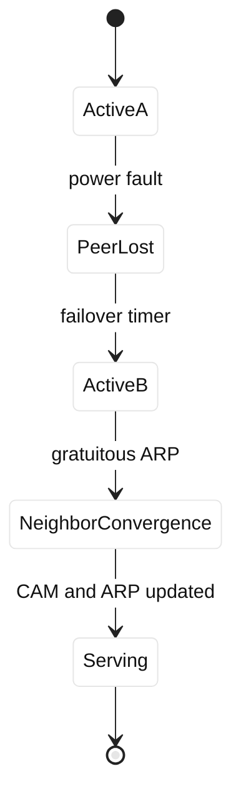

# Case study 13: LTM HA failover

## Context and goals

Fictional Harbor Analytics runs `reports.harbor.example` on an active-standby BIG-IP LTM pair. The floating self IP is 198.51.100.150, the VIP is 198.51.100.151, and pool members use 203.0.113.31 through .34. The devices exchange failover state over a dedicated fictional VLAN 250. At 03:12 UTC on 2026-07-26, reports began timing out as the active unit rebooted after a power-controller fault. The goals were to establish whether standby ownership, ARP convergence, connection mirroring, or upstream switching caused the outage, and to recover without creating split brain.

**Fact:** the standby became active, but clients continued sending traffic to the old MAC for approximately 42 seconds. **Inference:** upstream ARP and CAM aging dominated the outage window; configuration synchronization was current. The team treated stateful failover as several independent mechanisms: device health, configuration sync, traffic-group ownership, neighbor discovery, and application recovery.

## Architecture

The pair shared a traffic group and floating address. Each device had a management address and a unique self IP; the VIP was not tied to either physical management address. A redundant upstream switch pair learned the floating MAC. Connection mirroring was enabled for selected TCP flows but could not preserve every application transaction across an abrupt power loss. Monitors and pool state were synchronized configuration, not a guarantee that existing sockets would survive.

| Component | Expected behavior | Observed during failover |
| --- | --- | --- |
| Active unit | owns floating VIP | rebooted |
| Standby unit | assumes traffic group | assumed after timer |
| Upstream ARP/CAM | points to floating MAC | stale for 42 seconds |
| Pool state | monitors synchronized | remained current |

```mermaid
%%{init: {"theme":"base","themeVariables":{"primaryColor":"#ffffff","primaryTextColor":"#111111","lineColor":"#222222"}}}%%
flowchart LR
 C[Clients] --> SW[Upstream switch pair]
 SW --> A[Active LTM A]
 SW --> B[Standby LTM B]
 A --> F[Floating VIP .151]
 B --> F
 A -. failover VLAN .250 .-> B
 F --> P[Report pool .31-.34]
```

F5 HA and traffic-group behavior are vendor facts that must be checked against the deployed release documentation. Ethernet neighbor behavior follows ARP in RFC 826; TCP retransmission and connection semantics are described by RFC 9293. Standards do not promise application transaction continuity after a device crash. All addresses here are documentation ranges.

## Timeline

At 03:11:40, power-controller alarms appeared on unit A. At 03:12:02, A stopped forwarding. At 03:12:08, B declared the peer unavailable. At 03:12:10, B owned the traffic group and sent a gratuitous ARP. At 03:12:22, some clients still used the old switch entry. At 03:12:44, CAM and ARP converged. At 03:13:05, synthetic reports succeeded. At 03:25, operators verified config-sync status and disabled automatic re-election pending hardware review. At 05:00, a controlled maintenance failover passed.



## Evidence

Device event logs showed A rebooting and B assuming the traffic group. Config-sync reports matched before the event. Switch logs showed the floating MAC moving from A's port to B's port after the failover notification. Captures on a test client showed retransmissions until ARP refreshed. `tmsh show sys failover` and `tmsh show sys connection` are illustrative read-only commands. **Facts:** ownership changed, config was current, and neighbor state lagged. **Inference:** stale upstream state caused most lost packets.

Application logs showed some report jobs retried safely, while streaming exports needed a new session. This distinction is expected from TCP and application semantics, not evidence that mirroring failed universally. The team checked pool member health separately and found no simultaneous origin failure. A clock comparison ruled out a misleading timestamp offset.

## Competing hypotheses

A config-sync gap could have made B advertise an old VIP, but hashes and object lists matched. Split brain was considered; peer-loss logs and only one observed owner argued against simultaneous forwarding. A failed pool was inconsistent with successful origin probes. A switch multicast issue was considered because gratuitous ARP timing varied, but unicast traffic and CAM logs pointed to aging. Connection-mirroring failure explained some resets but not clients resolving the old MAC.

## Decision points

Operators could force B active immediately, wait for its timer, or restore A. Forcing ownership risked dual active if A recovered unexpectedly. Waiting increased loss but preserved split-brain safety. They confirmed A was electrically isolated, then allowed B to own the group. A temporary static ARP change was rejected because it would create hidden state and be hard to reverse. This ordering is an engineering inference emphasizing fencing before promotion.

## Remediation

The pair now has an independent management and failover path, tested power fencing, and documented ownership priorities. Upstream switches use a bounded MAC-aging policy compatible with floating-MAC movement. The network team verified gratuitous ARP handling and recorded exceptions for the service VLAN. Stateful mirroring is limited to flows whose applications tolerate partial replay; reports use idempotent job IDs. Monitors and configuration synchronization are checked before every planned failover.

Runbooks include “fence, promote, converge, verify” and explicitly prohibit simultaneous manual activation. Alerting covers peer status, sync age, traffic-group owner, CAM movement, and synthetic report success. A quarterly drill measures packet loss, session recovery, and operator decision time. These are operational recommendations, not claims about all F5 releases.

## Verification

A controlled failover during a maintenance window produced one floating owner, a MAC move in the switch logs, and successful ARP resolution from three test subnets. Ten new HTTPS reports completed on B, and interrupted jobs resumed using idempotent identifiers. Existing long-lived exports were expected to reconnect rather than silently continue. The team repeated the test with A isolated at the power layer, proving that fencing prevented split brain.

## Rollback or recovery

If B exhibited a software fault, operators would stop accepting new work, fence B, and promote A only after verifying A's health and configuration revision. If neighbor convergence failed, the switch team would use the documented reversible aging adjustment while preserving normal ARP behavior afterward. A rollback never consists of powering both units on and hoping election resolves it. Recovery requires one owner, synchronized configuration, stable neighbor entries, and application-level retries.

## Postmortem lessons

HA is a chain, not a checkbox. **Fact:** B assumed ownership and clients initially retained stale neighbor state. **Inference:** convergence, rather than configuration, controlled the observed gap. Connection mirroring reduces disruption for some flows but cannot guarantee durable application work after a crash. Fencing, ownership observability, and synthetic verification are as important as standby capacity.

The exercise changed the team's language from “the standby is healthy” to “the standby is ready to own this traffic group.” Readiness includes current configuration, matching profiles and certificates, reachable pool members, a working failover channel, and a known upstream convergence behavior. A device can pass its local checks while the path above it still forwards to a former owner. The drill recorded each transition separately so future incident commanders can state which layer is healthy and which remains uncertain.

Application owners also accepted that load-balancer HA cannot replace durable queues. A report submission receives an idempotency key before it enters the pool, and workers reconcile unfinished jobs after reconnect. This is more reliable than promising that every TCP byte survives a power failure. Network operations, platform engineering, and application engineering now share one failover test: the first measures ownership and packet convergence, the second measures TLS and pool behavior, and the third measures job correctness. The evidence is kept with the change rather than in disconnected dashboards.

The drill also exposed a human failure mode: two engineers independently interpreted a stale console as evidence that each unit owned the traffic group. The revised procedure requires one incident commander to announce the owner, one operator to verify fencing, and a second reviewer to confirm switch and client observations. Screenshots are supplementary; timestamps from device logs, switch events, and synthetic probes are the primary record. This division reduces the chance that a hurried manual action turns a single-device outage into split brain.

The resulting handoff template records the traffic-group owner, peer reachability, synchronization revision, floating MAC, upstream port, and application test result. It includes a stop condition whenever two sources disagree. A planned exercise intentionally delays ARP convergence so engineers learn to distinguish expected packet loss from a dangerous ownership dispute. The exercise is run against the reserved topology and never against a tenant or customer VLAN.

The template is stored with the service's recovery objective and reviewed after hardware or switch changes.

## Questions and answers

1. **What failed first?** The active unit lost forwarding after a power-controller fault.
2. **Why did standby not restore every socket?** Abrupt failure and application semantics limit what connection mirroring can preserve.
3. **What was the main inference?** Stale ARP and CAM state extended impact after B owned the VIP.
4. **Why fence before promotion?** Fencing prevents the old unit from returning as a second active owner.
5. **What does config sync prove?** It proves selected configuration matched, not that traffic or sessions are currently healthy.
6. **Why avoid static ARP?** Hidden static state can mask the design issue and complicate safe rollback.
7. **What should synthetic tests cover?** New connections, report completion, retries, and expected behavior for interrupted jobs.
8. **What does RFC 826 explain?** IPv4 ARP request, reply, and cache behavior relevant to neighbor convergence.
9. **Can HA eliminate packet loss?** No; convergence and transport retransmission create a bounded but nonzero interruption.
10. **Why document traffic-group ownership?** Operators need one authoritative owner during incidents and drills.
11. **What is an application-level safeguard?** Idempotent report job IDs let retries avoid duplicate work.
12. **What is the SDE2 lesson?** Model device, state, neighbor, transport, and application recovery as separate layers.
