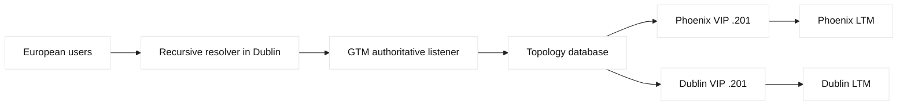
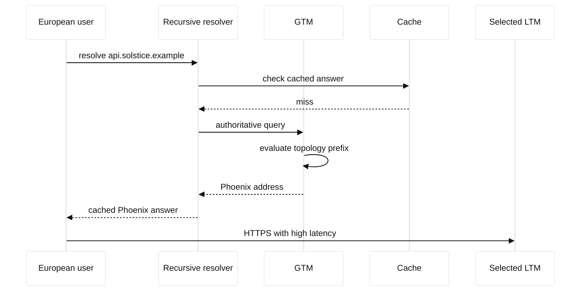

# Case study 14: GTM topology misrouting

## Context and goals

Fictional Solstice Bank publishes `api.solstice.example` through BIG-IP DNS, historically called GTM. The Wide IP has pools for fictional Phoenix and Dublin data centers, using documentation addresses 198.51.100.201 and 203.0.113.201. At 16:30 UTC on 2026-07-30, European clients were sent to Phoenix, increasing latency and causing token requests to exceed their budget. The goals were to determine whether topology records, recursive resolver location, DNS caching, or LTM availability caused the steering error, then correct policy without creating a global outage.

**Fact:** authoritative answers selected Phoenix for several resolvers whose egress addresses were mapped to North America. **Inference:** the topology map modeled recursive resolver source rather than the end-user population, and recent resolver changes exposed the mismatch. DNS steering is inherently dependent on the source address visible to the authoritative service.

## Architecture

Authoritative BIG-IP DNS listeners answered recursive resolvers for `api.solstice.example`. The Wide IP contained a topology-enabled pool with virtual servers representing LTM VIPs. A resolver in Dublin could serve users across Europe, while carrier-grade NAT could aggregate users from multiple countries. Health monitors evaluated LTM VIP availability. DNS TTL was 60 seconds for the incident service, but cached answers remained valid until their expiration.

| Object | Intended role | Incident observation |
| --- | --- | --- |
| Wide IP | policy for api name | topology enabled |
| Phoenix VIP | 198.51.100.201 | selected too often |
| Dublin VIP | 203.0.113.201 | healthy but underused |
| Topology record | resolver-prefix mapping | stale/overbroad |

DNS protocol behavior, including TTL and resolver caching, is described by RFC 1034 and RFC 1035. BIG-IP DNS Wide IP, topology records, and monitor integration are vendor-specific facts that require release documentation. The case does not assume EDNS Client Subnet is enabled; if it were, privacy and policy implications would need separate review.

## Timeline

At 15:40, a carrier migrated recursive resolver capacity. At 16:10, topology records were updated for a new resolver prefix but the old broad prefix remained. At 16:30, European latency alerts fired. At 16:38, operators compared answers from two resolvers and found different selections. At 16:50, both LTM VIPs and monitors were healthy. At 17:05, the broad record was disabled in a staged policy copy. At 17:15, new answers preferred Dublin. At 18:00, cache expiry completed and latency returned to baseline.

## Evidence

`dig @192.0.2.53 api.solstice.example +noall +answer +stats` was run against a fictional resolver, and the answer, TTL, and query time were recorded. Repeating through a Dublin and Phoenix test resolver produced different answers. BIG-IP DNS pool statistics showed both VIPs available. The topology table contained an old /12 mapping that covered the carrier's new resolver prefix. **Facts:** answer differences, healthy VIPs, and overlapping records were observed. **Inference:** the stale broad record caused misrouting.

Traceroute and application timing were collected from reserved test clients, not bank users. A DNS packet capture showed no protocol error; the response was syntactically valid and within TTL. This is important because a valid DNS answer can still be a poor policy result. Resolver location was treated as a proxy, not a guaranteed end-user location.

## Competing hypotheses

A Dublin LTM failure would explain Phoenix selection, but health and direct HTTPS checks were normal. A DNS cache bug was considered, yet answers changed as expected after expiry. A wrong geolocation database was possible, but the explicit broad topology record was sufficient explanation. Client VPN use could also make resolver geography misleading. A low TTL would not correct an incorrect answer until caches expired; it was a mitigation window, not a policy fix.

## Decision points

The team could remove topology steering, delete the broad record, or add a higher-priority narrow record. Removing steering would protect correctness but lose locality. Deleting the broad record was reversible and targeted. A narrow record risked another overlap if precedence was misunderstood. Operators cloned the policy, disabled the broad record, validated answer matrices, then promoted the change. They did not flush third-party caches, because cache ownership was external.

## Remediation

Topology records now have an owner, prefix provenance, effective date, and expiry review. Overlap detection runs before publication and reports which record wins for representative resolver prefixes. The policy documents that resolver geography approximates client geography and lists VPN, NAT, and roaming limitations. A fallback pool uses availability and capacity when no reliable topology match exists. Monitoring samples answers from multiple resolvers and compares latency by client region.

The DNS team also aligned TTL expectations with change safety. A 60-second TTL does not guarantee immediate global convergence, and a resolver may serve within permitted rules. LTM health remains a prerequisite, not a replacement for answer correctness. Changes use a staged Wide IP, signed review, and an explicit rollback record.

## Verification

After the policy promotion, test resolvers in Europe received Dublin and Phoenix received Phoenix for ten query intervals. TTL values decremented normally, and a controlled cache retained the old answer only until expiry. HTTPS synthetic requests measured regional latency within budget. Both VIPs were independently disabled in a test policy to verify fallback behavior. The topology overlap checker returned no winner ambiguity for sampled prefixes.

## Rollback or recovery

If Dublin began failing, the prior policy version could be restored or the Dublin record disabled while Phoenix served as an availability fallback. If the new map misrouted another carrier, operators could re-enable the broad record only with an incident owner and a documented TTL impact. Recovery includes waiting through old TTLs and communicating that cached answers cannot be recalled by the authoritative service. Evidence captures remain available for comparison.

## Postmortem lessons

Topology steering is a policy approximation, not a GPS feed. **Fact:** recursive resolvers supplied the source addresses used for matching. **Inference:** resolver migration exposed an overbroad record. Valid DNS syntax, green LTM monitors, and low TTL do not guarantee correct user locality. Ownership, overlap testing, resolver diversity, and explicit cache expectations make GTM decisions safer.

The review added a resolver-perspective matrix to every topology change. It lists representative corporate, public, mobile, VPN, and carrier resolvers, the address visible to the authoritative service, the expected pool, and the measured application latency. A new prefix is tested both while the old record exists and after it is removed, because longest-prefix and record-order assumptions can differ between policy implementations. The matrix is not a promise that every user follows the nearest resolver; it is an explicit statement of what the team knows and what remains an approximation.

The organization also separated correctness from speed. A nearby answer is useful only if the selected service is healthy, authorized for that client, and within the latency budget. Conversely, a distant answer can be acceptable during a regional failure. The Wide IP policy therefore documents availability fallback and does not encode business authorization in an unreviewed topology record. DNS operations retain the previous policy, effective TTL, and resolver samples so an incident commander can explain why old answers remain visible after a change. This makes cache behavior part of recovery planning rather than a surprising afterthought.

Finally, the team reviewed privacy and governance. Resolver prefixes can reveal organizational or geographic information, and an answer policy can affect where requests and regulated data travel. The topology table stores the minimum prefix detail needed for steering, restricts access to change history, and routes authorization decisions through application owners. **Fact:** DNS answers are cached and observable by recursive infrastructure. **Inference:** a topology correction can change data-path geography and deserves security review even when no packet-processing code changes. The review made that dependency visible to both network and software teams.

The change board now requires a resolver sample before and after each topology publication. Samples include the question name, resolver class, selected pool, TTL, and application latency, while omitting user payloads. A reviewer checks that an emergency availability fallback remains possible and that no record silently expands ownership beyond its documented prefix. These lightweight controls make an otherwise abstract DNS policy measurable and provide an honest basis for discussing uncertainty during an outage.

The owner also records when the sample was collected so cache age is not mistaken for policy state.

## Questions and answers

1. **Why did Europe receive Phoenix?** A stale broad topology prefix matched the new recursive resolver address.

Interview reasoning: Separate DNS decision time from application connection time. BIG-IP DNS/GTM evaluates Wide IP pools, topology or other methods, server/virtual-server health, and sometimes limits before returning an address; recursive caches may continue serving that answer until TTL expiry. Diagnose authoritative and recursive views, monitor state, topology data, TTL, and the resulting LTM path. The caveat is that DNS steering cannot revoke already cached answers or guarantee data consistency during a site failover.

2. **What was directly observed?** Resolver answer differences, healthy VIPs, and an overlapping /12 topology record.

Interview reasoning: Separate DNS decision time from application connection time. BIG-IP DNS/GTM evaluates Wide IP pools, topology or other methods, server/virtual-server health, and sometimes limits before returning an address; recursive caches may continue serving that answer until TTL expiry. Diagnose authoritative and recursive views, monitor state, topology data, TTL, and the resulting LTM path. The caveat is that DNS steering cannot revoke already cached answers or guarantee data consistency during a site failover.

3. **What is the causal inference?** The broad record caused selection; carrier and VPN behavior remain contributing context.

Interview reasoning: Separate DNS decision time from application connection time. BIG-IP DNS/GTM evaluates Wide IP pools, topology or other methods, server/virtual-server health, and sometimes limits before returning an address; recursive caches may continue serving that answer until TTL expiry. Diagnose authoritative and recursive views, monitor state, topology data, TTL, and the resulting LTM path. The caveat is that DNS steering cannot revoke already cached answers or guarantee data consistency during a site failover.

4. **Why not flush public caches?** Operators do not control every recursive cache, and authoritative DNS cannot recall valid answers.

Interview reasoning: Separate DNS decision time from application connection time. BIG-IP DNS/GTM evaluates Wide IP pools, topology or other methods, server/virtual-server health, and sometimes limits before returning an address; recursive caches may continue serving that answer until TTL expiry. Diagnose authoritative and recursive views, monitor state, topology data, TTL, and the resulting LTM path. The caveat is that DNS steering cannot revoke already cached answers or guarantee data consistency during a site failover.

5. **What does TTL control?** The expected caching lifetime, not an absolute promise of instant global convergence.

Interview reasoning: Separate DNS decision time from application connection time. BIG-IP DNS/GTM evaluates Wide IP pools, topology or other methods, server/virtual-server health, and sometimes limits before returning an address; recursive caches may continue serving that answer until TTL expiry. Diagnose authoritative and recursive views, monitor state, topology data, TTL, and the resulting LTM path. The caveat is that DNS steering cannot revoke already cached answers or guarantee data consistency during a site failover.

6. **Why can resolver geography mislead?** NAT, VPNs, roaming, and centralized resolvers separate resolver location from user location.

Interview reasoning: Separate DNS decision time from application connection time. BIG-IP DNS/GTM evaluates Wide IP pools, topology or other methods, server/virtual-server health, and sometimes limits before returning an address; recursive caches may continue serving that answer until TTL expiry. Diagnose authoritative and recursive views, monitor state, topology data, TTL, and the resulting LTM path. The caveat is that DNS steering cannot revoke already cached answers or guarantee data consistency during a site failover.

7. **What does a Wide IP do?** It applies DNS policy to pools and virtual-server availability for a DNS name.

Interview reasoning: Separate DNS decision time from application connection time. BIG-IP DNS/GTM evaluates Wide IP pools, topology or other methods, server/virtual-server health, and sometimes limits before returning an address; recursive caches may continue serving that answer until TTL expiry. Diagnose authoritative and recursive views, monitor state, topology data, TTL, and the resulting LTM path. The caveat is that DNS steering cannot revoke already cached answers or guarantee data consistency during a site failover.

8. **Why test multiple resolvers?** One resolver path cannot reveal policy behavior across different source prefixes.

Interview reasoning: Separate DNS decision time from application connection time. BIG-IP DNS/GTM evaluates Wide IP pools, topology or other methods, server/virtual-server health, and sometimes limits before returning an address; recursive caches may continue serving that answer until TTL expiry. Diagnose authoritative and recursive views, monitor state, topology data, TTL, and the resulting LTM path. The caveat is that DNS steering cannot revoke already cached answers or guarantee data consistency during a site failover.

9. **Could LTM health solve topology errors?** No; health can remove a dead target but cannot choose the correct geography.

Interview reasoning: Separate DNS decision time from application connection time. BIG-IP DNS/GTM evaluates Wide IP pools, topology or other methods, server/virtual-server health, and sometimes limits before returning an address; recursive caches may continue serving that answer until TTL expiry. Diagnose authoritative and recursive views, monitor state, topology data, TTL, and the resulting LTM path. The caveat is that DNS steering cannot revoke already cached answers or guarantee data consistency during a site failover.

10. **Why retain a fallback pool?** It provides availability when no trustworthy topology match exists.

Interview reasoning: Separate DNS decision time from application connection time. BIG-IP DNS/GTM evaluates Wide IP pools, topology or other methods, server/virtual-server health, and sometimes limits before returning an address; recursive caches may continue serving that answer until TTL expiry. Diagnose authoritative and recursive views, monitor state, topology data, TTL, and the resulting LTM path. The caveat is that DNS steering cannot revoke already cached answers or guarantee data consistency during a site failover.

11. **What belongs in topology ownership?** Prefix provenance, precedence, owner, review date, and rollback contact.

Interview reasoning: Separate DNS decision time from application connection time. BIG-IP DNS/GTM evaluates Wide IP pools, topology or other methods, server/virtual-server health, and sometimes limits before returning an address; recursive caches may continue serving that answer until TTL expiry. Diagnose authoritative and recursive views, monitor state, topology data, TTL, and the resulting LTM path. The caveat is that DNS steering cannot revoke already cached answers or guarantee data consistency during a site failover.

12. **What is the SDE2 lesson?** Treat DNS answers as cached policy decisions whose input identity and convergence are uncertain.

Interview reasoning: Separate DNS decision time from application connection time. BIG-IP DNS/GTM evaluates Wide IP pools, topology or other methods, server/virtual-server health, and sometimes limits before returning an address; recursive caches may continue serving that answer until TTL expiry. Diagnose authoritative and recursive views, monitor state, topology data, TTL, and the resulting LTM path. The caveat is that DNS steering cannot revoke already cached answers or guarantee data consistency during a site failover.
