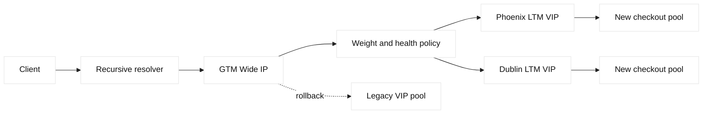
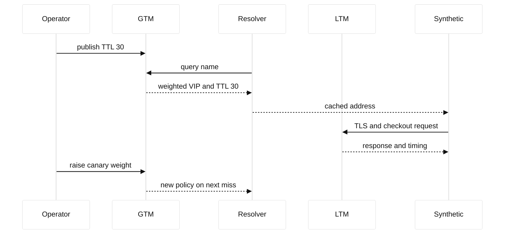

# Case study 15: GTM TTL migration

## Context and goals

Fictional Meridian Retail runs `checkout.meridian.example` through BIG-IP DNS, historically called GTM. Phoenix and Dublin LTM VIPs use documentation addresses `198.51.100.80` and `203.0.113.80`. The service normally uses a 300-second DNS TTL. During a planned move from the legacy pool to a new pool, the team wanted faster failover and therefore proposed a 30-second TTL. The goals were to reduce stale answers without pretending DNS is an instant control plane, preserve checkout availability, and make the migration reversible.

**Fact:** recursive resolvers cache positive answers and attach remaining TTL to responses. **Fact:** the authoritative service cannot recall an answer already cached by a resolver. **Inference:** lowering TTL before a change reduces the maximum expected cache lifetime after the lowered answer is observed, but does not remove answers issued under the old TTL. RFC 1034 and RFC 1035 describe this caching model; F5 BIG-IP DNS documentation describes Wide IP pools and TTL settings.

The incident began as a change-safety exercise rather than an outage. A release manager noticed that dashboards showed new VIP traffic immediately after publication while some regions still reached the old pool. A customer-support synthetic also showed a mixture of certificates. The team treated this as an opportunity to establish a measured migration protocol. They explicitly separated policy publication time, resolver observation time, and client connection time, because each clock can differ.

## Architecture

The Wide IP had a production pool containing Phoenix and Dublin virtual servers, a canary pool containing the new LTM VIPs, and a disabled recovery pool pointing at the legacy service. Monitors tested HTTPS status and expected the fictional host name. LTM terminated client TLS, applied an HTTP profile, selected pool members, and used SNAT from a reserved self IP for return routing. GTM answered recursive resolvers, not end users directly.

| Object | Before migration | Migration control |
| --- | --- | --- |
| Wide IP | production pool | weighted canary then production |
| TTL | 300 seconds | 30 seconds, then restored after stability |
| Phoenix VIP | 198.51.100.80 | new certificate and pool |
| Dublin VIP | 203.0.113.80 | new certificate and pool |
| Recovery | legacy VIPs | disabled, documented rollback |

The design uses reserved address ranges only. RFC 5737 reserves the IPv4 documentation blocks used in examples. The hostname ends in `example`, reserved by RFC 2606. No command in this study should be pointed at a real device. F5 terminology such as Wide IP, pool, virtual server, monitor, and TTL is vendor terminology; the causal statements about this event are engineering inferences unless marked as facts.

## Timeline

At 09:00 UTC the change window opened and operators captured answers from six recursive resolver classes. At 09:10, the authoritative TTL was lowered from 300 to 30 seconds while the old answer was still present in many caches. At 09:20, a 10 percent canary weight sent new answers to the new VIPs. At 09:32, certificate and checkout synthetic checks passed in Phoenix and Dublin. At 09:45, weight increased to 50 percent. At 10:00, one Dublin member failed its monitor and GTM correctly excluded that virtual server. At 10:12, the team reached 100 percent. At 11:30, after two cache windows, the TTL was restored to 300 seconds.

## Evidence

Operators ran `dig @192.0.2.53 checkout.meridian.example +noall +answer +stats` against fictional test resolvers and saved name, address, TTL, and query time. A controlled cache queried before and after publication showed old answers decrementing from 300 while new answers started at 30. This was **observed fact**, not a claim about every public resolver. GTM statistics showed the configured weight only for fresh authoritative responses; they did not measure every client request.

LTM access logs included virtual-server name, selected pool, status, and request latency, with payloads omitted. `openssl s_client -connect 198.51.100.80:443 -servername checkout.meridian.example -showcerts` was used only against a local simulation or documented test endpoint. The output verified the presented leaf and chain. A packet capture would show DNS response TTL and subsequent TCP/TLS flows, but it would not reveal which cached answer a remote resolver retained.

Evidence was placed in a timestamped change record with hashes for text exports. **Fact:** two answers coexisted during transition. **Inference:** coexistence was expected cache behavior, not split-brain authoritative state. The team avoided treating a dashboard percentage as global traffic truth because DNS and HTTP observations sample different populations.

## Competing hypotheses

One hypothesis was that GTM ignored the new weight. Direct authoritative queries disproved that for fresh queries. A second was that LTM health failed; direct HTTPS and monitor logs showed healthy VIPs except the intentionally failed member. A third was that resolvers violated TTL. The controlled cache respected TTL, while external behavior was not controllable enough to prove universal compliance. A fourth was certificate inconsistency; SNI inspection found old certificates only on cached legacy addresses. A fifth was application session affinity, which could preserve old connections after DNS changed.

## Decision points

The team considered an immediate TTL reduction, a scheduled reduction one full old-TTL window before migration, and no reduction. It chose the scheduled approach for future work because it gives more predictable convergence. During this window, it continued with a measured canary because waiting alone cannot prove backend readiness. It chose weighted DNS rather than deleting the legacy pool, because deletion would remove a simple rollback and make stale clients fail.

The decision record states that TTL is a convergence aid, not a circuit breaker. It also records that a resolver can cache an answer for its permitted lifetime and clients can retain established TCP connections. The 30-second value was accepted only for the migration interval because it increases query volume. **Inference:** query load and operational cost are trade-offs, not protocol errors.

## Remediation

The team created a migration checklist: lower TTL at least one old-TTL period ahead, validate authoritative serial and answer sets, test both VIP certificates, introduce weight gradually, and keep an explicit legacy pool. Change automation now renders a read-only plan before publication and rejects a TTL increase while a canary is active. It records the desired Wide IP state, actual state, and owner for every pool member.

Monitoring now queries from corporate, public, mobile, VPN, and regional resolver perspectives. It reports answer address, remaining TTL, selected certificate fingerprint, and checkout latency. Alerts distinguish stale-but-valid DNS answers from authoritative errors. An SRE runbook explains that `dig` with `@server` tests one resolver and `+trace` tests a different path; neither is a universal client census.

## Verification

Verification required three independent observations. First, authoritative queries returned the intended weighted set and TTL. Second, controlled resolvers changed answers only after their prior TTL elapsed. Third, synthetic HTTPS transactions completed through each VIP with the expected SNI certificate and application response. The team also induced a monitor failure in a non-production policy and confirmed GTM withdrew that target while leaving the other region available.

At the end of the window, query volume returned near baseline after TTL restoration. The change was not declared complete until old-cache samples disappeared from the controlled population and the legacy pool remained available but unused. **Fact:** this proves the tested population only. **Inference:** broader convergence was likely but could not be directly guaranteed.

## Rollback or recovery

Rollback means setting canary weight to zero, re-enabling the legacy pool, and publishing the prior known-good Wide IP policy. Operators then wait through the effective old and new TTL windows while monitoring both addresses. They do not flush arbitrary public caches. If the new LTM certificate is bad, the legacy VIP remains able to serve clients whose DNS answer is still old; clients with new answers can be returned to the old address on subsequent authoritative misses.

Recovery evidence includes the exact policy version, TTL, resolver samples, certificate fingerprints, and LTM health. If DNS query load becomes excessive, restoration to 300 seconds is considered only after the incident commander records its effect on convergence. This preserves a recoverable state without claiming that rollback rewinds already cached answers.

## Postmortem lessons

The migration succeeded because the team modeled three layers of state: authoritative policy, recursive cache, and established client connection. **Fact:** those states changed at different times. **Inference:** treating DNS as a synchronous deployment switch creates false alarms and unsafe reversions. TTL changes should be planned in advance, measured from multiple resolver perspectives, and paired with backend readiness checks.

The team also learned that a canary weight is not a request percentage. It is a selection input for eligible DNS answers, and resolver caching can amplify or delay its visible effect. LTM logs are therefore necessary to understand actual requests. Certificate inspection must include SNI, because the same address can present different chains for different host names. The runbook now asks which layer supplied each observation.

Finally, preserving a disabled recovery pool was valuable. It reduced rollback time and made the decision reversible. Ownership metadata now includes who may publish, who validates certificates, who owns the application health endpoint, and when the temporary TTL expires. This turns a one-off migration into a repeatable, reviewable lifecycle.

## Questions and answers

1. **Does lowering TTL delete old answers?** No. Answers issued under the previous TTL can remain cached until they expire.

Interview reasoning: Separate DNS decision time from application connection time. BIG-IP DNS/GTM evaluates Wide IP pools, topology or other methods, server/virtual-server health, and sometimes limits before returning an address; recursive caches may continue serving that answer until TTL expiry. Diagnose authoritative and recursive views, monitor state, topology data, TTL, and the resulting LTM path. The caveat is that DNS steering cannot revoke already cached answers or guarantee data consistency during a site failover.

2. **What does GTM weight affect?** It affects selection for eligible authoritative responses, not every already-cached client.

Interview reasoning: Separate DNS decision time from application connection time. BIG-IP DNS/GTM evaluates Wide IP pools, topology or other methods, server/virtual-server health, and sometimes limits before returning an address; recursive caches may continue serving that answer until TTL expiry. Diagnose authoritative and recursive views, monitor state, topology data, TTL, and the resulting LTM path. The caveat is that DNS steering cannot revoke already cached answers or guarantee data consistency during a site failover.

3. **Why retain the legacy pool?** It provides a fast, explicit recovery target for old or newly queried clients.

Interview reasoning: Separate DNS decision time from application connection time. BIG-IP DNS/GTM evaluates Wide IP pools, topology or other methods, server/virtual-server health, and sometimes limits before returning an address; recursive caches may continue serving that answer until TTL expiry. Diagnose authoritative and recursive views, monitor state, topology data, TTL, and the resulting LTM path. The caveat is that DNS steering cannot revoke already cached answers or guarantee data consistency during a site failover.

4. **What did `dig @resolver` prove?** It showed one resolver’s current answer and TTL, not global convergence.

Interview reasoning: Separate DNS decision time from application connection time. BIG-IP DNS/GTM evaluates Wide IP pools, topology or other methods, server/virtual-server health, and sometimes limits before returning an address; recursive caches may continue serving that answer until TTL expiry. Diagnose authoritative and recursive views, monitor state, topology data, TTL, and the resulting LTM path. The caveat is that DNS steering cannot revoke already cached answers or guarantee data consistency during a site failover.

5. **Why inspect SNI?** TLS certificate selection can depend on the requested host name.

Interview reasoning: Walk through the handshake fields and the trust decision rather than saying only that TLS encrypts traffic. Check the hostname/SNI, negotiated protocol and cipher, certificate validity interval, SAN, chain order, trust store, and—when applicable—the client certificate and mapped identity. A practical example is testing each proxy leg independently with an explicit SNI name. The caveat is that front-end certificate success says nothing about backend TLS, authorization, or application readiness.

6. **Can a DNS rollback close existing TCP sessions?** No. Established sessions remain on their current address until they end or fail.

Interview reasoning: Separate DNS decision time from application connection time. BIG-IP DNS/GTM evaluates Wide IP pools, topology or other methods, server/virtual-server health, and sometimes limits before returning an address; recursive caches may continue serving that answer until TTL expiry. Diagnose authoritative and recursive views, monitor state, topology data, TTL, and the resulting LTM path. The caveat is that DNS steering cannot revoke already cached answers or guarantee data consistency during a site failover.

7. **Why use reserved addresses?** RFC 5737 documentation ranges prevent examples from targeting real infrastructure.

Interview reasoning: Separate DNS decision time from application connection time. BIG-IP DNS/GTM evaluates Wide IP pools, topology or other methods, server/virtual-server health, and sometimes limits before returning an address; recursive caches may continue serving that answer until TTL expiry. Diagnose authoritative and recursive views, monitor state, topology data, TTL, and the resulting LTM path. The caveat is that DNS steering cannot revoke already cached answers or guarantee data consistency during a site failover.

8. **What is an authoritative observation?** A direct query to the service responsible for the zone, without an intermediate cache.

Interview reasoning: Separate DNS decision time from application connection time. BIG-IP DNS/GTM evaluates Wide IP pools, topology or other methods, server/virtual-server health, and sometimes limits before returning an address; recursive caches may continue serving that answer until TTL expiry. Diagnose authoritative and recursive views, monitor state, topology data, TTL, and the resulting LTM path. The caveat is that DNS steering cannot revoke already cached answers or guarantee data consistency during a site failover.

9. **Why sample multiple resolver classes?** Resolver geography and caching behavior vary, so one sample can mislead.

Interview reasoning: Separate DNS decision time from application connection time. BIG-IP DNS/GTM evaluates Wide IP pools, topology or other methods, server/virtual-server health, and sometimes limits before returning an address; recursive caches may continue serving that answer until TTL expiry. Diagnose authoritative and recursive views, monitor state, topology data, TTL, and the resulting LTM path. The caveat is that DNS steering cannot revoke already cached answers or guarantee data consistency during a site failover.

10. **What is the SDE2 lesson?** DNS migration is a distributed state transition with policy, cache, and connection clocks.

Interview reasoning: Separate DNS decision time from application connection time. BIG-IP DNS/GTM evaluates Wide IP pools, topology or other methods, server/virtual-server health, and sometimes limits before returning an address; recursive caches may continue serving that answer until TTL expiry. Diagnose authoritative and recursive views, monitor state, topology data, TTL, and the resulting LTM path. The caveat is that DNS steering cannot revoke already cached answers or guarantee data consistency during a site failover.
