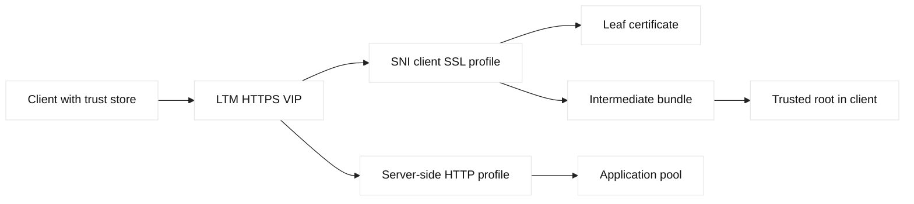
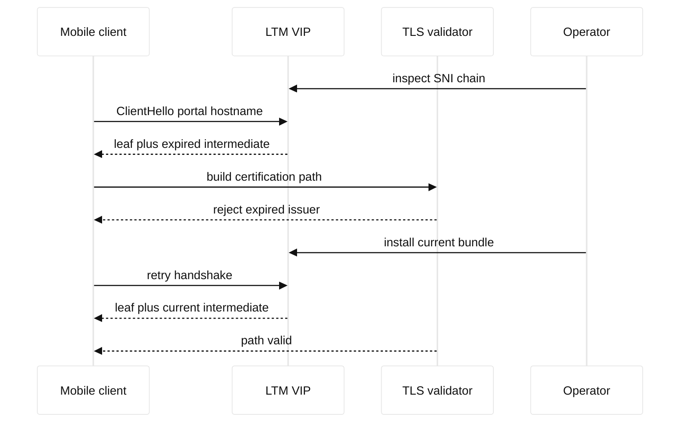

# Case study 16: expired TLS intermediate

## Context and goals

Fictional Northstar Health exposed `portal.northstar.example` on Phoenix and Dublin BIG-IP LTM VIPs, `198.51.100.116` and `203.0.113.116`. At 07:42 UTC on 2026-08-11, Android clients began reporting certificate errors while many desktop browsers succeeded. The certificate leaf was valid, but the intermediate certificate in the served chain had expired. Goals were to establish why failures were client-selective, replace the chain safely, preserve private-key controls, and verify both VIPs and all SNI paths.

**Fact:** TLS peers validate a certificate chain according to their trust store, validity checks, and protocol rules. **Fact:** a server can present a leaf plus intermediate certificates, but the client normally supplies trust anchors. **Inference:** different client populations can disagree when their trust stores build different paths or tolerate different chain conditions. RFC 5280 defines certificate and path-validation concepts; RFC 8446 defines TLS 1.3; F5 client SSL profiles control certificate presentation on a virtual server.

The alert initially looked like an application outage because login failures rose. The LTM monitor still reported HTTP 200, since its test client used a cached alternate chain. This distinction mattered: a green application monitor did not prove that every user could construct a trusted path. The team treated certificate inventory, SNI routing, and client diversity as separate evidence streams.

## Architecture

Clients connected to an LTM virtual server with a client SSL profile. The profile selected the Northstar certificate based on SNI and sent the leaf with an intermediate bundle. LTM proxied HTTP to pool members over a server-side profile. GTM selected a regional VIP, so both regions had to be corrected. An internal automation job stored certificates in a fictional vault and produced a read-only deployment plan.

| Layer | Intended state | Observed state |
| --- | --- | --- |
| Leaf | valid through 2027 | valid |
| Intermediate | current issuer | expired on one bundle |
| SNI profile | portal hostname | correct selection |
| Phoenix VIP | 198.51.100.116 | stale chain |
| Dublin VIP | 203.0.113.116 | stale chain |

Only fictional names and RFC 5737 addresses appear here. The command examples use inspection against a test listener. `openssl s_client` output is evidence from that endpoint, not a universal statement about all clients. F5 profile behavior is vendor terminology and should be checked against the deployed BIG-IP release documentation.

## Timeline

At 07:42, mobile-login error rate crossed the alert threshold. At 07:48, support supplied an Android error showing an expired issuer certificate. At 07:55, desktop Chrome succeeded, and the team suspected trust-store differences. At 08:05, `openssl s_client` against Phoenix showed the expired intermediate; Dublin showed the same bundle. At 08:20, the certificate owner issued a new chain. At 08:35, the plan passed review. At 08:45, Dublin was updated and tested, followed by Phoenix at 08:55. At 09:15, mobile and desktop synthetics passed. At 10:00, the old bundle was revoked from automation inputs but retained in evidence.

## Evidence

The incident record captured `openssl s_client -connect 198.51.100.116:443 -servername portal.northstar.example -showcerts`, certificate serials, `notBefore`, `notAfter`, issuer, and SHA-256 fingerprints. The same command was run against Dublin. A browser test matrix recorded operating system, trust-store update date, negotiated TLS version, and result without collecting patient data. **Facts:** both VIPs served the same expired intermediate and mobile failures correlated with strict validation.

The team compared the served chain to the approved inventory and checked the LTM client SSL profile attachment. `openssl verify -CAfile test-root.pem -untrusted test-intermediate.pem test-leaf.pem` was run against fictional test files. A failure involving expiration was distinguished from hostname mismatch, unknown authority, and signature failure. This prevented a broad “replace all certificates” response.

The monitor’s success was explained by its test image and alternate cached chain. **Inference:** monitor diversity, rather than monitor frequency, was the missing control. Packet capture could confirm the TLS Certificate message, but it could not determine which roots a remote client trusted.

## Competing hypotheses

An expired leaf was considered and rejected by `notAfter`. A DNS misrouting theory was unlikely because both VIPs showed the same chain and direct regional tests failed. A root-store problem explained some clients but not why the server sent an expired issuer. A clock-skew problem was tested with controlled clients and did not explain the population. An SNI mismatch could select the wrong certificate, yet the requested name consistently selected the portal profile. The strongest explanation was stale intermediate material on both VIPs, with trust-store differences determining visibility.

## Decision points

The team could replace only the intermediate bundle, rotate the leaf and key, or move traffic to a different VIP. Reusing the approved key reduced blast radius but required confirming that policy allowed it. A new key increased assurance but added issuance and deployment steps. They chose a newly issued chain with the existing approved leaf first, because the leaf was valid and key rotation was not needed to repair expiration. A separate key rotation was scheduled with its own review.

They also decided to update one region, test, then update the other. This temporarily created chain inconsistency but made rollback and diagnosis clearer. Both profiles were exported as redacted configuration plans; private keys never appeared in logs. **Inference:** staged regional change is safer when client behavior is heterogeneous.

## Remediation

Automation now parses every certificate and intermediate for validity, issuer continuity, hostname coverage, and fingerprint. It rejects a bundle whose shortest-lived component expires before the change window plus safety margin. The inventory records owner, source, renewal date, profile attachment, regions, and rollback artifact. A preflight test uses SNI explicitly and checks both TLS 1.2 and TLS 1.3 where supported.

The LTM monitor now has a strict-chain synthetic alongside the existing HTTP monitor. It tests Phoenix and Dublin independently and alerts before expiration. The release process requires a chain-order review: leaf first, then intermediates, with the trusted root generally omitted unless a specific client requirement is documented. F5 documentation is consulted for profile import semantics because bundle ordering and profile references are vendor-specific.

## Verification

Verification began with direct endpoint inspection and fingerprints. Both VIPs served the expected leaf and current intermediate for the exact SNI name. A test trust store rejected the old chain and accepted the new one. Mobile, desktop, and a minimal OpenSSL client completed handshakes. Application synthetics then exercised login and logout, confirming the TLS fix did not conceal an HTTP regression.

The team waited through the synthetic schedule and reviewed error rates by client family. **Fact:** failures returned to baseline in the observed population. **Inference:** clients that had cached session state would converge as sessions renewed; TLS servers do not control old completed handshakes. The old certificate remained available only as a protected rollback artifact.

## Rollback or recovery

If the new chain failed, operators would restore the previous profile attachment from the approved configuration snapshot, then immediately evaluate whether it reintroduced expiration. Because the old chain was unsafe after its expiry, rollback was time-limited and required incident-owner approval. A safer recovery would be to keep the valid leaf with a known-good alternate intermediate, if path validation proved it acceptable. DNS changes were avoided because the defect was present in both regions.

Recovery communication named affected client classes and explained that restarting an application could trigger a new handshake. Evidence included profile version, certificate fingerprints, validation outputs, and timestamps. No private key or patient information was copied into the incident record.

## Postmortem lessons

Certificate incidents are path-building incidents, not merely leaf-expiration incidents. **Fact:** an HTTP monitor can pass while a strict TLS client fails. **Inference:** every critical VIP needs a monitor that validates the actual SNI chain and represents stricter client behavior. Certificate validity must be checked across the full served chain, both regions, and every relevant profile.

The organization added a “days to earliest expiry” metric and ownership escalation. Renewal is not complete until deployment and endpoint inspection succeed. Trust stores are treated as client inputs that vary over time; the server cannot assume all clients build the same path. F5 profile attachment is included in inventory because a correct file unused by the active VIP is operationally equivalent to no fix.

The review also reinforced least-data evidence. Fingerprints, serials, and validation results were sufficient; private material and health data were not. This keeps troubleshooting useful without creating a new security incident.

## Questions and answers

1. **Why did desktops pass while phones failed?** Their trust stores and path-building behavior differed.

Interview reasoning: Walk through the handshake fields and the trust decision rather than saying only that TLS encrypts traffic. Check the hostname/SNI, negotiated protocol and cipher, certificate validity interval, SAN, chain order, trust store, and—when applicable—the client certificate and mapped identity. A practical example is testing each proxy leg independently with an explicit SNI name. The caveat is that front-end certificate success says nothing about backend TLS, authorization, or application readiness.

2. **Was the leaf expired?** No; inspection showed the intermediate was expired.

Interview reasoning: Walk through the handshake fields and the trust decision rather than saying only that TLS encrypts traffic. Check the hostname/SNI, negotiated protocol and cipher, certificate validity interval, SAN, chain order, trust store, and—when applicable—the client certificate and mapped identity. A practical example is testing each proxy leg independently with an explicit SNI name. The caveat is that front-end certificate success says nothing about backend TLS, authorization, or application readiness.

3. **What does `-servername` test?** It selects the SNI name used by the TLS ClientHello.

Interview reasoning: Walk through the handshake fields and the trust decision rather than saying only that TLS encrypts traffic. Check the hostname/SNI, negotiated protocol and cipher, certificate validity interval, SAN, chain order, trust store, and—when applicable—the client certificate and mapped identity. A practical example is testing each proxy leg independently with an explicit SNI name. The caveat is that front-end certificate success says nothing about backend TLS, authorization, or application readiness.

4. **Why test both VIPs?** GTM can route clients to either regional endpoint.

Interview reasoning: Walk through the handshake fields and the trust decision rather than saying only that TLS encrypts traffic. Check the hostname/SNI, negotiated protocol and cipher, certificate validity interval, SAN, chain order, trust store, and—when applicable—the client certificate and mapped identity. A practical example is testing each proxy leg independently with an explicit SNI name. The caveat is that front-end certificate success says nothing about backend TLS, authorization, or application readiness.

5. **Should a root normally be served?** Usually clients supply trust anchors; follow the issuer’s and platform’s documented chain guidance.

Interview reasoning: Walk through the handshake fields and the trust decision rather than saying only that TLS encrypts traffic. Check the hostname/SNI, negotiated protocol and cipher, certificate validity interval, SAN, chain order, trust store, and—when applicable—the client certificate and mapped identity. A practical example is testing each proxy leg independently with an explicit SNI name. The caveat is that front-end certificate success says nothing about backend TLS, authorization, or application readiness.

6. **Can an HTTP monitor prove TLS health?** Only for its own client image and validation behavior.

Interview reasoning: Walk through the handshake fields and the trust decision rather than saying only that TLS encrypts traffic. Check the hostname/SNI, negotiated protocol and cipher, certificate validity interval, SAN, chain order, trust store, and—when applicable—the client certificate and mapped identity. A practical example is testing each proxy leg independently with an explicit SNI name. The caveat is that front-end certificate success says nothing about backend TLS, authorization, or application readiness.

7. **What is a fact here?** Both endpoints served an expired intermediate.

Interview reasoning: Walk through the handshake fields and the trust decision rather than saying only that TLS encrypts traffic. Check the hostname/SNI, negotiated protocol and cipher, certificate validity interval, SAN, chain order, trust store, and—when applicable—the client certificate and mapped identity. A practical example is testing each proxy leg independently with an explicit SNI name. The caveat is that front-end certificate success says nothing about backend TLS, authorization, or application readiness.

8. **What is an inference?** Trust-store variation determined which users noticed first.

Interview reasoning: Walk through the handshake fields and the trust decision rather than saying only that TLS encrypts traffic. Check the hostname/SNI, negotiated protocol and cipher, certificate validity interval, SAN, chain order, trust store, and—when applicable—the client certificate and mapped identity. A practical example is testing each proxy leg independently with an explicit SNI name. The caveat is that front-end certificate success says nothing about backend TLS, authorization, or application readiness.

9. **Why retain the old chain?** As a protected evidence and recovery artifact, not normal service material.

Interview reasoning: Walk through the handshake fields and the trust decision rather than saying only that TLS encrypts traffic. Check the hostname/SNI, negotiated protocol and cipher, certificate validity interval, SAN, chain order, trust store, and—when applicable—the client certificate and mapped identity. A practical example is testing each proxy leg independently with an explicit SNI name. The caveat is that front-end certificate success says nothing about backend TLS, authorization, or application readiness.

10. **What is the SDE2 lesson?** Certificate lifecycle includes issuance, profile attachment, path validation, monitoring, and rollback.

Interview reasoning: Walk through the handshake fields and the trust decision rather than saying only that TLS encrypts traffic. Check the hostname/SNI, negotiated protocol and cipher, certificate validity interval, SAN, chain order, trust store, and—when applicable—the client certificate and mapped identity. A practical example is testing each proxy leg independently with an explicit SNI name. The caveat is that front-end certificate success says nothing about backend TLS, authorization, or application readiness.
