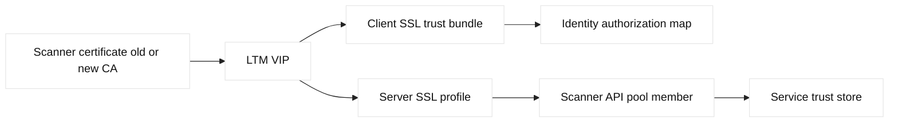
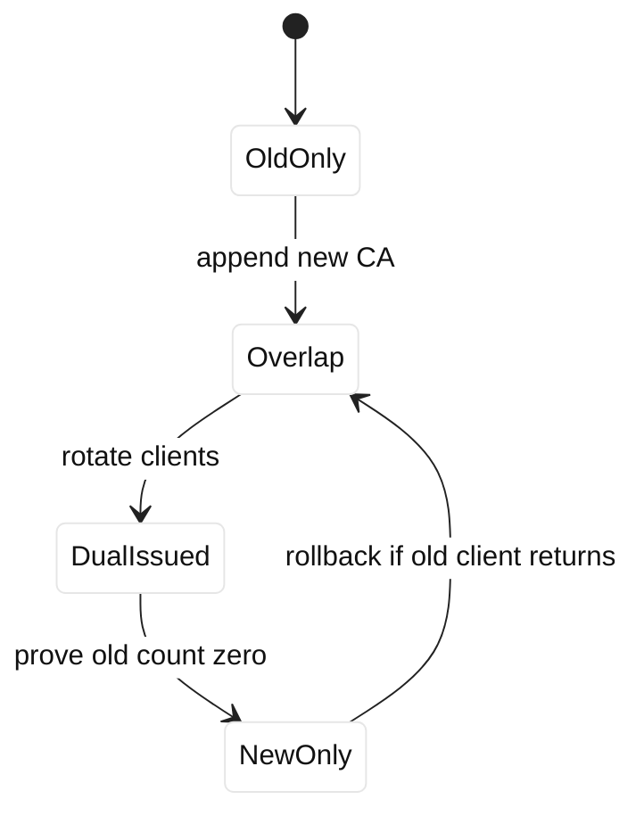

# Case study 17: mTLS trust rotation

## Context and goals

Fictional Atlas Freight uses mutual TLS between an LTM VIP and `scanner.atlas.example`, a warehouse scanning service. Clients connect to `198.51.100.117`; LTM presents a server certificate and requests a client certificate. The server validates client certificates against a trust bundle. A private certificate authority was approaching its planned retirement, so the team needed to introduce a replacement CA without dropping scanners still using the old CA. Goals were overlap, explicit identity policy, safe removal, and evidence that both client and server validation worked.

**Fact:** mTLS adds certificate authentication by both peers; encryption alone does not prove client identity. **Fact:** a trust store determines which issuer chains are acceptable. **Inference:** a rotation requires an overlap period in which old and new identities are intentionally trusted, followed by measured removal. RFC 5280 covers path validation, while RFC 8446 covers TLS negotiation. F5 client and server SSL profiles provide the relevant BIG-IP controls.

The first rollout failed in a staging environment because operators replaced the server trust bundle rather than appending the new CA. New scanners failed while old scanners worked. This case documents the corrected production plan and distinguishes a configuration fact from assumptions about scanner population. No real device or certificate is represented.

## Architecture

Warehouse scanners initiated TLS to the LTM VIP. The client SSL profile validated scanner certificates and mapped certificate subjects to an authorization policy. LTM used a server SSL profile to authenticate to pool members, which trusted a separate service CA. The GTM layer was not on this single-site name, but a second regional VIP was available for disaster recovery. Certificate serial and issuer metadata came from a fictional vault.

| Component | Trust responsibility | Rotation state |
| --- | --- | --- |
| Scanner | trusts server CA | old and new accepted |
| LTM client profile | trusts scanner CAs | overlap bundle |
| LTM server profile | trusts service CA | unchanged |
| Pool member | validates LTM client | service identity |
| Authorization map | subject/SAN to role | versioned |

The addresses use RFC 5737 documentation space and the hostname uses RFC 2606 example space. Trusting a CA is not the same as authorizing every certificate it issues; that policy distinction is an engineering requirement. F5 profile names and behavior should be checked against the installed release.

## Timeline

At 13:00 UTC, the CA team announced the replacement root and intermediate. At 13:20, operators inventoried scanner issuer, expiry, and SAN values. At 14:00, a staging change replaced rather than appended the bundle and five test scanners failed. At 14:25, the change was rolled back and the cause recorded. At 15:00, the overlap bundle was built and reviewed. At 16:00, 10 percent of scanners received new certificates. At 16:30, both issuers succeeded. At 17:00, all scanners rotated. Seven days later, the old CA was removed after issuer telemetry showed zero old certificates.

## Evidence

Inventory used `openssl x509 -in scanner.pem -noout -issuer -subject -serial -dates -ext subjectAltName` on redacted test certificates. LTM logs recorded handshake success, issuer fingerprint, authorization result, and pool outcome, without storing private keys or payloads. A controlled scanner tested old and new certificates against the overlap configuration. **Facts:** replacement-only staging failed old scanners; append-and-test accepted both.

The team captured TLS alerts and distinguished `unknown_ca`, expired certificate, hostname mismatch, and authorization denial. A successful TLS handshake was not treated as authorization proof: a certificate could chain to a trusted CA but fail the subject-to-role map. Pool health was checked separately with an HTTP monitor. **Inference:** issuer telemetry was the least invasive way to know when old trust could be removed.

## Competing hypotheses

The staging failure could have been scanner certificate expiry, a missing intermediate, an SNI mismatch, or an LTM profile attachment error. Dates and fingerprints rejected expiry. Endpoint inspection showed the replacement bundle attached to the wrong profile in one initial plan, but the primary failure was removal of the old CA. Another theory blamed pool health; direct mTLS handshakes failed before HTTP. The evidence favored replacement semantics and insufficient overlap.

## Decision points

The team chose additive trust followed by client rotation, rather than a synchronized flag day. Additive trust increases the temporary set of acceptable issuers, so authorization mapping and a short overlap window were mandatory. It rejected trusting a new root globally on every device because that expanded blast radius. It also chose issuer telemetry over guessing from certificate inventory, because unregistered scanners can exist.

The old CA removal gate required zero old-issuer handshakes for seven days, confirmation from warehouse operations, and a tested rollback bundle. A break-glass trust bundle was encrypted and access-controlled. **Inference:** a longer overlap is worthwhile when device connectivity is intermittent, but indefinite overlap weakens lifecycle hygiene.

## Remediation

Automation now renders an additive trust plan, verifies chain order, checks profile attachment, and compares intended issuer fingerprints with live inspection. It fails if a removal plan has no rollback artifact or if authorization maps are empty. Scanner enrollment records certificate serial, issuer, device owner, and rotation deadline. The service rejects certificates without the required SAN pattern and role mapping.

Operators document that `verify` answers chain questions while the application policy answers identity questions. The LTM monitor exercises a real mTLS test identity. Regional recovery VIPs carry the same trust-bundle version. Alerts fire on old-issuer use, unknown issuer, and authorization denials separately, allowing a rotation problem to be diagnosed without collapsing all failures into “TLS down.”

## Verification

Verification covered old scanner, new scanner, expired scanner, wrong SAN, trusted-but-unauthorized scanner, and no-certificate client. Old and new identities succeeded only during overlap; invalid and unauthorized cases failed with expected telemetry. The LTM server-side handshake to the pool was also tested so a client-side success could not mask a backend trust failure. Phoenix and recovery VIPs were inspected independently.

After seven days, issuer telemetry reported no old certificates. The old CA was removed in staging first, then production during a low-volume window. A synthetic new scanner continued to perform a complete transaction. **Fact:** tested identities behaved as designed. **Inference:** unobserved disconnected scanners were unlikely but remained a recovery consideration.

## Rollback or recovery

Rollback restores the signed overlap bundle and authorization map, not an arbitrary prior file. If a new identity fails, operators can re-enable old trust while investigating issuance or SAN policy. If an unauthorized certificate is discovered, trust can remain additive while that identity is denied in the authorization map. Emergency rollback is time-boxed and followed by a renewed removal plan.

Recovery communication names the issuer version and scanner cohort. Device teams are given a safe re-enrollment path. Evidence retains fingerprints and counts, never private keys. If both client and server trust fail, the team isolates which SSL profile failed by testing each leg separately.

## Postmortem lessons

The failed staging change exposed a common mTLS misconception: replacing a trust store is not a certificate rotation strategy when clients change asynchronously. **Fact:** old scanners failed immediately after old CA removal. **Inference:** additive trust, issuer telemetry, and explicit authorization are necessary controls for distributed devices.

Trust rotation is a lifecycle spanning CA issuance, intermediate delivery, profile attachment, client enrollment, policy mapping, monitoring, and deletion. F5 configuration exports and certificate inventory must be correlated; a valid bundle unused by the active VIP has no effect. The team now treats “trusted” and “authorized” as separate dimensions and records both in dashboards.

The final lesson is that rollback must be designed before deletion. Keeping an overlap artifact and a known test identity made recovery fast without granting uncontrolled access. The runbook states when old trust expires, who approves extension, and what evidence proves removal is safe.

## Additional analysis

Trust rotation changes the accepted identity set, not merely a file path. The
team inventoried every client certificate issuer, intermediate, SAN, expiry,
and deployment location, then tested a dual-trust overlap in a disposable
listener. Logs distinguished “certificate absent,” “chain untrusted,” “name
not authorized,” and “application identity mapping denied.” That distinction
prevented a dangerous response in which the server would accept any client
certificate from a broad public CA. The rollout included a client population
sample, a time-bounded overlap, revocation or retirement criteria, and a
read-only post-change audit of the F5 SSL profile and application authorization
mapping.

## Questions and answers

1. **What makes mTLS mutual?** The server authenticates the client certificate while the client authenticates the server certificate.

Interview reasoning: Walk through the handshake fields and the trust decision rather than saying only that TLS encrypts traffic. Check the hostname/SNI, negotiated protocol and cipher, certificate validity interval, SAN, chain order, trust store, and—when applicable—the client certificate and mapped identity. A practical example is testing each proxy leg independently with an explicit SNI name. The caveat is that front-end certificate success says nothing about backend TLS, authorization, or application readiness.

2. **Why append a CA first?** It allows old and new clients to overlap during asynchronous rotation.

Interview reasoning: Walk through the handshake fields and the trust decision rather than saying only that TLS encrypts traffic. Check the hostname/SNI, negotiated protocol and cipher, certificate validity interval, SAN, chain order, trust store, and—when applicable—the client certificate and mapped identity. A practical example is testing each proxy leg independently with an explicit SNI name. The caveat is that front-end certificate success says nothing about backend TLS, authorization, or application readiness.

3. **Does a trusted CA authorize every client?** No; subject, SAN, and role policy still need evaluation.

Interview reasoning: Walk through the handshake fields and the trust decision rather than saying only that TLS encrypts traffic. Check the hostname/SNI, negotiated protocol and cipher, certificate validity interval, SAN, chain order, trust store, and—when applicable—the client certificate and mapped identity. A practical example is testing each proxy leg independently with an explicit SNI name. The caveat is that front-end certificate success says nothing about backend TLS, authorization, or application readiness.

4. **What caused staging failure?** The old CA was removed instead of retained in an overlap bundle.

Interview reasoning: Walk through the handshake fields and the trust decision rather than saying only that TLS encrypts traffic. Check the hostname/SNI, negotiated protocol and cipher, certificate validity interval, SAN, chain order, trust store, and—when applicable—the client certificate and mapped identity. A practical example is testing each proxy leg independently with an explicit SNI name. The caveat is that front-end certificate success says nothing about backend TLS, authorization, or application readiness.

5. **What does issuer telemetry show?** Which certificate issuer is actually arriving at the endpoint.

Interview reasoning: Walk through the handshake fields and the trust decision rather than saying only that TLS encrypts traffic. Check the hostname/SNI, negotiated protocol and cipher, certificate validity interval, SAN, chain order, trust store, and—when applicable—the client certificate and mapped identity. A practical example is testing each proxy leg independently with an explicit SNI name. The caveat is that front-end certificate success says nothing about backend TLS, authorization, or application readiness.

6. **Why test the server-side profile?** LTM may succeed with a client while failing its pool-member handshake.

Interview reasoning: Walk through the handshake fields and the trust decision rather than saying only that TLS encrypts traffic. Check the hostname/SNI, negotiated protocol and cipher, certificate validity interval, SAN, chain order, trust store, and—when applicable—the client certificate and mapped identity. A practical example is testing each proxy leg independently with an explicit SNI name. The caveat is that front-end certificate success says nothing about backend TLS, authorization, or application readiness.

7. **What is a fact?** Replacement-only staging rejected old scanner certificates.

Interview reasoning: Walk through the handshake fields and the trust decision rather than saying only that TLS encrypts traffic. Check the hostname/SNI, negotiated protocol and cipher, certificate validity interval, SAN, chain order, trust store, and—when applicable—the client certificate and mapped identity. A practical example is testing each proxy leg independently with an explicit SNI name. The caveat is that front-end certificate success says nothing about backend TLS, authorization, or application readiness.

8. **What is an inference?** Overlap reduced risk for intermittently connected scanners.

Interview reasoning: Walk through the handshake fields and the trust decision rather than saying only that TLS encrypts traffic. Check the hostname/SNI, negotiated protocol and cipher, certificate validity interval, SAN, chain order, trust store, and—when applicable—the client certificate and mapped identity. A practical example is testing each proxy leg independently with an explicit SNI name. The caveat is that front-end certificate success says nothing about backend TLS, authorization, or application readiness.

9. **When remove old trust?** After measured zero use, owner confirmation, and a tested rollback artifact.

Interview reasoning: Walk through the handshake fields and the trust decision rather than saying only that TLS encrypts traffic. Check the hostname/SNI, negotiated protocol and cipher, certificate validity interval, SAN, chain order, trust store, and—when applicable—the client certificate and mapped identity. A practical example is testing each proxy leg independently with an explicit SNI name. The caveat is that front-end certificate success says nothing about backend TLS, authorization, or application readiness.

10. **What is the SDE2 lesson?** mTLS identity, trust, authorization, and lifecycle deletion are distinct controls.

Interview reasoning: Walk through the handshake fields and the trust decision rather than saying only that TLS encrypts traffic. Check the hostname/SNI, negotiated protocol and cipher, certificate validity interval, SAN, chain order, trust store, and—when applicable—the client certificate and mapped identity. A practical example is testing each proxy leg independently with an explicit SNI name. The caveat is that front-end certificate success says nothing about backend TLS, authorization, or application readiness.
