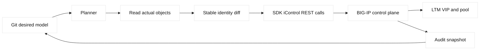
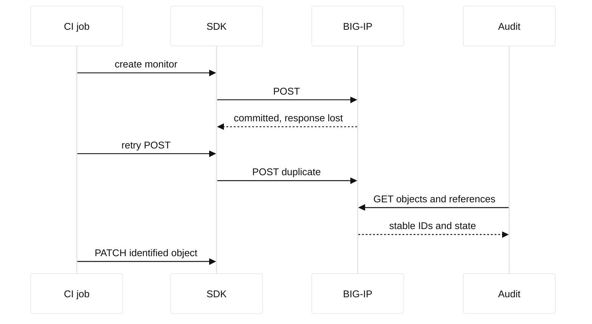

# Case study 18: F5 SDK idempotency drift

## Context and goals

Fictional Cedar Media used a Python F5 SDK job to keep a BIG-IP LTM pool for `video.cedar.example` aligned with Git. The desired VIP was `198.51.100.118`, with members `192.0.2.41` and `192.0.2.42` in documentation space. A repeated deployment created duplicate monitor and pool objects with generated names, then failed to remove an obsolete member. The goal was to explain why a supposedly idempotent reconciliation drifted, stop further changes, recover the intended state, and define safe SDK boundaries.

**Fact:** an API client can issue syntactically successful POST requests that create additional resources. **Fact:** idempotency is an end-to-end property requiring stable identity, read-before-write logic, and deterministic update semantics. **Inference:** the job’s use of display names and create-only calls caused drift; the SDK itself did not promise reconciliation. F5 iControl REST and the F5 Python SDK are vendor interfaces; HTTP method semantics are informed by RFC 9110.

The job had been tested against an empty lab and appeared correct. In the shared lab, retries after a timeout caused another monitor object. The operator assumed a failed request had not reached BIG-IP, but the server had committed it before the client lost the response. This is a classic ambiguity that requires querying state rather than blindly retrying creation.

## Architecture

A CI runner read a declarative YAML-like model, authenticated to a fictional BIG-IP management address `192.0.2.118`, and used SDK managers for virtual servers, pools, members, and monitors. The data plane used a client SSL profile and SNAT. Git stored desired names and immutable labels. A read-only audit endpoint compared actual object IDs, names, references, and enabled state.

| Resource | Desired identity | Drift observed |
| --- | --- | --- |
| Virtual server | `/Common/cedar-video-vip` | one object, correct |
| Pool | `/Common/cedar-video-pool` | duplicate generated pool |
| Monitor | `/Common/cedar-video-http` | three same-purpose monitors |
| Member | node:port key | obsolete member retained |
| CI plan | stable PUT/PATCH intent | create-only retry |

All names and addresses are fictional or reserved. The SDK example is conceptual and must not be run against a real system without authorization. Credentials are never placed in source or logs. F5 object identity, partition behavior, and SDK versions must be checked against primary release documentation.

## Timeline

At 18:00 UTC, the first CI run created the intended pool and monitor. At 18:03, a client timeout occurred after a monitor POST. At 18:04, the retry created a second monitor. At 18:10, a developer reran the job and a generated pool appeared because lookup used a transient display label. At 18:30, audit reported duplicate purpose labels and an obsolete member. At 19:00, writes were frozen. At 19:20, a read-only inventory identified references. At 20:00, operators removed unreferenced duplicates in a reviewed change. At 20:30, deterministic reconciliation passed twice.

## Evidence

The team captured GET responses containing object IDs, full paths, generation numbers, monitor destinations, pool references, and timestamps. It compared SDK request logs with server audit logs. **Facts:** two POST operations had distinct IDs; the first had a server commit timestamp before the client timeout. The pool referenced one monitor while two duplicates were unreferenced. A member key comparison showed the obsolete member remained.

The audit used read-only calls and redacted tokens. A pseudo-command such as `python3 audit.py --target 192.0.2.118 --read-only --json` demonstrates intent but is not a production command. The team inspected HTTP status and response bodies, not only exceptions. **Inference:** the retry policy assumed transport failure implied server failure, which is unsafe for non-idempotent POST.

## Competing hypotheses

A BIG-IP race condition was considered, but server audit showed sequential commits. A naming collision was unlikely because generated names differed. SDK serialization could have omitted partition fields, yet the successful object paths were clear. Another hypothesis was manual change; audit ownership attributed all duplicates to CI. Finally, stale cache in the planner could explain the obsolete member, and repeated GET confirmed the job had not refreshed state before planning.

## Decision points

The team could delete every duplicate, keep all objects, or freeze writes and graph references first. It chose reference-aware cleanup because deleting a monitor still attached to a pool could break health. It chose stable full paths as identities rather than display names. For create ambiguity, the job now queries by an immutable label and verifies desired fields before deciding whether to reuse an object.

The team also chose a plan/apply split. Plan is read-only and emits additions, updates, removals, and uncertain operations. Apply requires an explicit approval token and records before/after snapshots. **Inference:** slower reconciliation is acceptable for control-plane safety, especially when retries can create data-plane consequences.

## Remediation

The reconciler performs GET, canonicalizes fields, computes a diff, and uses update operations for existing objects. It treats member identity as node plus service port plus partition, not array position. It preserves unknown fields unless ownership is explicit. Duplicate candidates are quarantined and reported; they are not automatically deleted. Retry policy distinguishes safe repeated GET from ambiguous POST and requires a follow-up query before retrying creation.

A uniqueness check rejects two desired objects with the same purpose label. The SDK is pinned and response schemas are validated. Secrets come from an external runtime mechanism and are excluded from snapshots. The audit stores hashes of non-secret configuration and links each change to a Git revision. A data-plane monitor confirms that the VIP still has eligible members after any control-plane update.

## Verification

Verification ran the planner twice against the corrected lab. The first run made intended updates; the second produced an empty diff. GET responses showed one canonical monitor, one pool, expected members, and the VIP reference. A simulated lost response proved the recovery path queried for the immutable label before retrying. A member disable test verified that monitor and pool behavior remained understandable.

The team compared control-plane state to LTM traffic logs and checked TLS SNI on the VIP. **Fact:** no duplicate was created during repeated reconciliation. **Inference:** deterministic identity and read-after-ambiguous-write eliminated the observed drift mechanism. This does not prove every SDK operation is idempotent; each method remains documented and tested separately.

## Rollback or recovery

Rollback restores the prior desired model through the same reviewed reconciler. It does not blindly replay a list of POSTs. Before removing an object, the planner confirms no virtual server or pool references it. If state is uncertain, writes stop and a fresh inventory is taken. A data-plane emergency can disable a bad member through a narrowly scoped change while the control-plane investigation continues.

Recovery snapshots include IDs, paths, references, and non-secret fields. The team can reconstruct the intended model without recovering credentials. If an update partially succeeds, the next plan converges from actual state rather than assuming transactionality.

## Postmortem lessons

An SDK is an interface, not a desired-state engine. **Fact:** a timed-out POST had committed and a retry created a duplicate. **Inference:** transport ambiguity plus unstable identity produced idempotency drift. Reliable automation needs immutable identity, read-before-write, canonical diffing, explicit ownership, and reference-aware deletion.

The organization now treats control-plane APIs as distributed systems. Every operation is classified as safe to retry, conditionally retryable after GET, or manual. Plans are reviewable artifacts. Object paths include partition context. SDK upgrades run against representative fixtures and a disposable lab, with schema changes called out.

The SDE2 lesson is to make uncertainty visible. “Request failed” is not equivalent to “state unchanged.” A follow-up read is often more valuable than a faster retry. Audit snapshots and a plan/apply boundary turn hidden drift into an inspectable state transition.

## Additional analysis

The team found that idempotency was a property of the whole workflow, not the
Python function name. A read that normalized partition, defaults, ordering, and
object references could produce a stable diff; an apply step still needed a
precondition and an audit record. Retries were classified by whether the
request had definitely reached BIG-IP, and the automation never retried an
ambiguous destructive operation without an operator decision. Mock responses
covered authentication failure, permission denial, pagination, stale state,
and a timeout after a successful server-side write. This made the SDK client a
reviewable change tool rather than a script that happened to call REST.

## Questions and answers

1. **Why did the duplicate appear?** A committed POST timed out at the client and was retried as another POST.
2. **Is POST always unsafe to retry?** Unless the API provides idempotency semantics, assume a retry can create another resource.
3. **What is stable identity?** A full path or immutable label that survives display-name changes.
4. **Why query after timeout?** The server may have committed even when the response was lost.
5. **What did audit prove?** Distinct object IDs and a commit before the client timeout.
6. **Why graph references before deletion?** An apparently unused object may be attached through another resource.
7. **Should unknown fields be erased?** Only when the automation explicitly owns them.
8. **What is a fact?** The corrected planner produced an empty second diff.
9. **Why separate plan and apply?** Review and approval reduce accidental control-plane mutation.
10. **What is the SDE2 lesson?** Idempotency must be designed across client, API, retries, and state identity.
