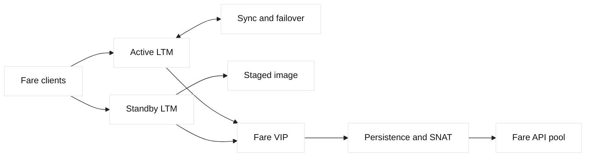
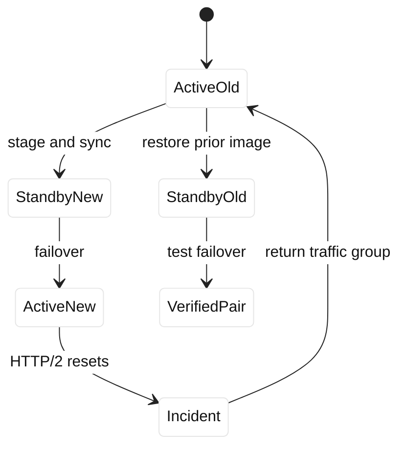

# Case study 19: load-balancer upgrade rollback

## Context and goals

Fictional Blue Mesa Transit planned a BIG-IP LTM software upgrade for the `fare.bluemesa.example` VIP, `198.51.100.119`, during a low-volume window. The pair used active-standby HA, sync-failover, client TLS termination, persistence, SNAT, and a pool of fare APIs. After upgrading the standby and failing over, HTTP/2 clients saw intermittent resets and the persistence table did not behave as expected. The goals were to protect ticket purchases, determine whether the defect was software, configuration, or application behavior, and execute a reversible rollback.

**Fact:** an HA failover changes the device processing traffic, while existing connections may not all survive. **Fact:** software upgrades can change defaults, profile behavior, or compatibility. **Inference:** a rollback must include traffic ownership, configuration version, connection expectations, and application verification, not just an image filename. F5 lifecycle and upgrade guides are primary vendor references; HTTP/2 behavior is specified by RFC 9113.

The change had passed a lab test using HTTP/1.1, but production clients negotiated HTTP/2. A health monitor remained green because it used a simple HTTP/1.1 request. The team therefore paused automation and used packet, TLS, LTM log, and application evidence together.

## Architecture

Two fictional appliances, `lb-a.bluemesa.example` and `lb-b.bluemesa.example`, shared a traffic group. The active unit owned the VIP and floating self IPs. The standby had synchronized configuration and a separately staged software image. LTM selected fare API members, applied persistence by a cookie, and used SNAT so responses returned through the active unit. A GTM Wide IP was out of scope for the single VIP but could route to a recovery site.

| Lifecycle element | Intended control | Failure observation |
| --- | --- | --- |
| Image | staged and boot-tested | new image active on standby |
| Config | versioned UCS/archive | profile compatibility uncertain |
| HA | failover after health gate | HTTP/2 resets |
| Monitor | HTTP/1.1 only | remained green |
| Rollback | prior image plus owner return | required coordination |

Addresses are RFC 5737 documentation addresses and names use `example`. F5 HA state, traffic groups, UCS archives, and upgrade procedures are vendor terms requiring release-specific review. No production command is implied.

## Timeline

At 22:00 UTC, operators verified backups, member health, configuration sync, and active ownership. At 22:20, standby `lb-b` booted the candidate image. At 22:45, a failover moved the traffic group. At 22:48, HTTP/2 reset alerts rose and fare retries increased. At 22:55, operators forced ownership back to `lb-a`; new requests recovered but some sessions had failed. At 23:10, packet captures showed stream resets after negotiation on the new image. At 23:30, the change was declared failed. At 00:10, the prior image was restored to `lb-b`. At 00:45, a controlled failover succeeded with HTTP/1.1 and HTTP/2 tests.

## Evidence

The team recorded HA status, traffic-group owner, software versions, config-sync generation, profile references, and member monitor output before each transition. `openssl s_client -connect 198.51.100.119:443 -servername fare.bluemesa.example -alpn h2` was used against a fictional test endpoint to record negotiated protocol and certificate fingerprint. A separate HTTP/1.1 request passed while an HTTP/2 client saw stream resets. **Facts:** resets began after ownership moved to the upgraded unit and correlated with ALPN h2.

A capture showed TCP establishment and TLS completion followed by HTTP/2 reset frames. LTM logs showed pool members healthy and SNAT translations present. Application logs recorded duplicate retry attempts but no broad backend outage. **Inference:** the candidate image or an incompatible profile interaction was the trigger; the evidence did not justify blaming the fare API.

## Competing hypotheses

A pool-member failure was considered and rejected by direct member checks. SNAT exhaustion was checked through translation counters and did not align with the narrow protocol correlation. A certificate issue was unlikely because TLS completed and fingerprints matched. Persistence loss could explain duplicate fare requests but not every reset. The leading hypotheses were an image defect, a changed HTTP/2 profile default, or a configuration migration incompatibility. A client library regression was considered because only some clients negotiated h2.

## Decision points

The team could continue debugging on the new active unit, disable HTTP/2, fail back, or route to a recovery site. It chose failback because ticket purchase reliability had priority and the prior unit was healthy. Disabling HTTP/2 would have been a mitigation but could alter client behavior and hide the upgrade defect. Recovery-site routing was held in reserve because it would increase DNS cache and application-session complexity.

The rollback gate required stable HTTP/1.1 and HTTP/2 synthetics, certificate verification, persistence checks, and no reset spike for 30 minutes. The team did not declare the upgrade successful merely because the health monitor was green. **Inference:** a protocol-representative gate is necessary when client negotiation changes data-plane behavior.

## Remediation

The upgrade runbook now inventories negotiated protocols, profiles, iRules, persistence, SNAT capacity, and monitor client capabilities. A disposable test client exercises HTTP/1.1, HTTP/2, TLS SNI, cookie persistence, member failure, and failover before production ownership moves. Candidate images are tested with the exact configuration schema and a rollback boot path.

Operators added a protocol-aware synthetic and dashboard dimensions for active device, ALPN, reset type, and pool member. Configuration archives are labeled with software version and traffic-group owner. The process requires an explicit “return traffic” action and a post-change comparison of connection counts; failover is not treated as a transactional handoff.

## Verification

After restoring the prior image, the team tested fresh TCP/TLS connections and long-lived HTTP/2 streams through the active VIP. Cookie persistence routed repeated test requests to the expected member, while a controlled member failure moved new sessions appropriately. SNAT translations returned through the active unit. Both devices reported synchronized configuration and known software versions.

The candidate image was retained for lab analysis, not silently reintroduced. **Fact:** the reset spike disappeared after failback. **Inference:** image or image-profile interaction remained the most plausible cause, pending vendor reproduction. The successful rollback verified recovery, not candidate correctness.

## Rollback or recovery

Rollback starts by freezing writes, confirming the healthy unit, and moving the traffic group back only after ownership is known. Existing connections may fail; clients must retry safely, and fare APIs must provide idempotent transaction keys. The standby is booted with the prior approved image, configuration compatibility is checked, and a controlled failover is performed only after synthetics pass.

If both units fail, GTM recovery routing can direct new DNS answers to the fictional secondary site, subject to TTL and session caveats. That path is a separate recovery plan. Evidence captures preserve versions, failover events, ALPN results, and application transaction IDs without payment data.

## Postmortem lessons

An LB upgrade is a lifecycle transition across image, configuration, ownership, connection state, protocol negotiation, and backend behavior. **Fact:** a green HTTP/1.1 monitor missed HTTP/2 resets. **Inference:** monitoring must represent important client protocols, not only the simplest request.

The team learned that failover is a change in packet-processing context, not an atomic migration of every session. Persistence tables and SNAT state require explicit validation. Rollback should be rehearsed and have a known owner-return mechanism. A prior image alone is insufficient if configuration schema or certificates are incompatible.

Future upgrades use a canary standby, exact-client test matrix, timed hold points, and a stop condition tied to user transactions. Vendor references are recorded with the release version, while local measurements remain labeled facts. This gives reviewers a clear boundary between documented behavior and incident inference.

## Additional analysis

The upgrade board treated software, configuration, traffic, and observability
as separate compatibility surfaces. Before touching the standby device, the
team validated image integrity, license and hardware support, config sync,
certificate/key availability, monitor behavior, persistence expectations, and
the ability to move traffic back. During failover they watched client and
server connection rates separately because an apparently successful device
role change can still break a server-side profile or route. Rollback was a
known-good image and configuration path with explicit ownership, not an
unplanned downgrade. The postmortem recorded which checks were predictive and
which only detected failure after users were affected.

## Questions and answers

The rollback rehearsal also covered monitoring continuity. Dashboards had to
distinguish the active device, the standby device, client-side connections,
server-side connections, monitor state, and configuration-sync state. Without
those dimensions, a green aggregate graph could hide a broken standby or a
small but critical TLS failure. The team assigned an owner to each signal and
recorded the exact alert threshold and observation window.

1. **Why did the monitor stay green?** It tested HTTP/1.1 while affected clients negotiated HTTP/2.

Interview reasoning: Map the answer to the BIG-IP LTM object model: virtual server and profiles admit the client flow, a monitor determines member eligibility, a pool chooses a member, and SNAT/persistence influence the server-side tuple. In a diagnosis, compare VIP-side and member-side captures, monitor logs, pool state, persistence records, and return routing. The caveat is that a green monitor is only evidence for that probe; it is not proof that every user request, TLS name, dependency, or capacity budget is healthy.

2. **What changed first?** Traffic-group ownership moved to the upgraded unit.

Interview reasoning: Interviewers want the control loop: discover current state, normalize only supported fields, calculate a minimal diff, obtain approval, apply idempotently, validate behavior, and record evidence. For F5, include partition/folder/self-link handling, pagination, version compatibility, bounded retries, and read-back after uncertain responses; use SSH for approved diagnostics rather than hidden mutation. The caveat is that an HTTP 200 or successful SDK call is not proof of traffic health, so rollback and post-change probes are part of correctness.

3. **Did TLS fail?** No; TLS completed and the expected certificate was seen.

Interview reasoning: Walk through the handshake fields and the trust decision rather than saying only that TLS encrypts traffic. Check the hostname/SNI, negotiated protocol and cipher, certificate validity interval, SAN, chain order, trust store, and—when applicable—the client certificate and mapped identity. A practical example is testing each proxy leg independently with an explicit SNI name. The caveat is that front-end certificate success says nothing about backend TLS, authorization, or application readiness.

4. **Why fail back?** The prior unit restored fare reliability with the smallest immediate risk.

Interview reasoning: Interviewers want the control loop: discover current state, normalize only supported fields, calculate a minimal diff, obtain approval, apply idempotently, validate behavior, and record evidence. For F5, include partition/folder/self-link handling, pagination, version compatibility, bounded retries, and read-back after uncertain responses; use SSH for approved diagnostics rather than hidden mutation. The caveat is that an HTTP 200 or successful SDK call is not proof of traffic health, so rollback and post-change probes are part of correctness.

5. **Does failover preserve every session?** No; existing connections and state may be disrupted.

Interview reasoning: Interviewers want the control loop: discover current state, normalize only supported fields, calculate a minimal diff, obtain approval, apply idempotently, validate behavior, and record evidence. For F5, include partition/folder/self-link handling, pagination, version compatibility, bounded retries, and read-back after uncertain responses; use SSH for approved diagnostics rather than hidden mutation. The caveat is that an HTTP 200 or successful SDK call is not proof of traffic health, so rollback and post-change probes are part of correctness.

6. **What does ALPN reveal?** The protocol negotiated during TLS, such as h2 or HTTP/1.1.

Interview reasoning: Interviewers want the control loop: discover current state, normalize only supported fields, calculate a minimal diff, obtain approval, apply idempotently, validate behavior, and record evidence. For F5, include partition/folder/self-link handling, pagination, version compatibility, bounded retries, and read-back after uncertain responses; use SSH for approved diagnostics rather than hidden mutation. The caveat is that an HTTP 200 or successful SDK call is not proof of traffic health, so rollback and post-change probes are part of correctness.

7. **Why test persistence?** A failover or profile change can alter cookie and session routing.

Interview reasoning: Map the answer to the BIG-IP LTM object model: virtual server and profiles admit the client flow, a monitor determines member eligibility, a pool chooses a member, and SNAT/persistence influence the server-side tuple. In a diagnosis, compare VIP-side and member-side captures, monitor logs, pool state, persistence records, and return routing. The caveat is that a green monitor is only evidence for that probe; it is not proof that every user request, TLS name, dependency, or capacity budget is healthy.

8. **What is a fact?** Resets correlated with the new active image and h2 traffic.

Interview reasoning: Interviewers want the control loop: discover current state, normalize only supported fields, calculate a minimal diff, obtain approval, apply idempotently, validate behavior, and record evidence. For F5, include partition/folder/self-link handling, pagination, version compatibility, bounded retries, and read-back after uncertain responses; use SSH for approved diagnostics rather than hidden mutation. The caveat is that an HTTP 200 or successful SDK call is not proof of traffic health, so rollback and post-change probes are part of correctness.

9. **What is an inference?** An image/profile interaction was the likely trigger.

Interview reasoning: Interviewers want the control loop: discover current state, normalize only supported fields, calculate a minimal diff, obtain approval, apply idempotently, validate behavior, and record evidence. For F5, include partition/folder/self-link handling, pagination, version compatibility, bounded retries, and read-back after uncertain responses; use SSH for approved diagnostics rather than hidden mutation. The caveat is that an HTTP 200 or successful SDK call is not proof of traffic health, so rollback and post-change probes are part of correctness.

10. **What is the SDE2 lesson?** Safe upgrades require representative gates and a rehearsed rollback across all state layers.

Interview reasoning: Interviewers want the control loop: discover current state, normalize only supported fields, calculate a minimal diff, obtain approval, apply idempotently, validate behavior, and record evidence. For F5, include partition/folder/self-link handling, pagination, version compatibility, bounded retries, and read-back after uncertain responses; use SSH for approved diagnostics rather than hidden mutation. The caveat is that an HTTP 200 or successful SDK call is not proof of traffic health, so rollback and post-change probes are part of correctness.
