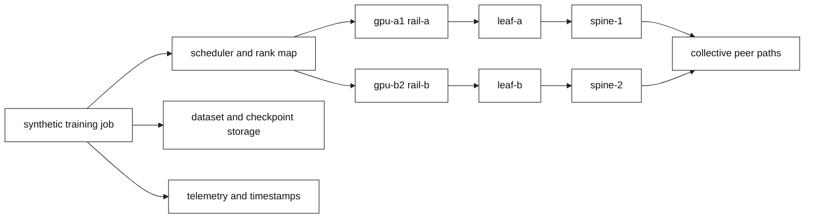

# AI training fabric straggler: a bounded simulated incident

This case study is fictional and intentionally uses the local
`ai-fabric-fixture/v2` model. It describes how an interview candidate or design
reviewer should reason from evidence; it is not a claim about a real cluster,
GPU, NIC, switch, collective library, or vendor release.

## Context and goals

The synthetic `atlas-lab` platform runs a four-rank training job named
`job-synthetic-17`. Its owner reports that the second phase of a step is slow
and that the rank timeline appears to wait for `gpu-b2`. The service objective
is a bounded step completion target of `0.50` synthetic seconds, not a promise
about wall-clock hardware performance. The platform team wants a diagnosis
before reserving more accelerators or changing a fabric policy.

The incident commander sets three goals: protect tenant and checkpoint
boundaries, distinguish a collective straggler from storage or scheduler
contention, and make only a reversible local change. The network, ML platform,
storage, and observability owners agree that an output from the fixture will be
recorded as an **Observed lab result**, while any claim about physical behavior
will remain an **Engineering inference** requiring target-release validation.

## Architecture

The model has four dual-rail hosts (`gpu-a1`, `gpu-a2`, `gpu-b1`, `gpu-b2`),
two logical rails, two leaves, two spines, and separate scheduler, storage,
and telemetry services. Rank 0 and rank 2 use `rail-a`; rank 1 and rank 3 use
`rail-b`. The path map is a teaching abstraction: it does not emulate an
ASIC, PCIe, DMA, NIC queue, physical buffer, or runtime algorithm.

**Fact:** a synchronized collective can expose the slowest participant as a
job-level delay. **Vendor terminology:** a runtime such as NCCL may expose
collective or topology terms whose behavior depends on its release and
environment. **Engineering inference:** the fixture's rank completion estimate
helps order hypotheses but is not a runtime benchmark.

## Timeline

| Time | Event | Initial interpretation | Evidence boundary |
| --- | --- | --- | --- |
| 09:00 | Job admitted and placed | Four ranks appear present | Scheduler record and rank map |
| 09:03 | Baseline fixture run | Both rails are balanced | Schema v2 derived output |
| 09:08 | Synthetic regression reported | Rank 3 looks slow | Runtime timeline, not root cause |
| 09:12 | Rail fault replayed | Rail-b load becomes disproportionate | Fixture path and queue model |
| 09:16 | Storage fault replayed | Similar degraded status appears | Storage evidence differs |
| 09:22 | Negative control run | Metadata note does not alter path | Derived digest comparison |
| 09:28 | Local repair replayed | Baseline state returns | Repair read-back and hash manifest |
| 09:35 | Rollback replayed | Known baseline is reproducible | Rollback artifact and cleanup proof |

## Evidence

The first evidence bundle contains the scenario digest, rank map, phase loads,
path map, and a high timestamp-confidence value. Baseline output reports `70
Gb/s` offered on each modeled rail, available paths, clear qualitative queue
states, and a completed status. The incident report does not treat “completed”
as a hardware health assertion; it is a derived field from the local model.

The rail replay changes rail-b offered load by the fault model and marks the
direct signal as disproportionate rail load. Its ownership hint points to
host/platform and network/platform teams. The storage replay lowers modeled
storage capacity below checkpoint demand and marks storage as the direct
signal. Both can result in a degraded workload status, which is why the
symptom alone is insufficient.

The negative control changes only the review metadata. Its derived path digest
and status remain unchanged. An independent link fault changes path
availability and health state. The retained bundle has setup, baseline-readback,
fault, assertion, repair-readback, rollback, and cleanup files with SHA-256
manifest entries. **Observed lab result:** these facts are bounded by runner
`2.0.0` and schema `ai-fabric-fixture/v2`.

## Competing hypotheses

| Hypothesis | Supporting observation | Falsifier | Owner |
| --- | --- | --- | --- |
| Congested rail or ECMP imbalance | One rail load and rank tail move together | Balanced path replay leaves delay unchanged | Network/platform and ML platform |
| Link/member failure | Eligible path disappears or asymmetric path appears | All declared links remain available | Network/platform |
| MTU or PMTU mismatch | Effective MTU is below modeled payload path | Same result with compatible MTU and independent payload evidence | Host/network |
| PFC or marking growth | Queue state changes to marked or paused | No queue state change and no workload correlation | Network/platform |
| Storage/checkpoint bottleneck | Storage demand exceeds modeled capacity | Storage remains below capacity while delay persists | Storage/data platform |
| Placement or noisy neighbor | Rank map concentrates a rail or failure domain | Rebalanced local placement has no effect | ML platform/scheduler |
| Control, identity, DNS, or certificate block | Job cannot transition from connecting | Control state is available and rank membership is complete | Control/security |
| Telemetry ambiguity | Clock confidence is low or samples are missing | Independent monotonic timestamps agree | Observability |

The initial report favors a network explanation because a queue counter was
mentioned. The team rejects that as a conclusion. Average utilization can miss
microbursts, but a high average queue counter can also be incidental. The next
evidence must correlate the rank, host, rail, storage, control, and timestamp
boundaries.

## Decision points

At 09:12 the commander chooses a local fixture replay rather than a production
threshold change. The network owner supplies the path and queue interpretation;
the ML platform owner supplies rank and placement; storage supplies capacity
and checkpoint evidence; observability supplies clock and sampling confidence.
The security owner confirms that no tenant payload or credential enters the
bundle.

At 09:16 the team compares two options. Option A is to label the incident a
rail problem and request more bandwidth. Option B is to compare independent
rail and storage faults, then repair only the declared fault input. Option B
costs a small amount of analysis time but protects against an expensive,
irreversible attribution. The team selects B.

The Staff decision gate is explicit: no production change is authorized from a
fixture status. A migration or procurement decision requires target hardware,
driver, firmware, runtime, topology, workload, power/cooling, optics, storage,
and cost evidence. A security boundary, data-integrity concern, undeclared
scope, or persistent objective breach after rollback is an irreversible stop.

## Remediation

The bounded repair removes the single injected rail imbalance from the local
scenario and reruns the full lifecycle. It does not enable PFC, alter ECN
thresholds, change MTU, move a route, restart a scheduler, or increase a
buffer. The repaired read-back must show the baseline path, balanced loads,
and cleanup proof. The storage hypothesis remains open until its independent
capacity evidence is checked.

For a real design review, the next safe action would be a read-only evidence
request against the authorized environment: rank/runtime timestamps, host/NIC
counters, path/control state, authorized queue or marking telemetry, storage
queue and checkpoint records, and scheduler placement. Product behavior must
be named with vendor, model/generation, driver, firmware, runtime, release,
and test topology. This case deliberately provides no production command.

## Verification

Verification checks five properties: the baseline is deterministic; each
allowlisted fault changes derived observations; caller conclusions are rejected;
retained phase hashes match their manifest; and temporary work is removed.
The negative control proves metadata alone cannot cause a path result. The
storage and rail replays demonstrate that similar job symptoms can have
different evidence and ownership.

The team records a confidence statement: high confidence that the fixture
derived the stated synthetic fields, medium confidence in the engineering
hypothesis that rail imbalance resembles a straggler mechanism, and no claim
about physical queue or collective performance. That distinction is more
valuable than a superficially precise percentage from an explanatory model.

## Rollback or recovery

Rollback replays the known baseline scenario and verifies the same normalized
derived observation, rather than retrying the job and calling that rollback.
The retained bundle is write-once and hash-manifested; verification detects
changed phase content while the verifier and manifest are trustworthy. The
temporary workspace is removed by the runner. A human reviewing an artifact
must remove only an artifact bundle they own below `observed/`; unrelated paths
are outside the fixture contract.

If a real rollout later proves that a topology change harms an objective, the
rollback authority must be named before migration, with an old release,
placement policy, or traffic slice that is known to be supportable. Forward
repair is preferred only when evidence shows the intended new state is safe and
rollback would increase risk. Neither choice is automatic.

## Postmortem lessons

The first lesson is ownership: “network slow” is not a complete incident
category. The second is synchronization: a single straggler can turn a small
path problem into a job-level delay. The third is evidence: storage, scheduler,
identity, and telemetry can produce similar symptoms. The fourth is economics:
lost accelerator time, checkpoint delay, power/cooling, optics, storage, and
operator complexity belong in the capacity decision, but fictional model
values are not prices.

The durable prevention item is a design-review template that requires a rank
map, rail/failure-domain map, capacity sensitivity, evidence ownership,
negative control, migration stages, adoption plan, rollback, and stop gate.
The trigger for review is any change in workload mix, hardware generation,
driver/firmware/runtime release, topology, or failure policy. The template also
requires privacy and retention decisions for job and tenant identifiers.

## Questions and answers

1. **[SDE1] What is the most important first correction to the incident report?**

   **Answer:** Replace “the switch is slow” with an observable symptom: a rank timeline, phase, timestamp confidence, path map, and objective. Then list network, storage, scheduler, control, host, and telemetry hypotheses before asking an owner for targeted evidence.

2. **[SDE1] Why does the baseline matter?**

   **Answer:** The baseline defines the fictional topology, balanced loads, expected path availability, and derived status before a single declared fault. Without it, a degraded output has no comparison point and a learner may mistake an assumption for an observation.

3. **[SDE1] What does the storage replay teach?**

   **Answer:** Storage saturation can delay a checkpoint or step while leaving fabric path evidence different from a rail fault. Similar user symptoms therefore require independent capacity and queue evidence instead of a single network counter.

4. **[SDE2] How would you falsify rail imbalance?**

   **Answer:** Reconstruct the rank-to-host-to-rail map, compare per-rail offered load and path eligibility, check authorized queue or marking evidence, and replay a balanced local placement. If the delay persists without the rail difference, rail imbalance is weakened.

5. **[SDE2] Why is PFC not the remediation?**

   **Answer:** PFC is a deployment-specific pause behavior that may contain loss for a priority while propagating congestion or blocking unrelated traffic. The case has not established a causal pause signal, and the fixture provides no production threshold or enablement procedure.

6. **[SDE2] What does the manifest prove?**

   **Answer:** It proves that the retained local phase files match their recorded hashes, schema, runner version, correlation ID, and cleanup proof. It does not prove that an actual switch, NIC, GPU, or collective runtime would behave the same way.

7. **[SDE2] How should clock skew change the incident response?**

   **Answer:** Lower causal confidence, preserve source and clock metadata, and use monotonic local durations or an independent timeline. Do not infer that queue growth preceded a rank stall when the ordering depends on an offset or incomplete sample.

8. **[Staff] What should be in the migration decision record?**

   **Answer:** State objectives, options, assumptions, owners, failure domains, capacity and cost variables, power/cooling and storage impacts, release boundaries, canary stages, communication, adoption, rollback authority, forward-repair criteria, and an irreversible stop for isolation, integrity, authority, or persistent SLO risk.

9. **[Staff] Who is accountable when the root cause crosses teams?**

   **Answer:** The incident commander owns coordination and decision cadence, not every technical state. ML platform owns ranks and placement, network owns path evidence, storage owns checkpoint evidence, and observability owns timestamp quality. Each owner supplies falsifiers and records uncertainty.

10. **[Staff] What durable prevention is justified?**

   **Answer:** Require every expansion or release change to carry a workload-specific capacity worksheet, failure-domain map, evidence plan, negative control, privacy boundary, staged adoption, rollback, and review trigger. This addresses the decision process without pretending that a fixture is a production benchmark.

## Evidence and scope

**Fact:** IP and ECN references include [RFC 791](https://www.rfc-editor.org/rfc/rfc791)
and [RFC 3168](https://www.rfc-editor.org/rfc/rfc3168). **Vendor terminology:**
collective and Ethernet/RDMA terminology must be checked against the selected
runtime, NIC, switch, driver, firmware, and release documentation; [NCCL
documentation](https://docs.nvidia.com/deeplearning/nccl/user-guide/docs/overview.html)
is one named example, not a universal contract. **Observed lab result:** the
timeline and statuses are from schema `ai-fabric-fixture/v2`, runner `2.0.0`,
and the scenario files named above. **Engineering inference:** the competing
hypotheses, ownership split, and rollout gates require target-environment
measurements. See the [book evidence ledger](../FACT-INFERENCE-LEDGER.md).
