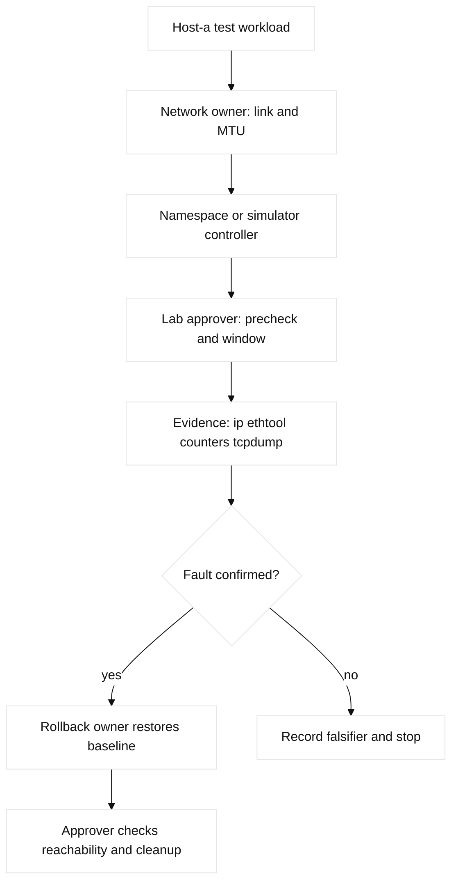

# 01. Network Models and Physical Foundations

## A. Learning objectives and prerequisites

By the end, you can map an application request through the OSI and TCP/IP
models, identify the management, control, data, and forwarding planes, choose
copper or fiber for a distance and speed, and turn an interface symptom into a
testable hypothesis. Prerequisites are basic binary numbers and comfort with a
terminal. The lab uses `leaf-a`, `spine-a`, `host-a`, and documentation addresses
198.51.100.0/24 and 2001:db8:100::/64.

## B. Portable mental model

An endpoint creates application data. Transport adds ports and reliability;
the network layer adds an IP header; a data-link layer adds a frame; the
physical layer turns bits into symbols, light, or electrical transitions.
Receiving devices decapsulate, inspect the relevant header, and re-encapsulate
for the next link. A router changes the Layer 2 envelope at every hop; a switch
usually forwards using a learned MAC-to-port mapping. The control plane learns
routes or topology, the data/forwarding plane applies those decisions, and the
management plane carries configuration, telemetry, and access. A failure in
one plane can look like a failure in another, so name the plane before choosing
a command.


## C. Concept inventory

**Fact:** OSI is a teaching model with seven layers; TCP/IP groups them more
loosely. Encapsulation is the wrapping process and decapsulation is the reverse.
Routers, Layer 2 switches, Layer 3 switches, firewalls, IPS devices, wireless
APs and controllers, endpoints, servers, hypervisors, VMs, and containers each
observe different headers. A LAN, campus, branch, SOHO, data-center, or WAN is
a scope and topology, not a protocol. Physical and logical topology can differ.

An Ethernet collision domain is the set of interfaces sharing contention; a
broadcast domain is normally bounded by a router or VLAN policy. Failure domains
should be intentionally smaller than a whole site. Convergence is the time for
control-plane and forwarding state to settle after a change. A Clos topology
uses repeated equal-cost paths; a three-tier topology separates access,
distribution, and core. Hypervisors and containers add virtual switches and
namespaces, so a host can have more logical hops than cables.

Physical choices include twisted-pair copper, single-mode fiber (SMF),
multimode fiber (MMF), SFP/SFP+/QSFP/QSFP28 transceivers, connectors,
wavelengths, optical loss, power levels, and distance limits. **Vendor
terminology:** the exact optic coding and DOM fields are platform-specific.
Speed/duplex and auto-negotiation must agree. CRC/input/output errors, runts,
giants, late collisions, and interface flaps are evidence, not diagnoses. MTU
is a per-link payload limit; jumbo frames need an end-to-end budget. PoE is a
power negotiation and budget problem, not simply “the port supplies power.”

## D. Configuration shapes and cloud mappings

These are lab-only shapes. On IOS-XE, an interface description, speed/duplex,
MTU, and `show interfaces` counters are relevant. NX-OS uses different feature
gates and interface syntax. Linux equivalents are `ip link`, `ethtool`, and
`ip -s link`. Mutations are omitted here to keep the example read-only:

```text
IOS-XE (read-only): show interfaces Gi1/0/1
NX-OS  (read-only): show interface ethernet1/1 counters errors
Linux  (read-only): ip -s link show eth0; ethtool eth0
```

AWS ENIs expose link semantics through instance and flow-log evidence rather
than a user-managed optic. GCP VM NICs similarly abstract the medium. A
Terraform module can declare an MTU-sensitive VPC, subnet, or instance shape,
but the provider schema and quota must be pinned; any `example.invalid` or
fictional provider is **non-runnable illustrative configuration**. The mapping
is conceptual: physical failure becomes provider health, reachability, or host
telemetry evidence.

## E. Verification and expected evidence

Start at the endpoint: `ip link`, `ethtool`, `ping -M do`, and `tcpdump -ni eth0`.
At a switch inspect admin/operational state, negotiated speed, duplex, MTU,
optic diagnostics, error counters, and recent flaps. At a router compare both
ends and inspect CPU/memory only after link evidence. For a cloud path, inspect
ENI/NIC status, flow logs, reachability/connectivity tests, and service events.
An expected healthy result is stable carrier, matching speed/duplex/MTU, zero
new CRCs, and bidirectional packets visible at adjacent points.

## F. Failure lab: intermittent host reachability

Starting state: `host-a` reaches `host-b` over `leaf-a` on a 1500-byte link.
Inject one fault in a disposable simulator: mismatch MTU to 1400, or replace
an optic fixture with a high-loss fixture. Symptom: small pings pass, large
DF pings fail, or counters rise. Hypotheses are MTU mismatch, optic loss,
duplex mismatch, bad cable, or an upper-layer timeout.

Falsify in order with endpoint MTU probes, both interface counters, DOM power,
and a capture. The smallest safe action is to stop traffic generation and
restore the lab baseline. Roll back the MTU/optic fixture, then verify both
directions and counters. Forward repair is justified only if the designed MTU
budget is updated and every dependent tunnel is checked.



## G. Hands-on exercise, answer, and rubric

Exercise: build a two-link topology on a local Linux namespace or simulator.
Document the physical/logical map, MTU budget, interface names, expected planes,
and a five-command evidence sequence. Inject one CRC or MTU fault and submit a
timeline, hypothesis tree, falsifier, cleanup, and one cloud translation.

Answer: first prove the host sent the frame, then prove carrier and negotiated
parameters, then compare counters at both ends, and finally inspect the IP
fragment/DF behavior. Do not “fix” a CRC by changing routing. A strong answer
states that AWS/GCP hide the physical medium and therefore require service,
flow, and host evidence instead. Rubric: 30% model, 25% evidence order, 20%
safety, 15% cloud mapping, 10% clarity. SDE2 follow-up: automate baseline
collection without writing state. Staff follow-up: design a transceiver
standard, N+1 path, and ownership policy across sites.

## H. Interview questions and answers

1. **Why can a Layer 3 switch be called a switch and a router?** **Answer:** It
   switches within a VLAN and routes between SVIs. **Wrong turn:** following the
   product label instead of the destination path. **Evidence:** CAM/SVI lookup
   and a capture show the boundary. **Follow-up:** where would an ACL be applied?
2. **What does encapsulation change at a router?** **Answer:** The IP packet can
   survive while the incoming frame is replaced. **Wrong turn:** assuming the
   same MAC crosses the routed hop. **Evidence:** captures on both links show
   different L2 envelopes. **Follow-up:** what does NAT additionally change?
3. **What does a CRC error prove?** **Answer:** The receiver detected bad frame
   integrity, not which component caused it. **Wrong turn:** replacing the first
   cable named. **Evidence:** both-end counters, DOM data, and a known-good swap.
   **Follow-up:** why preserve counters before clearing them?
4. **Why is duplex mismatch severe?** **Answer:** The ends disagree about
   transmission, causing collisions and retransmits. **Wrong turn:** treating
   auto-negotiation as proof of a match. **Evidence:** negotiated state and
   counters at both ends. **Follow-up:** which symptoms distinguish MTU failure?
5. **What is the control/data-plane boundary?** **Answer:** Control computes
   state; forwarding applies it per packet. **Wrong turn:** treating a RIB entry
   as forwarding proof. **Evidence:** protocol state plus FIB/adjacency output.
   **Follow-up:** which plane owns a configuration commit?
6. **Why distinguish broadcast and failure domains?** **Answer:** A VLAN bounds
   broadcast, while shared dependencies can fail farther. **Wrong turn:** assuming
   one VLAN equals one failure domain. **Evidence:** dependency map and blast-radius
   observation. **Follow-up:** Staff: set a failure-domain SLO.

## I. Evidence labels and references

**Fact:** RFC 1122 defines host communication requirements; RFC 8200 defines
IPv6; IEEE 802.3 defines Ethernet. **Vendor terminology:** Cisco `show
interfaces` and DOM field names. **Observed lab result:** a local namespace
will show `ip -s link` counters for the selected kernel and virtual link.
**Engineering inference:** reserved addresses and explicit MTU budgets make
interview labs safer and conclusions more portable. References: [RFC Editor](https://www.rfc-editor.org/), [IEEE 802.3](https://standards.ieee.org/standard/802_3-2022.html), [Cisco IOS XE interface guide](https://www.cisco.com/c/en/us/support/ios-nx-os-software/ios-xe-17/series.html), and [ethtool manual](https://man7.org/linux/man-pages/man8/ethtool.8.html).

## J. A-L contract mapping and concept-to-evidence matrix

The lettered path is A objectives, B model, C concepts, D configuration, E
verification, F failure lab, G exercise, H Q&A, I evidence labels, J diagrams,
K ownership and rollback, and L completion evidence.

| Concept | Mechanism and limit | IOS-XE/NX-OS evidence | Linux/namespace evidence | Falsifier |
| --- | --- | --- | --- | --- |
| Encapsulation | Each routed hop rebuilds L2; MTU bounds payload | `show interfaces` | `ip -s link`, `tcpdump -eni` | Same MAC crosses a router |
| Optics/copper | Speed, duplex, wavelength, loss, and power must fit | `show interfaces transceiver detail` | `ethtool eth0`, `ethtool -S eth0` | Stable DOM and no new errors |
| Planes | Control computes; forwarding applies; management configures | `show interfaces`, platform FIB output | `ip route get`, `ip -s link` | Forwarding works without control change |
| PoE/MTU | Power budget and frame budget are separate | `show power inline`, MTU/counters | `ip link`, `ping -M do` | Full-size DF packets pass |

## K. Detailed shapes and named reproducible failure lab

Cisco IOS-XE shape: `show interfaces Gi1/0/1`, `show interfaces transceiver
detail`, and `show controllers ethernet-controller` where supported. NX-OS
shape: `show interface ethernet1/1`, `show interface ethernet1/1 counters
errors`, and `show interface transceiver`. Linux uses `ip -s link`, `ethtool`,
and `tcpdump`; namespaces provide an isolated forwarding boundary. These are
read-only, release-dependent commands.

The named lab is **`physical-mtu-namespace-repro`**. Safety: only disposable
namespaces, veth pairs, and documentation addresses are allowed; never select a
production interface. Prechecks: `id`, `ip netns list`, `ip link show`, and
`command -v ip tcpdump`; abort if the fixture is not empty. Baseline:

```text
sudo ip netns add host-a; sudo ip netns add host-b
sudo ip link add veth-a type veth peer name veth-b
sudo ip link set veth-a netns host-a; sudo ip link set veth-b netns host-b
sudo ip -n host-a addr add 198.51.100.10/30 dev veth-a
sudo ip -n host-b addr add 198.51.100.11/30 dev veth-b
sudo ip -n host-a link set lo up; sudo ip -n host-b link set lo up
sudo ip -n host-a link set veth-a up; sudo ip -n host-b link set veth-b up
sudo ip netns exec host-a ping -c 2 198.51.100.11
sudo ip -n host-a link show veth-a > /tmp/physical-mtu-baseline.txt
```

Expected output is `2 received, 0% packet loss` and both links `state UP`.
Injected fault: `sudo ip -n host-b link set veth-b mtu 1400`. Symptom:
small ping passes but `ping -M do -s 1472 -c 1 198.51.100.11` fails. Hypothesis:
MTU mismatch. Falsifier: matching MTUs plus an echo reply in
`tcpdump -ni veth-a icmp` sends the investigation to the medium/upper layer.
Repair is `sudo ip -n host-b link set veth-b mtu 1500`; rollback is the saved
baseline or fixture recreation. Success requires both probes, no new errors,
and a closed capture. Cleanup proof: `sudo ip netns del host-a; sudo ip netns
del host-b; test ! -e /var/run/netns/host-a`.

## L. Worked answer, rubric, and SDE2/Staff follow-ups

The worked topology is `host-a--veth--host-b`; the expected planes are namespace
management, kernel forwarding, and the test workload. The submission below is
a completed example, not a claim that a provider or physical optic was tested.

| Rubric criterion | Learner artifact | Expected evidence | Pass/fail threshold | SDE2 follow-up answer | Staff follow-up answer |
| --- | --- | --- | --- | --- | --- |
| Encapsulation and path model (30%) | One frame-to-packet-to-segment path with MTU boundaries | L2/L3 headers, interface MTUs, namespace topology | Pass only if every hop and overhead assumption is named | I would encode the path as structured data and assert each hop's MTU before probing. | I would set an end-to-end MTU budget, owner, and change gate for every encapsulation boundary. |
| Ordered evidence (25%) | Timestamped `ip`, `ethtool`, neighbor, and capture transcript | Negotiation, counters, ARP/ND, and packet arrival at both ends | Pass only if at least two independent layers support the hypothesis | I would collect read-only evidence concurrently and reject a layer when its falsifier is present. | I would require a common evidence schema so physical, cloud, and service teams can correlate a fault. |
| Safe fault handling (20%) | Saved fixture, one MTU fault, repair and rollback | Diff before/after, bounded test, restored baseline | Pass only if rollback is reversible and cleanup is proven | I would use a disposable namespace and a timeout so a failed test cannot persist. | I would approve blast radius, spare path, maintenance window, and explicit rollback ownership. |
| Cloud translation (15%) | Mapping of NIC MTU, route, SG/firewall, and flow evidence | AWS/GCP object names plus provider read-back fields | Pass only if translation calls out non-equivalence | I would keep provider adapters separate from the portable path model and test both. | I would standardize the contract across clouds while retaining provider-specific limits and quotas. |
| Cleanup proof (10%) | Fixture inventory and post-run checks | No namespace/process/file or changed state remains | Pass only if the cleanup command and expected empty result are recorded | I would make cleanup an assertion, not a best-effort final note. | I would audit lab residue and make ownership transfer explicit before closing the change. |

**Completed score:** 30/30 + 25/25 + 20/20 + 15/15 + 10/10 = **100/100**.
The SDE2 answer explains how to automate evidence; the Staff answer explains
how to govern the dependency and its failure domain.

## M. Reproducible lab record

**Disposable fixture/topology and safety:** disposable Linux namespaces represented by two
veth endpoints, `host-a--veth--host-b`; no physical interface or cloud NIC is
touched. **Exact setup inputs:** `LAB_DIR=$(mktemp -d /tmp/ccna01.XXXXXX)`;
create `mtu_a=1500 mtu_b=1500 state=UP replies=2 errors=0` in
`$LAB_DIR/state.txt`, then copy it to `baseline.txt`.

**Baseline command and expected baseline:** `cat "$LAB_DIR/state.txt"` should
show the setup values (**illustrative** until run). **Injected fault:**
`sed -i 's/mtu_b=1500/mtu_b=900/' "$LAB_DIR/state.txt"`.
**Measurable assertion/sample output:** `grep -q 'mtu_b=900'
"$LAB_DIR/state.txt"` -> `ASSERT MTU_MISMATCH`; this is illustrative, not
observed physical behavior. **Repair:** restore `mtu_b=1500`, then `cmp
state.txt baseline.txt`. **Rollback:** `cp baseline.txt state.txt` when endpoint
or owner is uncertain. **Cleanup verification:** `rm -f "$LAB_DIR/state.txt"
"$LAB_DIR/baseline.txt"; rmdir "$LAB_DIR"; test ! -e "$LAB_DIR"`.
Record the learner-run status as **observed**; expected clean status `0` is
**illustrative**.

## N. Artifact-backed submission

Observed bundle: [`01-physical-mtu.json`](fixtures/observed/01-physical-mtu.json). The retained v3 record derives `path_mtu` from effective interface MTUs and packet size; it does not inject a second plane fault. Its assertion proves a metadata-only control change remains healthy while an evaluator-only carrier fault fails. Reconciliation retains desired state, task, effective read-back, and observation. Module-specific scoring: [worked submissions](fixtures/worked-submissions.md#02-b-module-01--01-physical-mtu).
