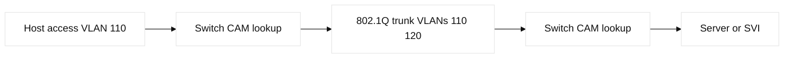
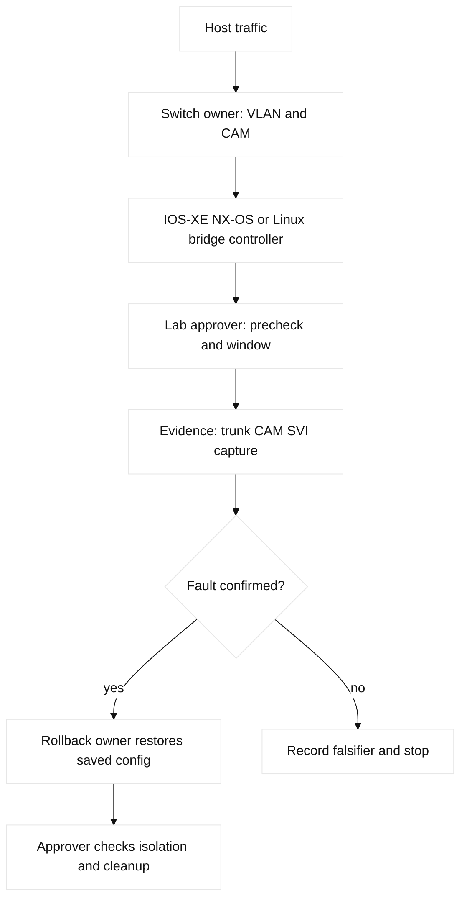

# 02. Ethernet Switching and VLANs

## A. Learning objectives and prerequisites

You will explain Ethernet frame forwarding, MAC/CAM learning and aging,
flooding, VLAN isolation, access/trunk behavior, 802.1Q tags, native/voice/
management VLANs, pruning, inter-VLAN routing, port security, storm control,
DHCP snooping, Dynamic ARP Inspection (DAI), IP Source Guard, CDP, and LLDP.
Know the physical model in module 01 and basic IPv4 addressing.

## B. Portable mental model

A switch learns the source MAC on the ingress port, looks up the destination,
and forwards, filters, or floods within a VLAN. A trunk carries multiple VLANs
with an 802.1Q tag; an access port assigns untagged ingress frames to one VLAN.
An SVI or routed port becomes a Layer 3 boundary. Control-plane protocols and
security features create metadata, while ASIC forwarding applies the lookup.
The native VLAN is an untagged convention and therefore a mismatch can create
both reachability and security ambiguity.



## C. Concept inventory

An Ethernet frame has source/destination MAC, optional 802.1Q priority/VLAN
tag, EtherType, payload, and FCS. CAM is the hardware table used for MAC
lookups; learning and aging limit stale state. Unknown unicast, broadcast, and
multicast flooding are bounded by VLAN and storm-control policy. Access, trunk,
voice, and management VLANs express different trust boundaries. VLAN pruning
reduces unnecessary trunk traffic, while VLAN hopping attacks exploit tagging
assumptions. Port security can bind sticky MACs and choose shutdown/restrict
violation behavior. DHCP snooping builds trusted bindings; DAI validates ARP;
IP Source Guard uses bindings to filter spoofed source IP/MAC.

**Vendor terminology:** Cisco calls a switched virtual interface an SVI and a
routed interface a routed port; other vendors differ. CDP is Cisco discovery;
LLDP is multi-vendor. A Layer 3 switch may use CEF or another ASIC pipeline.

## D. Configuration shapes and cloud mappings

Illustrative IOS-XE shape (lab only):

```text
vlan 110
 name APP
interface Gi1/0/10
 switchport mode access
 switchport access vlan 110
 spanning-tree portfast
interface Gi1/0/48
 switchport mode trunk
 switchport trunk allowed vlan 110,120
interface Vlan110
 ip address 198.51.100.1 255.255.255.0
```

NX-OS may require `feature interface-vlan` and uses `show mac address-table`;
Linux bridges expose `bridge vlan show` and `bridge fdb show`. The example is
configuration-shaped and release-dependent, not a universal paste target.
AWS maps a VLAN-like boundary to a subnet plus route table and security group,
not to a customer-managed 802.1Q trunk. GCP VPC subnets and firewall rules are
also logical. Terraform resource names differ by provider; any generic switch
provider or `example.invalid` endpoint is **non-runnable**. Preserve ownership:
the switch controller owns VLAN state, while Terraform may own cloud subnets.

## E. Verification

Read-only evidence includes `show vlan brief`, `show interfaces trunk`, `show
mac address-table dynamic`, `show interfaces counters errors`, `show cdp
neighbors detail`, and `show lldp neighbors detail`. On Linux use `bridge vlan`,
`bridge fdb`, `ip addr`, and `tcpdump -eni`. Verify the SVI ARP/ND state and
the host default gateway separately. AWS evidence is subnet route tables,
security-group/NACL decisions, and VPC Flow Logs. GCP evidence is subnet route,
firewall logging, and VPC Flow Logs. A healthy path shows the expected VLAN on
both trunks, a learned MAC on the intended port, and no unauthorized flood.

## F. Failure lab: native VLAN and stale CAM

Start with host-a in VLAN 110 and server-a in VLAN 120 routed through SVI.
Inject a trunk allowed-list omission or native VLAN mismatch in a simulator.
Symptom: one VLAN fails, CDP warns, or traffic appears on an unexpected VLAN.
Hypotheses are tagging mismatch, missing VLAN, SVI/ARP issue, CAM movement, or
an ACL. Falsify from the edge inward: host VLAN, trunk allowed/native state,
CAM location, SVI status, then a capture. Smallest action is remove the injected
fault or shut the lab port; rollback the saved config and verify each VLAN.



## G. Hands-on exercise, answer, and rubric

Build two switches, two access VLANs, one trunk, and one SVI in a local
simulator. Deliver an Ethernet hop table, a VLAN/trunk inventory, a security
binding plan, six read-only commands, and a packet capture showing a tagged
trunk frame. Inject a missing allowed VLAN and explain why same-VLAN and
inter-VLAN tests differ.

Answer: verify the endpoint sends, prove its ingress VLAN, confirm the VLAN is
allowed across every trunk, locate the destination MAC, then verify SVI ARP and
route state. A missing VLAN is not fixed by clearing CAM. Rubric: 25% frame
reasoning, 25% evidence, 20% safe rollback, 15% security controls, 15% cloud
translation. SDE2: write a read-only compliance check for trunk allow-lists.
Staff: design a VLAN-to-subnet/IPAM policy that prevents tenant overlap and
limits broadcast blast radius.

## H. Interview questions and answers

1. **When does a switch flood?** **Answer:** Unknown unicast, broadcast, or
   permitted multicast floods within the VLAN. **Wrong turn:** interpreting a
   flood as proof the host is offline. **Evidence:** CAM aging and captures.
   **Follow-up:** how does storm control change the result?
2. **Why is a native VLAN mismatch dangerous?** **Answer:** Untagged frames can
   land in different VLANs. **Wrong turn:** relying on ping alone. **Evidence:**
   trunk state and tagged/untagged captures. **Follow-up:** what is the safest
   native VLAN policy?
3. **What is the difference between an SVI and a routed port?** **Answer:** An
   SVI serves a VLAN; a routed port has no switchport semantics. **Wrong turn:**
   treating both as access ports. **Evidence:** interface mode and ARP state.
   **Follow-up:** where does ARP occur in each design?
4. **How do DHCP snooping and DAI relate?** **Answer:** Snooping learns trusted
   bindings that DAI can use to validate ARP. **Wrong turn:** enabling DAI with
   no trusted DHCP/static binding plan. **Evidence:** binding table and DAI drops.
   **Follow-up:** how are static hosts admitted?
5. **How would you detect a MAC flap?** **Answer:** Correlate CAM moves,
   interface events, TCNs, and loop evidence over time. **Wrong turn:** clearing
   counters before saving a baseline. **Evidence:** timestamped CAM/event output.
   **Follow-up:** which control feature can contain a loop?
6. **Are AWS security groups VLANs?** **Answer:** No; they are stateful virtual
   firewall rules, while VLANs segment Layer 2. **Wrong turn:** mapping names by
   intent alone. **Evidence:** subnet/VLAN and flow-rule tests. **Follow-up:**
   what cloud evidence replaces a trunk capture?

## I. Evidence labels and references

**Fact:** IEEE 802.1Q defines VLAN tagging; RFC 826 defines ARP. **Vendor
terminology:** Cisco CAM, SVI, CDP, and DAI names. **Observed lab result:** a
Linux bridge FDB changes when a namespace sends a frame. **Engineering inference:** explicit trunk allow-lists and management-plane isolation reduce
blast radius. References: [IEEE 802.1Q](https://standards.ieee.org/standard/802_1Q-2022.html), [Cisco VLAN configuration](https://www.cisco.com/c/en/us/td/docs/switches/lan/catalyst-9300/software/release/17-9/configuration_guide/), [Linux bridge](https://man7.org/linux/man-pages/man8/bridge.8.html), and [AWS security groups](https://docs.aws.amazon.com/vpc/latest/userguide/vpc-security-groups.html).
## J. A-L mapping and concept-to-evidence table

A objectives, B model, C concepts, D shapes, E verification, F lab, G exercise,
H Q&A, I labels, J diagrams, K ownership/rollback, and L completion evidence
are the explicit review mapping for this chapter.

| Concept | Mechanism and limit | Cisco IOS-XE/NX-OS | Linux bridge/namespace | Falsifier |
| --- | --- | --- | --- | --- |
| CAM learning | Source MAC learns and ages; unknown destinations flood | `show mac address-table dynamic` | `bridge fdb show` | MAC stays on intended port |
| VLAN tagging | Access is untagged; trunks carry permitted 802.1Q VLANs | `show interfaces trunk` | `bridge vlan show`, `tcpdump -eni` | Correct tag crosses both ends |
| SVI/routed port | SVI routes a VLAN; routed port is L3-only | `show ip interface brief` | `ip addr`, `ip route` | ARP and route are correct |
| L2 protection | Snooping bindings feed DAI/IPSG; storm control limits floods | `show ip dhcp snooping binding` | Namespace tests are illustrative | Authorized binding is accepted |

## K. Detailed shapes and named reproducible failure lab

IOS-XE shape uses `switchport mode access`, `switchport access vlan 110`, and
`switchport trunk allowed vlan 110,120`; NX-OS commonly needs `feature
interface-vlan` before an SVI. Linux uses `ip link add br-lab type bridge`,
`bridge vlan add`, and veth pairs. These are lab-only shapes; save state and
verify release syntax before mutation.

The named lab is **`vlan-allowed-list-namespace-repro`**. Safety: disposable
namespaces and a bridge named `br-lab` only. Prechecks: `ip link show br-lab`,
`ip netns list`, and `bridge vlan show`; abort if non-lab ports exist. Baseline
puts two namespace veths in VLAN 110, assigns `198.51.100.10/24` and
`.11/24`, and saves `bridge fdb show` and `bridge vlan show` to
`/tmp/vlan-baseline.txt`; expected output shows VLAN 110 on both ports and each
MAC on its veth. Injected fault: remove VLAN 110 from one port with `bridge vlan
del dev veth-b vid 110`. Symptom: same-VLAN ping fails while links remain UP.
Hypothesis: membership fault. Falsifier: correct tags, FDB, and ARP in a
capture. Expected output is no reply and a missing VLAN row. Repair restores
`bridge vlan add dev veth-b vid 110`; rollback reapplies saved state. Success
is bidirectional ping and matching VLAN rows. Cleanup proof: delete both
namespaces and `br-lab`, then confirm `ip link show br-lab` reports absent.

## L. Worked answer, rubric, and SDE2/Staff follow-ups

The worked answer identifies untagged access ingress, tagged trunk transit, and
the SVI boundary. The fixture is a local bridge/VLAN model; no switch or cloud
account is mutated.

| Rubric criterion | Learner artifact | Expected evidence | Pass/fail threshold | SDE2 follow-up answer | Staff follow-up answer |
| --- | --- | --- | --- | --- | --- |
| Frame and VLAN reasoning (25%) | Ingress/egress drawing for access, trunk, and SVI | Tagged capture, VLAN membership, MAC/FDB entries | Pass if tag handling and broadcast boundary are correct | I would assert VLAN ID, tag state, and destination MAC at each hop. | I would define VLAN/IPAM ownership and prohibit unreviewed native-VLAN changes. |
| Evidence quality (25%) | Ordered read-back transcript | Port mode, trunk allow-list, CAM, ARP/ND, counters | Pass if the result uses both control and forwarding evidence | I would compare a known-good port with the suspect port and preserve timestamps. | I would require independent switch and service-owner evidence before declaring impact. |
| Reversible fault (20%) | One missing VLAN/allow-list fault with saved state | Negative probe, changed row, restored row | Pass if one fault is injected and rollback returns the exact baseline | I would gate the mutation on a fixture identifier and verify the diff is one row. | I would choose forward repair versus rollback based on active sessions and change window. |
| Security controls (15%) | DAI/DHCP-snooping/segmentation decision | Binding table, drop counters, permitted/denied test | Pass if control intent is separated from mere reachability | I would add positive and negative tests for trusted and untrusted sources. | I would own exception expiry, enforcement order, and incident escalation. |
| Cloud translation (15%) | AWS subnet/route/SG and GCP subnet/route/firewall mapping | API object read-back plus flow/reachability proof | Pass if no provider feature is called equivalent without a caveat | I would build a provider-neutral test contract with provider-specific assertions. | I would approve blast radius, quotas, and the single writer for each policy object. |

**Completed score:** 25/25 + 25/25 + 20/20 + 15/15 + 15/15 = **100/100**.
This is an **illustrative submission**; only the local fixture output and
repository checks are observed results.

## M. Reproducible lab record

**Disposable fixture/topology and safety:** `host-a--access-port--bridge/VLAN 110--trunk--SVI--host-b`
is a local text fixture; no switch port or cloud subnet is changed. **Exact
setup inputs:** `LAB_DIR=$(mktemp -d /tmp/ccna02.XXXXXX)`; write
`access=VLAN110 trunk=tagged allow=110 cam=learned svi=up probe=pass` to
`state.txt` and copy it to `baseline.txt`.

**Baseline command/expected baseline:** `cat "$LAB_DIR/state.txt"` shows the
access VLAN, tagged trunk, allow-list, learned CAM, and passing probe
(**illustrative**). **Injected fault:** `sed -i 's/allow=110/allow=120/;
s/probe=pass/probe=fail/' "$LAB_DIR/state.txt"`. **Measurable assertion/sample output:**
`grep -q 'allow=120' "$LAB_DIR/state.txt"` -> `ASSERT VLAN_ALLOWED_MISMATCH`.
A real lab adds tagged capture and CAM read-back. **Repair:** restore
`allow=110` and `probe=pass`, then `cmp state.txt baseline.txt`. **Rollback:**
`cp baseline.txt state.txt` if the trunk or VLAN is not the reserved fixture.
**Cleanup verification:** `rm -f "$LAB_DIR/state.txt" "$LAB_DIR/baseline.txt";
rmdir "$LAB_DIR"; test ! -e "$LAB_DIR"`. Only learner-run local status is
**observed**; sample output is **illustrative**.

## N. Artifact-backed submission

Observed bundle: [`02-vlan-trunk.json`](fixtures/observed/02-vlan-trunk.json). The v3 evaluator derives `hop_admission` from the effective allowed VLANs and tagged-frame path. The assertion separates a healthy metadata control change from an evaluator-only tag-strip fault; reconciled task/read-back records accompany the control fault and repair. Module-specific scoring: [worked submissions](fixtures/worked-submissions.md#03-b-module-02--02-vlan-trunk).
