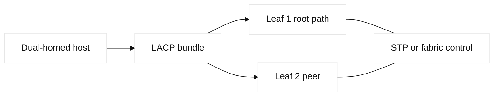
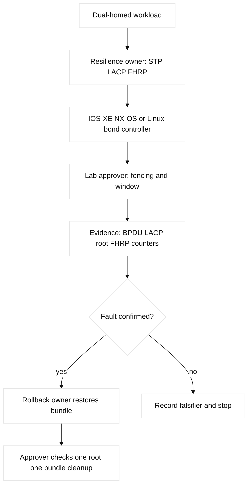

# 03. STP, LACP, and Layer 2 Resilience

## A. Learning objectives and prerequisites

Explain STP, RSTP, MST, BPDUs, bridge/root election, port roles and states,
cost, topology changes, guards, PortFast, EtherChannel, LACP, PAgP, hashing,
MLAG, vPC, StackWise, HSRP, VRRP, GLBP, split brain, and convergence. You
should already understand VLANs, trunks, and CAM learning.

## B. Portable mental model

Redundant Layer 2 links create loops unless a control protocol selects a tree or
bundles links into one logical adjacency. STP computes a loop-free active path;
LACP negotiates member consistency and presents one logical port-channel. FHRPs
provide a virtual first hop, while MLAG/vPC/stacking make two physical switches
appear as a multi-chassis system with platform-specific control state. Control
state and forwarding state must be checked separately: a port can be logically
blocked, bundled incorrectly, or forwarding with a stale neighbor.

## C. Concept inventory

STP elects a root bridge using bridge ID; ports select root, designated, or
alternate roles and move through states. RSTP accelerates transitions; MST
maps VLANs to instances. BPDUs carry control state. PortFast is for an edge
port, while BPDU Guard protects that edge assumption. BPDU Filter can suppress
or ignore BPDUs and is dangerous when misapplied. Root Guard prevents an
unexpected root; Loop Guard protects against unidirectional BPDU loss. TCNs
signal topology changes and can affect MAC aging. Path cost and bridge/port
priority determine selection.

EtherChannel may use LACP (IEEE), PAgP (Cisco), or static bundling. Hashing
usually selects a member per flow, not per packet. MLAG and Cisco vPC extend
dual-homing with peer-link and keepalive semantics; StackWise creates a logical
control system. HSRP, VRRP, and GLBP provide first-hop redundancy with different
ownership and load-sharing semantics. Split brain is a dangerous case where
both sides believe they are active.

## D. Configuration shapes and mappings

Safe read-only shapes include `show spanning-tree vlan 110`, `show spanning-
tree detail`, `show etherchannel summary`, `show lacp neighbor`, `show vpc`, and
`show standby brief` on IOS-XE/NX-OS. Linux uses `cat /proc/net/bonding/bond0`,
`bridge link`, and `ip neigh`. A mutation would be lab-only and preceded by a
saved config and precheck. AWS does not expose customer STP inside a VPC;
redundancy is modeled with AZs, routes, TGW attachments, and managed services.
GCP similarly uses regional/global control planes, Cloud Router, and load
balancers. Terraform can own cloud attachments but should not simultaneously
own a switch controller's port-channel. Placeholder provider examples are
**non-runnable** until versions and credentials are supplied.

## E. Verification

Collect root ID, local root port, alternate/blocking ports, topology-change
count, BPDU guard events, bundle members, actor/partner state, hashing input,
peer-link/keepalive health, and FHRP active/standby state. Verify a host sends
through the expected active member by using multiple flows, not one ping.
Cloud verification uses route-table propagation, attachment state, health
checks, and flow logs; a cloud route failover is not evidence of STP behavior.

## F. Failure lab: bundle inconsistency and loop protection

Start with two switches connected by a two-member LACP bundle and a host on an
edge port. Inject one member into a different VLAN or disable the peer-link
keepalive in a simulator. Symptoms are one-way traffic, a suspended member,
MAC flapping, or a broadcast storm. Hypotheses: LACP parameter mismatch,
physical one-way fault, STP root movement, guard action, or split brain.

Falsify by comparing both LACP actor/partner states, member counters, STP root,
and peer health. The smallest safe action is isolate the suspect lab link or
stop the traffic generator. Restore the saved port-channel and prove one root,
one logical bundle, stable MACs, and no new TCNs. If forward repair is chosen,
change one member at a time and hold a rollback window.

## G. Hands-on exercise, answer, and rubric

Create a two-switch topology with an access VLAN, an LACP bundle, STP root
primary/secondary intent, and HSRP or VRRP. Deliver a failure-domain diagram,
prechecks, expected evidence, a two-flow hash test, and a cleanup plan. Inject
one member mismatch and one edge BPDU event.

Answer: establish the intended root and FHRP owner, validate every bundle member
has identical L2 attributes, then test forwarding and control events. A suspended
member is safer than silently forwarding inconsistent frames. Rubric: 25% loop
mechanics, 25% evidence, 20% guard safety, 15% HA design, 15% explanation.
SDE2: create a read-only bundle consistency test. Staff: define a multi-site
redundancy standard with split-brain fencing, convergence SLO, and game-day
evidence.

## H. Interview questions and answers

1. **Why does STP block a link that looks healthy?** **Answer:** It removes a
   loop path based on root, cost, and priority. **Wrong turn:** calling blocking
   a hardware failure. **Evidence:** root ID, role, and cost output. **Follow-up:**
   what changes with RSTP?
2. **What does LACP prove?** **Answer:** Negotiated member compatibility and
   logical aggregation, not application reachability. **Wrong turn:** equating a
   bundled flag with a good path. **Evidence:** actor/partner and counters.
   **Follow-up:** how do varied flows test hashing?
3. **Why can one flow fail to show load sharing?** **Answer:** Hashing commonly
   maps one flow to one member. **Wrong turn:** testing with one ping. **Evidence:**
   varied tuples and hash configuration. **Follow-up:** what does a member
   counter prove?
4. **How do BPDU Guard and Root Guard differ?** **Answer:** BPDU Guard protects
   an edge port by err-disabling; Root Guard blocks an undesired root path.
   **Wrong turn:** applying either without an edge/root intent. **Evidence:**
   guard event and STP role. **Follow-up:** when is Loop Guard appropriate?
5. **What is split brain?** **Answer:** Redundant control members lose
   coordination and both become active. **Wrong turn:** trusting fast failover
   without fencing. **Evidence:** keepalive, peer-link, and dual-active state.
   **Follow-up:** who approves recovery?
6. **Is HSRP the same as VRRP?** **Answer:** Both provide a virtual gateway,
   but HSRP is Cisco terminology and VRRP an open standard with differing
   defaults. **Wrong turn:** transferring syntax or ownership assumptions.
   **Evidence:** active/standby state and virtual MAC. **Follow-up:** how does
   GLBP change the design?

## I. Evidence labels and references

**Fact:** IEEE 802.1D/802.1w and IEEE 802.1AX define spanning-tree and link
aggregation standards. **Vendor terminology:** PAgP, vPC, StackWise, HSRP, and
GLBP. **Observed lab result:** a Linux bond reports actor/partner state only when
the chosen kernel and driver support it. **Engineering inference:** use control
and forwarding evidence together before changing a redundant path. References:
[IEEE 802.1AX](https://standards.ieee.org/standard/802_1AX-2020.html), [Cisco STP guide](https://www.cisco.com/c/en/us/td/docs/switches/lan/catalyst-9300/software/release/17-9/configuration_guide/), and [Linux bonding documentation](https://www.kernel.org/doc/Documentation/networking/bonding.txt).
## J. A-L mapping and concept-to-evidence table

A objectives, B model, C concepts, D shapes, E verification, F lab, G exercise,
H Q&A, I labels, J diagrams, K ownership/rollback, and L completion evidence
make the review mapping explicit.

| Concept | Mechanism and limit | IOS-XE/NX-OS evidence | Linux/bond evidence | Falsifier |
| --- | --- | --- | --- | --- |
| STP root | Bridge ID, cost, and priority choose roles; blocked can be intentional | `show spanning-tree vlan 110` | `bridge link`, `bridge fdb` | Root/role match design |
| LACP | Actor/partner negotiation creates one logical bundle; hash is per flow | `show etherchannel summary`, `show lacp neighbor` | `cat /proc/net/bonding/bond0` | Both members forward consistently |
| FHRP | Virtual gateway ownership fails over; it is not link aggregation | `show standby brief` | `ip neigh` (adjacent evidence) | Active/standby and virtual MAC are correct |
| MLAG/vPC | Peer-link/keepalive coordinate chassis; split brain needs fencing | `show vpc` | Linux bond is not MLAG | Peer health and one active owner |

## K. Detailed shapes and named reproducible failure lab

IOS-XE shape uses `interface Port-channel10`, `channel-group 10 mode active`,
and `show etherchannel summary`; NX-OS may require `feature lacp` and `feature
vpc`. Linux shape uses `ip link add bond0 type bond mode 802.3ad`,
`/proc/net/bonding/bond0`, and `bridge link`. These are configuration shapes,
not paste-ready production changes; LACP and peer settings must match on both
sides.

The named lab is **`lacp-member-consistency-repro`**. Safety: two disposable
Linux namespaces, two veth members, and no physical ports; Prechecks are
`ip netns list`, `ip link show`, and `test ! -e /tmp/lacp-lab.lock`. Baseline
records `cat /proc/net/bonding/bond0`, `bridge fdb show`, and two varied-flow
pings in `/tmp/lacp-baseline.txt`; expected output lists both slaves and stable
MAC locations. Injected fault: remove one member from the bridge or change its
VLAN. Symptom: one suspended member, a MAC move, or one-way traffic. Hypothesis:
member inconsistency. Falsifier: both actor/partner states and counters agree;
then inspect STP/FHRP. Expected output shows one member not collecting/distributing
or a missing VLAN row. Repair restores the member's identical mode/VLAN; rollback
restores the saved bond/bridge state. Cleanup deletes namespaces, bond, and
veths, then proves `ip link show bond0` is absent. Stop the generator before
any repair and keep the peer-link/keepalive fault out of production.

## L. Worked answer, rubric, and SDE2/Staff follow-ups

The worked answer elects a deterministic STP root, gives the matching FHRP owner
to the preferred gateway, validates both LACP sides, and tests multiple tuples.

| Rubric criterion | Learner artifact | Expected evidence | Pass/fail threshold | SDE2 follow-up answer | Staff follow-up answer |
| --- | --- | --- | --- | --- | --- |
| Loop and convergence mechanics (25%) | Root/blocked/forwarding state diagram | Root ID, port roles, topology-change counters | Pass if the chosen root and failure transition are explicit | I would assert one root, expected roles, and bounded convergence time. | I would set convergence and N+1 objectives and rehearse failure across domains. |
| LACP evidence (25%) | Member consistency matrix and two-flow test | Actor/partner state, collecting/distributing flags, counters | Pass if both ends agree and at least two hashes are tested | I would reject a single successful ping as insufficient and test tuple diversity. | I would own transceiver, hashing, capacity, and vendor interoperability decisions. |
| Guard safety (20%) | BPDU-guard/root-guard/MLAG fencing decision | Violation counters, peer-link/keepalive state, saved config | Pass if the guard cannot create a wider outage and has rollback | I would apply guards only to fixture edge ports and test the expected shut state. | I would approve split-brain fencing and a break-glass procedure. |
| HA ownership (15%) | STP/FHRP/MLAG RACI | Gateway state, peer health, owner and approver | Pass if no two systems claim the same authoritative role | I would encode ownership checks in preflight validation. | I would resolve control-plane ownership before a game day or migration. |
| Recovery and cleanup (15%) | Timed failover, restoration, and residue checklist | Traffic recovery, topology stability, clean fixture | Pass if normal and failure paths are both recorded | I would automate post-repair stability checks for several intervals. | I would require capacity proof after a member loss, not only convergence proof. |

**Completed score:** 25/25 + 25/25 + 20/20 + 15/15 + 15/15 = **100/100**.
The failure result is **illustrative** unless the learner supplies a dated
fixture transcript; the lab record below makes that distinction explicit.

## M. Reproducible lab record

**Disposable fixture/topology and safety:** `leaf-a--member1/member2--leaf-b` models an
LACP bundle with an STP root; it is a disposable file, not a switch or MLAG
change. **Exact setup inputs:** `LAB_DIR=$(mktemp -d /tmp/ccna03.XXXXXX)`;
write `root=leaf-a members=2 collecting=2 distributing=2 topology_changes=0`
to `state.txt`, then save `baseline.txt`.

**Baseline command/expected baseline:** `cat "$LAB_DIR/state.txt"` shows one
root, two collecting/distributing members, and zero changes (**illustrative**).
**Injected fault:** `sed -i 's/distributing=2/distributing=1/;
s/topology_changes=0/topology_changes=1/' "$LAB_DIR/state.txt"`.
**Measurable assertion/sample output:** `grep -q 'distributing=1' "$LAB_DIR/state.txt"` ->
`ASSERT LACP_MEMBER_DEGRADED`. **Repair:** restore `distributing=2` and zero
changes, then `cmp state.txt baseline.txt`. **Rollback:** `cp baseline.txt
state.txt` if member identity, root, or owner is uncertain. **Cleanup verification:**
`rm -f "$LAB_DIR/state.txt" "$LAB_DIR/baseline.txt"; rmdir
"$LAB_DIR"; test ! -e "$LAB_DIR"`. Results are **illustrative** until a
learner runs the fixture; no physical failover is claimed.

## N. Artifact-backed submission

Observed bundle: [`03-stp-lacp.json`](fixtures/observed/03-stp-lacp.json). The v3 evaluator derives `cycle_detected` from the loop-capable topology and effective blocked edges. A metadata-only control mutation remains healthy, while an evaluator-only unblocked-loop fault fails; reconciliation tasks, effective state, rollback, and cleanup are retained. Module-specific scoring: [worked submissions](fixtures/worked-submissions.md#04-b-module-03--03-stp-lacp).
