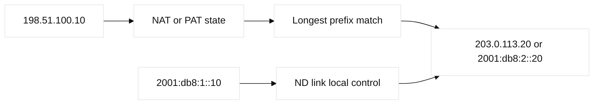
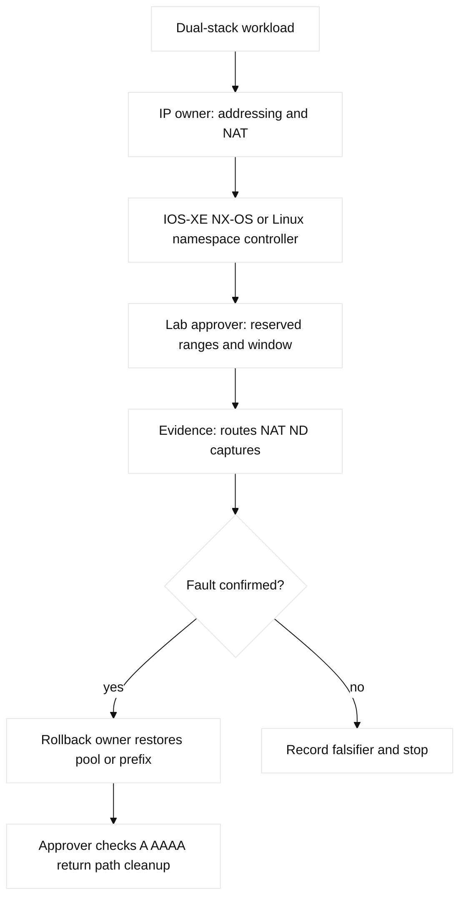

# 04. IPv4, Subnetting, NAT, and IPv6

## A. Learning objectives and prerequisites

Allocate IPv4 with binary math, CIDR, VLSM, summarization, public/private
ranges, IPAM, overlap and exhaustion controls; explain static/dynamic NAT,
PAT, pools, hairpin NAT, and CGNAT; and design IPv6 with GUA, link-local, ULA,
multicast, anycast, EUI-64, SLAAC, DHCPv6, ND, DAD, dual stack, NAT64, and
DNS64. Know Ethernet and basic routing.

## B. Portable mental model

An address identifies an interface in a forwarding domain; a prefix tells a
router where to send traffic. Subnetting is a capacity and failure-domain
decision, not only arithmetic. A host chooses a local neighbor or default
gateway; a router performs longest-prefix match. NAT inserts a stateful identity
translation between domains, while IPv6 generally restores end-to-end
addressing but still needs policy and state. IPv6 Neighbor Discovery replaces
ARP functions with ICMPv6 messages and multicast.



## C. Concept inventory

IPv4 notation can be converted to binary to find network, host, and broadcast
bits. CIDR `/24`, VLSM, supernetting, and summarization trade route-table size
against failure blast radius. RFC 1918 private space is not Internet-routable;
public space requires allocation and policy. Loopback, link-local/APIPA, and
directed/limited broadcast have distinct meanings. IPAM prevents duplicate
allocation, overlap, and exhaustion. NAT can be static one-to-one, dynamic
from a pool, or PAT many-to-one by port. Hairpin NAT lets an internal client
use an external name/address; CGNAT shares provider space and complicates
inbound reachability and attribution.

IPv6 GUA is globally routable, ULA is private-like, link-local supports local
control, multicast replaces broadcast, and anycast uses one address at multiple
locations. EUI-64 can derive interface IDs but privacy addresses are common.
SLAAC uses router advertisements; DHCPv6 can be stateful or stateless.
Neighbor Solicitation/Advertisement, Router Solicitation/Advertisement, DAD,
and ND cache manage neighbor reachability. Dual stack is operationally simple
but doubles paths. NAT64/DNS64 translate IPv6-only clients to IPv4 services.

## D. Configuration shapes and cloud mappings

Lab-only IOS-XE shape:

```text
interface Vlan110
 ip address 198.51.100.1 255.255.255.0
 ipv6 address 2001:db8:110::1/64
 ip nat inside
 ipv6 nd managed-config-flag
```

Read-only checks are `show ip interface brief`, `show ip route`, `show ip nat
translations`, `show ipv6 neighbors`, and Linux `ip addr`, `ip route`, `ip -6
neigh`. NX-OS syntax and feature gates differ. AWS VPCs use CIDR subnets,
route tables, ENIs, NAT gateways, and IPv6 egress-only gateways; GCP uses VPC
subnets, routes, Cloud NAT, and IPv6 support according to the selected service
and region. Terraform can allocate CIDRs and NAT resources, but provider
versions, quotas, and lifecycle behavior must be pinned. Any generic NAT or
IPv6 provider block shown here is **non-runnable illustrative shape**.

## E. Verification

Calculate the expected network and host range before running commands. Verify
IPAM ownership, route presence, ARP/ND neighbor state, NAT translations and
timeouts, and packet captures on each side of translation. For AWS inspect
subnet route tables, NAT gateway metrics, flow logs, and reachability analysis.
For GCP inspect routes, Cloud NAT port allocation/logs, firewall logs, and
Connectivity Tests. A healthy dual-stack service has intentionally tested A and
AAAA paths, not merely an IPv6 address on an interface.

## F. Failure lab: overlap and translation exhaustion

Use a fixture where two private sites both advertise `10.20.0.0/16`, or where
a PAT pool has too few ports. Symptom: selected destinations are unreachable,
some clients fail while others pass, or translations disappear. Hypotheses:
overlap, wrong prefix, NAT pool/PAT exhaustion, hairpin policy, missing return
route, or IPv6 firewall/ND failure. Falsify with IPAM, route tables, NAT state,
port counts, and captures. Stop the generator, restore the reserved pool or
remove the injected overlap, then verify old and new sessions separately.



## G. Hands-on exercise, answer, and rubric

Design an address plan for app, database, management, and transit segments in
two sites plus AWS and GCP. Use non-overlapping reserved ranges, summarize
where safe, allocate IPv6 /64s, and document NAT/hairpin behavior. Implement
the plan in Linux namespaces or a simulator; submit calculations, IPAM table,
read-only commands, one overlap fault, and cleanup.

Answer: reserve growth first, allocate failure domains separately, identify
which prefixes are translated, and test return traffic. A summary that hides a
security boundary is not a good summary. Rubric: 30% arithmetic, 20% route and
NAT reasoning, 20% IPv6, 15% cloud mapping, 15% safety. SDE2: add automated
overlap detection. Staff: create an organization-wide address governance and
IPv6 migration policy with ownership and cost.

## H. Interview questions and answers

1. **How do you find the usable hosts in a /27?** **Answer:** 32 total minus
   network and broadcast traditionally leaves 30 IPv4 hosts. **Wrong turn:**
   ignoring platform reservations. **Evidence:** binary/CIDR worksheet and IPAM.
   **Follow-up:** why does IPv6 use /64 so often?
2. **Why can a more-specific route defeat a summary?** **Answer:** Longest-prefix
   match selects the most specific candidate. **Wrong turn:** preferring the
   summary by AD alone. **Evidence:** route table and origin/policy. **Follow-up:**
   how would you contain a stale /25?
3. **What does PAT preserve and change?** **Answer:** It preserves intent but
   changes source address and usually port, requiring state. **Wrong turn:**
   expecting the original tuple at the service. **Evidence:** translation table
   and both-side capture. **Follow-up:** why is hairpin special?
4. **Does IPv6 eliminate NAT?** **Answer:** It removes address exhaustion in
   many designs, but NAT64 and policy translation remain. **Wrong turn:** treating
   IPv6 as permission to omit firewalls. **Evidence:** route, policy, and NAT64
   tests. **Follow-up:** when is DNS64 required?
5. **What is the role of a link-local IPv6 address?** **Answer:** It is local
   scope and supports neighbor/control protocols. **Wrong turn:** routing it as
   a global destination. **Evidence:** `ip -6 addr` scope and ND capture.
   **Follow-up:** how does a router use link-local next hops?
6. **How do you debug an IPv6 host that has an address but no reachability?**
   **Answer:** Check RA/default route, ND/DAD, ICMPv6 policy, symmetry, and
   captures. **Wrong turn:** treating `ip addr` as reachability proof.
   **Evidence:** `ip -6 route`, `ip -6 neigh`, and packet capture. **Follow-up:**
   how would you separate RA loss from firewall loss?

## I. Evidence labels and references

**Fact:** RFC 1918 defines private IPv4 space; RFC 4632 defines CIDR; RFC 4861
defines IPv6 ND; RFC 4862 defines SLAAC; RFC 6146 describes stateful NAT64.
**Vendor terminology:** AWS NAT Gateway and GCP Cloud NAT are managed services,
not identical appliances. **Observed lab result:** Linux namespaces show ND
entries in `ip -6 neigh`. **Engineering inference:** an IPAM owner and overlap
policy are more important than a clever subnet calculator. References: [RFC 1918](https://www.rfc-editor.org/rfc/rfc1918), [RFC 4632](https://www.rfc-editor.org/rfc/rfc4632), [RFC 4861](https://www.rfc-editor.org/rfc/rfc4861), [AWS VPC IP addressing](https://docs.aws.amazon.com/vpc/latest/userguide/vpc-ip-addressing.html), and [Google Cloud VPC](https://cloud.google.com/vpc/docs).
## J. A-L mapping and concept-to-evidence table

A objectives, B model, C concepts, D shapes, E verification, F lab, G exercise,
H Q&A, I labels, J diagrams, K ownership/rollback, and L completion evidence
make the review mapping explicit.

| Concept | Mechanism and limit | IOS-XE/NX-OS evidence | Linux/namespace evidence | Falsifier |
| --- | --- | --- | --- | --- |
| VLSM/summaries | Prefix math trades table size for blast radius | `show ip route` | `ip route` | Binary worksheet matches IPAM |
| PAT | Stateful address/port mapping has pool/port limits | `show ip nat translations`, `show ip nat statistics` | `conntrack -L` where available | Translation and return tuple exist |
| IPv6 ND | RS/RA and NS/NA replace ARP; DAD detects duplicates | `show ipv6 neighbors` | `ip -6 neigh`, `tcpdump -ni` | ND and default route are healthy |
| NAT64/DNS64 | IPv6 client reaches IPv4 service through stateful translation | Platform/service logs | Namespace transition fixture | A/AAAA and translated flow agree |

## K. Detailed shapes and named reproducible failure lab

IOS-XE shape combines `ip nat inside`, `ip nat outside`, `ip nat inside source
list 10 interface Gi1/0/1 overload`, and read-only translation/statistics
commands. NX-OS NAT and IPv6 feature gates vary. Linux uses `ip addr`, `ip
route`, `ip -6 route`, `ip -6 neigh`, and namespaces; FRR is relevant only when
the fixture adds dynamic routing, not for host NAT itself.

The named lab is **`pat-pool-exhaustion-and-nd-repro`**. Safety: reserved
documentation prefixes, disposable namespaces, and a bounded generator only;
Prechecks are `ip netns list`, `ip link show`, `command -v ip tcpdump`, and a
maximum of 20 test flows. Baseline records routes, NAT counters, `ip -6 neigh`,
and one IPv4/IPv6 success to `/tmp/addressing-baseline.txt`; expected output is
one translation and a reachable neighbor. Injected fault: exhaust a tiny lab PAT pool or, in a
namespace-only variant, omit the default route. Symptom: later IPv4 flows fail
or IPv6 shows an address but no destination. Hypothesis: state/port exhaustion
or ND/default-route failure. Falsifier: free translations and valid ND/route
shift investigation to return policy. Expected output is a pool/port counter at
limit or `ip -6 route` with no default. Repair restores the pool/default route;
rollback reapplies the saved config. Cleanup stops the generator, deletes all
namespaces/veths, and proves the fixture names are absent.

## L. Worked answer, rubric, and SDE2/Staff follow-ups

Worked allocation: split a `/24` into `/26` app, `/27` database, `/28`
management, and `/30` transit, then reserve growth; each IPv6 segment receives
a distinct `/64`.

| Rubric criterion | Learner artifact | Expected evidence | Pass/fail threshold | SDE2 follow-up answer | Staff follow-up answer |
| --- | --- | --- | --- | --- | --- |
| Address arithmetic (30%) | CIDR/VLSM worksheet with usable ranges and reservations | Non-overlap calculation, IPAM reservation, route summaries | Pass if every subnet fits and no reserved range is consumed | I would parse prefixes and assert containment/non-overlap in CI. | I would govern allocation, summarization, and growth headroom through IPAM. |
| Route/NAT reasoning (20%) | Original/translated tuple and longest-prefix path | RIB/FIB, NAT table, return route, port budget | Pass if both directions and translation ownership are shown | I would assert the translated tuple and reverse lookup, not only a ping. | I would monitor SNAT port exhaustion and approve capacity before scale-out. |
| IPv6 control flow (20%) | SLAAC/DHCPv6/ND/RA flow with scope | RA/ND capture, address scope, route and policy state | Pass if link-local/global scope and control-plane roles are correct | I would test duplicate-address and stale-neighbor cases in the fixture. | I would plan dual-stack migration, filtering, and operational readiness. |
| Cloud mapping (15%) | AWS/GCP subnet, route, NAT, and firewall mapping | Provider read-back plus reachability/log evidence | Pass if IPv4 and IPv6 provider differences are named | I would keep allocation logic provider-neutral and adapters explicit. | I would own quotas, egress cost, and overlapping-prefix exceptions. |
| Safety and cleanup (15%) | Reserved test prefix, bounded generator, rollback transcript | No leaked route/NAT/namespace state | Pass if the fixture is removed and baseline is reproduced | I would use a disposable namespace and cap packet rate. | I would require approval for address changes and a tested rollback owner. |

**Completed score:** 30/30 + 20/20 + 20/20 + 15/15 + 15/15 = **100/100**.
The numeric allocation is a **worked example**, while any command output is
**observed** only when a learner runs the documented local fixture.

## M. Reproducible lab record

**Disposable fixture/topology and safety:** a disposable address/NAT/ND file models
`client--gateway--NAT--service` and an IPv6 neighbor; it does not install a
route or NAT rule. **Exact setup inputs:** `LAB_DIR=$(mktemp -d /tmp/ccna04.XXXXXX)`;
write `prefix=192.0.2.0/24 nat=present v6_prefix=2001:db8:1::/64 nd=reachable`
to `state.txt`, then save `baseline.txt`.

**Baseline command/expected baseline:** `cat "$LAB_DIR/state.txt"` shows the
non-overlapping prefix, NAT, `/64`, and reachable ND (**illustrative**).
**Injected fault:** `sed -i 's/prefix=192.0.2.0\/24/prefix=192.0.2.0\/25/;
s/nd=reachable/nd=stale/' "$LAB_DIR/state.txt"`. **Measurable assertion/sample output:**
`grep -q 'nd=stale' "$LAB_DIR/state.txt"` -> `ASSERT PREFIX_OR_ND_MISMATCH`.
**Repair:** restore the reserved prefix and `nd=reachable`, then `cmp state.txt
baseline.txt`. **Rollback:** `cp baseline.txt state.txt` if IPAM ownership or
the translated tuple is not exact. **Cleanup verification:**
`rm -f "$LAB_DIR/state.txt" "$LAB_DIR/baseline.txt"; rmdir "$LAB_DIR"; test ! -e "$LAB_DIR"`.
Numeric output is **illustrative**; only a learner-run fixture is **observed**.

## N. Artifact-backed submission

Observed bundle: [`04-ipv4-nat-ipv6.json`](fixtures/observed/04-ipv4-nat-ipv6.json). The v3 evaluator derives the translation from the effective NAT rule and independent flow fixture, while retaining IPv6 neighbor state. The assertion distinguishes a healthy metadata control change from evaluator-only NAT-table loss; request, reconcile task, effective read-back, repair, and rollback are retained. Module-specific scoring: [worked submissions](fixtures/worked-submissions.md#05-b-module-04--04-ipv4-nat-ipv6).
