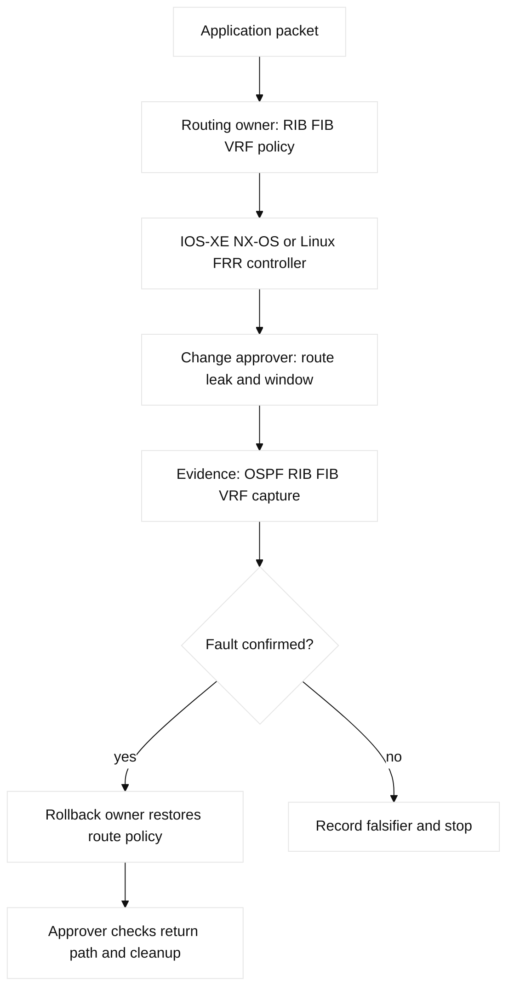

# 05. Routing, Static Paths, OSPF, and VRF

## A. Learning objectives and prerequisites

By the end, you should be able to explain route learning and forwarding, choose
static or dynamic routing, configure a Cisco IOS-XE-style OSPF and VRF lab, and
diagnose a route that exists but does not forward. Prerequisites are Ethernet,
VLANs, IPv4 subnetting, IPv6 basics, and SVI versus router-interface concepts.
Syntax is a **configuration shape**: commands vary by IOS-XE/NX-OS release.

## B. Portable mental model

Routing has two useful layers. The routing information base (RIB) is the
control-plane collection of candidate routes learned from connected interfaces,
static configuration, OSPF, BGP, or redistribution. Administrative distance
(AD) compares sources; a protocol metric compares routes within one source.
After selection, the forwarding information base (FIB) is the optimized lookup
structure used by the data plane. Cisco Express Forwarding (CEF) is Cisco's
forwarding architecture that uses the FIB and adjacency information rather than
running a full routing decision for every packet.

For a destination, the router first applies longest-prefix match: `/25` wins
over `/24`, even if the summary came from a preferred protocol. Equal best
routes can use equal-cost multipath (ECMP). A next hop may require recursive
resolution. Thus “the route is in `show ip route`” does not prove that the FIB,
adjacency, ACL, MTU, or return path is healthy.


## C. Route types and policy concepts

- **Connected and local routes** come from an addressed interface and are the
  foundation for recursive next-hop resolution.
- A **static route** explicitly names a prefix and next hop or exit interface.
  A **default route** (`0.0.0.0/0`) is the least-specific fallback. A
  **floating static route** uses higher AD and activates when the preferred
  route disappears. Tracking or IP SLA may be needed because an up interface
  does not prove end-to-end reachability.
- A **null route** intentionally discards traffic, often to make a summary safe
  or prevent a loop. A blackhole route is the operational outcome of traffic
  reaching discard rather than its intended destination; it may be deliberate
  or accidental. Document the difference and monitor it.
- **Policy-based routing (PBR)** selects a next hop using source, destination,
  or protocol rather than only the destination RIB. It can bypass normal
  routing, complicate symmetry, and require a local-policy exception.
- **Redistribution** imports routes from one protocol into another. It needs
  filtering, tagging, and a clear seed metric; otherwise feedback loops,
  excessive advertisements, and unstable convergence follow.
- **VRF** creates separate routing tables on one device. VRF-Lite does this
  without an MPLS provider core. **Route leaking** deliberately shares selected
  prefixes between VRFs, usually with policy or a firewall boundary.

## D. OSPF control plane

OSPF is a link-state IGP. Each router has a router ID, exchanges LSAs, builds a
link-state database (LSDB), and runs SPF. Hello and dead timers discover
neighbors. On broadcast Ethernet, a designated router (DR) and backup DR (BDR)
reduce adjacency scale; point-to-point links do not need that election. A
passive interface advertises its prefix without forming neighbors.

An area limits topology scope. Area 0 is the backbone. An area border router
(ABR) connects areas; an autonomous system boundary router (ASBR) injects
external routes. Type 1 and Type 2 external metrics differ in internal-cost
handling. Stub areas suppress selected external LSAs; NSSA permits controlled
injection through a Type 7 LSA. The design question is scope, summarization,
and failure visibility.

Authentication protects adjacency and route integrity; it does not encrypt
application traffic. Common failures include area, timer, network-type,
authentication, MTU, subnet, and router-ID mismatches. `EXSTART` or `EXCHANGE`
often indicates MTU or negotiation trouble; `2-WAY` can be normal for DROTHER
peers on a broadcast segment.

## E. Cisco configuration shapes

The following is a fictional, lab-only IOS-XE shape using documentation ranges:

```text
interface GigabitEthernet1/0/1
 ip address 198.51.100.1 255.255.255.252
 ip ospf 10 area 0
 no shutdown
!
router ospf 10
 router-id 198.51.255.1
 passive-interface default
 no passive-interface GigabitEthernet1/0/1
 area 10 stub
!
ip route 203.0.113.0 255.255.255.0 198.51.100.2 200
ip route 0.0.0.0 0.0.0.0 198.51.100.2
ip route 192.0.2.0 255.255.255.0 Null0 250
!
ip vrf APP
 rd 65000:10
!
interface GigabitEthernet1/0/2
 ip vrf forwarding APP
 ip address 192.0.2.1 255.255.255.0
```

Putting an interface into a VRF can clear its existing IP address; precheck and
restore it in a disposable lab. NX-OS may require `feature ospf` or
`feature interface-vlan`. For route leaking, use supported route-target or
controlled import mechanisms; never assume a global route is visible in a VRF.
PBR uses a route map and interface attachment; redistribution should match
approved prefixes and set tags/metrics.

AWS maps to VPC and Transit Gateway route tables plus propagated/static routes;
GCP uses VPC routes and Cloud Router for dynamic exchange. These are cloud
control planes, not IOS VRFs. Terraform can own explicit routes and
associations, but appliance OSPF and provider-generated routes need an owner.

## F. Verification and evidence

Start with source and destination VRF, then verify:

```text
show ip route [vrf APP] 203.0.113.20
show ip cef [vrf APP] 203.0.113.20 detail
show ip ospf neighbor
show ip ospf interface brief
show ip ospf database
show ip protocols
show ip route ospf
show ip route static
show ip interface brief
```

On Linux, use `ip route get 203.0.113.20`, `ip route show table all`,
`ip rule`, and `ping -I`. Confirm next hop, outgoing interface, ARP/ND
adjacency, and return route. A route may be present in the RIB but absent from
CEF because it lost selection or its adjacency is unresolved. For AWS inspect
the VPC/TGW table, propagation, security groups, NACLs, and flow logs. For GCP
inspect VPC routes, Cloud Router advertisements, firewall logs, and Connectivity
Tests. Capture both directions after narrowing the hypothesis.



## G. Failure lab: OSPF neighbor up, application unreachable

Start with Router-A in area 0 and Router-B in area 10, an APP VRF on B, and a
test node at `192.0.2.20`. Inject a fault by placing the node's route in the
global table while the ingress interface is in `APP`, or change the OSPF area
on one link. The symptom is a failed ping or TCP connection although a similar
global-table test works.

Hypotheses are wrong VRF, missing leak, area mismatch, ACL, unresolved
adjacency, or missing return route. Falsify with `show ip route vrf APP`,
`show ip cef vrf APP`, neighbor/interface output, and a host capture.
The smallest safe action is to restore the intended table or lab area value,
not to redistribute every route. Save the pre-change configuration, remove the
injected line, verify both directions, and check that the global table remains
isolated. **Observed lab result:** a global route lookup can succeed while a
VRF lookup fails because they are distinct tables.

## H. Answered exercise and rubric

Design Router-A and Router-B with an OSPF backbone, an area 10 stub, a
management VRF, one floating WAN default, and a summarized null route. Submit
an addressing table, route-policy diagram, configuration shapes, verification
transcript, and a fault injection. Explain why leaking only DNS and monitoring
prefixes is safer than leaking the entire global table.

Answer: make management and lookup context explicit; form OSPF only on transit
links; advertise area-10 prefixes; install the higher-AD floating default; use
tagged, bounded redistribution; and use a null summary only with monitored
more-specific routes. Verify RIB, FIB/CEF, adjacency, and return path.
Score: 25% design, 25% evidence, 20% OSPF reasoning, 20% recovery, 10% safety.
SDE2: automate route and neighbor assertions. Staff: define ownership, blast
radius, route-policy review, and migration criteria.

## I. Questions and answers (interview Q&A)

1. **Why can a route be in the RIB but traffic still fail?** **Answer:** The
   FIB winner, adjacency, ACL, MTU, or return path can differ. **Wrong turn:**
   treating `show ip route` as delivery proof. **Evidence:** CEF/FIB, adjacency,
   and capture. **Follow-up:** show the VRF-specific lookup.
2. **How does longest-prefix match interact with AD?** **Answer:** Prefix length
   wins first; AD compares sources for that same prefix. **Wrong turn:** using AD
   to defeat a more-specific route. **Evidence:** RIB candidates and policy.
   **Follow-up:** how would you contain a stale `/25`?
3. **When is a floating static route useful?** **Answer:** It is a predictable
   backup when the lower-AD route disappears. **Wrong turn:** assuming an up
   interface proves upstream health. **Evidence:** AD, tracking, and failover
   tests. **Follow-up:** what should IP SLA track?
4. **Why is unrestricted redistribution dangerous?** **Answer:** It creates
   feedback, metric ambiguity, churn, and oversized tables. **Wrong turn:**
   redistributing every route to “fix” reachability. **Evidence:** filters,
   tags, metrics, and protocol tables. **Follow-up:** how do you prevent reimport?
5. **What problem do OSPF DR and BDR solve?** **Answer:** They reduce full
   adjacency and LSA exchange on broadcast segments. **Wrong turn:** treating
   DR/BDR as link redundancy. **Evidence:** neighbor roles and LSDB output.
   **Follow-up:** why is 2-WAY normal for some DROTHER peers?
6. **What is a VRF leak and its main risk?** **Answer:** It intentionally shares
   selected prefixes between routing tables. **Wrong turn:** leaking the whole
   global table. **Evidence:** import/export policy and VRF lookups. **Follow-up:**
   who approves a management-prefix leak?

## J. References and evidence labels

**Fact:** OSPF is specified by [RFC 2328](https://www.rfc-editor.org/rfc/rfc2328);
VRF terminology differs between vendors. **Vendor terminology:** CEF, RIB, and
FIB are Cisco terms with platform-specific displays; AWS VPC/TGW route tables
and GCP VPC routes are managed-cloud constructs. **Engineering inference:** a
route workflow should name the VRF and inspect RIB and forwarding state.
Consult [Cisco OSPF configuration guidance](https://www.cisco.com/c/en/us/td/docs/ios-xml/ios/iproute_ospf/configuration/xe-17/iro-xe-17-book.html),
[AWS VPC route tables](https://docs.aws.amazon.com/vpc/latest/userguide/WorkWithRouteTables.html),
and [Google Cloud VPC routes](https://cloud.google.com/vpc/docs/routes).
## K. A-L mapping and concept-to-evidence table

**OSPF network types:** broadcast, point-to-point, NBMA, point-to-multipoint,
and virtual-link alter discovery, DR/BDR election, and hello behavior. **Route
classes:** O intra-area, O IA inter-area, O E1/E2 external, and N1/N2 NSSA.
For mismatch troubleshooting compare both ends' area, timers, network type,
subnet/MTU, authentication, router ID, and passive state; `show ip ospf
interface`, neighbor detail, and LSDB output are evidence, while matching
parameters plus Full state falsify a mismatch.

A objectives, B model, C concepts, D shapes, E verification, F lab, G exercise,
H Q&A, I labels, J diagrams, K ownership/rollback, and L completion evidence
make the review mapping explicit.

| Concept | Mechanism and limit | IOS-XE/NX-OS evidence | Linux/FRR/namespace evidence | Falsifier |
| --- | --- | --- | --- | --- |
| RIB/FIB | RIB selects candidates; FIB/CEF forwards; adjacency can fail | `show ip route`, `show ip cef` | `ip route get`, `ip neigh` | FIB and adjacency agree |
| OSPF | LSDB/SPF installs routes; area/timer/MTU/auth must agree | `show ip ospf neighbor`, `show ip ospf database` | FRR `show ip ospf neighbor`, `vtysh -c 'show ip route'` | Full adjacency and expected LSAs |
| VRF | Separate tables isolate lookup; leaks must be bounded | `show ip route vrf APP` | `ip rule`, `ip route show table 100` | Global lookup cannot reach APP prefix |
| PBR/static | Policy or AD changes next hop; tracking detects beyond-link failure | `show route-map`, `show ip sla statistics` | `ip rule`, `ip route` | Normal LPM remains selected |

## L. Detailed shapes and named reproducible failure lab

```text
mkdir -p /tmp/ccna05-lab
printf '%s\n' '{"a":"broadcast","b":"point-to-point","area_a":0,"area_b":10}' > /tmp/ccna05-lab/ospf.json
cp /tmp/ccna05-lab/ospf.json /tmp/ccna05-lab/baseline.json
python3 -c 'import json; p="/tmp/ccna05-lab/ospf.json"; x=json.load(open(p)); x["b"]="broadcast"; json.dump(x,open(p,"w"))'
python3 -c 'import json; x=json.load(open("/tmp/ccna05-lab/ospf.json")); print("MISMATCH area=0/10 network-type=broadcast/broadcast")'
cp /tmp/ccna05-lab/baseline.json /tmp/ccna05-lab/ospf.json; cmp /tmp/ccna05-lab/ospf.json /tmp/ccna05-lab/baseline.json
rm -f /tmp/ccna05-lab/ospf.json /tmp/ccna05-lab/baseline.json; rmdir /tmp/ccna05-lab
```

Expected output: `MISMATCH area=0/10 network-type=broadcast/broadcast`; `cmp` and successful `rmdir`
prove rollback and cleanup. This is a local mock and never touches a router.

IOS-XE shape: `router ospf 10`, `ip ospf 10 area 0`, `passive-interface
default`, `no passive-interface`, `ip vrf forwarding APP`, and a tracked
floating static route. NX-OS may need `feature ospf` and `feature interface-vlan`.
Linux/FRR shape uses `/etc/frr/ daemons`, `router ospf`, `network` or interface
addressing, and `vtysh -c 'show ip ospf neighbor'`; Linux namespaces use
`ip link`, `ip route`, `ip rule`, and separate tables. FRR owns its protocol
state; the kernel owns the installed FIB.

The named lab is **`ospf-vrf-rib-fib-namespace-repro`**. Safety boundary: two
disposable namespaces, veth links, documentation prefixes, and no default route
on the host. Prechecks are `id`, `ip netns list`, `command -v ip`, and a check
that fixture names are absent. Baseline creates `rtr-a` and `rtr-b`, assigns
`198.51.100.1/30` and `.2/30`, installs table 100 for APP, and records
`ip route show table all`, `ip rule`, `ip route get`, and `ip neigh` to
`/tmp/ospf-vrf-baseline.txt`; expected output shows a connected transit route,
an APP lookup, and a reachable neighbor. Injected fault: place the destination
route only in the global table while the workload uses table 100, or change the
FRR link area in a disposable FRR fixture. Symptom: global lookup succeeds but
APP ping/TCP fails. Hypothesis: wrong VRF/missing leak or OSPF adjacency/LSA
fault. Falsifier: correct table, full neighbor, expected LSA, and FIB adjacency
send the investigation to ACL/MTU/return path. Expected output is a missing
APP route or an OSPF state below Full. Repair restores the bounded route/leak or
area; rollback reapplies the saved config. Success is both VRF-scoped and return
lookups plus a two-way capture. Cleanup deletes namespaces, veths, FRR sockets,
and proves fixture names are absent.

## M. Worked answer, rubric, and SDE2/Staff follow-ups

Worked score: design 25/25 (area/VRF/default/null choices), evidence 25/25
(neighbor, LSDB, RIB/FIB, return path), OSPF reasoning 20/20 (network type and
route class), recovery 20/20 (saved fixture restored), safety 10/10 (reserved
target and cleanup proof): **100/100**. SDE2 adds route assertions; Staff adds
leak ownership and N+1 criteria.

The worked answer uses transit-only OSPF, passive LAN interfaces, an area-10
stub, a higher-AD floating default, and a leak limited to DNS/monitoring
prefixes. It verifies neighbor, LSDB, RIB, FIB/CEF, adjacency, and return path
in that order. Score 25% design, 25% evidence, 20% OSPF reasoning, 20% recovery,
and 10% safety/cleanup. SDE2 should automate route/neighbor assertions. Staff
should own route-policy review, leak approval, capacity, and migration rollback.

### L.1 Criterion-by-criterion worked submission

| Rubric criterion | Learner artifact | Expected evidence | Pass/fail threshold | SDE2 follow-up answer | Staff follow-up answer |
| --- | --- | --- | --- | --- | --- |
| Design (25%) | Area/VRF/default/null route diagram | Prefixes, areas, passive LANs, leak policy | Pass if scope and route class are explicit | I would assert route origin, prefix length, VRF, and next hop. | I would govern leak approval, failure domains, and N+1 capacity. |
| Evidence (25%) | Ordered neighbor-to-FIB transcript | OSPF neighbor/LSDB, RIB/FIB, adjacency, return path | Pass if control state is not forwarding proof | I would fail when any layer is missing or stale. | I would require cross-team evidence ownership and a recovery window. |
| OSPF reasoning (20%) | Network-type/DR/LSA explanation | Timers, network type, LSA and DR/BDR output | Pass if mismatch falsifier is named | I would test network type and timer parity before changing routes. | I would standardize interoperability profiles and migration gates. |
| Recovery (20%) | Saved fixture, fault, repair, rollback | Restored state and bounded probe | Pass if rollback is deterministic | I would poll convergence with a timeout and retain the diff. | I would choose forward repair when rollback increases route risk. |
| Safety (10%) | Reserved prefix and cleanup transcript | No real device/provider touched, empty fixture | Pass if scope and cleanup are proved | I would enforce fixture IDs in automation. | I would approve change scope, break-glass, and post-change review. |

**Completed score:** 25/25 + 25/25 + 20/20 + 20/20 + 10/10 = **100/100**.

## N. Reproducible lab record

**Disposable fixture/topology and safety:** `R1--transit--R2` with VRF `APP` and OSPF
area-10 transit is represented by a local state file; no router is contacted.
**Exact setup inputs:** `LAB_DIR=$(mktemp -d /tmp/ccna05.XXXXXX)`; write
`vrf=APP area=10 network_type=broadcast/broadcast route=connected fib=installed`
to `state.txt`, then save `baseline.txt`.

**Baseline command/expected baseline:** `cat "$LAB_DIR/state.txt"` shows matching
network type, connected route, and installed FIB (**illustrative**). **Injected
fault:** `sed -i 's/network_type=broadcast\/broadcast/network_type=broadcast\/point-to-point/;
s/fib=installed/fib=missing/' "$LAB_DIR/state.txt"`. **Measurable assertion/sample output:**
`grep -q 'fib=missing' "$LAB_DIR/state.txt"` -> `ASSERT OSPF_TYPE_MISMATCH FIB_MISSING`.
**Repair:** restore matching type and FIB, then `cmp state.txt baseline.txt`.
**Rollback:** `cp baseline.txt state.txt` if area, VRF, or owner differs.
**Cleanup verification:** `rm -f "$LAB_DIR/state.txt" "$LAB_DIR/baseline.txt";
rmdir "$LAB_DIR"; test ! -e "$LAB_DIR"`. Result is **illustrative** until run;
no OSPF device execution is claimed.

## O. Artifact-backed submission

Observed bundle: [`05-ospf-vrf.json`](fixtures/observed/05-ospf-vrf.json). The v3 evaluator derives `neighbor_state` and the VRF route from effective area/network type plus an independent adjacency fixture. A metadata-only change stays healthy and evaluator-only adjacency loss fails; reconciliation and route observations remain separate. Module-specific scoring: [worked submissions](fixtures/worked-submissions.md#06-b-module-05--05-ospf-vrf).
