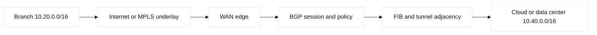
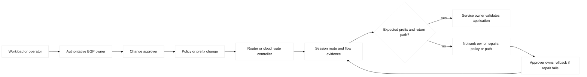

# 06. BGP Policy and Hybrid WAN

## A. Learning objectives and prerequisites

Explain eBGP and iBGP packet/control flow, configure a bounded policy in a
fictional lab, verify RIB/FIB and session evidence, and troubleshoot a hybrid
WAN path. Prerequisites are IP addressing, route selection, OSPF, VRFs, and
basic IPsec. All commands are configuration shapes; syntax and licensed
features vary by IOS-XE/NX-OS, Linux FRRouting, and provider release.

## B. Portable mental model

BGP is a policy-bearing control plane. A peer exchanges reachable prefixes and
path attributes over a TCP session (normally TCP/179). The receiver applies
inbound policy, selects a best path, and advertises only what outbound policy
allows. The forwarding plane then installs an eligible result in the RIB/FIB.
An established session therefore proves neither reachability nor correct
return traffic.

An enterprise WAN commonly has an underlay (carrier MPLS, Internet, or cloud
private circuit), an overlay (GRE, IPsec, or SD-WAN tunnel), and a policy layer.
Keep these separate when troubleshooting: tunnel/IKE, routing adjacency,
prefix policy, forwarding, and application behavior are different failure
domains.



## C. BGP concepts and policy inventory

**Fact:** eBGP normally connects different autonomous systems (ASNs), while
iBGP distributes externally learned routes inside one ASN. iBGP's split-horizon
rule means a route learned from one iBGP peer is not normally advertised to
another iBGP peer; a route reflector (RR) or confederation scales this mesh.
An RR changes control-plane topology, not the physical forwarding path.

The AS path records traversed ASNs and supports loop prevention and prepending.
Local preference selects the preferred exit inside an AS. MED is a hint to an
external neighbor about an entry point and is compared according to platform
policy. Cisco **weight** is local and non-transitive. Origin, next hop, and
vendor-specific tie breakers complete the best-path process; the exact order
must be checked for the target release. Communities are policy labels, often
used for no-export, local preference classes, blackhole handling, or region
intent. **Engineering inference:** use communities as an interface contract,
not as an undocumented collection of magic values.

| Concept | Mechanism / purpose | Limit or adjacent term | Evidence and falsifier |
| --- | --- | --- | --- |
| Best path | Compares attributes and installs an eligible result | Selection order varies; RIB is not FIB | `show bgp ...` plus RIB/FIB; missing FIB falsifies forwarding readiness |
| RR and confederation | Reduce iBGP session count and preserve policy boundaries | Path visibility and cluster mistakes can hide alternatives | Client, cluster/originator IDs, and reflected routes |
| Community policy | Carries intent such as local preference, no-export, or prepend | Semantics are bilateral/provider-specific | Received/advertised communities and policy counters |
| BFD and convergence | Detects forwarding failure faster than BGP timers | Aggressive timers can cause false flaps and CPU load | BFD events, CPU, loss, and withdrawal timestamps |
| Hybrid WAN | Separates underlay, overlay encryption, and route policy | MPLS, GRE, IPsec, DMVPN, and SD-WAN have different owners | IKE/SA, tunnel, BGP, and packet-capture layers |

Filtering should bound both direction and scale: prefix lists, route maps or
policy statements, AS-path filters, community filters, maximum-prefix limits,
and explicit default-origination. A deny at the end and a saved pre-change
configuration make accidental transit less likely. Graceful restart can keep
stale forwarding during control restart; convergence is not instantaneous.
Dampening can suppress flapping but may hide an underlying fault.

Multiprotocol BGP (MP-BGP) carries address families such as IPv6 and
EVPN. BGP is also used by MPLS VPN and EVPN, but an EVPN control route is not
the same thing as a plain IPv4 unicast route. BFD provides fast liveness for a
supported peer or tunnel; it should have timers compatible with the actual
underlay and CPU budget.

WAN choices have distinct semantics: MPLS supplies provider-managed VPN
forwarding; GRE provides encapsulation but no confidentiality; IPsec uses IKE
to negotiate authenticated encrypted security associations; DMVPN combines
NHRP with multipoint GRE and IPsec; SD-WAN controllers select overlay paths
from measured loss, latency, and policy. A cloud VPN is encrypted over a
provider edge, whereas Direct Connect (AWS) and Interconnect (GCP) are private
connectivity products that still require routing and failure design.

## D. Safe configuration shapes and ownership

Fictional IOS-XE shape; `198.51.100.0/24`, `203.0.113.0/24`, and `192.0.2.0/24`
are documentation ranges and must remain in a disposable lab:

```text
router bgp 65010
 bgp router-id 198.51.255.10
 neighbor 198.51.100.2 remote-as 65020
 neighbor 198.51.100.2 description LAB-TRANSIT
 neighbor 198.51.100.2 password LAB-ONLY
 neighbor 198.51.100.2 maximum-prefix 50 90 restart 5
 address-family ipv4
  neighbor 198.51.100.2 activate
  neighbor 198.51.100.2 route-map LAB-IN in
  neighbor 198.51.100.2 route-map LAB-OUT out
  network 203.0.113.0 mask 255.255.255.0
 exit-address-family
!
ip prefix-list LAB-OUT seq 10 permit 203.0.113.0/24
route-map LAB-OUT permit 10
 match ip address prefix-list LAB-OUT
 set community 65010:100 additive
route-map LAB-IN permit 10
 match ip address prefix-list LAB-IN
 set local-preference 150
```

On Linux FRRouting, the equivalent shape uses `router bgp`, `neighbor`,
`address-family ipv4 unicast`, prefix-lists, and route-maps. Verify the daemon,
kernel route, and namespace before changing anything. Do not paste a Cisco
configuration into FRR or assume a route-map's default behavior is identical.

Terraform may own AWS `aws_vpn_connection`, Transit Gateway route tables,
propagation, and Direct Connect virtual interfaces, or GCP HA VPN, Cloud
Router BGP peers, and Interconnect attachments. AWS VPC route tables and TGW
route tables are distinct ownership objects; GCP VPC routes and Cloud Router
advertisements are also distinct. Terraform owns declared cloud objects and
state, while a network team or controller owns appliance BGP policy unless
explicit device automation is intentionally integrated. Run `terraform plan`,
review the route and prefix diff, save it, and never put secrets in HCL.

## E. Verification and evidence

On Cisco inspect `show bgp ipv4 unicast summary`, `show bgp ipv4 unicast
neighbors 198.51.100.2 advertised-routes`, `show bgp ipv4 unicast neighbors
198.51.100.2 received-routes`, `show bgp ipv4 unicast 203.0.113.0/24`, `show
ip route`, `show ip cef`, `show bfd neighbors`, and `show crypto ikev2 sa` /
`show crypto ipsec sa` for an encrypted overlay. Use read-only commands first.
On Linux use `vtysh -c 'show bgp summary'`, `ip route get 203.0.113.20`,
`ss -tn`, `ip xfrm state`, and `tcpdump -ni any port 179 or udp port 500`.

AWS evidence is the VPN/TGW or DX state, TGW/VPC route table and propagation,
VPC flow logs, and Reachability Analyzer where supported. GCP evidence is HA
VPN tunnel state, Cloud Router BGP status and learned/advertised routes,
VPC firewall logging, and Connectivity Tests. **Vendor terminology:** cloud
route propagation is not a promise that every attachment sees every prefix.



The ownership path is deliberately separate from the packet path. The BGP
owner can change policy, but the service owner validates application behavior;
the approver owns the change boundary, and the rollback owner is named before
the first mutation. A failure investigation still checks underlay, session,
policy, RIB/FIB, and application evidence in that order.

## F. Failure lab: accidental transit and asymmetric return

Start with Edge-A AS 65010 advertising only `203.0.113.0/24` to Provider-Lab
AS 65020, and Edge-B receiving a default route over a second fictional path.
Inject an outbound policy deletion so Edge-A advertises a connected lab summary
and an unintended learned prefix. The symptom is a maximum-prefix alert,
unexpected traffic through Edge-A, or a return path that enters the wrong VRF.

Hypotheses are underlay failure, wrong AF activation, next-hop recursion,
missing prefix/community policy, stale graceful-restart state, or asymmetric
return. Falsify in that order with tunnel/session state, advertised/received
route views, RIB/FIB lookup, and packet capture. The smallest safe action is to
restore the saved route policy or shut the lab peer, not to clear all BGP
sessions. Roll back the deleted policy, verify the exact prefix set and both
directions, then remove the injected route. **Observed lab result:** an
Established BGP session can carry zero usable prefixes after policy filtering.

## G. Hands-on exercise, answer, and rubric

### Worked lab fields

- **Safety:** isolated namespaces or simulator, documentation prefixes only;
  no public peer, secret, production route, or real cloud account.
- **Prechecks and baseline:** peers established; record prefix count,
  underlay/IPsec, BFD, CPU, `ip route get`, and saved configuration.
- **Saved artifact:** policy counters, advertised/received sets, RIB/FIB path,
  BFD state, timestamp, and Terraform plan when using a provider mock.
- **Injected fault:** delete only `LAB-OUT` or add one synthetic learned prefix.
- **Symptom:** maximum-prefix alert, unexpected advertisement, or asymmetric return.
- **Hypothesis/falsifier:** underlay, session, policy, RIB/FIB, then app; healthy
  evidence at each layer falsifies that branch.
- **Expected output:** session stays up, outbound set is exactly
  `203.0.113.0/24`, and both directions return to baseline.
- **Repair:** restore the route-map/prefix-list and withdraw the test prefix.
- **Rollback:** network engineer restores the saved config/plan; lab approver
  reviews the diff before reapplying.
- **Cleanup proof:** stop generators, remove test routes, clear lab state only,
  and prove no unexpected prefixes, BFD alarms, or SAs remain.

Build a two-site topology with an MPLS-like underlay, an Internet IPsec backup,
eBGP at each edge, one RR, a community-based preferred-exit policy, maximum
prefix protection, and a bounded cloud route. Submit an address/ASN table,
policy matrix, configuration shapes, precheck/plan, verification transcript,
one fault injection, and cleanup proof. Do not use public peers or real cloud
accounts.

Answer: keep site prefixes in a prefix list; set higher local preference for
the primary community; prepend only on the backup advertisement; activate BFD
only after measuring the lab; advertise cloud routes through an explicit TGW
or Cloud Router association; and prove RIB, FIB, return path, and route count.
Rubric: 25% packet/control-plane model, 25% safe policy, 20% evidence, 15%
failure recovery, 15% ownership and documentation. SDE2: test policy with
synthetic prefixes and alert on unexpected advertisements. Staff: define WAN
failure domains, ASN/community contracts, capacity headroom, migration and
failback gates, and who owns cloud versus appliance state.

## H. Interview Q&A

Each answer below uses the explicit review contract: **Answer**, **Wrong
turn**, **Evidence**, and **Follow-up**.

1. **Why does eBGP versus iBGP matter?** ASN boundaries and advertisement
   rules differ. Wrongly treating iBGP as a full mesh can create scale or loop
   problems; evidence is peer ASN, update source, and RR client state.
   **Answer:** ASN boundaries and advertisement rules differ. **Wrong turn:**
   assuming iBGP is a full mesh. **Evidence:** peer and RR state. **Follow-up:**
   explain confederation boundaries.
2. **What does local preference do?** It chooses an exit within an AS and is
   normally propagated by iBGP. A common wrong turn is using MED to solve an
   internal exit decision; show received attributes and the selected path.
   **Answer:** local preference selects an internal exit. **Wrong turn:** using
   MED for that decision. **Evidence:** attributes and selected path. **Follow-up:**
   identify who owns community rewriting.
3. **Why prepend AS paths?** To make a path less attractive to a neighbor; it
   is a hint, not a guarantee. Follow up with communities or provider policy.
   **Answer:** prepend makes a path less attractive to a neighbor. **Wrong turn:**
   treating it as deterministic. **Evidence:** advertised path and neighbor choice.
   **Follow-up:** compare provider communities.
4. **What is a route reflector's trade-off?** It reduces iBGP sessions but can
   introduce reflection-policy and path-visibility surprises. Inspect cluster
   IDs, originator IDs, and advertised routes. **Answer:** an RR reduces sessions
   but can hide paths. **Wrong turn:** thinking it changes forwarding. **Evidence:**
   cluster/originator IDs. **Follow-up:** describe RR isolation recovery.
5. **Why use maximum-prefix?** It limits blast radius from a leak or provider
   mistake. Set a threshold from a measured baseline with alert headroom, not
   an arbitrary tiny number. **Answer:** maximum-prefix bounds leak impact.
   **Wrong turn:** setting it below measured headroom. **Evidence:** baseline and
   alert log. **Follow-up:** define restart ownership.
6. **Does IPsec replace BGP?** No. IPsec protects packets; BGP decides prefixes
   if configured over the tunnel. Verify IKE/child SA, peer session, and FIB
   independently. **Answer:** IPsec protects packets; BGP selects prefixes.
   **Wrong turn:** declaring reachability from an IKE SA. **Evidence:** child SA,
   BGP, RIB/FIB, and return capture. **Follow-up:** compare GRE and IPsec.
7. **When is BFD dangerous?** Aggressive timers on a congested or overloaded
   path can flap a healthy route. Correlate BFD, interface counters, CPU, and
   loss before changing timers. **Answer:** aggressive timers can false-flap.
   **Wrong turn:** lowering them without measurements. **Evidence:** BFD events,
   CPU, loss, and withdrawals. **Follow-up:** calculate an underlay timer budget.

## I. References and evidence labels

## J. Ownership and rollback contract

Terraform owns only the fictional cloud attachment and route-table objects; the
WAN owner approves BGP policy; the device owner owns IOS-XE/FRR; evidence reads
session, policy, RIB/FIB, tunnel, and flow state; rollback restores the saved
policy. No writer changes another writer's fields.

## K. Detailed reproducible failure lab

```text
mkdir -p /tmp/ccna06-lab
printf '%s\n' '{"prefix":"203.0.113.0/24","community":"65010:100","accepted":true}' > /tmp/ccna06-lab/route.json
cp /tmp/ccna06-lab/route.json /tmp/ccna06-lab/baseline.json
python3 -c 'import json; p="/tmp/ccna06-lab/route.json"; x=json.load(open(p)); x["accepted"]=False; json.dump(x,open(p,"w"))'
python3 -c 'import json; x=json.load(open("/tmp/ccna06-lab/route.json")); print("WITHDRAWN by inbound policy")'
cp /tmp/ccna06-lab/baseline.json /tmp/ccna06-lab/route.json; cmp /tmp/ccna06-lab/route.json /tmp/ccna06-lab/baseline.json
rm -f /tmp/ccna06-lab/route.json /tmp/ccna06-lab/baseline.json; rmdir /tmp/ccna06-lab
```

Expected output is `WITHDRAWN by inbound policy`; `cmp` and `rmdir` prove
repair/cleanup. A real replay pairs policy requests with `show bgp ...
received-routes`, RIB/FIB, BFD, and IKE read-back.

## L. Worked answer, rubric, and SDE2/Staff follow-ups

**Criterion-by-criterion completed submission:** mechanism, evidence, injected
failure, repair, rollback, and Staff follow-up are each stated and verified:
BGP policy controls the prefix; peer/policy/RIB/FIB/tunnel read-backs prove it;
the prefix assertion catches the fault; the saved policy repairs it; the test
route is withdrawn for rollback; Staff governs transit and convergence SLOs.

Policy 25/25 (prefix filter, max-prefix, community), evidence 25/25 (session,
received/advertised route, RIB/FIB, tunnel), safety 20/20 (reserved target and
saved plan), recovery 15/15 (withdraw/restore/read-back), ownership 15/15:
**100/100**. SDE2 adds retry/convergence assertions; Staff adds transit,
failure-capacity, and exit governance.

| Rubric criterion | Learner artifact | Expected evidence | Pass/fail threshold | SDE2 follow-up answer | Staff follow-up answer |
| --- | --- | --- | --- | --- | --- |
| Policy mechanics (25%) | Prefix-filter and best-path decision table | Peer state, received/advertised routes, attributes, RIB/FIB | Pass if selected and rejected paths are both explained | I would parse structured BGP output and assert prefix, next hop, and policy reason. | I would define transit policy, max-prefix limits, communities, and exception approval. |
| Evidence chain (25%) | Ordered peer-to-forwarding evidence bundle | BGP, route, tunnel/BFD, and bounded flow results | Pass if Established is not treated as forwarding proof | I would correlate timestamps and fail the check when any layer is missing. | I would set convergence SLOs and require evidence owners for cloud and edge domains. |
| Safe failure (20%) | One reserved-prefix policy fault and reversible plan | Withdrawal, negative probe, saved policy, restored path | Pass if only the lab prefix changes and rollback is deterministic | I would canary one prefix and cap route count before applying. | I would approve a maintenance window, emergency withdraw, and provider escalation path. |
| Hybrid transport (15%) | VPN/Direct Connect or HA VPN/Interconnect comparison | Tunnel, BGP, route propagation, and return-path reads | Pass if transport health and route authorization are separate claims | I would test route propagation independently from IKE or circuit state. | I would design dual transport, failure capacity, and exit criteria for each provider. |
| Recovery/ownership (15%) | Restore transcript and RACI | Prefix restored, FIB converged, named approver/rollback owner | Pass if recovery is observed and ownership is unambiguous | I would add bounded polling with a timeout and preserve the failed artifact. | I would own customer impact, route-policy governance, and post-failure capacity. |

**Completed score:** 25/25 + 25/25 + 20/20 + 15/15 + 15/15 = **100/100**.

## M. Reproducible lab record

**Disposable fixture/topology and safety:** this is a disposable text-model lab for a route-policy
decision. It does not contact a BGP speaker, AWS, GCP, or a public peer.

1. **Disposable topology and exact setup inputs:** `Edge-A (AS 65010)` sends
   `203.0.113.0/24` to `Provider-Lab (AS 65020)`; create only a temporary
   directory and one route file:

   ```bash
   LAB_DIR=$(mktemp -d /tmp/ccna06.XXXXXX)
   printf '%s\n' 'prefix=203.0.113.0/24 policy=ALLOW community=65010:100 state=ADVERTISED' > "$LAB_DIR/route.txt"
   cp "$LAB_DIR/route.txt" "$LAB_DIR/baseline.txt"
   ```

2. **Baseline command and expected baseline:**

   ```bash
   awk -F'[ =]' '$1=="prefix" {print "BASELINE prefix=" $2 " policy=" $4 " state=" $6}' "$LAB_DIR/route.txt"
   ```

   **Illustrative expected output:** `BASELINE prefix=203.0.113.0/24 policy=ALLOW state=ADVERTISED`.

3. **Injected fault:** replace only the policy decision with `DENY`:
   `sed -i 's/policy=ALLOW/policy=DENY/; s/state=ADVERTISED/state=WITHDRAWN/' "$LAB_DIR/route.txt"`.

4. **Measurable assertion and sample expected output:**
   `awk -F'[ =]' '$1=="prefix" {print "ASSERT prefix=" $2 " policy=" $4 " state=" $6}' "$LAB_DIR/route.txt"`.
   **Illustrative expected output:** `ASSERT prefix=203.0.113.0/24 policy=DENY state=WITHDRAWN`.
   A real device lab would pair this with received/advertised route, RIB/FIB,
   and bounded probe output; this file model is not that execution.

5. **Repair decision:** restore the approved allow policy only after confirming
   the target prefix is the reserved fixture prefix:
   `sed -i 's/policy=DENY/policy=ALLOW/; s/state=WITHDRAWN/state=ADVERTISED/' "$LAB_DIR/route.txt"; cmp "$LAB_DIR/route.txt" "$LAB_DIR/baseline.txt"`.
   **Illustrative expected output:** no output from `cmp`; a non-zero result is
   a failed repair and should stop the exercise.

6. **Rollback command/decision:** if the repair is not approved, restore the
   saved baseline instead of editing forward: `cp "$LAB_DIR/baseline.txt"
   "$LAB_DIR/route.txt"`. Roll back when the prefix, owner, or expected state
   differs; forward-repair only when the diff is exactly the injected fault.

7. **Cleanup verification:** `rm -f "$LAB_DIR/route.txt" "$LAB_DIR/baseline.txt";
   rmdir "$LAB_DIR"; test ! -e "$LAB_DIR"`. **Observed result:** record the
   shell exit status from the learner's run. **Illustrative result:** a clean
   fixture ends with exit status `0`; no provider execution is claimed.

**Fact:** [RFC 4271](https://www.rfc-editor.org/rfc/rfc4271) specifies BGP-4;
[RFC 4456](https://www.rfc-editor.org/rfc/rfc4456) specifies route reflection;
[RFC 5492](https://www.rfc-editor.org/rfc/rfc5492) defines capability
negotiation. **Fact:** [RFC 5880](https://www.rfc-editor.org/rfc/rfc5880)
specifies BFD and [RFC 4364](https://www.rfc-editor.org/rfc/rfc4364)
describes BGP/MPLS IP VPNs. **Vendor terminology:** Cisco route maps,
weight, and CEF are platform terms; consult [Cisco BGP configuration](https://www.cisco.com/c/en/us/td/docs/ios-xml/ios/iproute_bgp/configuration/xe-17/irg-xe-17-book.html).
**Vendor terminology:** AWS [Site-to-Site VPN](https://docs.aws.amazon.com/vpn/latest/s2svpn/VPC_VPN.html),
[Transit Gateway](https://docs.aws.amazon.com/vpc/latest/tgw/what-is-transit-gateway.html),
and [Direct Connect](https://docs.aws.amazon.com/directconnect/latest/UserGuide/Welcome.html)
have separate state and route semantics; GCP [Cloud Router](https://cloud.google.com/network-connectivity/docs/router/concepts/overview),
[HA VPN](https://cloud.google.com/network-connectivity/docs/vpn/concepts/overview),
and [Interconnect](https://cloud.google.com/network-connectivity/docs/interconnect/concepts/overview)
do likewise. **Engineering inference:** layered evidence reduces the chance
of mistaking control-plane health for application reachability.

## N. Artifact-backed submission

Observed bundle: [`06-bgp-policy.json`](fixtures/observed/06-bgp-policy.json). The v3 evaluator derives `rib_result` from peer state, policy, and the independent prefix path. The control fault filters the prefix without a second plane mutation; the negative assertion separately demonstrates evaluator-only FIB withdrawal. Reconciled policy task/read-back, repair, rollback, and cleanup are retained. Module-specific scoring: [worked submissions](fixtures/worked-submissions.md#07-b-module-06--06-bgp-policy).
