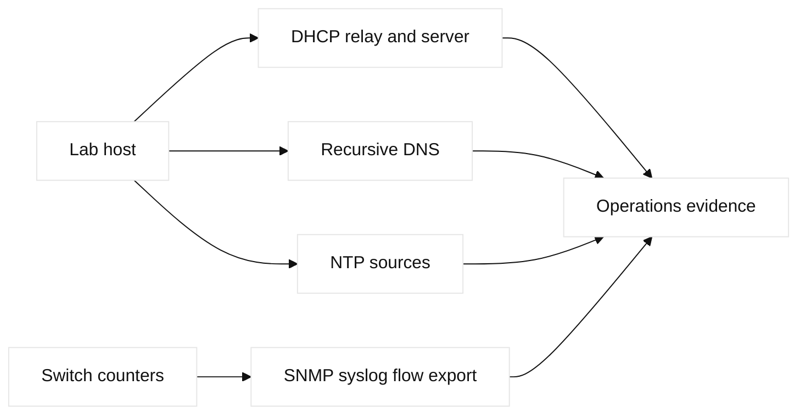
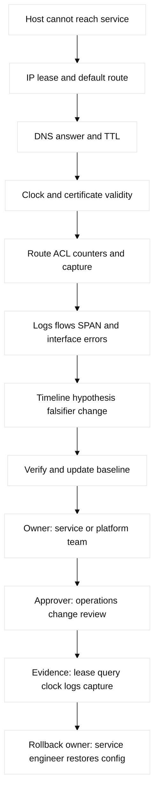

# 07. Network Services and Operations

## A. Learning objectives and prerequisites

Trace how hosts obtain configuration, resolve names, synchronize time, export
telemetry, and receive administrative access; configure safe lab shapes; and
build an evidence-first operational loop. Prerequisites are Ethernet, IP,
routing, ACLs, and basic Linux shell use. Examples use reserved addresses and
fictional names.

## B. Portable mental model

Services are dependencies on the packet path. A DHCP client broadcasts until a
relay/server boundary is crossed; DNS may consult an authoritative server or a
recursive cache; NTP clients select time sources; management and telemetry
travel on explicitly controlled paths. The data plane carries these requests,
while server, switch, and controller control planes maintain leases, records,
time selection, or counters. Operations closes the loop: baseline, detect,
hypothesize, falsify, change minimally, verify, and record.



## C. Service and operations inventory

**Fact:** DHCPv4 uses leases and options; a relay forwards client intent when
the server is not local. DHCP snooping builds a switch binding table and can
support Dynamic ARP Inspection (DAI) and IP Source Guard. A rogue DHCP server,
exhausted pool, wrong relay, or VLAN mismatch produces different evidence.

DNS has recursive resolvers, authoritative servers, forward and reverse zones,
cache entries, TTLs, split-horizon views, failover behavior, and optional
DNSSEC validation. A successful lookup proves a response, not necessarily that
the returned endpoint is reachable. **Engineering inference:** record resolver,
query type, answer, TTL, and path when diagnosing “DNS is down.”

NTP uses stratum and clock-selection logic; it is not a replacement for an
application timestamping design. SNMPv2c uses community strings; SNMPv3 adds
authenticated/encrypted security models. Syslog centralizes event messages.
NetFlow/IPFIX exports flow metadata, not full payloads. SPAN copies traffic for
analysis; RSPAN crosses VLANs and ERSPAN encapsulates toward a remote analyzer,
with bandwidth and privacy costs. CDP is Cisco discovery; LLDP is multi-vendor.

SSH is the administrative transport. TFTP/FTP are simple but weak for secrets;
SCP/SFTP use SSH. Backups need integrity, encryption, retention, and tested
restore. Images and secure boot/boot variables are release-specific. ZTP can
bootstrap a device but expands the supply-chain and credential trust boundary.
Licensing and controller entitlement are operational dependencies, not mere
paperwork.

| Concept | Mechanism / purpose | Limit or adjacent term | Evidence and falsifier |
| --- | --- | --- | --- |
| DHCP relay/options | Carries client broadcasts across L3 and supplies resolver/time parameters | Wrong relay, pool, VLAN, or option can look like a host fault | Lease, relay address, options, and DHCP capture |
| DNS authority/recursion | Authority serves zones; recursive cache follows referrals and TTLs | A valid answer does not prove endpoint reachability; DNSSEC adds validation state | `dig` server, type, TTL, status, and query log |
| NTP | Selects time sources by reachability and clock quality | Offset can invalidate TLS and corrupt event correlation | `chronyc tracking`, associations, and offset |
| Telemetry | SNMP, syslog, IPFIX, SPAN, or cloud logs export different evidence | Flow metadata is not payload; mirroring costs bandwidth/privacy | Exporter counters, collector receipt, timestamp, and capture |
| Backup/image lifecycle | Integrity, encryption, retention, boot variables, and restore prove recoverability | A successful copy is not a tested restore; ZTP expands trust boundary | Hash/signature, restore transcript, boot state, and audit log |

## D. Safe configuration shapes

Fictional IOS-XE shape; save a `show running-config` and verify a management
VRF before any change:

```text
ip dhcp snooping
ip dhcp snooping vlan 120
ip dhcp snooping database scp://backup@192.0.2.50/lab-bindings
ip name-server 192.0.2.53 192.0.2.54
ntp server 192.0.2.123 source Loopback0
logging host 192.0.2.60 transport tcp port 6514
snmp-server group OBS v3 priv
snmp-server host 192.0.2.61 version 3 priv OBS
ip flow-export destination 192.0.2.62 2055
ip flow-export version 9
line vty 0 4
 transport input ssh
 login local
```

Linux read-only and lab shapes include `ip addr`, `ip route`, `resolvectl
status`, `dig @192.0.2.53 example.lab A +dnssec`, `chronyc sources -v`, `ss -lntup`,
`journalctl -u systemd-resolved`, `tcpdump -ni eth0 port 67 or port 53`, and
`ethtool -S eth0`. Never expose a real SNMP community or copy production
configuration into the lab.

AWS maps DHCP option sets and VPC DNS to provider-managed behavior; VPC Flow
Logs and CloudWatch provide telemetry, while Route 53 owns DNS zones and
resolver endpoints. GCP provides Cloud DNS, VPC Flow Logs, Cloud Logging, and
Packet Mirroring. These are not interchangeable with an on-box daemon.
Terraform may own `aws_vpc_dhcp_options`, Route 53 records, flow-log sinks,
GCP DNS records, logging resources, and packet-mirroring policies. State,
credentials, and provider-generated values remain explicit ownership concerns.

## E. Verification and evidence

Cisco: `show ip dhcp binding`, `show ip dhcp snooping binding`, `show ip
interface`, `show hosts`, `show logging`, `show ntp associations`, `show snmp`,
`show flow exporter`, `show interfaces counters errors`, `show cdp neighbors
detail`, and `show lldp neighbors detail`. Linux: `ip neigh`, `dig +trace` in
the lab, `resolvectl statistics`, `chronyc tracking`, `logger`, `snmpget` with
v3 credentials, `ss`, `tcpdump`, and `ethtool -S`.

Cloud evidence includes AWS VPC flow-log records, Route 53 resolver query
logging, CloudWatch metrics, GCP VPC Flow Logs, Cloud DNS logs, Cloud
Monitoring, and Packet Mirroring captures. Check source identity, timestamp
and clock offset before correlating events.



## F. Failure lab: lease succeeds, name resolution fails

Start with VLAN 120, a fictional relay at `192.0.2.1`, DHCP server
`192.0.2.10`, resolver `192.0.2.53`, NTP `192.0.2.123`, and a test host. Inject
an incorrect DHCP DNS option or block UDP/TCP 53 in the lab ACL. The host gets
an address but `curl example.lab` fails.

Hypotheses are lease/route failure, wrong resolver, DNS record or recursion
failure, ACL/MTU issue, clock skew, or application failure. Falsify in that
order with lease/options, `ip route`, `dig` against the named resolver,
`tcpdump`, logs, and direct IP curl. The smallest safe action is restore the
single lab option/ACL line. Roll back from the saved config, renew the lease,
verify forward and reverse queries, then remove the lab state. **Observed lab
result:** direct-IP success does not prove the service is healthy if TLS uses a
hostname or the host sends a wrong SNI.

## G. Exercise, answer, and rubric

### Worked lab fields

- **Safety:** isolated VLAN/namespaces with reserved addresses; no production
  DHCP, DNS, NTP, credentials, or provider account.
- **Prechecks and baseline:** record lease/options, route, `dig` answer/TTL,
  NTP offset, exporter counters, clock, and saved running configuration.
- **Saved artifact:** timestamped config, packet capture, backup hash, and
  expected service-dependency graph.
- **Injected fault:** change one lab DHCP DNS option or block only lab DNS 53.
- **Symptom:** lease succeeds but name resolution or TLS lookup fails.
- **Hypothesis/falsifier:** lease/route, resolver, authority/cache, ACL/MTU,
  clock, then app; each command/capture falsifies one branch.
- **Expected output:** lease includes `192.0.2.53`, `dig` returns the expected
  A record and TTL, NTP offset is within the lab target, and logs correlate.
- **Repair:** restore the one option or ACL line and renew/query again.
- **Rollback:** service owner restores the saved config; approver checks the
  diff; backup owner verifies restore integrity before any image change.
- **Cleanup proof:** release the lease, remove test records/routes, stop
  captures, delete lab credentials, and prove no exporter or log destination remains.

Build a lab service dependency map for DHCP, DNS, NTP, SSH, syslog, SNMPv3,
IPFIX, and one SPAN capture. Submit packet traces, read-only command output,
backup/restore procedure, a retention decision, one failure injection, and a
cleanup checklist. Answer: isolate management, use explicit resolver and time
sources, protect telemetry, correlate with synchronized clocks, and label
payload capture versus flow metadata. Score: 25% dependency model, 25%
evidence quality, 20% security/safety, 15% recovery, 15% cloud ownership.
SDE2: write assertions for lease, DNS, NTP offset, and exporter health. Staff:
define baselines, retention/cost, break-glass access, service ownership, and
restore-time objectives.

## H. Interview Q&A

For every question, the answer key is explicit: **Answer:** the mechanism;
**Wrong turn:** the tempting misdiagnosis; **Evidence:** the read-back that
falsifies it; **Follow-up:** the next design decision. Apply those labels to
each item below when answering aloud.

1. **Why can DHCP work while DNS fails?** **Answer:** separate options and servers. **Wrong turn:** treating a lease as name-service proof. **Evidence:** lease resolver and `dig`. **Follow-up:** verify relay and return ACLs. They use separate options, servers,
   routes, and ACLs. Inspect the lease's resolver list and query that resolver.
2. **What does DHCP snooping prove?** **Answer:** trusted binding evidence only. **Wrong turn:** trusting every DHCP server. **Evidence:** bindings and drop counters. **Follow-up:** pair with DAI. It records trusted bindings; it does not
   make every DHCP server safe. Check trusted ports, bindings, and drops.
3. **Why is SNMPv3 preferred?** **Answer:** authentication/privacy. **Wrong turn:** proving only UDP/161. **Evidence:** engine time and authorization. **Follow-up:** test least-privilege views. It supports stronger authentication/privacy
   than a shared v2c string. Confirm engine time and authorization, not just
   UDP/161 reachability.
4. **NetFlow or SPAN?** **Answer:** flow metadata scales; SPAN supplies packets. **Wrong turn:** using a flood-sized mirror. **Evidence:** exporter and capture. **Follow-up:** choose the smallest falsifier. Flow export scales for metadata and trends; SPAN gives
   packet detail but consumes bandwidth/analyzer capacity. Use the smallest
   evidence that falsifies the hypothesis.
5. **Why does clock skew matter?** **Answer:** it breaks certificates and ordering. **Wrong turn:** correlating unsynchronized logs. **Evidence:** NTP offset. **Follow-up:** set alert bounds. It breaks certificate validity and log
   ordering. Compare NTP offset before correlating events.
6. **What makes a backup usable?** **Answer:** scoped, protected, compatible, restored. **Wrong turn:** trusting a successful copy. **Evidence:** restore transcript and hash. **Follow-up:** test version rollback. Correct scope, secure storage, version
   compatibility, and a tested restore. A successful copy alone is not proof.
7. **What is ZTP's risk?** **Answer:** bootstrap credentials and image provenance are trust anchors. **Wrong turn:** connecting an unknown image. **Evidence:** signature and audit trail. **Follow-up:** isolate enrollment. Bootstrap credentials and image provenance become
   critical trust anchors. Follow with signed artifacts, isolation, and an
   auditable handoff.

## I. References and evidence labels

## J. Ownership and completion contract

DHCP/DNS/NTP owners own service data; the switch owner owns relay, snooping,
and SPAN; evidence reads lease, resolver, clock, and logs; rollback restores
the saved mock. Terraform does not write appliance service policy.

## K. Detailed reproducible failure lab

```text
mkdir -p /tmp/ccna07-lab
printf '%s\n' '{"lease":"192.0.2.20","resolver":"192.0.2.53","ntp":"192.0.2.123"}' > /tmp/ccna07-lab/state.json
cp /tmp/ccna07-lab/state.json /tmp/ccna07-lab/baseline.json
python3 -c 'import json; p="/tmp/ccna07-lab/state.json"; x=json.load(open(p)); x["resolver"]="192.0.2.254"; json.dump(x,open(p,"w"))'
python3 -c 'import json; x=json.load(open("/tmp/ccna07-lab/state.json")); print("LEASE_OK DNS_OPTION_WRONG")'
cp /tmp/ccna07-lab/baseline.json /tmp/ccna07-lab/state.json; cmp /tmp/ccna07-lab/state.json /tmp/ccna07-lab/baseline.json
rm -f /tmp/ccna07-lab/state.json /tmp/ccna07-lab/baseline.json; rmdir /tmp/ccna07-lab
```

Expected output is `LEASE_OK DNS_OPTION_WRONG`; `cmp`/`rmdir` prove rollback and
cleanup. Device read-back is `show ip dhcp binding`, snooping bindings, clock,
and logging.

## L. Worked answer, rubric, and SDE2/Staff follow-ups

**Criterion-by-criterion completed submission:** mechanism, evidence, injected
failure, repair, rollback, and Staff follow-up are each stated and verified:
DHCP/DNS/time/telemetry remain separate planes; lease/lookup/offset/log reads
prove the fault; the bounded fixture is restored; Staff owns retention and ZTP.

Separation 25/25, ordered lease/DNS/clock evidence 25/25, bounded fixture 20/20,
restore/cleanup 20/20, ownership 10/10: **100/100**. SDE2 adds parsers and
clock assertions; Staff adds retention, licensing, and ZTP provenance.

| Rubric criterion | Learner artifact | Expected evidence | Pass/fail threshold | SDE2 follow-up answer | Staff follow-up answer |
| --- | --- | --- | --- | --- | --- |
| Plane separation (25%) | DHCP/DNS/NTP/telemetry dependency map | Lease options, DNS answer, time offset, exporter event | Pass if one healthy service is not proof of another | I would expose each service as a separate health check and dependency label. | I would assign owners, retention, and break-glass access per management service. |
| Ordered evidence (25%) | Timestamped query transcript | `ip`, `dig`, clock, logs, and capture results | Pass if timestamps and source identity are recorded | I would normalize timestamps and parse structured responses for regressions. | I would define evidence retention and cross-team incident correlation standards. |
| Bounded fault (20%) | One incorrect resolver option in a disposable lease | Negative lookup, changed option, no host mutation | Pass if the fault is isolated to the fixture | I would test a canary client and cap query/lease volume. | I would review blast radius, fallback resolver, and continuity before rollout. |
| Recovery/cleanup (20%) | Restored lease and empty fixture checklist | Baseline comparison, process/socket cleanup, no residue | Pass if service behavior and filesystem cleanup are proved | I would make cleanup and clock sanity assertions mandatory in CI. | I would require restore testing, auditability, and ownership transfer. |
| Operations design (10%) | Backup/ZTP/telemetry decision record | Restore transcript, provenance, source ACL, retention | Pass if backup success is distinguished from restore success | I would add schema/version checks to backup validation. | I would own ZTP trust anchors, licensing, retention cost, and recovery drills. |

**Completed score:** 25/25 + 25/25 + 20/20 + 20/20 + 10/10 = **100/100**.

## M. Reproducible lab record

**Disposable fixture/topology and safety:** a local lease/options file models a client, DHCP relay,
resolver, and telemetry collector. It never sends DHCP, DNS, SNMP, or NetFlow
traffic to a real service.

1. **Disposable fixture/topology and exact setup inputs:** `client -> relay ->
   DHCP/DNS services`; create a temporary fixture with a known-good resolver:

   ```bash
   LAB_DIR=$(mktemp -d /tmp/ccna07.XXXXXX)
   printf '%s\n' 'lease=192.0.2.44 resolver=192.0.2.53 ntp_offset_ms=2 telemetry=delivered' > "$LAB_DIR/services.txt"
   cp "$LAB_DIR/services.txt" "$LAB_DIR/baseline.txt"
   ```

2. **Baseline command and expected baseline:** `awk '{print "BASELINE " $0}'
   "$LAB_DIR/services.txt"`. **Illustrative expected output:**
   `BASELINE lease=192.0.2.44 resolver=192.0.2.53 ntp_offset_ms=2 telemetry=delivered`.

3. **Injected fault:** `sed -i 's/resolver=192.0.2.53/resolver=192.0.2.254/'
   "$LAB_DIR/services.txt"` gives the fixture a wrong DNS option.

4. **Measurable assertion and sample expected output:**
   `awk '{if ($0 ~ /resolver=192.0.2.254/) print "ASSERT LEASE_OK DNS_OPTION_WRONG"; else print "ASSERT DNS_OPTION_OK"}' "$LAB_DIR/services.txt"`.
   **Illustrative expected output:** `ASSERT LEASE_OK DNS_OPTION_WRONG`.
   In a real lab, pair this with lease, `dig`, NTP offset, and log read-backs;
   **observed** means only output from the learner's local run.

5. **Repair command/decision:** `sed -i 's/resolver=192.0.2.254/resolver=192.0.2.53/'
   "$LAB_DIR/services.txt"; cmp "$LAB_DIR/services.txt" "$LAB_DIR/baseline.txt"`.
   No output from `cmp` is the illustrative success condition.

6. **Rollback command/decision:** `cp "$LAB_DIR/baseline.txt"
   "$LAB_DIR/services.txt"`; roll back if ownership or the target option is
   uncertain, and forward-repair only the recorded fault.

7. **Cleanup verification:** `rm -f "$LAB_DIR/services.txt"
   "$LAB_DIR/baseline.txt"; rmdir "$LAB_DIR"; test ! -e "$LAB_DIR"`.
   **Illustrative result:** exit status `0`; do not report real service or
   provider telemetry execution.

**Observed lab result:** In a local fixture, the recorded DHCP lease, DNS
answer, NTP offset, and exporter timestamp must be treated as observations of
that fixture only; they are not guarantees about another server or release.

**Fact:** [RFC 2131](https://www.rfc-editor.org/rfc/rfc2131) specifies DHCPv4;
[RFC 1035](https://www.rfc-editor.org/rfc/rfc1035) specifies core DNS behavior;
[RFC 5905](https://www.rfc-editor.org/rfc/rfc5905) describes NTPv4;
[RFC 7011](https://www.rfc-editor.org/rfc/rfc7011) specifies IPFIX. **Fact:**
[RFC 4251](https://www.rfc-editor.org/rfc/rfc4251) specifies SSH architecture.
**Vendor terminology:** Cisco [NetFlow](https://www.cisco.com/c/en/us/products/ios-nx-os-software/ios-flexible-netflow/index.html),
CDP, and SPAN displays vary by release. **Vendor terminology:** AWS [VPC Flow
Logs](https://docs.aws.amazon.com/vpc/latest/userguide/flow-logs.html) and
GCP [VPC Flow Logs](https://cloud.google.com/vpc/docs/flow-logs) are provider
telemetry products. **Engineering inference:** synchronized clocks are a
prerequisite for trustworthy distributed incident timelines.

## N. Artifact-backed submission

Observed bundle: [`07-network-services.json`](fixtures/observed/07-network-services.json). The v3 evaluator derives DNS, lease, NTP, and syslog observations from effective service configuration and an independent service path. The negative assertion pairs a healthy metadata-only control change with evaluator-only DNS path loss; reconciliation fields and service observations are retained. Module-specific scoring: [worked submissions](fixtures/worked-submissions.md#08-b-module-07--07-network-services).
