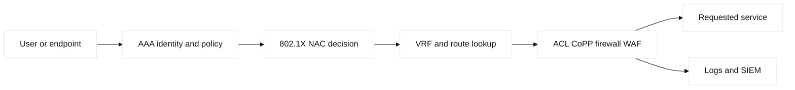
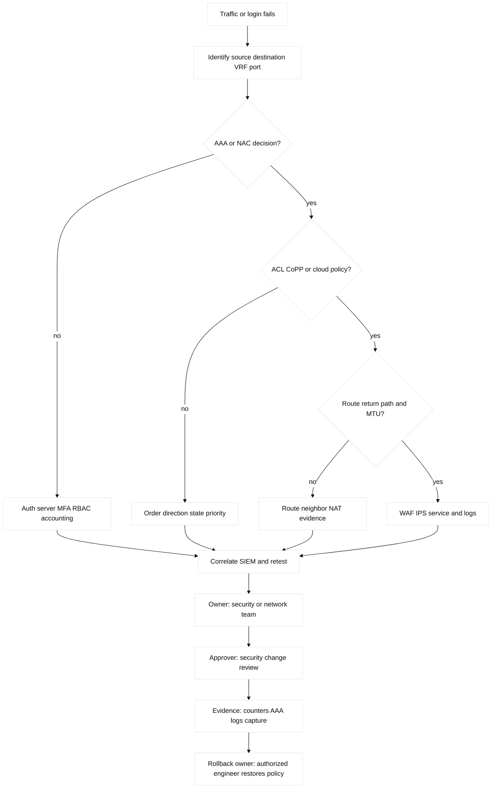

# 08. ACLs, AAA, and Network Security

## A. Learning objectives and prerequisites

Explain packet filtering and identity control, configure safe lab-only ACL and
AAA shapes, verify enforcement with evidence, and reason about layered
defense. Prerequisites are Ethernet, IP/routing, DHCP, DNS, and SSH. Targets
use only `192.0.2.0/24`, `198.51.100.0/24`, and fictional identities.

## B. Portable mental model

Security is a path and an authorization decision. A packet crosses interface,
VLAN/VRF, route lookup, ACL/CoPP/firewall inspection, and possibly an
application proxy. AAA separately authenticates an operator or endpoint,
authorizes actions, and accounts for them. The forwarding/data plane enforces
compiled rules; control and management planes distribute policy, identities,
keys, and logs. Zero trust means continuously evaluating identity, device
posture, and requested resource rather than trusting network location alone.



## C. Controls and threat inventory

An IPv4 standard ACL usually matches source; an extended ACL can match source,
destination, protocol, and ports. Named ACLs improve change review. IPv6 ACLs
have IPv6-specific neighbor and ICMP considerations. Direction matters: inbound
is evaluated as traffic enters an interface, outbound as it leaves. Entries
are ordered, wildcard masks describe inverse network masks in Cisco syntax, and
an implicit deny exists at the end unless deliberately permitted. ACLs are not
stateful firewalls: return traffic needs a rule, and fragmentation, protocols,
and logging have platform-specific behavior.

Control Plane Policing (CoPP) protects the device CPU from punted control and
management traffic; it must not block required routing or neighbor protocols.
AAA separates authentication, authorization, and accounting. TACACS+ commonly
supports granular device-command authorization; RADIUS commonly carries
network access authentication/authorization and is used by 802.1X. LDAP,
MFA, RBAC, and break-glass accounts are surrounding identity controls, not
replacements for transport security.

Threats include ARP, DHCP, MAC-table, VLAN-hopping, STP, DNS, route, credential,
and DDoS attacks. DHCP snooping, DAI, IP Source Guard, port security, BPDU
guards, segmentation, and rate limits address different layers. IDS detects;
IPS can block inline; an NGFW combines stateful and application controls; a
WAF protects HTTP semantics; DDoS controls absorb or filter volumetric attacks.
NAC/802.1X gates access using EAP and a RADIUS server. SIEM correlation and
forensics preserve evidence without altering originals. **Engineering
inference:** no single ACL is a zero-trust architecture.

| Concept | Mechanism / purpose | Limit or adjacent term | Evidence and falsifier |
| --- | --- | --- | --- |
| IPv4/IPv6 ACL | Ordered stateless match/action; IPv6 also needs permitted ND/ICMP | Direction, fragments, implicit deny, and return rules matter | Interface ACL counters plus both-direction capture |
| CoPP | Classifies and rate-limits traffic punted to the CPU | Must preserve routing, ARP/ND, and management control | Policy-map drops/CPU and protocol adjacency |
| AAA | Separates authentication, authorization, and accounting | TACACS+ command control differs from RADIUS network access | Server transaction log and local fallback test |
| NAC | EAP/RADIUS posture or identity gates a port/VLAN | Endpoint, supplicant, and policy-server failure domains differ | 802.1X state, VLAN assignment, and RADIUS result |

## D. Safe configuration shapes

Fictional IOS-XE shape with explicit logging and a lab-only management source:

```text
ip access-list extended LAB-APP-IN
 permit tcp 192.0.2.0 0.0.0.255 host 198.51.100.20 eq 443 log
 permit icmp 192.0.2.0 0.0.0.255 host 198.51.100.20 echo
 deny ip any any log
interface GigabitEthernet1/0/1
 ip access-group LAB-APP-IN in
!
aaa new-model
aaa authentication login default group tacacs+ local
aaa authorization commands 15 default group tacacs+ local
aaa accounting commands 15 default start-stop group tacacs+
ip tacacs source-interface Loopback0
ip ssh version 2
line vty 0 4
 transport input ssh
 exec-timeout 10 0
 login authentication default
!
control-plane
 service-policy input LAB-COPP
```

Precheck counters and an out-of-band console. A CoPP policy must be built from
observed control traffic, saved, and tested with a known-good session. Linux
shapes are `nft list ruleset`, `ss -lntup`, `ip route`, `ip neigh`, `journalctl
-u ssh`, and `tcpdump`; a lab rule should be loaded with a rollback timer and
tested from `192.0.2.10`, never from a production host.

AWS Security Groups are stateful, ENI-associated allow rules; network ACLs are
subnet-associated, stateless, ordered rules. AWS Network Firewall, WAF,
Shield, PrivateLink, and VPC flow logs have different scopes. GCP VPC firewall
rules are distributed, stateful policy with priorities and targets; Cloud
Armor protects supported HTTP(S) edges, and hierarchical policies add
organization/project scope. Do not translate an SG into a GCP priority rule
word-for-word. Terraform can own these declared cloud policies and associations;
an identity provider, appliance, or controller owns its own policy unless
explicitly imported. Review `terraform plan`, state locking, secrets, and drift.

## E. Verification and evidence

Cisco: `show access-lists`, `show ip interface`, `show ipv6 access-list`, `show
policy-map control-plane`, `show aaa servers`, `show users`, `show privilege`,
`show ssh`, `show login`, and `show logging`. Linux: `nft list ruleset`, `ip6tables-save`
where legacy tooling applies, `ss -lntup`, `journalctl`, `last`, `auditctl -l`,
and `tcpdump -ni any`. Verify both allowed and denied test cases, counters,
source/destination/VRF, and return traffic.

AWS evidence is SG/NACL rule evaluation, Network Firewall/WAF logs, flow logs,
Reachability Analyzer, and IAM/MFA audit records. GCP evidence is firewall
logging, hierarchical policy, Cloud Armor logs, Connectivity Tests, and Cloud
Audit Logs. IDS/IPS/SIEM evidence should retain timestamps, sensor identity,
and chain-of-custody metadata.



## F. Failure lab: management lockout and false confidence

Start with a console, a lab VTY reachable only from `192.0.2.0/24`, TACACS
server `192.0.2.40`, local emergency account, and an APP ACL permitting HTTPS.
Inject a VTY source ACL typo or an extended ACL entry that permits the forward
direction but denies the return. The symptom is lockout or a one-way session.

Hypotheses are wrong interface/direction, ACL order or implicit deny, AAA
timeout/fallback, CoPP drop, route/VRF mismatch, or service failure. Falsify
with console read-only output, counters, AAA logs, route lookup, and a capture.
The smallest safe action is use console/out-of-band to remove one injected
line; do not reload or broadly permit `any`. Restore saved config, verify SSH,
AAA accounting, both packet directions, and cleanup. **Observed lab result:**
an ACL hit counter demonstrates evaluation, not successful application response.

## G. Exercise, answer, and rubric

### Worked lab fields

- **Safety:** console and reserved-source lab access remain available; use
  documentation addresses and synthetic identities only.
- **Prechecks and baseline:** save config; verify console, emergency account,
  IPv4/IPv6 routes, ACL counters, CoPP counters, AAA fallback, and 802.1X state.
- **Saved artifact:** signed config diff, rule/counter snapshot, RADIUS log,
  and timestamped packet capture.
- **Injected fault:** add one lab deny in the wrong direction or rate-limit a
  synthetic control class; do not alter the production/default policy.
- **Symptom:** management lockout, missing IPv6 neighbor discovery, or dropped
  routing/AAA control traffic.
- **Hypothesis/falsifier:** direction/order, route/VRF, return rule, CoPP,
  AAA/NAC, then endpoint; test both directions and compare counters.
- **Expected output:** intended session is permitted, ND and routing remain
  established, denied test traffic increments only the intended counter.
- **Repair:** remove the single injected entry or restore its direction/order.
- **Rollback:** security owner restores the signed policy; approver confirms
  out-of-band access and the AAA break-glass path.
- **Cleanup proof:** remove synthetic users/flows, clear only lab counters,
  verify IPv4/IPv6 and CoPP health, and archive the evidence bundle.

Design a management, user, and service policy for two fictional VLANs. Include
an IPv4 and IPv6 ACL, CoPP intent, TACACS+/local fallback, 802.1X decision
flow, cloud SG versus NACL comparison, WAF/IDS placement, and a SIEM evidence
plan. Submit prechecks, positive/negative tests, fault injection, rollback, and
forensics handling. Answer: name direction and state for every rule, permit
required control traffic, separate identity from network location, and verify
cloud rule scope and priority. Score: 25% packet policy, 25% identity/security,
20% evidence, 15% recovery, 15% ownership. SDE2: lint rules for shadowing,
overbroad sources, and missing return paths. Staff: set risk acceptance,
break-glass governance, DDoS/DR strategy, privacy retention, and migration
criteria across sites and providers.

## H. Interview Q&A

For every question, state **Answer**, **Wrong turn**, **Evidence**, and
**Follow-up** explicitly. Evidence must include direction and return-path
checks for stateless ACLs, and control-plane counters for CoPP.

1. **What is the implicit ACL deny?** **Answer:** unmatched traffic is denied. **Wrong turn:** forgetting order/direction. **Evidence:** sequence and counter. **Follow-up:** add a bounded log. Unmatched traffic is denied unless a
   later platform feature changes semantics; place an explicit deny/log when
   evidence is useful and verify order.
2. **Why can an ACL permit still fail?** **Answer:** return path or another layer can fail. **Wrong turn:** stopping at one permit counter. **Evidence:** both directions, route, NAT, MTU. **Follow-up:** capture the five-tuple. Return rules, route/VRF, MTU, NAT,
   CoPP, or the service can fail. Test both directions and inspect counters.
3. **TACACS+ or RADIUS?** **Answer:** choose by device-command versus network-access authorization. **Wrong turn:** assuming attributes match. **Evidence:** server/profile logs. **Follow-up:** test break-glass. They have different common scopes and attribute
   models; choose from required device-command or network-access authorization,
   then verify the actual server/profile behavior.
4. **What does CoPP protect?** **Answer:** the control-plane CPU. **Wrong turn:** applying transit assumptions. **Evidence:** CPU-class counters and protocol health. **Follow-up:** canary rate limits. The control-plane CPU, not transit forwarding.
   A too-broad policy can break BGP, OSPF, DHCP relay, or SSH; baseline first.
5. **IDS versus IPS?** **Answer:** IDS alerts; IPS can block inline. **Wrong turn:** ignoring bypass/false positives. **Evidence:** placement and block event. **Follow-up:** test fail-open policy. IDS alerts out of band; IPS can block inline and can
   introduce latency or false positives. Prove sensor placement and bypass.
6. **Why are AWS SG and NACL not equivalent?** **Answer:** SGs are stateful/ENI-scoped; NACLs are stateless/subnet-scoped. **Wrong turn:** copying rules mechanically. **Evidence:** each rule set and flow log. **Follow-up:** test return traffic. SGs are stateful and attached
   to ENIs; NACLs are stateless and subnet-scoped. Inspect both independently.
7. **How does zero trust change design?** **Answer:** evaluate identity, posture, and resource policy per request. **Wrong turn:** trusting a flat VLAN. **Evidence:** decision log and session policy. **Follow-up:** define exception expiry. Identity, posture, and resource
   policy are evaluated per request; a flat trusted VLAN is insufficient.

## I. References and evidence labels

## J. Ownership and completion contract

The device owner controls ACL/CoPP/VTY; AAA owns TACACS+/RADIUS; security owns
NAC, IDS/IPS, and WAF; evidence reads counters, AAA logs, boot integrity, and
image provenance; rollback uses the saved config and break-glass path.

## K. Detailed reproducible failure lab

```text
mkdir -p /tmp/ccna08-lab
printf '%s\n' '{"src":"192.0.2.10","dst":"198.51.100.20","tcp":443,"permit":true,"image":"sha256:lab-good"}' > /tmp/ccna08-lab/policy.json
cp /tmp/ccna08-lab/policy.json /tmp/ccna08-lab/baseline.json
python3 -c 'import json; p="/tmp/ccna08-lab/policy.json"; x=json.load(open(p)); x["permit"]=False; json.dump(x,open(p,"w"))'
python3 -c 'print("DENY counter=1 signed_image=present")'
cp /tmp/ccna08-lab/baseline.json /tmp/ccna08-lab/policy.json; cmp /tmp/ccna08-lab/policy.json /tmp/ccna08-lab/baseline.json
rm -f /tmp/ccna08-lab/policy.json /tmp/ccna08-lab/baseline.json; rmdir /tmp/ccna08-lab
```

Expected output is `DENY counter=1 signed_image=present`; `cmp`/`rmdir` prove
repair and cleanup. Secure boot verifies a trusted boot chain, a signed image
verifies provenance, and hardening reduces runtime attack surface; none alone
proves a secure deployment. Pair the mock with ACL counters, AAA logs,
secure-boot status, and image hash/signature read-back.

## L. Worked answer, rubric, and SDE2/Staff follow-ups

**Criterion-by-criterion completed submission:** mechanism, evidence, injected
failure, repair, rollback, and Staff follow-up are each stated and verified:
ordered filters and identity enforce least privilege; counters/AAA/certificates
prove the boundary; the narrow rule is restored; Staff governs keys and recovery.

ACL/CoPP reasoning 25/25, counters plus AAA and signed-image evidence 25/25,
bounded fixture 20/20, restore/cleanup 20/20, owners/approver 10/10:
**100/100**. SDE2 adds negative tests; Staff adds NAC rollout, key rotation,
recovery, and SIEM retention.

| Rubric criterion | Learner artifact | Expected evidence | Pass/fail threshold | SDE2 follow-up answer | Staff follow-up answer |
| --- | --- | --- | --- | --- | --- |
| ACL/CoPP reasoning (25%) | Ordered policy with direction and control-plane classes | Rule counters, five-tuple tests, CPU-class counters | Pass if order, direction, and scope are explicit | I would generate positive and negative tests from the policy table. | I would review control-plane protection against protocol inventory and safe limits. |
| Identity and provenance (25%) | AAA/RBAC/certificate/image trust record | AAA logs, certificate chain, signature/boot evidence | Pass if identity and image provenance are separately proven | I would validate fallback and expiry in a disposable profile. | I would own key rotation, break-glass access, signed-image policy, and recovery. |
| Bounded fault (20%) | One deny rule or auth failure in a fixture | Counter increment, denied test, console/emergency path | Pass if management access cannot be irreversibly lost | I would use a timed rollback and reserve an out-of-band path. | I would approve blast radius, exception expiry, and incident escalation. |
| Restore/cleanup (20%) | Diff, rollback transcript, clean fixture | Baseline policy, counters, no test accounts/keys | Pass if policy and credentials are restored or removed | I would assert no unauthorized rule/account remains. | I would require audit evidence and a post-change access review. |
| Ownership/approval (10%) | Security/network/service RACI | Named approver, policy owner, evidence owner | Pass if escalation follows the broken layer | I would encode owner metadata in the change object. | I would govern policy lifecycle, SIEM retention, and recovery drills. |

**Completed score:** 25/25 + 25/25 + 20/20 + 20/20 + 10/10 = **100/100**.

## M. Reproducible lab record

**Disposable fixture/topology and safety:** this local policy file has one permitted and one denied
tuple. It is not a firewall, AAA server, CoPP policy, or secure-boot test and
uses no credentials or provider account.

1. **Disposable fixture/topology and exact setup inputs:** `client -> policy
   fixture -> service`, with an independent emergency path:

   ```bash
   LAB_DIR=$(mktemp -d /tmp/ccna08.XXXXXX)
   printf '%s\n' 'rule=100 src=192.0.2.10 dst=192.0.2.20 proto=tcp dport=443 action=PERMIT counter=0 console=available signed_image=present' > "$LAB_DIR/policy.txt"
   cp "$LAB_DIR/policy.txt" "$LAB_DIR/baseline.txt"
   ```

2. **Baseline command and expected baseline:** `grep -o
   'action=[A-Z]*\\|counter=[0-9]*\\|console=[a-z]*\\|signed_image=[a-z]*'
   "$LAB_DIR/policy.txt"`. **Illustrative expected output:** `action=PERMIT`,
   `counter=0`, `console=available`, `signed_image=present`.

3. **Injected fault:** `sed -i 's/action=PERMIT/action=DENY/; s/counter=0/counter=1/'
   "$LAB_DIR/policy.txt"`.

4. **Measurable assertion and sample expected output:**
   `awk '{if ($0 ~ /action=DENY/ && $0 ~ /counter=1/) print "ASSERT DENY counter=1 signed_image=present"}' "$LAB_DIR/policy.txt"`.
   **Illustrative expected output:** `ASSERT DENY counter=1 signed_image=present`.
   A real ACL lab must also test both directions and AAA/boot evidence; this
   assertion does not claim those systems ran.

5. **Repair command/decision:** after confirming rule number and tuple,
   `sed -i 's/action=DENY/action=PERMIT/; s/counter=1/counter=0/'
   "$LAB_DIR/policy.txt"; cmp "$LAB_DIR/policy.txt" "$LAB_DIR/baseline.txt"`.

6. **Rollback command/decision:** `cp "$LAB_DIR/baseline.txt"
   "$LAB_DIR/policy.txt"`; use rollback if any field beyond the injected
   action/counter differs, and keep the console path intact.

7. **Cleanup verification:** `rm -f "$LAB_DIR/policy.txt"
   "$LAB_DIR/baseline.txt"; rmdir "$LAB_DIR"; test ! -e "$LAB_DIR"`.
   **Observed result:** only a learner-run local exit status is observed;
   **illustrative result:** clean exit status `0`.

**Fact:** [RFC 4301](https://www.rfc-editor.org/rfc/rfc4301) describes IPsec
security architecture; [RFC 2865](https://www.rfc-editor.org/rfc/rfc2865)
specifies RADIUS; [RFC 8907](https://www.rfc-editor.org/rfc/rfc8907)
specifies TACACS+. **Vendor terminology:** Cisco ACL wildcard
masks and [CoPP](https://www.cisco.com/c/en/us/td/docs/ios-xml/ios/qos_plcshp/configuration/xe-17/qos-plcshp-xe-17-book.html)
are implementation terms. **Vendor terminology:** AWS [security groups and
network ACLs](https://docs.aws.amazon.com/vpc/latest/userguide/vpc-security-groups.html)
and GCP [firewall rules](https://cloud.google.com/firewall/docs/firewalls)
have different scope and state semantics. **Fact:** [NIST zero trust
architecture](https://csrc.nist.gov/publications/detail/sp/800-207/final)
defines the reference model. **Engineering inference:** layered controls and
independent evidence reduce blast radius but increase policy ownership cost.
