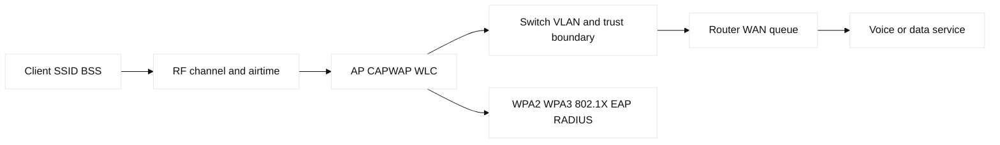
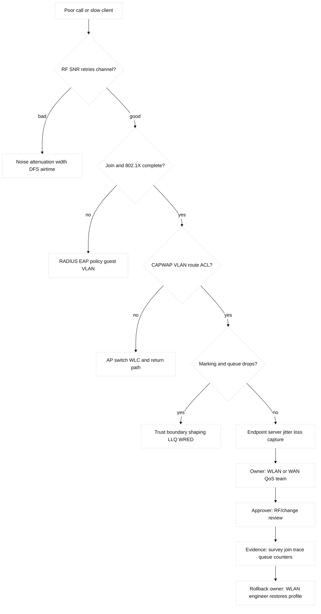

# 09. Wireless and QoS

## A. Learning objectives and prerequisites

Explain RF behavior, AP/controller forwarding, authentication and roaming,
and QoS from classification through queue service; configure safe lab shapes,
verify client and queue evidence, and troubleshoot voice-like traffic.
Prerequisites are Ethernet/VLANs, IP, ACL/AAA, and basic packet capture.

## B. Portable mental model

Wireless adds a shared, variable medium before the wired packet path. A client
associates to a BSS advertised by an AP; an ESS is the coordinated collection
of BSSs behind an SSID. The AP and WLC exchange control/data via CAPWAP in
controller designs, while FlexConnect can locally switch selected traffic.
WPA2/WPA3 and 802.1X/EAP/RADIUS establish access and keys; roaming transfers a
client without guaranteeing a lossless application session.

QoS classifies packets, optionally marks DSCP (L3) or CoS (802.1p/L2), trusts or
rewrites markings at boundaries, and then applies policing, shaping, queueing,
and drop policy. Wireless airtime contention and wired queue congestion are
separate bottlenecks.



## C. RF, wireless, and QoS inventory

RF quality depends on RSSI (received signal strength), noise, and SNR (signal
to noise ratio), not RSSI alone. Attenuation, distance, walls, multipath, and
co-channel/adjacent-channel interference reduce usable airtime. Bands and
channels have different propagation and capacity properties; channel width
trades peak rate against contention. DFS channels can require radar response
and channel moves. AP placement and power are a design, not a universal “more
power is better” setting.

SSID names a WLAN service; BSS is one AP radio cell; ESS is a coordinated set.
A WLC manages AP policy; CAPWAP commonly carries AP control and optionally
centralized data. WPA2 and WPA3 differ in cryptographic and onboarding modes;
802.1X uses EAP and RADIUS for enterprise identity. Guest isolation, dynamic
VLANs, fast roaming, and voice admission have compatibility and failure costs.

Classification may use application, port, VLAN, or endpoint markings. DSCP and
CoS are labels, not reserved bandwidth. Trust boundaries must sanitize
untrusted marks. Policing drops or remarks above a rate; shaping buffers to a
rate. Queues include FIFO, WFQ, CBWFQ, and LLQ; LLQ gives strict priority but
needs a ceiling to avoid starving other traffic. WRED probabilistically drops
before queues fill; tail drop waits until full. Jitter, loss, latency, and
microbursts matter more to voice than average throughput. **Engineering
inference:** end-to-end QoS is only as strong as its weakest trust boundary.

| Concept | Mechanism / purpose | Limit or adjacent term | Evidence and falsifier |
| --- | --- | --- | --- |
| RF channel plan | Chooses band, channel, width, and power from measured noise and reuse | DFS moves and wider channels trade capacity for contention | Survey noise/SNR/utilization and retry counters |
| Roaming | Reassociates and may use key caching/fast transition | A successful roam does not guarantee lossless application state | Client roam timeline, RADIUS/EAP, and packet loss |
| CAPWAP | Carries AP control and optionally centralized data to a WLC | FlexConnect/local switching changes VLAN and failure scope | AP join, tunnel mode, and wired capture |
| QoS queue | Classifies, marks, schedules, shapes, polices, and drops | DSCP is not reserved bandwidth; LLQ needs a ceiling | DSCP trust map, offered load, queue/drop counters |

## D. Safe configuration shapes

Fictional IOS-XE shapes; use a lab SSID and never reuse a real RADIUS secret:

```text
dot11 ssid LAB-STAFF
 authentication open eap eap_methods
 authentication network-eap
 vlan 120
!
interface GigabitEthernet1/0/20
 switchport mode trunk
 switchport trunk allowed vlan 120,130
 mls qos trust dscp
 service-policy output LAB-WAN-QOS
!
class-map match-any LAB-VOICE
 match dscp ef
policy-map LAB-WAN-QOS
 class LAB-VOICE
  priority percent 20
 class class-default
  bandwidth percent 80
```

NX-OS and controller syntax differs; WLAN policy, RF profiles, and CAPWAP
central/local switching must be checked against the target release. Linux
verification includes `iw dev`, `iw dev wlan0 link`, `iw event`, `nmcli dev
wifi`, `tc -s qdisc`, `tc -s class`, `ethtool -S`, `ss -tin`, and
`tcpdump -ni wlan0`. `tc` shapes a Linux interface; it does not configure an
AP radio.

AWS and GCP do not provide a universal enterprise WLAN controller equivalent.
Their relevant mappings are usually VPC/subnet/route/security policy plus
managed edge, VPN, or cloud QoS behavior; a campus AP/WLC remains an on-prem
or managed WLAN product. Terraform can own declared VPC routes, firewall
rules, VPNs, and load/edge resources, but not infer RF coverage or own a
controller's mutable client state unless that provider is explicitly used.

## E. Verification and evidence

Cisco/controller evidence includes client association/authentication state,
AP/WLC join and CAPWAP state, channel/width/power, RSSI/SNR/noise, retries,
roaming history, 802.1X/RADIUS logs, `show policy-map interface`, queue drops,
DSCP/CoS counters, and interface errors. Linux evidence is the `iw` link and
station dump, `tc -s`, `ip -s link`, `ping` with controlled rate, and packet
capture. Capture at client/AP edge and wired egress when possible; timestamps
must be comparable.

AWS/GCP evidence is provider flow logging, firewall policy, VPN/edge health,
and connectivity testing; these prove cloud path policy, not RF health. A
cloud load balancer or CDN may terminate/reclassify traffic, so inspect the
actual hop and marking boundary.



## F. Failure lab: strong RSSI, unusable voice

Start with two fictional APs on non-overlapping lab channels, SSID `LAB-VOICE`,
RADIUS `192.0.2.40`, WLC `192.0.2.41`, wired voice VLAN 130, and an egress
queue with a 20% LLQ ceiling. Inject a competing bulk stream, mark it EF, or
move both APs to one congested channel. The symptom is high retries, jitter,
queue drops, or a roaming interruption despite strong RSSI.

Hypotheses are RF noise/interference, authentication/roaming, CAPWAP/VLAN
loss, bad trust boundary, queue starvation, MTU, or endpoint/server behavior.
Falsify with SNR/noise/retries, association and RADIUS logs, path captures,
DSCP/CoS counters, `tc`/policy-map drops, and controlled `iperf3`. The smallest
safe action is remove the injected marking or bulk stream, not raise radio
power globally. Restore the saved policy, stop test traffic, verify voice/data
classes and cleanup. **Observed lab result:** high RSSI can coexist with low
SNR and poor airtime because noise and contention are separate measurements.

## G. Exercise, answer, and rubric

### Worked lab fields

- **Safety:** RF simulator or isolated APs with a lab SSID; no unauthorized
  interference, real RADIUS secret, or production channel/power change.
- **Prechecks and baseline:** save RF profile and QoS policy; record RSSI,
  noise, SNR, utilization, retries, roam time, offered load, and queue drops.
- **Saved artifact:** survey table, client/AP join trace, DSCP capture, and
  policy-map/`tc -s` output.
- **Injected fault:** add a controlled bulk stream with an untrusted EF mark or
  co-channel load; keep the stream rate bounded.
- **Symptom:** jitter/retries/queue drops despite strong RSSI.
- **Hypothesis/falsifier:** RF/SNR, auth/roam, CAPWAP/VLAN, trust boundary,
  queue, MTU, then app; compare client-edge and wired-edge timestamps.
- **Expected output:** removal of the fault restores SNR/retries or queue
  drops to baseline, voice remains within the lab jitter target, and guest
  traffic stays isolated.
- **Repair:** remove test load/remark untrusted traffic and restore saved policy.
- **Rollback:** WLAN owner restores RF/QoS config; approver checks channel and
  trust-boundary impact before reapply.
- **Cleanup proof:** stop generators, disassociate test clients, delete lab
  SSID/RADIUS entries, and verify no radio or queue alarms remain.

Design a two-AP staff/guest/voice WLAN with channel and power assumptions,
WPA3/802.1X fallback considerations, guest isolation, roaming evidence, wired
VLAN mapping, DSCP trust boundary, LLQ ceiling, and a failure lab. Submit a
small RF survey table, packet/airtime path, captures, queue counters, rollback,
and a cloud/on-prem ownership note. Answer: choose channels by measured
interference, authenticate through EAP/RADIUS, isolate guest traffic, preserve
voice markings only at trusted boundaries, and prove both RF and wired queue
health. Score: 25% RF model, 25% security/roaming, 20% QoS, 15% evidence, 15%
safety/ownership. SDE2: automate client/queue SLO checks and detect marking
violations. Staff: own spectrum planning, capacity/headroom, site rollout,
vendor exit, support model, and incident priorities.

## H. Interview Q&A

For every question, state **Answer**, **Wrong turn**, **Evidence**, and
**Follow-up** explicitly. Evidence must separate RF measurements, CAPWAP/auth
state, and wired queue counters.

1. **Why is RSSI insufficient?** **Answer:** noise/interference determine SNR and airtime. **Wrong turn:** treating strong signal as quality. **Evidence:** RSSI, noise, retries, capture. **Follow-up:** change channel width. Noise and interference determine SNR and usable
   airtime. Collect RSSI, noise, retries, channel utilization, and a capture.
2. **What is CAPWAP's role?** **Answer:** AP control and, by mode, data transport to a WLC. **Wrong turn:** assuming local switching. **Evidence:** tunnel and forwarding mode. **Follow-up:** test roaming. It connects AP control to a WLC and may carry
   centralized data; FlexConnect and release modes change forwarding. Verify
   actual tunnel and local-switch behavior.
3. **WPA3 versus 802.1X?** **Answer:** WPA3 is a security mode; 802.1X is access control using EAP. **Wrong turn:** treating them as synonyms. **Evidence:** auth exchange and RADIUS log. **Follow-up:** compare guest onboarding. WPA3 is a security generation/mode; 802.1X is an
   access-control framework using EAP and commonly RADIUS. They solve related,
   not identical, problems.
4. **Why can roaming still drop a call?** **Answer:** auth, key transition, channel move, or buffering can interrupt packets. **Wrong turn:** checking association only. **Evidence:** roam timeline and loss. **Follow-up:** measure voice jitter. Authentication, key transition,
   channel move, buffering, or application behavior can interrupt packets.
   Inspect roam timeline and packet loss, not only association state.
5. **Policing or shaping?** **Answer:** policing drops/remarks; shaping delays into a buffer. **Wrong turn:** shaping where no buffer exists. **Evidence:** class counters and latency. **Follow-up:** place the control boundary. Policing enforces by dropping/remarking; shaping
   delays into a buffer. Pick based on where control and buffering belong.
6. **Why cap LLQ?** **Answer:** strict priority can starve other classes. **Wrong turn:** allocating all bandwidth to voice. **Evidence:** priority drops and class latency. **Follow-up:** set admission control. Unbounded strict priority can starve other classes. Verify
   offered load, priority drops, and class-default latency.
7. **What does DSCP trust mean?** **Answer:** accept a marking for classification. **Wrong turn:** assuming downstream treatment. **Evidence:** markings and queue counters at each hop. **Follow-up:** remark untrusted edges. It accepts a marking for classification; it
   does not guarantee treatment downstream. Rewrite untrusted edges and count
   each boundary.

## I. References and evidence labels

## J. Ownership and completion contract

RF/WLC owns channels, CAPWAP, SSID, and roaming; access owns wired VLAN/trust;
QoS owns DSCP/CoS and queues; evidence reads SNR, retries, auth, and queue
counters; rollback restores the saved profile.

## K. Detailed reproducible failure lab

```text
mkdir -p /tmp/ccna09-lab
printf '%s\n' '{"rssi":-55,"noise":-90,"dscp":"EF","queue":"voice","drop":0}' > /tmp/ccna09-lab/rf.json
cp /tmp/ccna09-lab/rf.json /tmp/ccna09-lab/baseline.json
python3 -c 'import json; p="/tmp/ccna09-lab/rf.json"; x=json.load(open(p)); x["noise"]=-65; x["drop"]=4; json.dump(x,open(p,"w"))'
python3 -c 'print("RSSI_STRONG SNR_BAD QUEUE_DROPS=4")'
cp /tmp/ccna09-lab/baseline.json /tmp/ccna09-lab/rf.json; cmp /tmp/ccna09-lab/rf.json /tmp/ccna09-lab/baseline.json
rm -f /tmp/ccna09-lab/rf.json /tmp/ccna09-lab/baseline.json; rmdir /tmp/ccna09-lab
```

Expected output is `RSSI_STRONG SNR_BAD QUEUE_DROPS=4`; `cmp`/`rmdir` prove
repair/cleanup. Real read-back is AP/WLC client and CAPWAP state plus class
counters; the mock emits no RF.

## L. Worked answer, rubric, and SDE2/Staff follow-ups

**Criterion-by-criterion completed submission:** mechanism, evidence, injected
failure, repair, rollback, and Staff follow-up are each stated and verified:
RF, association, marking, and queues are separated; RSSI/SNR/client/DSCP reads
prove the fault; the saved profile is restored; Staff owns airtime and voice SLOs.

RF/SNR 25/25, CAPWAP/auth/QoS evidence 25/25, bounded fault 20/20,
restore/cleanup 20/20, ownership 10/10: **100/100**. SDE2 adds roam/DSCP
assertions; Staff adds airtime capacity, channel governance, and voice SLOs.

| Rubric criterion | Learner artifact | Expected evidence | Pass/fail threshold | SDE2 follow-up answer | Staff follow-up answer |
| --- | --- | --- | --- | --- | --- |
| RF/SNR reasoning (25%) | Channel, RSSI, noise, SNR, and airtime worksheet | Survey values, retries, utilization, client cohort | Pass if RSSI is not the sole quality signal | I would trend retries and airtime by channel and cohort. | I would govern channel width, density, roaming, and voice airtime budgets. |
| Association/control path (25%) | Client-to-AP/controller authentication path | Association/auth state, CAPWAP/control state, DHCP result | Pass if RF, auth, and IP assignment are separate | I would test each stage with a bounded client and explicit timeout. | I would own controller redundancy, identity dependencies, and maintenance windows. |
| QoS evidence (20%) | DSCP-to-queue mapping and flow test | Markings, queue drops, latency/jitter, WMM state | Pass if marking and queuing are both measured | I would generate several tuple classes and assert no remarking surprise. | I would set end-to-end voice SLOs and protect scarce airtime. |
| Reversible fault (20%) | One channel-width or QoS-profile change with restore | Before/after profile, negative test, restored health | Pass if the fault is bounded to the fixture SSID/client | I would canary one SSID and restore on retry threshold. | I would retain a stable escape SSID and approve client-impact thresholds. |
| Ownership (10%) | WLAN/RF/identity/application RACI | Controller owner, RF approver, service evidence | Pass if escalation follows evidence domain | I would publish a diagnostic bundle with client, AP, and queue IDs. | I would own airtime capacity, exception expiry, and business SLO alignment. |

**Completed score:** 25/25 + 25/25 + 20/20 + 20/20 + 10/10 = **100/100**.

## M. Reproducible lab record

**Disposable fixture/topology and safety:** a local client-profile file stands in for one lab SSID,
AP, controller, and voice flow. It cannot measure physical RF and must not be
described as a wireless survey or provider packet-mirroring run.

1. **Disposable fixture/topology and exact setup inputs:** `client-1 -> AP-1 ->
   controller -> voice service`:

   ```bash
   LAB_DIR=$(mktemp -d /tmp/ccna09.XXXXXX)
   printf '%s\n' 'ssid=LAB-VOICE channel=36 width=20 rssi=-55 noise=-92 snr=37 retries=1 queue_drops=0 dscp=46 state=ASSOCIATED' > "$LAB_DIR/wlan.txt"
   cp "$LAB_DIR/wlan.txt" "$LAB_DIR/baseline.txt"
   ```

2. **Baseline command and expected baseline:** `awk '{print "BASELINE " $0}'
   "$LAB_DIR/wlan.txt"`. **Illustrative expected output:** `snr=37 retries=1
   queue_drops=0 dscp=46 state=ASSOCIATED`.

3. **Injected fault:** `sed -i 's/width=20/width=80/; s/retries=1/retries=8/;
   s/queue_drops=0/queue_drops=3/' "$LAB_DIR/wlan.txt"`.

4. **Measurable assertion and sample expected output:** `awk '{if ($0 ~ /retries=8/
   && $0 ~ /queue_drops=3/) print "ASSERT RF_FAULT retries=8 queue_drops=3"}'
   "$LAB_DIR/wlan.txt"`. **Illustrative expected output:**
   `ASSERT RF_FAULT retries=8 queue_drops=3`. RF values are illustrative inputs;
   an observed result must come from a learner-run fixture.

5. **Repair command/decision:** `sed -i 's/width=80/width=20/; s/retries=8/retries=1/;
   s/queue_drops=3/queue_drops=0/' "$LAB_DIR/wlan.txt"; cmp
   "$LAB_DIR/wlan.txt" "$LAB_DIR/baseline.txt"` after checking SSID/profile owner.

6. **Rollback command/decision:** `cp "$LAB_DIR/baseline.txt"
   "$LAB_DIR/wlan.txt"`; roll back if the profile or client cohort is not the
   reserved fixture.

7. **Cleanup verification:** `rm -f "$LAB_DIR/wlan.txt"
   "$LAB_DIR/baseline.txt"; rmdir "$LAB_DIR"; test ! -e "$LAB_DIR"`.
   **Illustrative result:** exit status `0`; no physical RF or cloud execution.

**Fact:** [IEEE 802.11 overview](https://standards.ieee.org/ieee/802.11/10548/)
defines the WLAN family; exact amendments and capabilities are release and
client dependent. **Fact:** [RFC 2474](https://www.rfc-editor.org/rfc/rfc2474)
defines the DS field and differentiated services architecture;
[RFC 4594](https://www.rfc-editor.org/rfc/rfc4594) gives service-class guidance.
**Vendor terminology:** Cisco [CAPWAP/WLC](https://www.cisco.com/c/en/us/solutions/enterprise-networks/what-is-capwap.html),
`priority`, and `mls qos trust` syntax varies by platform. **Vendor
terminology:** AWS [VPC traffic mirroring](https://docs.aws.amazon.com/vpc/latest/mirroring/what-is-traffic-mirroring.html)
and GCP [Packet Mirroring](https://cloud.google.com/vpc/docs/packet-mirroring)
are observability constructs, not WLAN RF surveys. **Engineering inference:**
measure RF and queue domains independently before changing either one.
