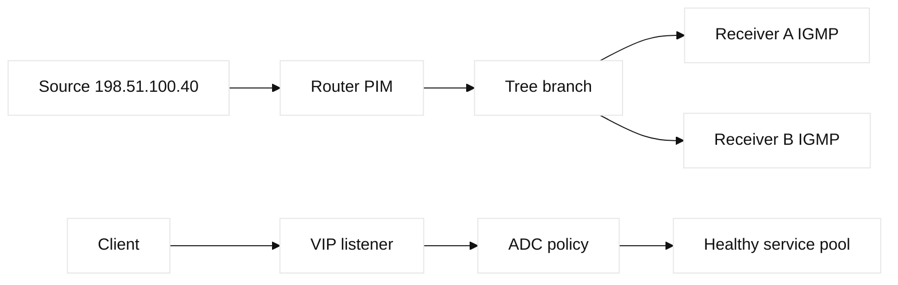
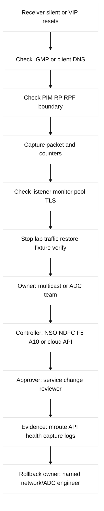

# 10. Multicast and Service Delivery

## A. Learning objectives and prerequisites

Explain one-to-many forwarding, configure a bounded multicast and VIP lab,
verify control and data planes, and troubleshoot an ADC or multicast tree.
Prerequisites are VLANs, routing, ACLs, BGP basics, and the request path in
the existing F5 material. Targets are fictional `leaf-a`, `rtr-a`, `adc-a`,
`host-a`, and reserved `192.0.2.0/24`, `198.51.100.0/24`, and
`2001:db8:10::/64` addresses.

## B. Portable mental model

A multicast source sends once to a group address; receivers join that group.
IGMP is the host-to-router membership protocol. PIM is the router control
protocol that builds a tree. The data plane replicates packets only at branch
points. In ASM, a rendezvous point (RP) helps discover sources; in SSM, the
receiver names `(S,G)` and does not require an RP. Reverse-path forwarding
(RPF) accepts a packet only when its arrival interface matches the route back
to the source. Switch IGMP snooping limits Layer 2 flooding, but a querier is
needed when no router supplies queries.

Service delivery has a different shape. A client resolves or receives a VIP,
connects to a listener, and an ADC/load balancer selects a healthy pool member.
The control plane owns VIP, pool, monitor, TLS, persistence, and policy state;
the forwarding plane performs L4/L7 decisions. A multicast tree and a VIP pool
can coexist, but a health check does not prove a multicast path.



## C. Concept inventory

**Fact:** IGMPv2 uses group membership reports and a querier; IGMPv3 can
express source-specific interest. PIM Dense Mode (PIM-DM) begins with flood
and prune; PIM Sparse Mode (PIM-SM) uses an RP and shared tree before a source
tree. PIM BiDir is an RP-centered bidirectional tree for suitable applications.
SSM is commonly `232.0.0.0/8` in IPv4 and uses `(S,G)` state; ASM uses `(*,G)`
and `(S,G)` state. RPF is a forwarding safety check, not an application ACL.

Multicast boundaries stop unwanted groups at a Layer 3 interface; ACLs and
TTL boundaries are separate controls. BUM means broadcast, unknown unicast,
and multicast. VXLAN carries BUM with ingress replication or multicast underlay;
that choice changes underlay state and failure evidence. **Vendor terminology:**
Cisco `ip pim sparse-mode`, RP, and `show ip mroute` names vary on NX-OS and
other vendors. A multicast route can exist while IGMP state, RPF, MTU, or a
boundary prevents delivery.

An ADC presents a VIP/listener and selects a pool/member/node using a monitor.
L4 uses connection metadata; L7 can inspect HTTP. One-arm designs often need
SNAT; two-arm designs separate client and server interfaces; DSR preserves the
source but requires return-path routing. Persistence, SNAT pools or automap,
source preservation, draining, slow start, rate limits, and WAF policy are
independent decisions. TLS can terminate, pass through, or re-encrypt; SNI
selects certificates or virtual servers. F5 BIG-IP LTM/DNS and A10 Thunder
are vendor products, not portable protocol names. Cloud LBs, CDNs, Route 53,
and Global Accelerator provide related but different managed semantics.

| Concept | Mechanism / purpose | Limit or adjacent term | Evidence and falsifier |
| --- | --- | --- | --- |
| IGMP/PIM | Hosts signal membership; routers build multicast state and trees | Querier, RP, boundary, and MTU can fail independently | IGMP groups, PIM neighbors, `show ip mroute`; absent `(S,G)` falsifies readiness |
| RP/RPF | RP bootstraps ASM; RPF checks the unicast route back to source | Wrong unicast route or RP creates silence without an app fault | RP mapping, `show ip rpf`, incoming-interface state |
| SSM/ASM | `(S,G)` source-specific state avoids RP; `(*,G)` supports shared discovery | Receiver/application support and group boundaries differ | Join source, mroute state, and capture |
| ADC VIP | Listener selects monitored pool members and applies L4/L7 policy | Monitor success does not prove client DNS/TLS/return path | F5 virtual server/pool/monitor or A10 SLB read-back |
| Cloud LB | Managed forwarding rule/backend/health abstraction | It is not an F5/A10 object; ownership and source preservation differ | AWS target health/access log or GCP backend/forwarding-rule log |

## D. Safe configuration shapes and mappings

These are illustrative, lab-only shapes. Save configuration, confirm the
management path, and use a non-production group before mutation:

```text
! Cisco IOS-XE/NX-OS shape; release and feature gates vary
ip multicast-routing
interface Gi1/0/24
 ip pim sparse-mode
 ip igmp version 3
interface Loopback0
 ip address 192.0.2.1 255.255.255.255
ip pim rp-address 192.0.2.1 LAB-GROUPS
ip access-list standard LAB-GROUPS
 permit 239.1.1.0 0.0.0.255
! ADC/F5/A10 shape: VIP 198.51.100.80:443 -> pool 198.51.100.81/82:8443
```

Linux inspection uses `ip maddress`, `ip route`, `tcpdump -ni eth0 host
239.1.1.10`, and an implementation such as FRRouting or `smcroute`; do not
assume a distribution has PIM enabled. A provider cloud may restrict or
translate multicast: AWS VPC and GCP VPC route/security abstractions are not
customer-controlled campus PIM domains. Terraform can own an AWS/GCP load
balancer, target group/backend service, health check, and firewall rule, but
the ADC controller must not also own those objects. Provider versions and
asynchronous health state are explicit prerequisites.

## E. Verification and expected evidence

On Cisco collect `show ip igmp groups`, `show ip igmp snooping groups`, `show
ip pim neighbor`, `show ip pim interface`, `show ip rpf 198.51.100.40`, and
`show ip mroute 239.1.1.10`; inspect counters and TTL. On Linux use `ip mroute
show`, `ss -u`, `tcpdump`, and interface counters. For an ADC inspect VIP
listener state, monitor requests, member health, persistence, SNAT usage,
TLS/SNI logs, and connection counters. AWS evidence includes target health,
LB access logs, Route 53 records, flow logs, and security-group/NACL decisions;
GCP evidence includes backend health, forwarding rule, firewall logs, Cloud
Logging, and Cloud DNS. A healthy result proves membership, neighbor/RP/RPF,
packet arrival, and return/application behavior separately.

## F. Failure lab: receiver silence and unhealthy VIP

Start with `source-a` sending UDP to `239.1.1.10`, two receivers joined, and a
VIP with two healthy HTTP members. Inject an IGMP snooping querier failure,
wrong RPF route, RP mismatch, multicast boundary, MTU drop, or an ADC monitor
that checks the wrong URI. Symptom: one receiver is silent or DNS resolves to
a VIP that resets connections. Hypotheses are membership, tree/RPF, policy,
transport, monitor, pool, TLS/SNI, SNAT, or return route.

Falsify in order: receiver join/capture; snooping and querier; PIM neighbor,
RP and RPF; interface/ACL/MTU counters; then ADC listener, monitor and member
logs. Stop the generator, restore the saved lab fixture, and verify both
directions. The smallest safe action is to repair the injected object only;
do not change RP or load-balancing policy globally to mask a receiver fault.



## G. Hands-on exercise, answer, and rubric

### Worked lab fields

- **Safety:** isolated multicast namespaces and lab VIP; reserved groups only;
  no public receiver, production RP, F5/A10 object, or cloud load balancer.
- **Prechecks and baseline:** save router/ADC config; record IGMP groups,
  querier, PIM neighbors/RP, RPF, `(S,G)`/`(*,G)`, VIP/listener, monitor, pool,
  TLS/SNAT state, and captures.
- **Saved artifact:** timestamped state outputs, API read-back, plan/diff, and
  hashes of simulator configuration.
- **Injected fault:** wrong RPF route, RP mapping, snooping querier, or one
  monitor URI; change one object only.
- **Symptom:** receiver silence or VIP reset/zero healthy members.
- **Hypothesis/falsifier:** join, snooping, PIM/RP/RPF, ACL/MTU, listener,
  monitor/pool, TLS/SNAT, then return path; capture at each boundary.
- **Expected output:** intended `(S,G)` or `(*,G)` appears with correct incoming
  interface; VIP has two healthy members and a successful client transaction.
- **Repair:** restore the single multicast/monitor object and re-read state.
- **Rollback:** multicast owner or ADC owner restores its saved config; change
  approver verifies provider/controller read-back before traffic resumes.
- **Cleanup proof:** stop source, remove group joins, delete lab VIP/pool/API
  objects, and prove no RP, monitor, backend, or cloud log rule remains.

Build a local multicast fixture and an ADC-like Python or simulator fixture.
Deliver a `(S,G)`/`(*,G)` state table, VIP-to-pool map, two captures, evidence
order, and cleanup. Inject one RPF or monitor fault. Answer: prove receiver
membership first, then control-tree state, RPF, data packets, and application
health. Score: 25% model, 25% evidence, 20% safety, 15% vendor/cloud mapping,
15% repair. SDE2: write read-only assertions for group, RPF, and pool health.
Staff: define multicast admission, service ownership, blast radius, and a
fallback for clients that cannot consume multicast.

## H. Interview Q&A

For every question, state **Answer**, **Wrong turn**, **Evidence**, and
**Follow-up** explicitly. Multicast evidence must separate membership, tree,
RPF, and data; ADC evidence must separate listener, monitor, pool, TLS, and
return path.

1. **Why does a PIM neighbor not prove delivery?** **Answer:** it proves control adjacency only. **Wrong turn:** inferring receiver delivery. **Evidence:** IGMP membership, RPF, tree, and counters. **Follow-up:** test the return path. It proves control adjacency,
not IGMP membership, RPF correctness, ACL allowance, or receiver processing.
2. **When choose SSM over ASM?** **Answer:** choose SSM when receivers name a trusted source. **Wrong turn:** adding RP complexity unnecessarily. **Evidence:** IGMPv3 source state and `(S,G)` tree. **Follow-up:** define source failover. Choose SSM when receivers can name a trusted
source; it removes RP dependence but requires source-aware application support.
3. **What does RPF prevent?** **Answer:** it rejects arrivals off the expected reverse path. **Wrong turn:** treating RPF as a route repair. **Evidence:** unicast RIB and RPF interface. **Follow-up:** test asymmetric return. It rejects arrivals that do not follow the
expected reverse path to the source, limiting loops; it does not fix a wrong
unicast route.
4. **Why can snooping break multicast?** **Answer:** missing querier or stale state suppresses delivery. **Wrong turn:** disabling snooping globally. **Evidence:** group table, timers, querier, ports. **Follow-up:** repair one VLAN. Without a querier or with stale state,
the switch may suppress or flood groups incorrectly. Inspect timers and ports.
5. **What does an ADC health monitor prove?** **Answer:** only the probe result at its observation point. **Wrong turn:** treating it as end-to-end health. **Evidence:** monitor request, member state, access log. **Follow-up:** test TLS and return path. Only the configured probe result
at its observation point. It does not prove client DNS, TLS, or return routing.
6. **When is SNAT necessary?** **Answer:** often in one-arm/asymmetric designs to preserve the ADC return path. **Wrong turn:** ignoring port exhaustion and client identity. **Evidence:** translation table and server route. **Follow-up:** compare source preservation. Often in one-arm or asymmetric designs so the
server returns through the ADC; it consumes ports and hides client identity.
7. **Why separate VIP and member health?** **Answer:** a listener can be up with no usable members. **Wrong turn:** equating VIP up with service up. **Evidence:** listener, pool, monitor, and member counters. **Follow-up:** drain one member. A listener can be up with zero
usable members, and a member can pass TCP while its application is degraded.
8. **Is a cloud load balancer an F5 virtual server?** **Answer:** it is a conceptual mapping, not identical state. **Wrong turn:** assuming equal algorithms or failure scope. **Evidence:** provider LB objects and logs. **Follow-up:** compare source preservation. It is a conceptual
mapping, not identical state; algorithms, source preservation, logging, and
failure scope are provider-specific.

## I. References and evidence labels

## J. Ownership and completion contract

Multicast owns IGMP/PIM/RP/RPF and boundaries; fabric owns BUM transport; ADC
owns VIP/listener/pool/monitor/TLS; evidence reads membership, tree, RPF,
counters, and health; rollback restores the saved declaration.

## K. Detailed reproducible failure lab

```text
mkdir -p /tmp/ccna10-lab
printf '%s\n' '{"group":"232.0.2.10","source":"198.51.100.10","igmp":true,"rpf":true,"vip":"198.51.100.20","members":2}' > /tmp/ccna10-lab/state.json
cp /tmp/ccna10-lab/state.json /tmp/ccna10-lab/baseline.json
python3 -c 'import json; p="/tmp/ccna10-lab/state.json"; x=json.load(open(p)); x["rpf"]=False; json.dump(x,open(p,"w"))'
python3 -c 'print("MEMBER_OK RPF_FAIL VIP_MEMBERS=2")'
cp /tmp/ccna10-lab/baseline.json /tmp/ccna10-lab/state.json; cmp /tmp/ccna10-lab/state.json /tmp/ccna10-lab/baseline.json
rm -f /tmp/ccna10-lab/state.json /tmp/ccna10-lab/baseline.json; rmdir /tmp/ccna10-lab
```

Expected output is `MEMBER_OK RPF_FAIL VIP_MEMBERS=2`; `cmp`/`rmdir` prove
cleanup. F5 AS3/iControl or A10 REST must read back listener, pool, monitor,
TLS, persistence, SNAT, and counters. Multicast over VXLAN can use underlay
multicast or EVPN ingress replication; IGMP/PIM, VTEP membership, MTU, and BUM
counters remain separate proof points.

## L. Worked answer, rubric, and SDE2/Staff follow-ups

**Criterion-by-criterion completed submission:** mechanism, evidence, injected
failure, repair, rollback, and Staff follow-up are each stated and verified:
membership, PIM/RPF, replication, and VIP health are separate claims; group,
tree, counter, and ADC reads prove them; the fixture is removed; Staff budgets capacity.

IGMP/PIM/RP/SSM/RPF 25/25, ADC and return-path evidence 25/25, ordered mock
fault 20/20, restore/cleanup 20/20, ownership 10/10: **100/100**. SDE2 adds
group/pool assertions; Staff adds replication and bypass capacity gates.

| Rubric criterion | Learner artifact | Expected evidence | Pass/fail threshold | SDE2 follow-up answer | Staff follow-up answer |
| --- | --- | --- | --- | --- | --- |
| Multicast control (25%) | Receiver/group/PIM/RP/RPF path | IGMP membership, PIM neighbor, RPF route, tree state | Pass if membership and tree claims are separate | I would assert group membership, incoming interface, and outgoing set. | I would govern RP redundancy, SSM adoption, replication capacity, and failure scope. |
| Service delivery (25%) | VIP, health monitor, pool, and return path map | VIP/listener, member health, ADC stats, bidirectional flow | Pass if healthy VIP is not assumed from healthy backend | I would test VIP, backend, and return flow separately. | I would own insertion, bypass, drain behavior, and application SLOs. |
| Fault isolation (20%) | One missing group or unhealthy member fault | Group/tree/counter or health-state delta | Pass if the fault has one measurable signature | I would create a negative assertion and preserve the original fixture. | I would set blast-radius and rollback thresholds for multicast and ADC. |
| Recovery/cleanup (20%) | Restored tree/pool and no residual receiver | Baseline comparison, counters, group/member cleanup | Pass if control and service state return | I would poll for convergence and verify no stale state. | I would require capacity and graceful-drain evidence after repair. |
| Ownership (10%) | Multicast/ADC/application RACI | Named RP, network, ADC, and service owners | Pass if escalation follows the broken evidence layer | I would route alerts by evidence domain instead of symptom. | I would align ownership with service and replication budgets. |

**Completed score:** 25/25 + 25/25 + 20/20 + 20/20 + 10/10 = **100/100**.

## M. Reproducible lab record

**Disposable fixture/topology and safety:** a local service-delivery state file represents one
multicast group, receiver, RPF interface, and ADC member. It does not join a
production group or modify F5/A10/Cisco state.

1. **Disposable fixture/topology and exact setup inputs:** `source -> RP/RPF ->
   receiver`; `client -> VIP -> pool-member`:

   ```bash
   LAB_DIR=$(mktemp -d /tmp/ccna10.XXXXXX)
   printf '%s\n' 'group=239.1.1.10 receiver=192.0.2.44 rpf=192.0.2.1 outgoing=eth1 member=192.0.2.20 health=UP vip=192.0.2.100' > "$LAB_DIR/service.txt"
   cp "$LAB_DIR/service.txt" "$LAB_DIR/baseline.txt"
   ```

2. **Baseline command and expected baseline:** `awk '{print "BASELINE " $0}'
   "$LAB_DIR/service.txt"`. **Illustrative expected output:** the group has
   `outgoing=eth1`, `health=UP`, and `vip=192.0.2.100`.

3. **Injected fault:** `sed -i 's/outgoing=eth1/outgoing=none/; s/health=UP/health=DOWN/'
   "$LAB_DIR/service.txt"`.

4. **Measurable assertion and sample expected output:** `awk '{if ($0 ~
   /outgoing=none/ && $0 ~ /health=DOWN/) print "ASSERT TREE_EMPTY MEMBER_DOWN"}'
   "$LAB_DIR/service.txt"`. **Illustrative expected output:**
   `ASSERT TREE_EMPTY MEMBER_DOWN`. A real lab must add IGMP/PIM/RPF and VIP
   logs; this mock does not claim them.

5. **Repair command/decision:** after verifying group and VIP, `sed -i
   's/outgoing=none/outgoing=eth1/; s/health=DOWN/health=UP/'
   "$LAB_DIR/service.txt"; cmp "$LAB_DIR/service.txt" "$LAB_DIR/baseline.txt"`.

6. **Rollback command/decision:** `cp "$LAB_DIR/baseline.txt"
   "$LAB_DIR/service.txt"`; roll back when group, VIP, or member does not match
   the reservation. Do not clear real multicast state as a shortcut.

7. **Cleanup verification:** `rm -f "$LAB_DIR/service.txt"
   "$LAB_DIR/baseline.txt"; rmdir "$LAB_DIR"; test ! -e "$LAB_DIR"`.
   **Observed result:** only a local run can be observed; **illustrative result:**
   exit status `0`.

**Fact:** [RFC 1112](https://www.rfc-editor.org/rfc/rfc1112) defines host
multicast, [RFC 3376](https://www.rfc-editor.org/rfc/rfc3376) defines IGMPv3,
and [RFC 4601](https://www.rfc-editor.org/rfc/rfc4601) defines PIM-SM.
**Vendor terminology:** [Cisco multicast guides](https://www.cisco.com/c/en/us/td/docs/ios-xml/ios/ipmulti_igmp/configuration/xe-17/igm-xe-17-book.html),
[F5 BIG-IP LTM](https://techdocs.f5.com/), and [A10 Thunder](https://documentation.a10networks.com/).
**Observed lab result:** a capture records only packets reaching the selected
interface and namespace. **Engineering inference:** membership, tree, RPF,
and application evidence should be collected as separate claims.

## N. Artifact-backed submission

Observed bundle: [`10-multicast-service-delivery.json`](fixtures/observed/10-multicast-service-delivery.json). The v3 evaluator derives RPF, IGMP/PIM state, and backend evidence from effective control plus a separate traffic fixture. The control fault has no paired plane fault; the assertion separately uses evaluator-only RPF mismatch. Module-specific scoring: [worked submissions](fixtures/worked-submissions.md#11-b-module-10--10-multicast-service-delivery).
