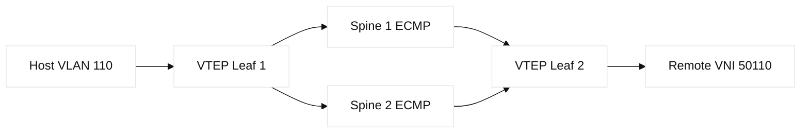
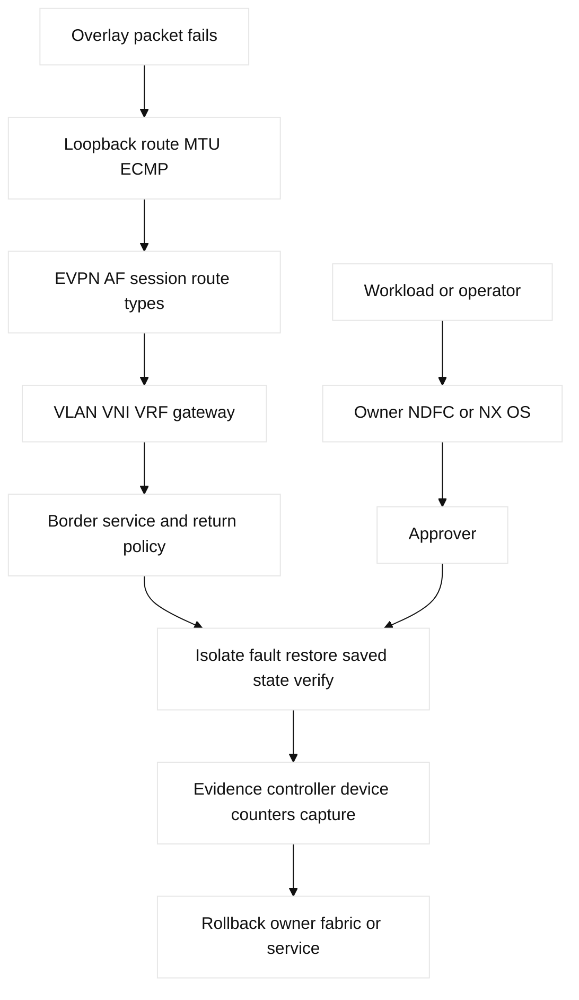

# 11. Data-Center Fabrics: Clos and EVPN/VXLAN

## A. Learning objectives and prerequisites

Design a small spine-leaf fabric, explain underlay/overlay separation, map
EVPN route types, and troubleshoot VTEP, MTU, anycast gateway, border, and
service-insertion failures. Prerequisites are VLANs, STP/LACP, OSPF/BGP, VRF,
multicast, and reserved lab addresses `10.10.0.0/16` and `2001:db8:11::/48`.

## B. Portable mental model

A Clos fabric gives leaves multiple equal-cost paths through spines. The
underlay provides routed reachability between loopbacks, commonly with OSPF or
eBGP and ECMP. VXLAN is the overlay: a VTEP wraps an Ethernet frame in UDP and
uses a VNI to identify a tenant segment. EVPN uses MP-BGP as the overlay
control plane so VTEPs learn endpoint identity, MAC/IP bindings, and prefixes
without relying solely on flood-and-learn.



## C. Concept inventory

**Fact:** VXLAN uses a 24-bit VNI and UDP encapsulation; VTEPs terminate the
overlay. VLAN/VNI and VRF/VNI mappings are local policy. EVPN route type 2
advertises MAC/IP reachability, EVPN route type 3 advertises inclusive multicast
Ethernet tag routes for BUM, and EVPN route type 5 advertises IP prefixes.
Route type 1 Ethernet
auto-discovery supports multihoming and aliasing. ARP/ND suppression reduces
flooding by using advertised bindings; duplicate-MAC and host-mobility
handling are control-plane policy, not proof of a healthy host.

An anycast gateway gives a subnet’s default gateway the same virtual MAC/IP on
multiple leaves, reducing tromboning. vPC and MLAG are vendor multichassis
Ethernet designs with peer-link, keepalive, consistency, and split-brain rules;
they are not EVPN itself. A border leaf exchanges routes with WAN, DCI, or
firewall domains. A service leaf can insert a firewall, IDS/IPS, or ADC, but
must preserve symmetry and health-check reachability. DCI/multi-site designs
need explicit stretch, mobility, failure, and route-leaking boundaries.

BUM can use underlay multicast or ingress replication. MTU must cover inner
frame plus VXLAN overhead; ECMP and oversubscription distribute flows but do
not eliminate microbursts or buffer pressure. **Vendor terminology:** NDFC,
NX-OS `feature nv overlay`, `nve1`, and `show bgp l2vpn evpn` vary by release.
AWS VPC/TGW route tables and GCP VPC/Cloud Router are external routing domains
at a border, not VLAN/VNI replacements; a Terraform cloud attachment must have
one owner and a documented import/export policy.

## D. Safe configuration shapes and mappings

```text
! NX-OS-like shape; fictional lab only, precheck and save first
feature ospf
feature bgp
feature nv overlay
interface loopback0
 ip address 10.10.0.11/32
interface nve1
 source-interface loopback0
 member vni 50110
  ingress-replication protocol bgp
router bgp 65011
 address-family l2vpn evpn
  neighbor 10.10.0.1 activate
  advertise l2vpn evpn
```

Linux inspection uses `ip link`, `bridge fdb`, `ip route`, `ip neigh`, and
`tcpdump -ni any udp port 4789`; FRRouting or a local simulator may supply
EVPN. Cisco verification is usually `show nve peers`, `show nve vni`, `show
bgp l2vpn evpn`, `show bgp l2vpn evpn route-type 2`, and `show interface
counters errors`. NDFC may own fabric intent and generated device state;
Terraform should own only explicitly delegated cloud or inventory objects.

## E. Verification and expected evidence

Verify underlay loopback reachability and ECMP first, then MTU, BGP EVPN
session/address family, VTEP/VNI state, type 2/3/5 routes, MAC/IP/ARP/ND
tables, anycast gateway, and endpoint captures. Inspect spine/leaf buffers,
interface drops, oversubscription, and flow distribution for microbursts.
At the border verify import/export policy and return path. A healthy overlay
does not merely show an Established BGP session: the remote VNI, endpoint
binding, and data packet must all be evidenced.

| Concept | Mechanism, purpose, and limit | Evidence and falsifier |
|---|---|---|
| EVPN type 1 | Ethernet A-D discovery/aliasing supports multihoming; it is not a MAC route. | `show bgp l2vpn evpn route-type 1`; missing aliasing falsifies healthy multihoming. |
| EVPN type 2 | MAC/IP reachability with mobility sequencing; stale or duplicate MACs can move traffic. | Route-type 2, MAC, and ARP/ND tables; matching local state falsifies “EVPN has no endpoint.” |
| EVPN type 3 | IMET membership for BUM; ingress replication consumes per-VTEP bandwidth/CPU. | Route-type 3 and NVE peers; present IMET falsifies “remote VTEP unknown.” |
| EVPN type 5 | IP prefixes for routed tenants; it does not advertise a host MAC. | Route-type 5 and VRF RIB; correct type 5 plus missing type 2 points to endpoint/L2 state. |
| RT and anycast | Import/export RT selects tenant membership; anycast shares gateway IP/MAC at leaves. Bad RT leaks or black-holes. | EVPN RT detail and ARP/ND; matching RT/gateway state falsifies RT mismatch. |
| vPC/MLAG and NDFC | Peer-link, keepalive, consistency, and fencing protect dual attachment; NDFC intent is not device proof. | `show vpc`, NDFC task/intent, NX-OS read-back; disagreement falsifies convergence. |
| Capacity | Four 100G links at 70% headroom provide 280G usable; after one link, 210G. Buffers still face microbursts. | Utilization, ECMP, queue drops, buffer telemetry; failed-path load above 210G falsifies N+1. |

NDFC (or an approved fabric controller) owns VNI/VRF intent and generated
configuration; NX-OS owns operational state; the service owner owns firewall
or ADC policy; Terraform owns only an explicitly delegated border attachment.
The Linux/FRR equivalent is FRR for EVPN control and `ip`/bridge for local
forwarding. Read back each layer rather than treating a controller task or
BGP session as proof. For a 900-byte inner frame, reserve the inner Ethernet
plus roughly 50 bytes of IPv4 VXLAN/UDP overhead in the underlay MTU.

## F. Failure lab: VNI black hole and duplicate MAC

Start with two leaves, two spines, VNI 50110, anycast gateway, and a border
default route. Inject a wrong VNI mapping, underlay MTU of 1500, EVPN AF
disabled, stale type-2 MAC, or a vPC peer-link failure. Symptoms are same-VNI
silence, intermittent host moves, ARP suppression failures, or cross-tenant
reachability. Hypotheses are underlay, overlay control, mapping, endpoint,
gateway, border policy, or buffer loss.

Falsify in that order. Stop traffic generation; restore the saved fixture or
isolate the duplicate endpoint. Repair one mapping or MTU edge, then verify
both directions, type-2/3/5 state, and no new MAC moves. Never stretch a VLAN
or leak a VRF as the first response to a missing underlay route.



## G. Hands-on exercise, answer, and rubric

Build a two-leaf/two-spine fixture with one VLAN/VNI, an anycast gateway, and
a border. Submit underlay routes, EVPN route-type evidence, MTU budget, ECMP
test, fault injection, and rollback. Answer: establish underlay first, then
EVPN control, then mappings and endpoint state. Score: 25% fabric model, 25%
route evidence, 20% failure isolation, 15% MTU/capacity, 15% ownership.
SDE2: write a read-only VTEP/VNI consistency checker. Staff: define tenant
scale, failure domains, DCI policy, service insertion symmetry, and N+1
oversubscription/headroom targets.

### Worked lab record

- Safety boundary and reserved fixture: isolated namespaces/simulator only;
  use `10.10.0.0/16`; no production VLAN, secret, or public peer.
- Starting state and prechecks: save controller intent and switch config;
  check loopback reachability, MTU, EVPN AF, VNI/RT, vPC consistency, and
  baseline counters.
- Saved config/plan: retain `baseline.txt`, controller task ID, and a diffable
  plan.
- Injected fault: wrong VNI, 1500-byte underlay MTU, disabled EVPN AF, stale
  type-2 MAC, or peer-link failure.
- Symptom: same-VNI silence, MAC moves, ARP suppression failure, or leakage.
- Hypothesis/falsifier: test underlay, EVPN types, mapping/RT, endpoint,
  gateway, border, then buffers; each read-back and bidirectional probe must
  falsify or retain one branch.
- Expected output: restored type 2/3/5 and MAC/VNI state, bidirectional probe
  success, and no new drops.
- Repair: change one mapping/MTU/AF edge and verify both directions.
- Rollback: restore the saved fixture if assertions fail; forward repair needs
  approval and bounded prefixes.
- Cleanup: remove the injected fault, clear lab-only state, rerun baseline,
  and attach clean diff/counters.

## H. Interview Q&A

1. **Why use a Clos fabric?** **Answer:** Repeated spines provide scalable ECMP and limit failure scope. **Wrong turn:** assuming equal paths guarantee capacity. **Evidence:** ECMP distribution and post-failure utilization. **Follow-up:** calculate N+1 headroom.
2. **What is underlay versus overlay?** **Answer:** Underlay routes VTEP loopbacks; overlay maps tenant Ethernet/IP semantics. **Wrong turn:** debugging a missing VNI with host ARP first. **Evidence:** underlay route, then NVE/EVPN state. **Follow-up:** identify the MTU falsifier.
3. **What does EVPN type 2 carry?** **Answer:** MAC/IP endpoint reachability; type 3 supports BUM; type 5 carries IP prefixes. **Wrong turn:** treating type 5 as a MAC advertisement. **Evidence:** filtered route output plus MAC/ARP tables. **Follow-up:** explain type 1 aliasing.
4. **Why is a BGP session insufficient?** **Answer:** AF, VNI, RT, mapping, MTU, or endpoint state can still discard data. **Wrong turn:** stopping at Established. **Evidence:** route types, NVE, and packet capture. **Follow-up:** separate control from forwarding proof.
5. **What problem does anycast gateway solve?** **Answer:** It gives hosts a consistent local gateway and reduces L2 tromboning. **Wrong turn:** assuming it removes return-path policy. **Evidence:** identical IP/MAC and routed flow. **Follow-up:** compare with vPC peer gateway.
6. **How does ingress replication differ from multicast underlay?** **Answer:** It signals per remote VTEP and avoids underlay multicast at packet/CPU cost. **Wrong turn:** calling it free multicast. **Evidence:** IMET peers and BUM counters. **Follow-up:** estimate load for 20 VTEPs.
7. **Why are duplicate MACs dangerous?** **Answer:** Mobility may move the binding, causing intermittent forwarding or leakage. **Wrong turn:** clearing tables without isolating the second endpoint. **Evidence:** mobility sequence, move counters, captures. **Follow-up:** state isolation and rollback order.
8. **When should a service leaf be used?** **Answer:** When policy requires insertion and paths remain symmetric with capacity, health checks, and bypass. **Wrong turn:** inserting an appliance without return-path ownership. **Evidence:** bidirectional flow, health, and border policy. **Follow-up:** define drained-appliance behavior.

## I. References and evidence labels

## J. Ownership and completion contract

NDFC owns fabric intent/tasks; device owns links, MTU, and NX-OS read-back;
border owns route leaking/service insertion; evidence reads EVPN type 2/3/5,
NVE, MAC/ARP, and counters; rollback restores saved intent. Terraform owns only
a delegated attachment.

## K. Detailed reproducible failure lab

```text
mkdir -p /tmp/ccna11-lab
printf '%s\n' '{"vlan":110,"vni":10110,"type2":1,"type3":2,"type5":1,"bum":"ingress-replication","mtu":1550}' > /tmp/ccna11-lab/fabric.json
cp /tmp/ccna11-lab/fabric.json /tmp/ccna11-lab/baseline.json
python3 -c 'import json; p="/tmp/ccna11-lab/fabric.json"; x=json.load(open(p)); x["mtu"]=1500; json.dump(x,open(p,"w"))'
python3 -c 'print("VNI_PRESENT MTU_TOO_SMALL BUM=ingress-replication")'
cp /tmp/ccna11-lab/baseline.json /tmp/ccna11-lab/fabric.json; cmp /tmp/ccna11-lab/fabric.json /tmp/ccna11-lab/baseline.json
rm -f /tmp/ccna11-lab/fabric.json /tmp/ccna11-lab/baseline.json; rmdir /tmp/ccna11-lab
```

Expected output is `VNI_PRESENT MTU_TOO_SMALL BUM=ingress-replication`;
`cmp`/`rmdir` prove repair. Read back NVE, EVPN route types, anycast gateway,
MAC moves, and underlay MTU. A BGP session alone is not forwarding proof.

## L. Worked answer, rubric, and SDE2/Staff follow-ups

**Criterion-by-criterion completed submission:** mechanism, evidence, injected
failure, repair, rollback, and Staff follow-up are each stated and verified:
Clos underlay and EVPN/VXLAN overlay are separated; VNI/route/ECMP/controller
reads prove the fault; intent is reverted; Staff owns N+1 and DCI gates.

Clos/VNI mapping 25/25, type-2/3/5 and multicast-BUM evidence 25/25, MTU fault
20/20, restore/cleanup 20/20, NDFC/device/border ownership 10/10: **100/100**.
SDE2 adds route/MAC-move tests; Staff adds N+1, oversubscription, and DCI gates.

| Rubric criterion | Learner artifact | Expected evidence | Pass/fail threshold | SDE2 follow-up answer | Staff follow-up answer |
| --- | --- | --- | --- | --- | --- |
| Clos/VNI mechanics (25%) | Spine-leaf underlay and VNI/VRF map | Underlay adjacency, VTEP loopbacks, VNI mapping | Pass if underlay and overlay responsibilities are separate | I would assert ECMP members and VNI-to-VRF mapping from structured state. | I would set N+1, oversubscription, and border capacity gates. |
| EVPN/BUM evidence (25%) | Type-2/3/5 and BUM decision table | EVPN route types, MAC/ARP, IMET or replication state | Pass if control-plane learning and BUM method are distinguished | I would test endpoint, multicast/BUM, and prefix routes independently. | I would choose ingress replication or multicast based on scale and failure budget. |
| Bounded MTU fault (20%) | One reserved VTEP MTU mismatch and test | Overlay packet loss, MTU read-back, counters | Pass if only the fixture path changes | I would probe payload sizes and assert the first failing overhead boundary. | I would approve jumbo-frame standardization and spare-path behavior. |
| Recovery/cleanup (20%) | Restored intent/device state and endpoint test | NDFC task, device read-back, FIB/ECMP, clean fixture | Pass if controller and device converge | I would poll task convergence and compare intended/effective state. | I would decide forward repair versus rollback based on fabric stability and blast radius. |
| Ownership (10%) | Fabric/controller/border/service RACI | Named NDFC, switch, border, ADC, and service owners | Pass if insertion and return path have owners | I would route alarms to underlay, overlay, or service evidence queues. | I would own DCI, capacity, maintenance, and exception governance. |

**Completed score:** 25/25 + 25/25 + 20/20 + 20/20 + 10/10 = **100/100**.

## M. Reproducible lab record

**Disposable fixture/topology and safety:** a local JSON-like state file models two leaves, one
spine, one VTEP pair, one VNI, and one endpoint. It does not configure NDFC,
NX-OS, EVPN, or a physical switch.

1. **Disposable fixture/topology and exact setup inputs:** `leaf-1 -- spine-1
   -- leaf-2`, VTEPs `10.0.0.11/32` and `10.0.0.12/32`, VNI `10100`:

   ```bash
   LAB_DIR=$(mktemp -d /tmp/ccna11.XXXXXX)
   printf '%s\n' 'vni=10100 vtep_a=10.0.0.11 vtep_b=10.0.0.12 underlay=UP mtu_a=9216 mtu_b=9216 evpn_type2=present evpn_type3=present bum=ingress-replication endpoint=192.0.2.44' > "$LAB_DIR/fabric.txt"
   cp "$LAB_DIR/fabric.txt" "$LAB_DIR/baseline.txt"
   ```

2. **Baseline command and expected baseline:** `awk '{print "BASELINE " $0}'
   "$LAB_DIR/fabric.txt"`. **Illustrative expected output:** `underlay=UP`,
   `mtu_a=9216 mtu_b=9216`, type 2/3 present, and `endpoint=192.0.2.44`.

3. **Injected fault:** `sed -i 's/mtu_b=9216/mtu_b=1500/'
   "$LAB_DIR/fabric.txt"` creates one overlay MTU mismatch.

4. **Measurable assertion and sample expected output:** `awk '{if ($0 ~
   /mtu_b=1500/) print "ASSERT VNI_PRESENT MTU_TOO_SMALL BUM=ingress-replication"}'
   "$LAB_DIR/fabric.txt"`. **Illustrative expected output:**
   `ASSERT VNI_PRESENT MTU_TOO_SMALL BUM=ingress-replication`.

5. **Repair command/decision:** after checking the VNI and VTEPs,
   `sed -i 's/mtu_b=1500/mtu_b=9216/' "$LAB_DIR/fabric.txt"; cmp
   "$LAB_DIR/fabric.txt" "$LAB_DIR/baseline.txt"`.

6. **Rollback command/decision:** `cp "$LAB_DIR/baseline.txt"
   "$LAB_DIR/fabric.txt"`; use rollback if the controller task or device
   target differs from the fixture. Never clear production MAC state for this lab.

7. **Cleanup verification:** `rm -f "$LAB_DIR/fabric.txt"
   "$LAB_DIR/baseline.txt"; rmdir "$LAB_DIR"; test ! -e "$LAB_DIR"`.
   **Illustrative result:** exit status `0`; no fabric execution is claimed.

| Evidence layer | Read-only evidence | Failure it can falsify |
| --- | --- | --- |
| Underlay | interface, LLDP, BGP/OSPF, MTU | bad link or missing transport route |
| Overlay | VTEP, VNI, EVPN route type, endpoint table | missing control-plane learning |
| Forwarding | VRF RIB/FIB, counters, bounded probe | policy, route, or data-plane drop |
| Controller | NDFC intent/task and device read-back | intent/device drift |

**Fact:** [RFC 7348](https://www.rfc-editor.org/rfc/rfc7348) specifies VXLAN and
[RFC 7432](https://www.rfc-editor.org/rfc/rfc7432) specifies BGP MPLS-based
Ethernet VPN procedures. **Vendor terminology:** [Cisco VXLAN EVPN](https://www.cisco.com/c/en/us/solutions/data-center-virtualization/vxlan-network-virtualization/index.html)
and [NDFC](https://www.cisco.com/c/en/us/products/cloud-systems-management/data-center-network-manager/index.html).
**Observed lab result:** UDP 4789 visibility depends on the capture point and
offload settings. **Engineering inference:** treat underlay, overlay, and
service insertion as separately owned evidence domains.

## N. Artifact-backed submission

Observed bundle: [`11-vxlan-evpn.json`](fixtures/observed/11-vxlan-evpn.json). The v3 evaluator derives type-2 count, VNI, underlay, and BUM behavior from effective fabric intent and an independent remote-MAC fixture. The negative assertion separates healthy metadata control from evaluator-only underlay loss; task/read-back, repair, rollback, and cleanup remain visible. Module-specific scoring: [worked submissions](fixtures/worked-submissions.md#12-b-module-11--11-vxlan-evpn).
